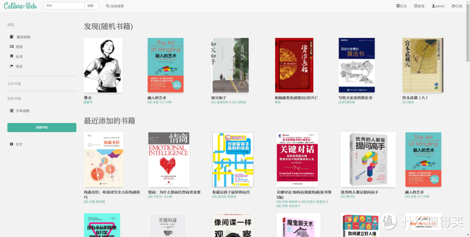
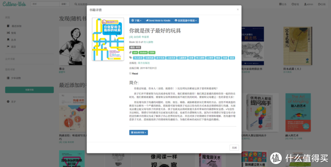
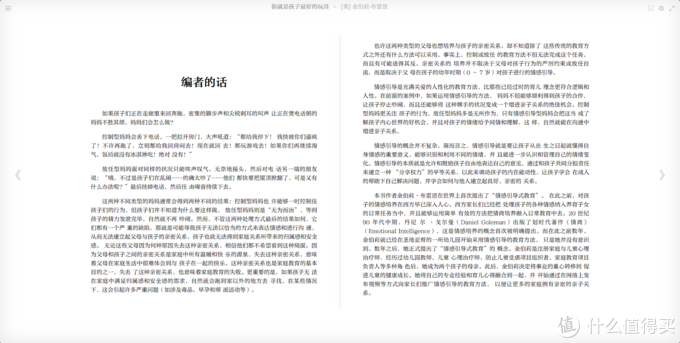
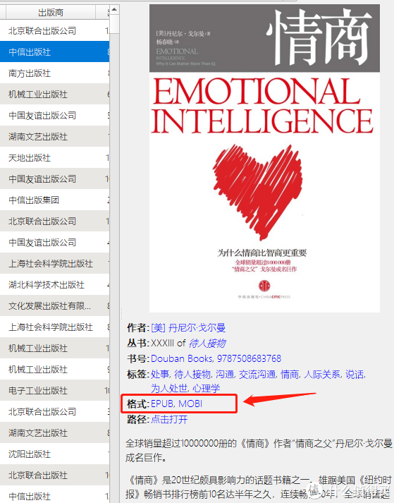
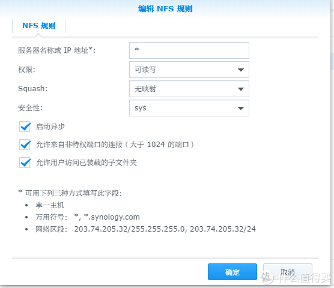

## NAS玩机十一年高阶玩家教程系列其四：Calibre、虚拟机以及杂志《经济学人》抓取

https://post.smzdm.com/p/az50vv7o/

## 系列大纲领【敲黑板】 

此系列所有服务的安装和使用，除了 wallabag、bitwarden 以外都不必须公网IP要求，搭建在局域网在局域网环境内使用OK，有能力内网穿透的也能从外网访问。教程设计docker的部分全程使用命令行。
原因：简单、快速、具有100%可还原性。

　　刚开始的时候可能你会觉得难受，毕竟长这么大敲命令行的时间加起来都没有半个小时，但是当你需要更新容器时，当升级换机时，复制粘贴几行代码，等待结束后无缝使用的体验，可比在docker套件里面点来点去保证设置不出错的感觉好太多了！

　　上菜了，[群晖](https://pinpai.smzdm.com/2315/)官网教程[如何通过 SSH/Telnet 用 root 权限登录 DSM](https://www.synology.com/zh-cn/knowledgebase/DSM/tutorial/General_Setup/How_to_login_to_DSM_with_root_permission_via_SSH_Telnet)

### 　　这两天文章没啥流量，更新动力不足。。。Calibre相关部署工程量太大了，看下来的朋友订阅、收藏、点赞、转发点起来好吧？这么良心的更新拿出来白票了，你们心不痛的吗…… 

##  

## 喜欢[电子书](https://www.smzdm.com/fenlei/dianzishuyueduqi/)的朋友不看此篇绝对是重大损失！  

## 应用介绍：

　　Calibre我就不介绍了，绝对的电子书管理神器。但是我收藏了一堆书，看书找书的时间还是远远多过管理书的时间。能不能有个像[书架](https://www.smzdm.com/fenlei/shujia/)那样的展示柜？不想每次找书都要打开电脑去开那个无比臃肿的calibre怎么办?
　　当当当当~~~ Calibre-web 横空出世了。把它理解为图书展示柜就好了，它的定位就是这个【千万不要想着从这里添加书本或者修改书本】，calibre是个多臃肿的软件，让小巧的calibre-web干那些事情真的是难为它的，把它当展示器就好了。

　　**能直接推送到kindle
**　　**能直接下载
**　　**除mobi之外的电子书格式都能在线阅读
**　　**支持opds书库的软件能直接添加为opds书库**

## 部署 

mkdir /volume1/docker/calibre && /volume1/eBooks/CalibreWeb && docker pull linuxserver/calibre-web:latest && docker run -d --name=Calibre-web -p 8084:8083 -v /volume1/docker/Calibre:/config -v /volume1/eBooks/CalibreWeb:/books --restart always linuxserver/calibre-web

等待成功提示，登录内网ip:8084 登录
账户 admin
密码 admin123

## 说明

/volume1/docker/calibre 为calibre-web配置资料存放路径
/volume1/eBooks/CalibreWeb 为calibre书库数据库文件以及电子书存放目录

## 注意

请设置好 /volume1/eBooks/CalibreWeb 目录权限为everyone ；第一次登陆calibre-web设置书库路径为/books ；设置里可更改UI为中文。

## 使用说明

1、在PC上安装[calibre【点我下载】](https://calibre-ebook.com/download)；
2、把你所有的藏书都添加到pc版calibre中，做好各种编辑、简介、分类工作，达到完善。
3、打开书库所在路径（在calibre中随便右键一本书 --> 打开所在目录 --> 往上2级目录 --> 看到 metadata.db 这就是书库主目录了）
4、全选主目录中的所有文件与目录，把所有文件、[文件夹](https://www.smzdm.com/fenlei/wenjianjia/)都剪切粘贴到 NAS /volume1/eBooks/CalibreWeb 目录下
5、用webdav把 /volume1/eBooks/CalibreWeb 映射到PC作为本地盘 【[群晖](https://pinpai.smzdm.com/2315/)套件中心下载webdav[服务器](https://www.smzdm.com/fenlei/fuwuqi/)，具体用法请自行搜索】
6、在calibre中切换书库为 /volume1/eBooks/CalibreWeb 映射的本地盘

至此，calibre PC 版 与 calibre-web 就完成了书库共享。
达成了 calibre PC 管理书本、calibre-web 展示书本的目的。

## 注意

书库共享是个危险行为，在修改书库的同时浏览calibre-web可能会造成metadata.db数据库不可逆损坏，**建议每次修改书目或者添加删减后，关闭calibre pc版，马上做一个 metadata.db 文件的增量备份。如果觉得calibre pc版臃肿，以下介绍一个更安全的添加书本到书库的方法：命令行**

在windows中打开cmd
**calibredb add --with-library e: d:booknew -1
calibredb add --with-library e: d:bookxxxx.epub
**

## **代码说明**** **

　　e: 是 /volume1/eBooks/CalibreWeb 映射到本机的盘符，根据你的实际情况修改。
　　d:booknew -1 表示你有一本书（比如《狂人日记》）有2种格式：狂人日记.mobi、狂人日记.epub都存放在new文件夹下，而想把她们存为同一本书，在calibre中显示如下

calibredb add --with-library e: d:bookxxxx.epub 这就表示直接把d:book目录下的 xxxx.epub 这本单独的书添加到书库

## 定时自动抓取新闻、杂志，并添加到书库中

　　**因为我自己的常规书库有藏书1000+，而自动抓取新闻几乎每天都有更新，所以实际上是架设了2个 calibre-web ，不让新闻杂志跟常规数目混合起来。
　　由于docker套件中的linux系统的各种限制，导致了定时任务crontab无法在docker容器中顺利运行；又因为后期教程matrix要运行在正常的centos7系统中，所以本期就一并说明用虚拟机在群晖中安装centos7系统。**

## 群晖安装CentOS7虚拟机 

1、先下载虚拟机套件 Virtualization 【[点我进入官方通道](https://archive.synology.com/download/Package/spk/Virtualization/2.5.0-9432/)】
2、群晖套件中心-->手动安装-->上传安装[Virtualization-x86_64-2.5.0-9432.spk](https://archive.synology.com/download/Package/spk/Virtualization/2.5.0-9432/Virtualization-x86_64-2.5.0-9432.spk)
**注意：至少有一个硬盘要是 btrfs 格式，后期才能正常安装虚拟机**
3、下载centos7 系统 【[点我进入官方通道](http://isoredirect.centos.org/centos/7/isos/x86_64/)】
4、安装完成的 Virtual Machine Manager 套件打开，新增 Linux 系统，选择上面下载的centos7的ISO文件
5、等待，设置用户名密码。完成
6、在 Virtual Machine Manager 套件中打开【连接】，连接到centos7命令行

## 安装一些必要的软件以及必要的设置 

1、[虚拟机下CentOS7安装并开启SSH连接](https://blog.csdn.net/trackle400/article/details/52755571)
2、虚拟机下CentOS7安装nfs的挂载等支持： yum install -y nfs-utils wget
3、群晖中打开 控制面板-->文件服务-->NFS打勾；控制面板-->共享文件夹-->选择ebook书库所在文件夹-->编辑-->NFS权限-->新增如下

## 在CentOS7中安装calibre 

sudo -v && sudo calibre-uninstall && wget -nv -O- https://download.calibre-ebook.com/linux-installer.sh | sudo sh /dev/stdin version=3.48.0

## 在群晖里面部署一个专门展示新闻、杂志的calibre-web书库 

mkdir /volume1/docker/magazine && /volume1/eBooks/magazine && docker pull linuxserver/calibre-web:latest && docker run -d --name=Calibre-magazine -p 8090:8083 -v /volume1/docker/magazine:/config -v /volume1/eBooks/magazine:/books --restart always linuxserver/calibre-web

## 为了方便管理，在CentOS7中映射2个文件夹到NAS上

### 其一：

mount -t nfs NAS内网IP地址:/NAS随便一个文件夹的路径 /centos7随便一个文件夹路径（为了方便centos7与nas交换数据）
如：
mount -t nfs 192.168.8.166:/volume2/Downloads/complete /mycentos

### 其二：

mount -t nfs 192.168.8.166:/volume1/eBooks/magazine/ /home/username/calibre/
挂载了centos7中的calibre书库目录与calibre-web-magazine的书库目录

### 设置开机自动挂载目录：

编辑/etc/fstab
**vi /etc/fstab**
追加：
**INS键进入编辑模式，在最后面添加与下面2行相符与你自己机器的内容**
192.168.8.166:/volume2/Downloads/complete /mycentos/ nfs rw,tcp,intr 0 1
192.168.8.166:/volume1/eBooks/magazine/ /home/username/calibre/ nfs rw,tcp,intr 0 1
**按ESC键退出编辑，键入:wq回车保存
【切记被挂载的服务端需要改权限】**

是否挂载成功可以通过以下命令查看
showmount -e NAS内网IP地址

## 实操在centos中设置定时抓取新闻杂志任务并添加到calibre-web中展示 

### A、新增抓取经济学人任务 【请注意点我打开后代码中的注释说明】

1、在 /volume1/eBooks/magazine/ 下新建文件夹 recipes
2、进入 recipes ，新建文本文档并重命名为 Economist.recipe
3、将这里的代码【[点我打开](https://github.com/toyqiu/-dockers/blob/master/Economist.recipe)】复制粘贴到 Economist.recipe 中
4、进入 recipes ，新建文本文档并重命名为 economist.sh
5、将这里的代码【[点我打开](https://github.com/toyqiu/-dockers/blob/master/economist.sh)】复制粘贴到 economist.sh 中
6、连接进入centos7命令行模式，进入 /home/username/calibre/recipes ，运行 sh economist.sh
7、访问nas内网IP:8090 看是否运行成功
8、连接进入centos7命令行模式，设置定时任务：
cd /etc && crontab -e
**INS键进入编辑模式，在最后面添加与下面1行相符与你自己机器的内容
**00 9 * * 6 /home/username/calibre/recipes/economist.sh
表示每星期六上午9点自动执行任务
**按ESC键退出编辑，键入:wq回车保存**

### B、新增自定义每日新闻任务 【请注意点我打开后代码中的注释说明】

1、进入 recipes ，新建文本文档并重命名为 Daily.recipe
2、将这里的代码【[点我打开](https://github.com/toyqiu/-dockers/blob/master/daiyly.recipe)】复制粘贴到 Daily.recipe 中
3、进入 recipes ，新建文本文档并重命名为 daily.sh
4、将这里的代码【[点我打开](https://github.com/toyqiu/-dockers/blob/master/daily.sh)】复制粘贴到 daily.sh 中
5、下载喜欢的图片作为daily的封面图，存放在 /volume1/eBooks/magazine/recipes 路径下，记住文件名，并在 Daily.recipe 中代码底部做相应修改。
**6、Daily.recipe 中可自定义你所想阅读的rss源，源的标题会被抓取为电子书目录，recipe代码中标题为中文的要全部转换为unicode码【**[**点我打开**](https://www.bejson.com/convert/unicode_chinese/)**】在线中文转换unicode码
**【我的Daily.recipe中一大半rss源是自己架设的rsshub中抓取的，别人不可用，请自行寻找可用源，或等rsshub的教程】

7、若想测试修改后的 Daily.recipe 有没有错误：
把自行修改后的Daily.recipe 文本内容全选复制 ---> 打开 calibre pc版 ---> 点击大图标【抓取新闻】旁边的小箭头 ---> 添加自定义新闻来源 ---> 自定义内置订阅清单 ---> 随便选一个，确定 ---> ctrl+a 全选 ---> 粘贴 ---> 保存
如果不报错，说明格式上没有错误，接着往下走，正常情况能正常使用；如果报错了，再看具体原因解决（很可能是中文转换unicode码这一步没做好）

8、连接进入centos7命令行模式，进入 /home/username/calibre/recipes ，运行 sh daily.sh
9、访问nas内网IP:8090 看是否运行成功
10、连接进入centos7命令行模式，设置定时任务：
cd /etc && crontab -e
**INS键进入编辑模式，在最后面添加与下面1行相符与你自己机器的内容**
00 23 * * * /home/xx7q9h/calibre/custom_recipes/daily.sh
表示每天23:00自动执行任务
**按ESC键退出编辑，键入:wq回车保存**

**此命令可查看当前设置成功的定时任务
crontab -u root -l
**

## **更多定时任务说明**

10 1 * * 6,0 /usr/local/etc/rc.d/lighttpd restart
每周六、周日的1 : 10 重启apache

0,30 18-23 * * * /usr/local/etc/rc.d/lighttpd restart
上面的例子表示在每天18 : 00至23 : 00之间每隔30分钟重启apache

0 23 * * 6 /usr/local/etc/rc.d/lighttpd restart
上面的例子表示每星期六的11 : 00 pm重启apache

\* */1 * * * /usr/local/etc/rc.d/lighttpd restart
每一小时重启apache

\* 23-7/1 * * * /usr/local/etc/rc.d/lighttpd restart
晚上11点到早上7点之间，每隔一小时重启apache

0 11 4 * mon-wed /usr/local/etc/rc.d/lighttpd restart
每月的4号与每周一到周三的11点重启apache

0 4 1 jan * /usr/local/etc/rc.d/lighttpd restart
一月一号的4点重启apache

**
**

## **ENJOY**

