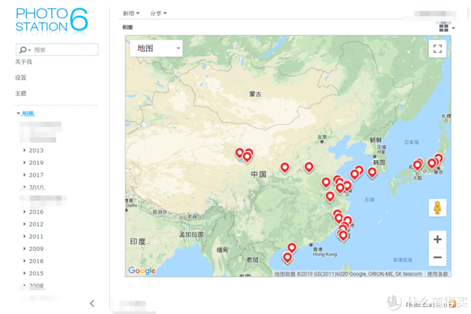
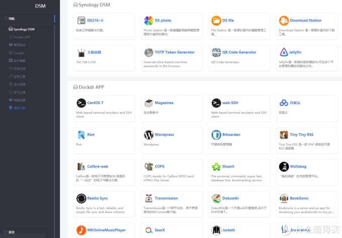

## NAS玩机第十一年，高阶玩家教程系列预告

https://post.smzdm.com/p/a3gwlgek/

　　从拥有第一台[群晖](https://pinpai.smzdm.com/2315/)到今天，已经第十一个年头了。感概最深的当属点开photo station套件，看到十年来的照片，GPS信息记录了我的脚步（可惜的是十年前的照片没有附注GPS信息）。因为是自己的[服务器](https://www.smzdm.com/fenlei/fuwuqi/)，我不怕信息泄露，但是又能有满足自身需求的服务设备。

十年足迹

　　但是仅仅作为一个媒体机，作为一个备份机，我那爱折腾的心却不能满足。现在，我的群晖216+ii，接管了我几乎90%的互联网服务入口。

再也不怕互联网提供商不能盈利跑路，而我的数据却没有着落了（自建shaarli全平台书签服务）；
再也不怕看个新闻要被AI学去我的阅读倾向了（自建rsshub新闻搜集中心；ttrss全平台新闻阅读器）；
再也不怕搜索几个关键词就被广告商嗅探了（自建SearX）；
再也不怕哪家互联网服务商被黑客攻破脱库密码丢失了（自建Bitwarden全平台密码管理器）；
再也不怕微信上发点 敏 感 信 息被喝茶了（自建matrix服务器代替微信）；
再也不用给视频网站交会员费了（download station RSS自动下载最新剧集；jellyfin全平台视频播放器）；
再也不怕[电子书](https://www.smzdm.com/fenlei/dianzishuyueduqi/)下了就丢在硬盘角落不见天日（calibre-web电子书展示web书库）；
再也不怕音频视频电话被AI分析卖关键字给广告商了
……

日常服务web页面

　　相信作为手持NAS的大多数人而言，看到上面的信息也不可能相信nas能做这么多事情。或许有些人觉得很麻烦，有些人觉得没有必要。这都很OK，各人的需求点不同。我比较重视自己资料的安全跟隐私，天然不相信互联网服务的提供商——他们天生是为了盈利，不能盈利的服务就砍掉；免费提供的就会嗅探你的隐私——这是刻在商业的基因里的。如果你像百度的李总说的，只要方便、免费，隐私什么的不重要，那这里没有一段教程是适合你的。但看到上面的一段【再也不怕】，你感同身受跃跃欲试想要探究的话，就订阅我，跟紧我的步伐吧！

　　嫌弃麻烦？那真的不适合折腾了。事实上，我搭建的都是基础服务——基础服务的概念就是，建造的时候麻烦，使用的时候你都感受不到它的存在，但你又不能没有它。

　　断断续续摸索了十年的进阶经验，今天我就在这里详细分享了（视文章热度决定进度及分享深度）。注意：这不是适合小白的教程，你要至少让你的nas跑起来；会设置[路由器](https://www.smzdm.com/fenlei/luyouqi/)端口转发；会用ssh连接登录到nas；会爬[梯子](https://www.smzdm.com/fenlei/tizi/)；会遇到linux命令问题随手搜索；会做内网穿透；最重要的一条：【你的机器要能安装docker套件】

　　是的，我说的这些服务有95%都是通过docker安装运行的。为什么要docker？
1）背靠github≈无限的开源资源，dockerhub上的开源软件≈无限
2）十年间的折腾让我认识到，白群晖对资料的保护是很到位的，你随便折腾乱来，只要不rm -rf * 或者暴力断电，资料是不会出什么问题的（这是我强烈推荐白群晖而不是黑群晖的理由，黑群晖折腾过火了，对资料的重视程度是不够的）但是系统设置不一样！【每次你把机器折腾到连接不上了，捅机器背后的小菊花，把系统设置还原（硬盘资料都还在，没有问题），能连接上了，但是傻眼了——系统设置、套件都没了，要全部重新安装，重新调试】但是docker不同。每次这么折腾完，安装上docker套件，你的所有容器就满血复活，跟宕机前没有任何区别。——这就是群晖的套件，只要有docker替代品，我绝对不安装套件的原因（包括video station、music station）

## 简单介绍说明含预告系列（留言投票你们最想看的教程序号）

1. 了解PT，如何订阅RSS自动下载最新更新的剧、动画

2. 自建 Jellyfin ，代替video station套件，全平台播放硬件解码、资料削刮、自行添加封面

3. docker 或虚拟机安装centos

4. 自建 calibre-web ，电子书展示书柜 （在命令行下添加、删除书本）

   【设置定时任务自动抓取 The economist、Nature 等杂志或自定义RSS新闻并自动添加到 calibre-web 展示页面中】

5. 自建 web-SSH，ssh端口暴露到外网很危险，那就通过 web-SSH 做一个中转命令行缓冲一下，安全又方便

6. 自建 Riot客户端、Matrix服务器，可全面替代微信的聊天软件服务器，端对端加密，可视频语音通话，发送图片资料没有限制，资料数据全掌握在自己手里

7. 自建 wordpress，你只是想简单的记录，换了那么多VPS，写了几年的博客数据却不能长期保持

8. 自建 bitwarden，全平台密码管理器，随机强密码生成器，登录自动填充，TOTP二次验证【我连所有的银行卡密码都随机化存在里面了，你还有什么理由不加强自己的密码管理？】

9. tiny tiny RSS，记得googlereader吗？现在还有活着的reader吗？会不会哪一天突然就宣布不盈利不再提供服务了呢？如果你讨厌头条新闻，你应该回到RSS的怀抱。

10. RSShub，rss数据抓取中心——现在很多网站、服务、公众号根本不支持rss，这个神奇的宝贝就是那些封闭服务的小克星——连抖音都能抓取哦！

11. Shaarli，全平台书签服务，你还记得 Delicious、Readitlater、Diigo、googlestars、pocket 这些凉透了的免费的好用到爆炸的全平台书签服务吗？你是在用什么同步和管理数千的呢？电脑上用chrome，手机上也不得不用chrome？我手机上就只想用 via 该怎么办？

12. Wallabag，evernote、instapaper 印象笔记流量不够用？会员费交了吗？note station 全文搜索结果跟狗屎差不多！那你应该了解一下 wallabag ！

13. Resilio Sync，啥也不说了，懂的人自然懂

14. transmission，手动添加的时候比 download station 方便，连接速度快。（主要我还没折腾成功flexget订阅RSS给transmission自动下载）

15. Dokuwiki，应该比较小众，看有没有需求，暂且列一下吧

16. BookSonic，自建有声书播放管理器

17. MKonlineMusicPlayer，自建在线各家音乐搜索合集播放器

18. SearX，自建匿名搜索引擎切换器

19. Jackett，自建 BT 资源入口中心

20. 为知笔记，自建为知笔记服务器

21. TOTP Token Generator，在线将totp源码生成限时密钥，应急用

22. QR Code Genertator，在线生成二维码，应急用