# UNraid下安装群晖NFS挂载PHOTO、Drive 目录

https://bbs.iobroker.cn/t/topic/914

话不多说，NFS挂载UNRAID的目录，这样文件文件直在UNRAID上我认人认为就算做数据恢复也很方便。在IMG里文件有一点点损坏全完了。。

unraid支持NFS群晖6.2.zipunraid支持NFS群晖6.2解压到UNRAID下新建虚拟机设置如下

[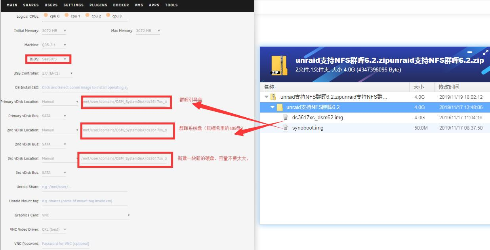1.jpg1237×633 59.9 KB](https://iobroker-1255708240.cos.ap-hongkong.myqcloud.com/original/2X/c/cd15bda08a6ca46755cb297f0f6967b1b4654b55.jpeg)

强停虚机后进行编辑。
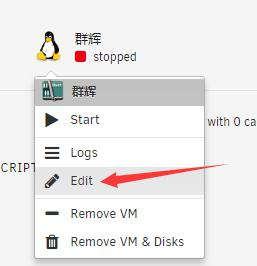
先取右边

[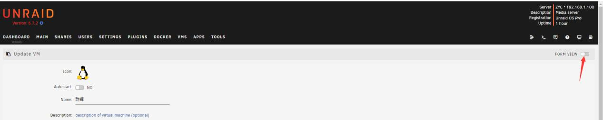3.jpg1267×253 17.9 KB](https://iobroker-1255708240.cos.ap-hongkong.myqcloud.com/original/2X/f/f41f54b7adb1a4784d8c8967312a2700807fec8c.jpeg)

修改网卡型号 e1000
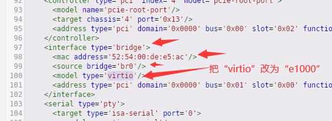

启动主机
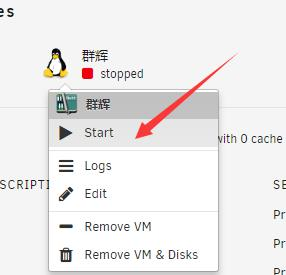

使用群晖的搜索工具搜出来接下来进去设置就行了

[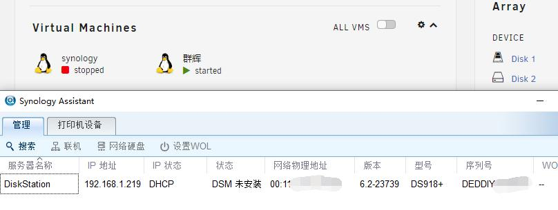6.jpg808×305 27.6 KB](https://iobroker-1255708240.cos.ap-hongkong.myqcloud.com/original/2X/5/5f2c55120cc342ec38853e675525fc52a58dfe3d.jpeg)

帐号admin 密码123456

进入磁盘管理新增

[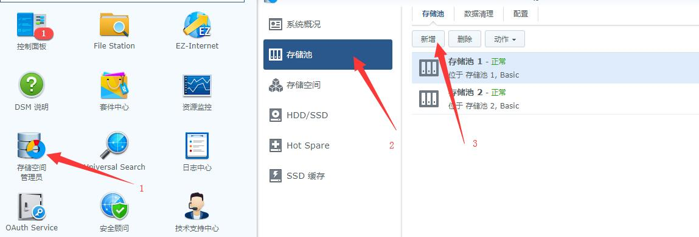8.jpg1149×391 37.6 KB](https://iobroker-1255708240.cos.ap-hongkong.myqcloud.com/original/2X/e/e3ffe05ee905403b42996df1e4d87f66079cc1e6.jpeg)

磁盘的类型选择无所谓最后反正NFS挂载，我是这个认为的。哈哈

新增存储空间~~~~~

[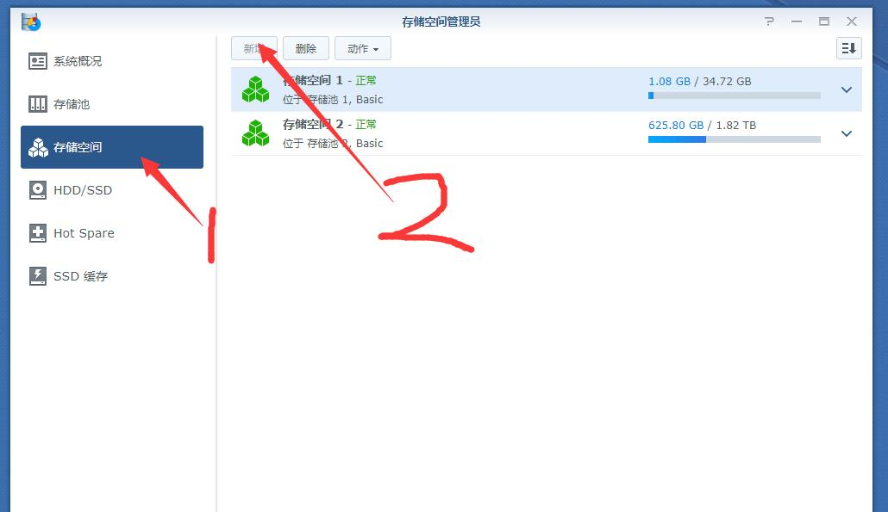9.jpg1030×595 32.5 KB](https://iobroker-1255708240.cos.ap-hongkong.myqcloud.com/original/2X/8/88afaec0b44c5df3a5d3e4fbbbaaf7d3d27fb9ce.jpeg)

然后安装套件 记得 Synology Drive Client 安装到volume2空间

[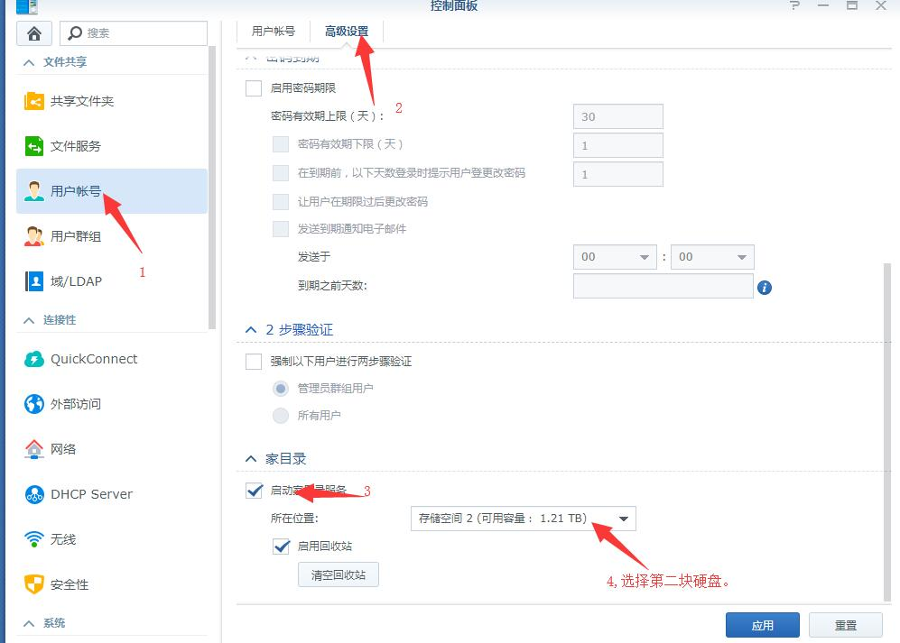11.jpg997×713 50.3 KB](https://iobroker-1255708240.cos.ap-hongkong.myqcloud.com/original/2X/5/5d31efa1d60497b622b802c8b9e5d1dc6b046c50.jpeg)

后面就在UNRAID里新建一个目录在建几个子目录，把NFS共享打开。
/mnt/user/Home_Nas/DSM_Disk1/photo
/mnt/user/Home_Nas/DSM_Disk1/video
/mnt/user/Home_Nas/DSM_Disk2

群晖里新建挂载任务

[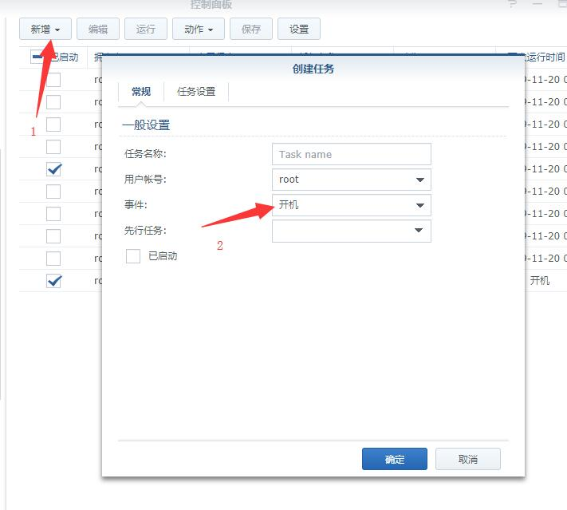10.jpg711×639 30 KB](https://iobroker-1255708240.cos.ap-hongkong.myqcloud.com/original/2X/7/7d62c045b563422c14b894b944d0edecabe074ec.jpeg)

新建开机启动任务

[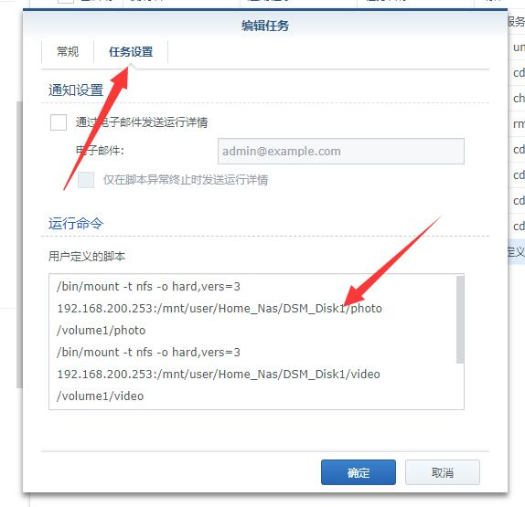12.jpg574×555 32.4 KB](https://iobroker-1255708240.cos.ap-hongkong.myqcloud.com/original/2X/2/2d5b6420052100b0dbf02ff7ce29e934163696a4.jpeg)

/bin/mount -t nfs -o hard,vers=3 192.168.200.253:/mnt/user/Home_Nas/DSM_Disk1/photo /volume1/photo
/bin/mount -t nfs -o hard,vers=3 192.168.200.253:/mnt/user/Home_Nas/DSM_Disk1/video /volume1/video
/bin/mount -t nfs -o hard,vers=3 192.168.200.253:/mnt/user/Home_Nas/DSM_Disk2 /volume2

完~~~好了~自己慢慢摸吧~！我不太会写也是摸过来的~哈哈