# [套娃]群晖VMM中安装黑群晖DSM6.2.2 并开启virtio网卡

众所周知，VirtualMachineManager(VMM)中的VirtualDSM是没有监控的授权的，而且存储空间的管理功能也与正常群晖有所区别，最重要的是价格贵。
 而有些特殊的用途需要在VMM中部署一个或多个黑群晖，理论上本方法白裙和黑裙的VMM都支持

 教程如下：

 1、引导文件准备
 由于要使用virtio网卡，所以建议使用@[panpan20081234](http://www.gebi1.com/space-uid-338129.html)编译的支持virtio的引导。
 请从@[panpan20081234](http://www.gebi1.com/space-uid-338129.html) 的帖子中自行下载synoboot_ds918_1.04b_extend.img文件引导下载帖子：
 http://www.gebi1.com/thread-295881-1-1.html重要 不要下载错了！ 是第一个文件6.2.2的 不是第二个6.2.3的引导！！

 2、创建VMM黑群晖虚拟机
  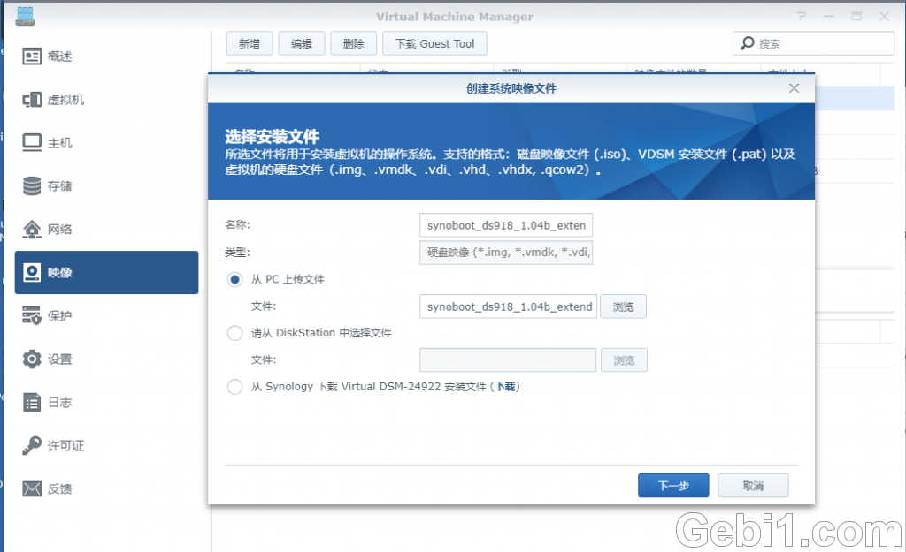  **1.PNG** *(240.16 KB, 下载次数: 0)* [下载附件](http://www.gebi1.com/forum.php?mod=attachment&aid=MTExMzY4fDE2NDU4YmYyfDE1OTYwNzU4NTB8OTgyNjV8Mjk1OTU3&nothumb=yes)  2020-4-29 18:46 上传    
 点左侧的映像 选择新增 选中上一步下载的引导

  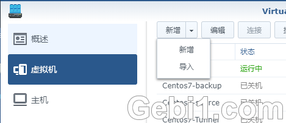  **2.PNG** *(23.39 KB, 下载次数: 0)* [下载附件](http://www.gebi1.com/forum.php?mod=attachment&aid=MTExMzY0fDc1ZTllMzhlfDE1OTYwNzU4NTB8OTgyNjV8Mjk1OTU3&nothumb=yes)  2020-4-29 18:46 上传    
 虚拟机页面点导入 导入 导入！！！

  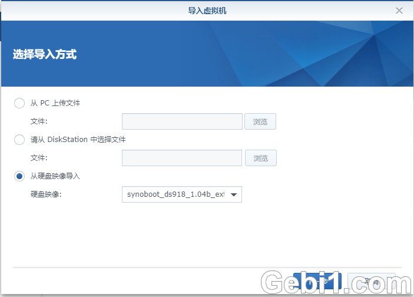  **3.PNG** *(57.88 KB, 下载次数: 0)* [下载附件](http://www.gebi1.com/forum.php?mod=attachment&aid=MTExMzY1fDRiOWNmYTUzfDE1OTYwNzU4NTB8OTgyNjV8Mjk1OTU3&nothumb=yes)  2020-4-29 18:46 上传    
 从磁盘映像导入，选中刚才导入的映像

  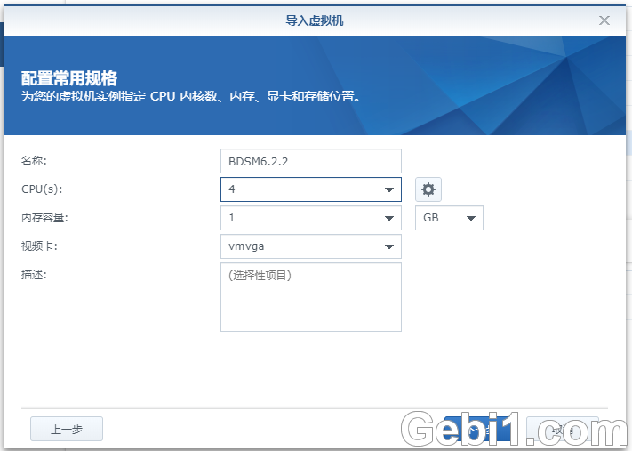  **4.PNG** *(58.99 KB, 下载次数: 0)* [下载附件](http://www.gebi1.com/forum.php?mod=attachment&aid=MTExMzY2fGQxYmY4MDI0fDE1OTYwNzU4NTB8OTgyNjV8Mjk1OTU3&nothumb=yes)  2020-4-29 18:46 上传    
 配置按需要改

 本帖隐藏的内容  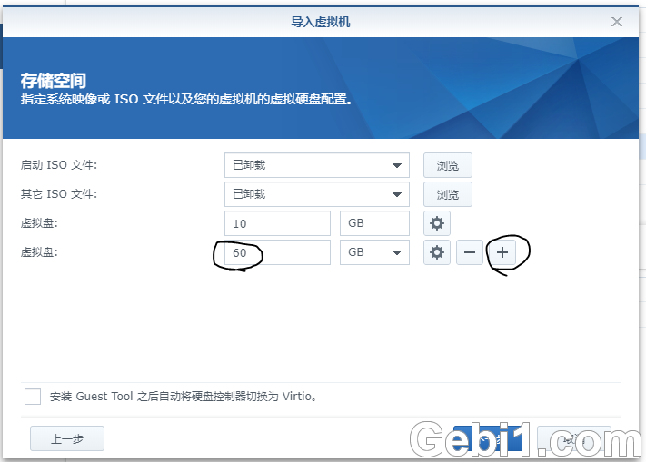   
 在虚拟磁盘页面，10G的那个就是引导，大小不需要改，点右侧的加号添加数据盘，并且改成需要的大小

  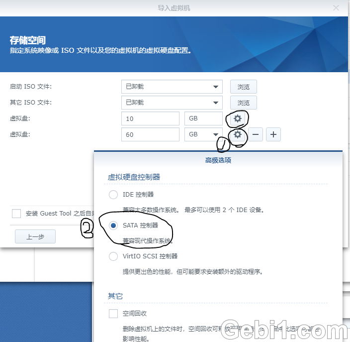   
 添加完数据盘后，**依次点击引导盘与数据盘的齿轮，把所有盘的控制器改成sata （重要！！）** 
 改成其他的都无法引导

  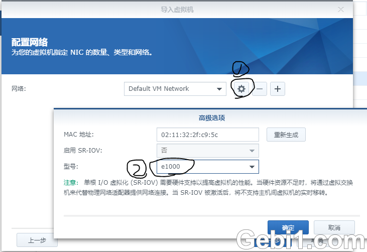   
 网络也点击齿轮，先把型号改成e1000

 

 创建好后开机
  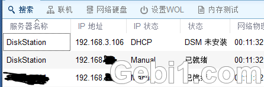   
 没问题的话在assiatant里面就可以看到了，按普通的方法安装就行了

  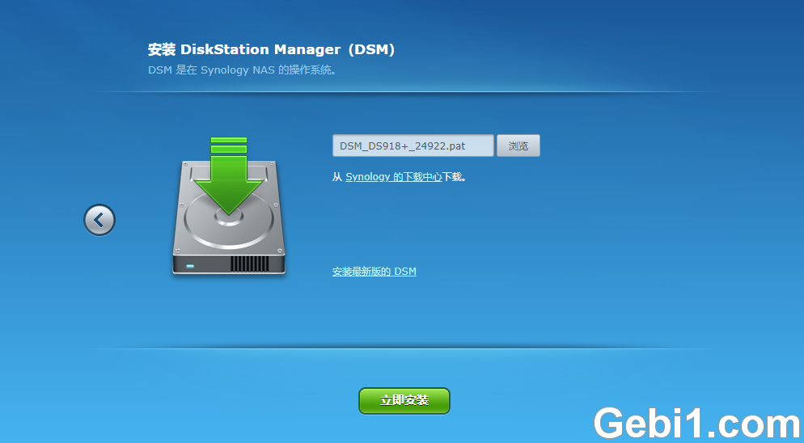   
 Ps.如果使用synoboot_ds918_1.04b_extend.img则只支持DSM6.2.2，请自行下载DSM6.2.2安装包安装
 不支持6.2.3，6.2.3的引导暂未测试，请自行尝试

  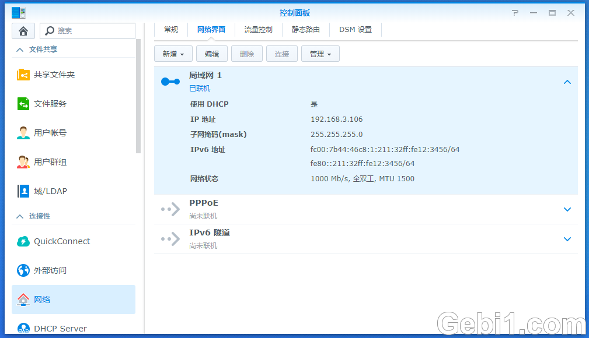   
 安装好后进系统，可以看到跑在e1000的1000M带宽下

 接下来，关闭系统

  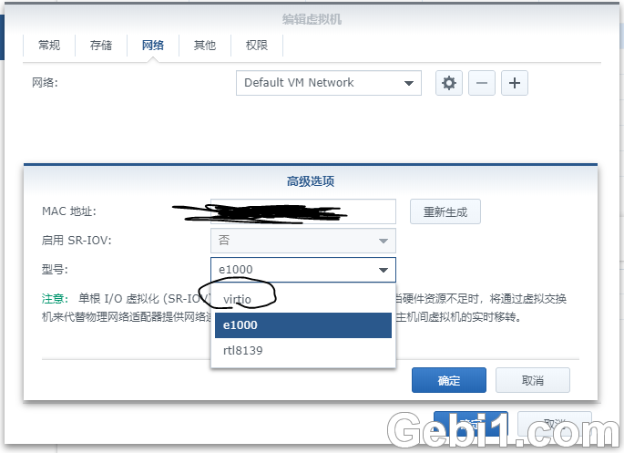   
 进入虚拟机设置界面，把e1000改成virtio后开机

 接下来尽情享受吧