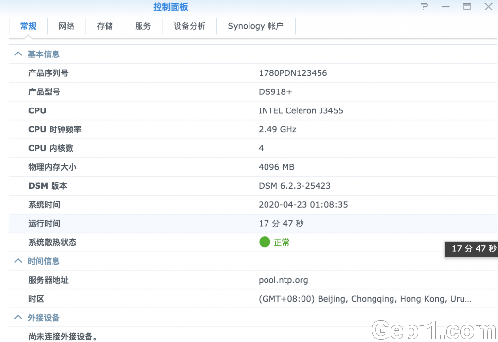

# [新增6.2.3]ds918 6.2.2引导-支持全系列网卡-支持virtio,e1000,支.....

由于6.2引导集成的驱动有限，且不支持e1000和virtio，所以在pve里默认是没法使用的。

 虽然可以通过修改启动参数的方式使用e1000e网卡，但是在dsm系统，网速统计有问题，性能也差。

 因此手动编译了一些驱动，集成在引导里，实测完美支持e1000，virtio(推荐，性能是e1000的10倍)，vmxnet3

 使用方法：使用附件替换引导，全新安装或转移，需配合6.2.2-24922版本
 [https://archive.synology.com/dow ... SM_DS918+_24922.pat](https://archive.synology.com/download/DSM/release/6.2.2/24922/DSM_DS918+_24922.pat)

 下载地址：
 https://funr.lanzous.com/ibm8abc
 密码:gbni

备份【 [synoboot_ds918_1.04b_extend.img.zip](tools/synoboot_ds918_1.04b_extend.img.zip) 】

 PVE中virtio网卡使用方法：
 安装时先选择e1000网卡，mac地址和引导文件中一致(默认：00:11:32:12:34:56)
 安装完成后，先关机，网卡切换成virtio，再开机即可

 update： 2020-04-23
 增加了6.2.3 的引导，此引导不可用于全新安装或转移，用法如下：

 \1. 使用6.2.2引导，安装或升级到6.2.2-24922
 \2. 安装完成后，在官网下载25423.pat手动升级(控制面板-> 更新和还原 ->手动更新)
   [https://global.download.synology ... &build_number=25423](https://global.download.synology.com/download/DSM/release/6.2.3/25423/DSM_DS918%2B_25423.pat?model=DS918%2B&bays=4&dsm_version=6.2.3&build_number=25423)

 \3. 重启后群晖会失联，等待5分钟后强制关机
 \4. 使用6.2.3引导即可进入系统，仍然支持virtio

 6.2.3引导地址：
 https://funr.lanzous.com/ibsk83a
 密码:gygv

备份 【 [synoboot_ds918_1.04b_6.2.3_extend.zip](tools/synoboot_ds918_1.04b_6.2.3_extend.zip) 】

 

 经过测试，在pve环境下，直通核显给群晖，6.2.3硬解转码正常
 测试环境：i5-8400 + b365