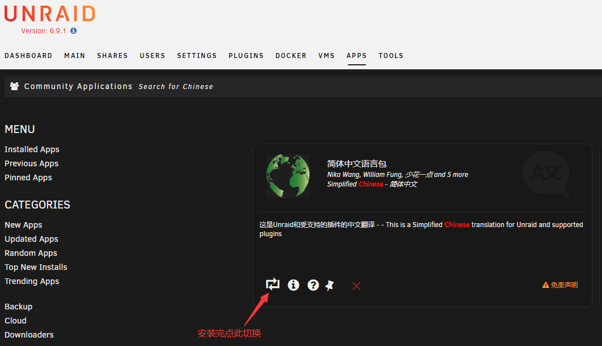
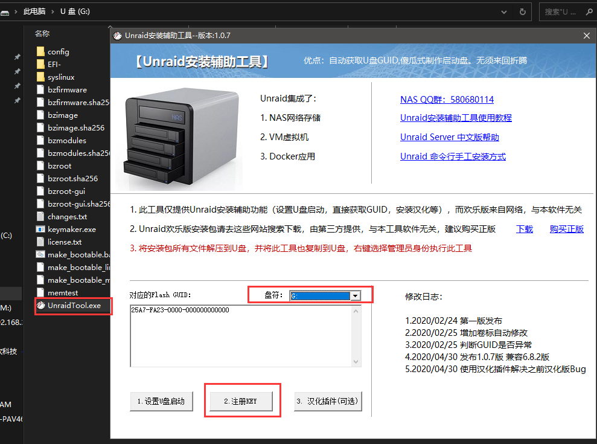

## unraid 6.8.2无损升级6.9.1开心版教程

https://blog.amings.cn/article/10.html

> 提供两种方法安装6.9.1

## 一、6.8.2无损升级6.9.1

既然各位能走到升级这一步，想必都是老手了，就不一一放图了。
　　1.1 下载压缩包:
[点击下载](https://blog.amings.cn/down/unraid6.9.1kaixin.rar)
此开心版原作者未知，此包转载于互联网，知道作者的请在评论区告知，我会批注在此处。
　　1.2 把Unraid关机并拔下U盘插到电脑上
　　1.3 备份原有的6.8.2U盘下的所有文件（直接复制到别的地方）
　　1.4 解压下载的压缩包到任意地方，把解压出来的文件全部复制至准备好的U盘中。
　　1.5 把备份出来的config文件夹替换到U盘中
　　1.6 把备份出来的syslinux文件夹下syslinux.cfg文件替换到U盘中相同路径中。
　　1.7 为保证启动正常，最好运行一下2.4步骤
　　1.8 至此，拿这个制作好的U盘，去插到主机上吧，不出意外的话，应该可以直接启动并进入6.9.1的页面了
　　注：6.9.1默认不带中文，需要在APPS中搜索Chinese安装，安装完点一下切换即可，不用重启。

## 二、直接安装6.9.1

本处只说引导盘如何制作，使用保姆级教程请百度，直接跳过其他教程里制作引导盘的部分即可，其他地方无异。
　　2.1 弄个U盘，建议4G以上全新的U盘，格式化为FAT32，如果U盘制作过其他引导盘，必须用dg删除分区再新建分区格式化。如果制作过pe，必须使用制作pe的工具还原U盘后在用dg删除分区再新建分区格式化
　　2.2 执行1.1/1.4步骤
　　2.3 右键管理员打开UnraidTool.exe，选择插入的U盘，点注册KEY，会在unraid里面的config生成一个叫做“BTRS.key”的文件，这个就是授权文件了。

我这里找的一个廉价U盘演示的，图中Flash GUID含00000000，此类U盘容易破解不成功，最好选一个U盘不是000000的，看运气。
　　2.4 右键点击“make_bootable.bat”以系统管理员运行，输入Y回车出现完成字样即可拔下U盘。
　　2.5 至此，拿这个制作好的U盘，去插到主机上吧，不出意外的话，应该可以直接启动并进入6.9.1的页面了
　　注：2.4 步骤即便是以系统管理员运行，有可能也会出现ERROR - script must be run as administrator（错误-脚本必须以管理员身份运行），这种情况未知如何解决，只能换一台电脑以管理员模式运行bat。（我遇到了，换了一台电脑解决了）