## 【NAS玩机十一年高阶玩家教程系列其一】

https://post.smzdm.com/p/a25gk0m7/


　　经过几天的预告帖发酵，我发现大家的热情还是很高的嘛，那我就从呼声最高的需求开始讲了，各位随时留言，随时到[预告贴（点我回到系列预告帖看系列目录）](https://post.smzdm.com/p/a3gwlgek/)留言投票想尽快看到的教程。
　　作为从菜鸟小白进阶到老鸟阶段的人来说，我做的教程会尽量贴合这个进阶阶段，强调一些坑以及这么做的原因【很多教程一步一步教你做下来，但有些一般小白不懂得坑，高手觉得很正常一掠而过的地方，往往最容易让人卡壳】。

------

### 【朋友们，真的请你热烈一点，我现在这篇教程写到60%，发现坑好多呀，头快烂掉了……】 

------

## 系列大纲领【敲黑板】 

此系列所有服务的安装和使用，除了 wallabag、bitwarden 以外都不必须公网IP要求，搭建在局域网在局域网环境内使用OK，有能力内网穿透的也能从外网访问。教程设计docker的部分全程使用命令行。
**原因**：简单、快速、具有100%可还原性。

　　刚开始的时候可能你会觉得难受，毕竟长这么大敲命令行的时间加起来都没有半个小时，但是当你需要更新容器时，当升级换机时，复制粘贴几行代码，等待结束后无缝使用的体验，可比在docker套件里面点来点去保证设置不出错的感觉好太多了！

　　上菜了，[群晖](https://pinpai.smzdm.com/2315/)官网教程[如何通过 SSH/Telnet 用 root 权限登录 DSM](https://www.synology.com/zh-cn/knowledgebase/DSM/tutorial/General_Setup/How_to_login_to_DSM_with_root_permission_via_SSH_Telnet)

　　就拿今天要说的套件举例，**【用docker套件webUI安装】VS【用命令行安装】**

### 噢，我的老伙计，怎么能忘了做介绍呢

咩嗨**密码管理器？**密码管理器有什么作用？密码管理器还能比我输入密码来的方便？**bitwarden** 在一众密码管理器中是个什么样的定位？ 优缺点如何？

　　不复制粘贴了，这里有两篇祥测对比文章：
　　[BitWarden：妈妈再也不用担心我记不住密码啦](https://sspai.com/post/54728)
　　[6款最好用的密码管理软件推荐](https://www.v1tx.com/post/best-password-mannager/)

　　你是否注册了N多网站只用一阵子，然后可能就忘了这个网站？
　　你是否除了微信、支付宝、QQ、邮件以外的所有服务账户名密码都一样？或者密码是网站相关字符+完全一样的字符？
　　你的微信、支付宝、QQ、邮件的密码字符有80%是否有以上的重合？不重合部分是不是对你来说有具体的意义？
　　你的常用密码是否顶多大写小写加字幕连特殊符号都没有的？
　　你的银行卡是否密码都一样？

　　嗯，对对，别否认了，会看到这里的基本上占3条了。看过美剧《黑客军团》吗？黑客要入侵你的机器或账户，本质上还是要拿到你的账户密码，用对你来说有意义的数字文字做密码、在各个网站用相同或者相似的密码，只要某一个网站被黑客入侵脱库，那么你的一切将赤裸裸展现在黑客眼前。但如果你每一个账户的密码都是这样的【4$@F&v@Q5K4@WEq9nj!T7b9gk】那么就算用超级计算机暴力破解，也要花上40年的时间。只要比大多数人注意安全，只要比旁边的人跑的快，你就能避免虎口！！！

　　全平台——iOS、安卓、win、linux、命令行

　　从此以后，你只要记住一个主密码，忘掉所有的网站服务账户密码；忘掉银行密码；需要的时候点一下（chrome都不需要点，进入网站就自动填充账号密码），就OJBK了！跟我讲不安全？我主密码28位大小写+数字+特殊字符无意义强密码，破解个给我试试？bitwarden开启2步验证，破解个给我试试？密码太长记不住？用个几天，这辈子就忘不掉了，真的。

## 请注意：由于正常使用bitwarden必须https登录，所以如果你家没有公网IP或者你没有可以供群晖做内网穿透的VPS的话，不用再往下看了，上面的测评文章里面找个顺眼的密码管理app用起来吧。 


### 来看一下我使用环境的截图

　　**哦，那啥，出于安全性原因，bitwarden app不能截屏，不能录屏。那咱们来说说安全性吧。
**　　除了上文说的强力随机长密码的加持之外，整个工具体系的安全性是很值得注意的。所有密码管理软件里面唯一一个可以自建[服务器](https://www.smzdm.com/fenlei/fuwuqi/)【密码密钥都掌握在自己手上】，且后端开源的一款。后端开源的意思是，代码公开所有人可看，杜绝了加入后门的可能性（就算加入了也会很快会被发现）。你看，像windows、[苹果](https://pinpai.smzdm.com/1687/)系统这些闭源系统，它要真在系统中植入后门，等到关键时刻用一下，除了内部人员是不会有人知道，也没有任何办法的。
　　连接密码库除了用自己的密码外，还能开启TOTP两步验证（类比电子银行密码器），有Google authenticator、其他外国的2步验证服务商、还有支持有一家提供二步验证硬件密码器，[详情点我了解。](https://help.bitwarden.com/article/setup-two-step-login/)

------


## 用docker套件webUI安装

[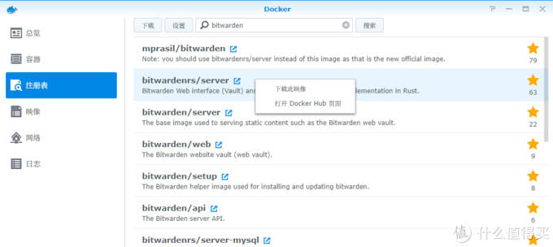](https://post.smzdm.com/p/a25gk0m7/pic_2/)搜索bitwarden用最前面2个，官方那个容易崩溃

[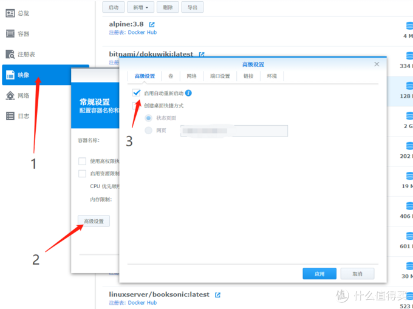](https://post.smzdm.com/p/a25gk0m7/pic_3/)

[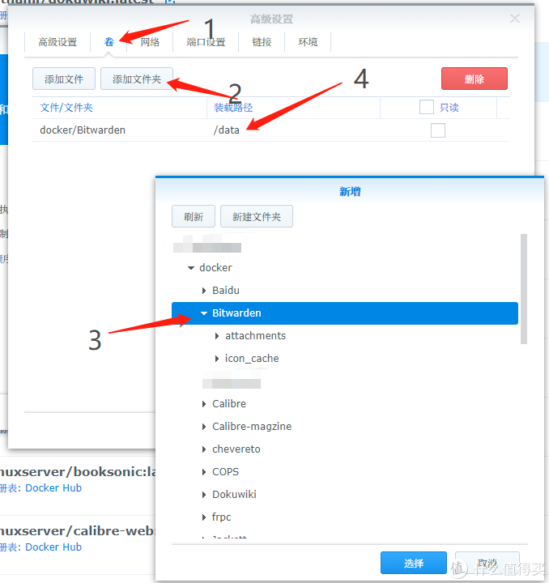](https://post.smzdm.com/p/a25gk0m7/pic_4/)

[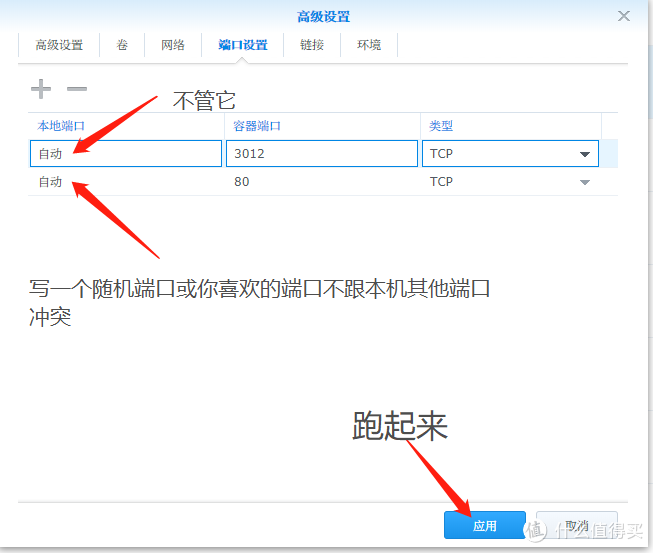](https://post.smzdm.com/p/a25gk0m7/pic_5/)应用，下一步，启动，不想截图了

好了，跑起来了

[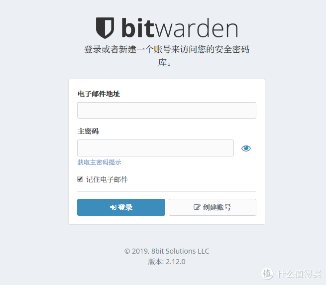](https://post.smzdm.com/p/a25gk0m7/pic_6/)然而看到这个页面只是万里长征第一步

------

### 我好难啊，我好烦啊！！！这是唯一的一次好吧！唯一的一次我做docker套件webUI做教程。来，看一下用命令行。【请注意！！！不要直接复制下面的代码在你机器上面跑】一定看完分析！ 

```
mkdir /volume1/docker/Bitwarden && docker pull bitwardenrs/server:latest && docker run --name Bitwarden-Server --restart=always -v /volume1/docker/Bitwarden:/data/ -p 12420:80 -p 12421:3012 -d bitwardenrs/server:latest
```

　　眼花了吗？上面一行代码的功用等于上面所有操作的截图，你改成对于自己机器的代码，复制粘贴回车，喝杯茶等两三分钟就可以看到这个了。

> [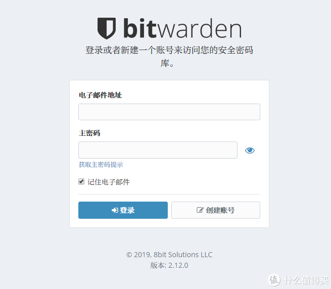](https://post.smzdm.com/p/a25gk0m7/pic_7/)

## 请拿出小本本，要开始分析了【只在这贴做分析，后面套路都差不多】

> **mkdir /volume1/docker/Bitwarden
> \#新建一个[文件夹](https://www.smzdm.com/fenlei/wenjianjia/)用来放bitwarden的数据，一定要有，以后就算容器坏了或者删除更新，资料都在
> \#每个人的机器环境不同 /volume1 是我的主盘； /docker 是我专门用来放各种docker容器数据的共享文件夹，只能在DSM控制面板-共享文件夹中添加；/Bitwarden 你随便取什么名儿，有它就对了**

> **&&
> \#前面一条命令敲完带个空格，打两个&，再带个空格，跟下一条命令。意思是上一条命令运行成功后继续运行下一条命令，没有个数限制，但是上一条命令返回的结果如果失败，则不会继续运行下一条命令。
> \#好处是啥?好处是无人值机呀，本来输入一条命令要等个几分钟再输入第二条，现在你一条输完然后去微博上看看小姐姐不好么。**

> **docker pull bitwardenrs/server:latest
> \#意思是下载 bitwardenrs/server:latest 这个映像的最新版本（用套件下载能[鼠标](https://www.smzdm.com/fenlei/shubiao/)选择旧版本，latest改成旧版本号也行。有些套件不一定非要用最新版本，所以了解一下可以选版本这个知识点**

> **docker run （启动了啊）--name Bitwarden-Server（容器的名字，可自定义，起个好听好看好记得，很重要！）--restart=always（让它不管发生啥情况都会自动重启，机器关机啦停电等恢复后容器会自动跑起来） -v /volume1/docker/Bitwarden（最开始那段新建的文件夹）:/data/（这个不敢改哈） -p 12420（自定义不冲突端口）:80(别手贱改它) -p 12421（自定义不冲突端口）:3012(别手贱改它) -d bitwardenrs/server:latest （表示要调用的映像，别手贱）**

**以后容器如果有更新，一行就搞定：**

```
docker stop Bitwarden-Server && docker rm Bitwarden-Server && docker rmi bitwardenrs/server:latest && docker pull bitwardenrs/server:latest &&docker run --name Bitwarden-Server --restart=always -v /volume1/docker/Bitwarden:/data/ -p 12420:80 -p 12421:3012 -d bitwardenrs/server:latest
```

翻译

```
docker stop Bitwarden-Server（停止运行中的容器） && docker rm Bitwarden-Server（删除停止后的容器） && docker rmi bitwardenrs/server:latest（删除该容器的映像） && docker pull bitwardenrs/server:latest （下载最新镜像）&&docker run --name Bitwarden-Server --restart=always -v /volume1/docker/Bitwarden:/data/ -p 12420:80 -p 12421:3012 -d bitwardenrs/server:latest
```

OK，至此，容器正常跑起来了，但是还不能正常使用。需要配置外部网络并部署SSL证书。

------

------

------

## 鉴于北京上海已经开始严打私设服务器（不只80、433端口，任意端口只要被扫到有网页服务，比如bitwarden等等会返回200的页面）都可能被封宽带，在此非常非常不建议直接拿域名绑定。 


## 群晖自动申请Let’s Encrypt的ssl域名证书，支持泛域名，支持自动签发，自动部署到群晖


搞定泛域名证书之后，你有2种选择。
1、直接拿域名+端口绑定群晖
2、域名绑定VPS服务器给群晖内网穿透

### 方法一 直接拿域名+端口绑定群晖

[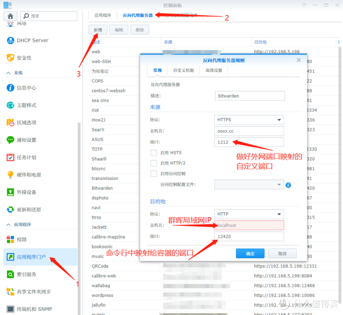](https://post.smzdm.com/p/a25gk0m7/pic_8/)做完这步就可以 https://ooxx.cc:1212 访问bitwarden了

### 方法二 域名绑定VPS服务器给群晖内网穿透

------

### 在VPS上配置一个Frp服务器

ssh登录到VPS
sudo -i
获取root
cd /usr/share/
CD到你要安装的目录
wget https://github.com/fatedier/frp/releases/download/v0.30.0/frp_0.30.0_linux_amd64.tar.gz

解压
mv frp_0.16.1_linux_amd64 frp

改名
cd frp

进入目录
rm -f frpc frpc_full.ini frpc.ini

删除没用的客户端文件
vi frps.ini

编辑ini文件
按ins进入编辑

```json
[common]
bind_addr = 0.0.0.0
bind_port = 7000
bind_udp_port = 7001
kcp_bind_port = 7000
vhost_http_port = 80
vhost_https_port = 443
dashboard_port = 7500
dashboard_user = 登录控制面板用的用户名
dashboard_pwd = 登录控制面板用的密码
token = 随便写一连串啥，但是要和客户端一样
allow_ports = 1,2,3-10,11-65535
max_pool_count = 100
authentication_timeout = 0
```

复制以上内容到 frps.ini

按ESC退出编辑 按shift+： 输入wq 保存退出

./frps -c ./frps.ini

使用临时启动命令启动服务

打开你的服务器IP:7500看看服务是否启动，没问题的话Ctrl+C 结束

nohup ./frps -c ./frps.ini &

后台运行

如果需要调试

使用ps -ef 查看进程ID

kill -s 9 xxxx 杀掉进程

调试好后重新启动即可

设置一个开机自启

一般使用nohup ./frps -c ./frps.ini &命令启动之后如果不重启VPS就会一直运行，以下操作可以省略，只需要在服务器重启之后，重新cd到程序目录，输入一次nohup ./frps -c ./frps.ini &命令即可

新建1个目录存放frps.ini
mkdir /etc/frps

拷贝frps 到/usr/bin/
cp /usr/share/frp/frps /usr/bin/

拷贝frps.ini 到/etc/frps/
cp /usr/share/frp/frps.ini /etc/frps/

使用systemd配置开机自启，适用于 centos7 Ubuntu 16 或 debian 8。

sudo vim /etc/systemd/system/frps.service 新建此文件，并写入以下内容

```
[Unit]
Description=frps daemon

[Service]
Type=simple
ExecStart=/usr/bin/frps -c /etc/frps/frps.ini

[Install]
WantedBy=multi-user.target
```

/usr/bin/frps 为frps文件目录

/etc/frps/frps.ini 为frps.ini文件目录

启动并设为开机自启。
sudo systemctl start frps
sudo systemctl enable frps

————centos6.5及以下———————
vi /etc/rc.local
在最下面加一行/usr/sbin/frp/frps -c /usr/sbin/frp/frps.ini
其中 /usr/sbin/frp是程序放置的目录，自己修改，重启ok


------

### 在群晖上配置一个Frp客户端

先写一个与上面服务器相对应的客户端配置文件 frpc.ini

```json
[common]
server_addr = VPS外网地址
server_port = 7000
token = 随便写一连串啥，但是要和服务端一样
protocol = tcp

[DSM-https]
type = https
local_ip = 群晖局域网ip
local_port = 5001
custom_domains = dsm.ooxx.cc

[navi-https]
type = https
local_ip = 群晖局域网ip
local_port = 1212
custom_domains = bitwarden.ooxx.cc
```

二级域名请在你的域名解析服务商处修改。

```
docker pull cloverzrg/frpc-docker:0.30.0 && docker run --name Frpc --restart=always -v /volume1/docker/frp/frpc.ini:/conf/frpc.ini -d cloverzrg/frpc-docker:0.30.0
```

[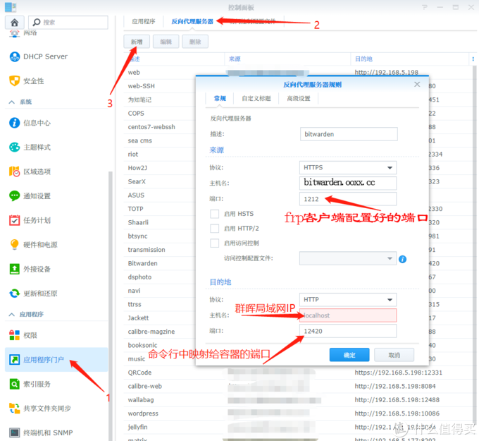](https://post.smzdm.com/p/a25gk0m7/pic_9/)

大功告成。登录bitwarden页面，注册账户，记下关键信息。还有几步要做。
1、关闭bitwarden容器
2、修改容器环境 SIGNUPS_ALLOWED=false 【不允许新用户注册】
3、运行容器

[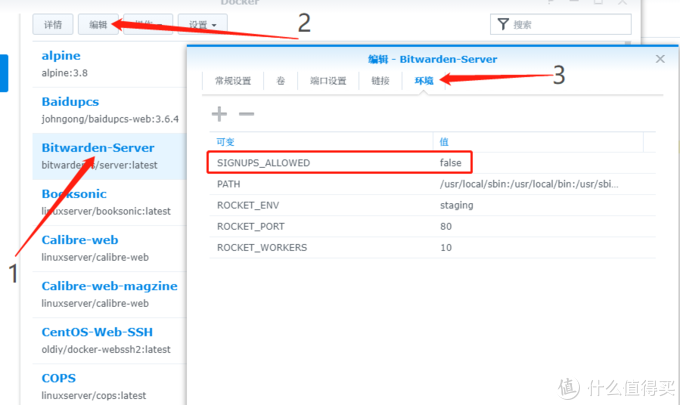](https://post.smzdm.com/p/a25gk0m7/pic_10/)

[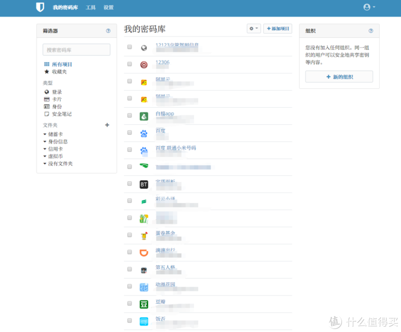](https://post.smzdm.com/p/a25gk0m7/pic_11/)web vault

[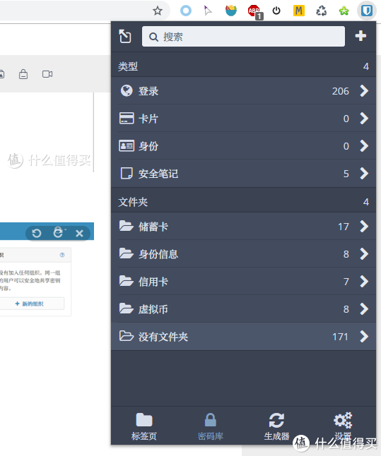](https://post.smzdm.com/p/a25gk0m7/pic_12/)chrome 插件

我了个妈，这第一篇坑就填不完。先这样了。。。