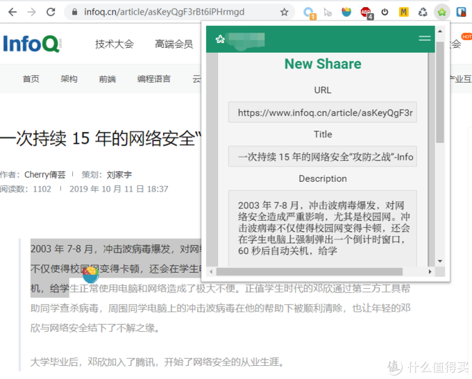
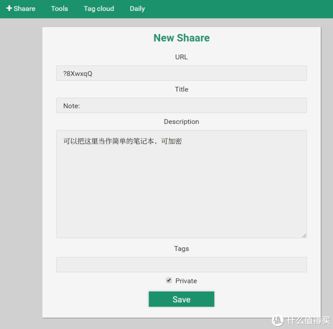
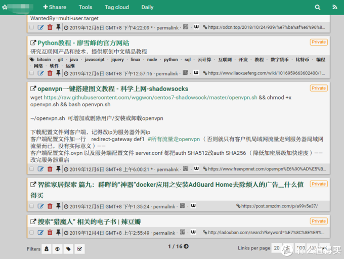
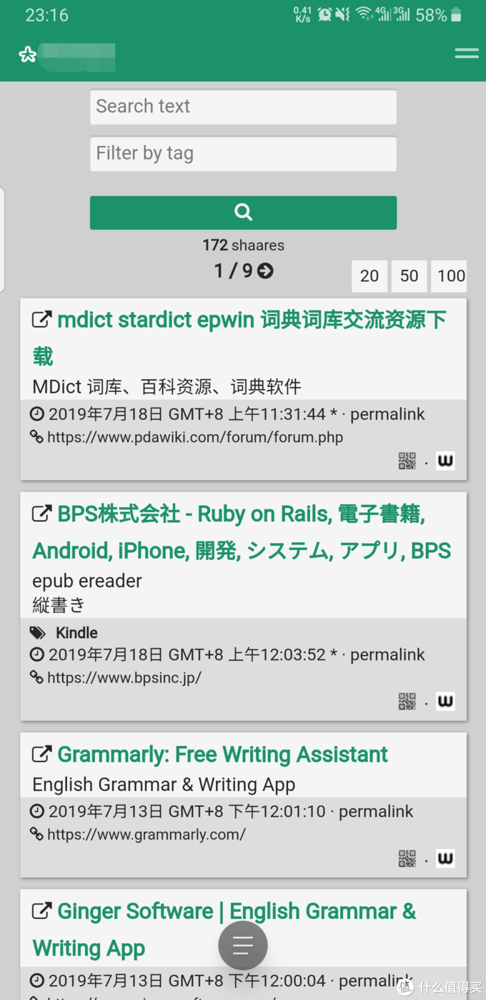
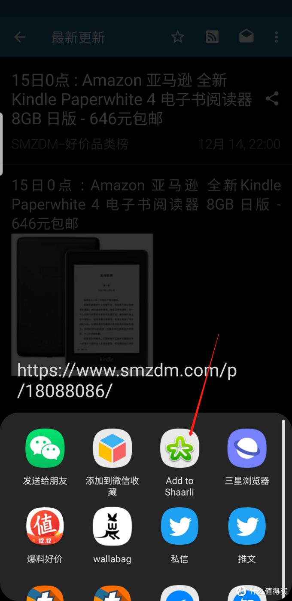

## 【NAS玩机十一年高阶玩家教程系列其三：Shaarli 全平台书签管理器】

https://post.smzdm.com/p/aqnlew57/

## 系列大纲领【敲黑板】 

此系列所有服务的安装和使用，除了 wallabag、bitwarden 以外都不必须公网IP要求，搭建在局域网在局域网环境内使用OK，有能力内网穿透的也能从外网访问。教程设计docker的部分全程使用命令行。
原因：简单、快速、具有100%可还原性。

　　刚开始的时候可能你会觉得难受，毕竟长这么大敲命令行的时间加起来都没有半个小时，但是当你需要更新容器时，当升级换机时，复制粘贴几行代码，等待结束后无缝使用的体验，可比在docker套件里面点来点去保证设置不出错的感觉好太多了！

　　上菜了，[群晖](https://pinpai.smzdm.com/2315/)官网教程[如何通过 SSH/Telnet 用 root 权限登录 DSM](https://www.synology.com/zh-cn/knowledgebase/DSM/tutorial/General_Setup/How_to_login_to_DSM_with_root_permission_via_SSH_Telnet)

### 有几位朋友在催书签管理器，那就插更一期。这两天文章没啥流量，更新动力不足。。。Calibre的工程量太大了，就先写写书签管理器。Calibre[电子书](https://www.smzdm.com/fenlei/dianzishuyueduqi/)工具先往后推了，看看有多少人想看。 

## 应用介绍：

　　Shaarli，全平台书签服务，类似 Delicious、Readitlater、Diigo、googlestars、pocket —— **唯一的区别是，这几个都死翘翘了。**自建的书签管理器我也用过好几个，像栞就挺好看的，但是[手机](https://www.smzdm.com/fenlei/zhinengshouji/)端没有[ap](https://pinpai.smzdm.com/86378/)p，数据导出是数据库文件，只能它自己用。综合一下我最终选择了 Shaarli 做常用的书签管理器。
　　如果你全平台用的是chrome浏览器，那的确是很方便，但是我不喜欢被绑死在某一家服务商，况且还有墙这个巨大的不确定因素。Shaarli 总的来说，不丑，能自己抓取网页简介、网页标题（如下）

支持 tag标签、支持标签搜索；全文搜索。

　　导出的文件为 html 格式，可以直接导入，也可以直接用浏览器打开【以后这个不用它了，也不怕资料拿不出来】。
　　电脑上直接把配置好的网址设到主页一键直达，chrome插件就叫shaarli，[安卓手机](https://www.smzdm.com/fenlei/androidshouji/)上有2个，一个收费一个免费，注意，叫Shaarlier的那个免费的好用！app的作用只是用来添加书签的时候好用的，用的时候还是访问管理器网页界面（适配手机版）

## 安装部署：

mkdir /volume1/docker/shaarli && docker pull shaarli/shaarli:latest && docker run --name Shaarli --restart=always -p 12320:80 -v /volume1/docker/shaarli:/var/www/shaarli/data -d shaarli/shaarli

就行了（参数说明请参考 [【NAS玩机十一年高阶玩家教程系列其一：Bitwarden】](https://post.smzdm.com/p/a25gk0m7/) ）

直接应该就是登录状态，自行修改用户名密码。直接在内网访问正常；愿意外网访问的直接映射端口就行；愿意htt[ps](https://pinpai.smzdm.com/161140/)访问的做好反向代理（具体请参考[【NAS玩机十一年高阶玩家教程系列其一：Bitwarden】](https://post.smzdm.com/p/a25gk0m7/) ）