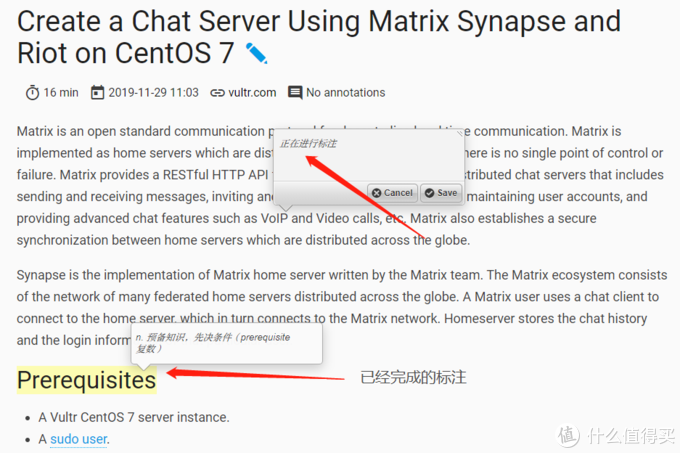
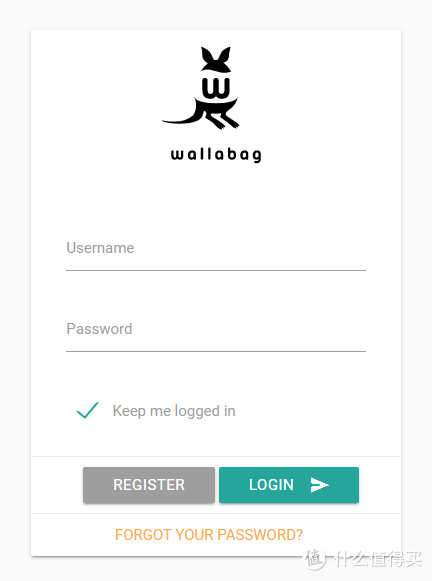

## 【NAS玩机十一年高阶玩家教程系列其二：wallabag】

https://post.smzdm.com/p/aoow2rm9/

## 系列大纲领【敲黑板】 

此系列所有服务的安装和使用，除了 wallabag、bitwarden 以外都不必须公网IP要求，搭建在局域网在局域网环境内使用OK，有能力内网穿透的也能从外网访问。教程设计docker的部分全程使用命令行。
原因：简单、快速、具有100%可还原性。

　　刚开始的时候可能你会觉得难受，毕竟长这么大敲命令行的时间加起来都没有半个小时，但是当你需要更新容器时，当升级换机时，复制粘贴几行代码，等待结束后无缝使用的体验，可比在docker套件里面点来点去保证设置不出错的感觉好太多了！

　　上菜了，[群晖](https://pinpai.smzdm.com/2315/)官网教程[如何通过 SSH/Telnet 用 root 权限登录 DSM](https://www.synology.com/zh-cn/knowledgebase/DSM/tutorial/General_Setup/How_to_login_to_DSM_with_root_permission_via_SSH_Telnet)

## 应用介绍：

　　主要替代Instapaper大部分功能（没有instapaper 发邮件剪辑的功能），替代为知笔记、印象笔记等的网页剪辑功能。说实话，印象笔记中我主要使用的功能就是网页剪辑功能，但是免费流量一个月就那么20m不到？网页图片多一点很快就到限额了。中间因为出过换[服务器](https://www.smzdm.com/fenlei/fuwuqi/)的事情，数据迁移也是一大问题，就开始找替代品了。
　　Wallabag 能剪辑大部分正规图文，能把图片抓下来存在本地。已经有过多次抓取某篇文章后，某篇文章因为各种原因全网消失，这时候就会体会到这个应用的好处。因为重点在【剪辑】，不是【笔记】，因此对剪辑下来的图文没有办法进行修改（看各人需求，我一贯以来也没有修改的需要）；但是可以在文中进行批注。

　　放弃印象笔记后，我用[群晖](https://pinpai.smzdm.com/2315/)的自带套件 note station 有一年多的时间，录入功能很方便，语音文字图片视频都能插入，但是有一个致命的问题：**【录入一时爽，搜索火葬场】。note station** 的搜索功能我只能用傻缺来形容了，只搜标题都搜不准，文章内容基本搜了等于没搜，要不就不出结果，要不就出各种不相干的结果。
　　不得不说，Wallabag 虽然是法国人写的，但是全文搜索定位精准，不管什么语言都能快速定位。

　　Wallabag 是我无意间在github上找到的，几乎没有找到可用的中文教程，在官网上慢慢摸索，安装了不能使用，然后继续官方论坛发问，最终折腾成功。以下呈现的是已经排除了所有的雷之后的一步到位教程。

　　这一篇开始重点说明docker-compose功能，并且不再做docker套件的截图说明教程。小白用户请去上一篇[【NAS玩机十一年高阶玩家教程系列其一：Bitwarden】](https://post.smzdm.com/p/a25gk0m7/)学习命令行与docker套件界面的对应关系，入门命令行操作。

## 部署准备：

　　参考 [【NAS玩机十一年高阶玩家教程系列其一：Bitwarden】](https://post.smzdm.com/p/a25gk0m7/) 中 **【群晖自动申请Let’s Encrypt的ssl域名证书，支持泛域名，支持自动签发，自动部署到群晖】** 部分，以及 **【搞定泛域名证书之后，你有2种选择。】的后文** 部分。

## docker-compose 说明及准备 

　　Docker 本质上是一个小型虚拟机。咱们具象一点把**【能完整跑起来的docker】**比喻为一台**【完整的电脑】**，买回家插上电、网络就能正常工作，比如上一篇的 Bitwarden 。
　　而今天说的 wallabag ，它的官方映像不是【能完整跑起来的docker】，不是一台【完整的电脑】，它充其量只是一个 ① 【[主板](https://www.smzdm.com/fenlei/zhuban/)+CPU】套件，那么要使它成为一台【完整的电脑】，还需要 ② 电源套件、 ③ [显卡](https://www.smzdm.com/fenlei/xianka/)内存硬盘显示屏鼠标键盘套件。那么咱们要做的就是一、买齐 ① ② ③ 套件；二、组装 ① ② ③ 套件；三、插电、网络跑起来。

　　上一篇我们讲的命令行 【docker pull】= 把电脑买回家；【docker run】= 插上电、网络，开机
　　今天讲的 docker-compose 配置文件，= 【一、买齐；二、组装；三、运行】整个流程事先封装到一起，然后用一行命令就能让他们自动一、二、三运行下去，咱们等待最后的结果。

　　新建[文件夹](https://www.smzdm.com/fenlei/wenjianjia/) /volume1/docker/wallabag （各人的系统文件不同，找适合自己的目录）；在此目录下新建3个文件夹 data 、images 、mysql

### 　　在电脑上新建文本文档，文档内容如下：【注意仔细看#后面附注的说明】[（链接）](https://github.com/toyqiu/-dockers/blob/master/wallabag-docker-compose)

另存为 docker-compose.yml ，并将 docker-compose.yml 配置文件存放于 /volume1/docker/wallabag 目录之下。

　　用SSH登录群晖，登录root账户，cd /volume1/docker/wallabag
　　键入 ls 回车，确保看到 data 、images 、mysql、docker-compose.yml 这4个东西
　　键入 docker-compose up -d 回车，运行，等待。

　　此时系统会根据配置文件自动下载对应映像、并根据写好的配置内容运行容器。等就对了。

　　看到最后出现一行长长的小写字母+数字的混合字符后，说明容器成功运行。此时容器第一次运行，就像新系统第一次开机一样，需要较长时间的等待，让它默认配置成功完成，需要10分钟左右的等待（不耐烦的朋友可以去docker套件看日志）。
　　之后在浏览器输入局域网IP+对应端口，应该就能看到登录界面了。

　　但是还不能正常使用。理由跟上一篇一样，一定要https、SSL证书配置正常才行。详见参考 [【NAS玩机十一年高阶玩家教程系列其一：Bitwarden】](https://post.smzdm.com/p/a25gk0m7/) 中 【群晖自动申请Let’s Encrypt的ssl域名证书，支持泛域名，支持自动签发，自动部署到群晖】 部分，以及 【搞定泛域名证书之后，你有2种选择。】的后文 部分。

## wallabag独特的坑

### 1、APP

　　wallabag 客户端有网页版、chrome版、win10应用商店版、手机app版，除了直接登录wallabag网页以外，chrome版、win10应用商店版、手机app版都不能用https登录，否则会出现连接错误。要用http+对应端口。
　　就是说 wallabag 需要配置http 、 https 2个端口，才能使全部 服务器、客户端都正常运行。

### 2、剪辑文章

　　默认配置知乎专栏无法剪辑、微信公众号文章能剪辑内容但是标题总是显示【未知标题】
　　解决方法：
　　用SSH登录群晖，登录root账户，**docker exec -it wallabag sh** 【非常重要的代码，请记下来，能进入任何容器内部】
　　键入 ls 回车，确保看到data 、images 、mysql、docker-compose.yml
　　键入 cd /var/www/wallabag/vendor/j0k3r/graby-site-config 回车 【wallabag 容器内存放剪辑配置文件的目录】

　　键入 vi zhuanlan.zhihu.com.txt 回车 【新建 zhuanlan.zhihu.com.txt 文件】
　　复制以下链接中文档里面的内容3行
https://github.com/toyqiu/-dockers/blob/master/wallabag-docker-zhihu
　　按 INS 切换到编辑模式、按 SHIFT+INS 粘贴复制好的内容、按ESC推出编辑模式、接着键入:wq回车（注意是3个字母+一个回车）保存更改并退出。

　　键入 vi mp.weixin.qq.com.txt 回车 【新建 mp.weixin.qq.com.txt 文件】
　　复制以下链接中文档里面的内容6行
https://github.com/toyqiu/-dockers/blob/master/wallabag-docker-weixin
　　按 INS 切换到编辑模式、按 SHIFT+INS 粘贴复制好的内容、按ESC推出编辑模式、接着键入:wq回车（注意是3个字母+一个回车）保存更改并退出。

　　键入exit回车，回到nas主机；键入docker restart wallabag重启容器。

　　坑填完了。

### 　　**已经是保姆教程了，其他地方找不到的。还没关注？还没收藏？还没投币？不考虑帮我推广一下吗？哎呀你良心不痛吗~~~~**

**
**

## **下一集讲Calibre：如何搭建展示书柜、如何安装虚拟机使用命令行calibre自动抓取新闻并自动添加到展示书柜、calibre recipes 分析、calibre 命令分享**