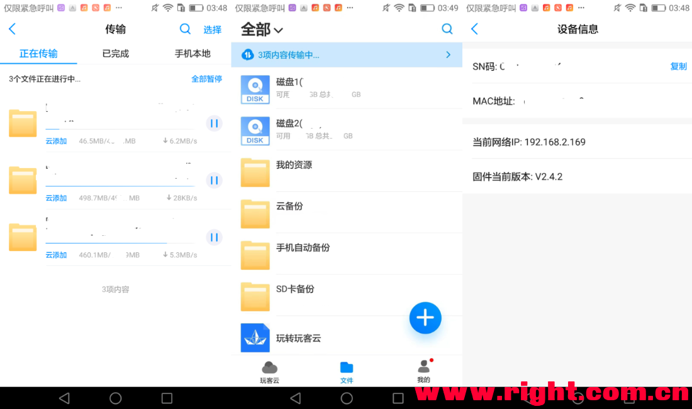

## 【玩客云ROOT】2021年新方法：下迅雷、挂甜糖、smb，一个也不耽误

https://www.right.com.cn/forum/thread-4108325-1-1.html

**未经许可，禁止转载到个人博客或其他网站。一经发现必严肃处理**

**首发帖：https://www.right.com.cn/forum/thread-4092171-1-1.html
**

声明：本教程目的在于折腾，比较费时费力。另外，建议您实践前确保有足够的把握再开始。
当然，也欢迎各位大佬基于此方法开发更简单的方法。

主要目的：破解ROOT密码、删除挖矿程序以彻底绝育(硬盘可以休眠)、保留迅雷下载(云添加)、保留局域网分享(SMB)、支持自己添加脚本或程序(比如甜糖)。

编写日期：2021.04.04. 如遇到问题可以联系我一起讨论，但不敢保证一定能及时回消息。QQ2182622

我参考过的教程：
https://www.right.com.cn/forum/thread-4034559-1-1.html
https://www.right.com.cn/forum/thread-3526512-1-1.html
https://www.right.com.cn/forum/thread-403227-1-1.html
感谢各位大佬提供的思路。

\#######################################################

主要流程：
官方2.12.2固件 → armbian → 坛友1.4.0固件 → 官方2.4.2固件 → U盘启动替换emmc数据强行修改密码 → 使用root登录到玩客云 → 全面开放，想干啥都行
先降级再升级是为了刷入一个支持U盘启动的uboot，然而玩客云没有官方刷机包，所以只好这样绕远路。
2.4.2就可以云添加了，没必要升级到2.12.2.

当然，也可以再升级到2.12.2，但是在步骤【11B】【11C】中 5613600 这个数字可能会变，请自行尝试查找。

适用条件：
玩客云2.12.2 或以下的固件版本，绝育/未绝育均可。已经刷过网心云的不适用。
如果已经刷了armbian/openwrt等，也可以刷，但需要知道刷机前的MAC序列号。部分批次的机器在主板上贴着mac，可供参考。

准备材料：
1、玩客云及拆机工具
2、USB A-A双公头线
3、USB 转 TTL线（请自行安装驱动。另外，需焊接排针/电线，或使用烧录夹、烧录探针等。）
4、一个4G或以上的U盘（硬盘不行）
5、网线、路由器、电脑
6、在这个帖子的末尾下载的文件包

\#######################################################

开始！

【0】、先准确记下玩客云在原官方系统正常使用时的的MAC序列号，建议在玩客云app里截图，或者在路由器管理页面复制。

【1】、【刷入一个第三方UBOOT】
线刷安卓。用USB线连接电脑和玩客云靠近HDMI的USB口，短接，用【USB_Burning_Tool】刷入【inphic-S805-支持硬解.img】，刷完后拔电拔USB线。
如果不会短接，请看
https://www.mydigit.cn/forum.php?mod=viewthread&tid=174374
或 http://feelsight.cn/post/114.html

【2】、【UBOOT中设置U盘启动】
电脑插入TTL线，打开Xshell，新建会话，协议选SERIAL，左侧列表SERIAL里COM口选你的实际COM口、波特率选115200，保存，连接。
TTL线另一端插玩客云，TTL的RX插玩客云TX，TTL的TX插玩客云RX，TTL的GND插玩客云GND。3根即可。
Xshell连接TTL，玩客云插电开机，然后再xshell里猛按回车中断启动，直到可以输入命令为止。

 

依次粘贴以下内容并按回车执行：

1. setenv bootfromrecovery 0
2. setenv bootfromnand 0
3. setenv start_mmc_autoscript 'if fatload mmc 0 11000000 s805_autoscript; then autoscr 11000000; fi;'
4. setenv start_usb_autoscript "if fatload usb 0 11000000 s805_autoscript; then autoscr 11000000; fi; if fatload usb 1 11000000 s805_autoscript; then autoscr 11000000; fi;"
5. setenv start_autoscript 'if usb start; then run start_usb_autoscript; fi; if mmcinfo; then run start_mmc_autoscript; fi;'
6. setenv bootcmd 'run start_autoscript; run storeboot'
7. setenv firstboot 1
8. saveenv

*复制代码*

总共8行，建议每粘贴一行就逐字检查一下屏幕上显示的和你复制的是否一样，再按回车！
因为TTL线很不靠谱，经常会出现粘贴进去乱码的情况！

8行都依次执行完了之后断电。先不用着急拔掉TTL。

【3】、【制作armbian启动U盘】
U盘格式化成fat32
用【USBWriter】选择【Armbian_5.99.img】和你的U盘，执行写入。
写完后，把【meson8b_m201_1G.dtb】复制到U盘的boot分区的dtb文件夹里，替换原有文件。
把【image77】复制到U盘boot分区的根目录。

【4】、【从U盘启动玩客云】
U盘插入靠近网口的USB口，插网线，插电。此时看TTL窗口，如果在读取USB盘位置停留了几秒说明正在执行U盘启动，否则回到第【2】步检查U盘启动的设置是否成功。
（停留几秒之后会继续，如果眼睛实在跟不上它的速度，那就略过此步）

【5】、【进入armbian】
首次U盘启动大概需要等3分钟，然后进路由器管理页面看一下你玩客云现在的IP是多少。
打开Xshell，新建会话，协议选SSH，主机填你玩客云IP，保存，连接。
登录到armbian：用户名root，初始密码1234（输入不显示）。
登录完成后会让你改密码，依次输入1234、回车、12345678、回车、12345678、回车，即可把密码改成12345678。（输入不显示）
改完密码还接着让你创建新用户，直接按Ctrl+C取消掉即可。

重新连接，重新登录。

【6】、【电脑上准备好固件】
打开HFS，在左边点右键，添加onecloud.img、uboot.bin、start_app.sh这三样。
玩客云和电脑连到同一局域网。

【7】、【用armbian刷入低版本固件】
在SSH连接的Xshell里输入

1. wget -O - http://192.168.2.101/uboot.bin | dd of=/dev/mmcblk0boot0

*复制代码*

刷入玩客云uboot。（IP地址是你电脑的IP）一两秒即可刷完。

然后输入

1. wget -O - http://192.168.2.101/onecloud.img | dd of=/dev/mmcblk0 bs=1M

*复制代码*

刷入旧版系统备份。此步大概需要5～10分钟。

【8】、【写入MAC】
断外网！！！！！！！建议直接拔掉路由器的WAN
玩客云插网线，别插u盘，插电开机。如果网口的两个灯都亮了说明到目前为止刷写一切顺利。
按照这个教程的第5步，用TTL进入uboot写入你原来的MAC，并检查。
https://www.right.com.cn/FORUM/thread-4034559-1-1.html
完事后拔电重启玩客云。

【9】、【开启系统升级】
Xshell新建会话，协议选TELNET，主机填你玩客云IP，端口填1287，保存，连接
按照这个教程的第6步，用TELNET连接玩客云，依次输入指令。
（6.1中的10.0.0.99换成你电脑的ip）
（6.2也许可以略过）
（6.4千万不要输入！！）
https://www.right.com.cn/FORUM/thread-4034559-1-1.html

【10】、【过夜升级系统】
上面都搞完之后重启，连外网，用玩客云APP看一下现在固件版本应该是1.4.0。
目前无法使用云添加功能，别急。
随便插一个u盘或硬盘（建议别用刚才armbian的那个，因为后面还会用到它）。
然后就放在那让它过夜，正常情况下凌晨会自动升级。
当然，运气不好也有可能两三天才升级成功，根据网络情况有关。（尤其是周末）
睡一觉起来再重新打开玩客云APP看一下固件版本，应该是2.4.2。
如果想升到2.12.2那就再接着等过夜升级，不过没必要，2.4.2也可以正常云添加。

【11A】、【再次U盘启动】
使用TTL连接到玩客云，开机猛按回车，按照第【2】步的方式再设置一次U盘启动。
（因为上次设置的在刷固件时被覆盖了）
插网线，靠网口插上U盘，重启玩客云，进入armbian。

【11B】、【检查EMMC】（此步可以略过，但不建议略过）
此时使用SSH连接到玩客云，用root、12345678登录armbian，依次执行：

1. mkdir /media/haha
2. mount /dev/sda1 /media/haha
3. dd if=/dev/mmcblk0 of=/media/haha/image55 skip=5613600 count=2 bs=512

*复制代码*

然后玩客云断电，U盘插到电脑上，用HxD分别打开你生成的image55和我给你的image55，大致看看看有没有明显区别，
如果有明显区别请立即停止，并联系我！

【11C】、【偷梁换柱修改EMMC数据】
插U盘、网线、电源，用SSH登录armbian，执行：

1. mount /dev/sda1 /media/haha
2. dd if=/media/haha/image77 of=/dev/mmcblk0 seek=5613600 count=2 bs=512

*复制代码*

（意思就是用我给你的image77里的内容替换了你emmc里某位置原有的1024个字节）

【12】、【使用root账号登录玩客云系统】
断外网！！！
拔掉U盘，开机，等待2分钟，然后用SSH连接玩客云。
此时连上的是玩客云系统，不是armbian了，并且玩客云系统的root密码被我强行用image77改成了2021march25。
使用root、2021march25登录进去。

如果连上外网，玩客云官方会再给你把root密码改成他们的密码。
但不用担心，刚才【11C】里替换的1024个字节会在每次开机都执行一次，
意思就是每次开机密码都会被重置成2021march25。

至此，ROOT成功。
（ROOT成功的标志就是能使用root账号登录到玩客云的SSH后台）\
当然，你也可以自己用 passwd 命令改密码，然后锁定密码禁止玩客云服务器给你瞎改：chattr +i /etc/passwd  和  chattr +i /etc/shadow

【13】、【删除升级程序和挖矿程序】（并把甜糖复制到机器里设置为开机自起）

将vancloud_hack242文件夹复制到U盘根目录（U盘建议fat32格式，直接用刚才那个armbian的也可以）

绑定甜糖账号的时候，直接用手机搜索局域网添加就ok。如果不需要甜糖，请删除文件夹里的S94ttnode和crash_monitor.sh

然后挂载U盘：

1. cd /media && mkdir haha
2. mount /dev/sda1 /media/haha

*复制代码*

然后运行我编写好的一键处理脚本：

1. sh /media/haha/vancloud_hack242/full_hack.sh

*复制代码*

无毒无害，放心使用。其实和一条一条的打命令是一样的，
但因为有将近100行，如果一行一行复制出错率比较高。所以我就写到文件里了，执行文件即可。

至此，大功告成。

这个方法是我自己鼓捣尝试了好几天才试成功的，在此分享给大家。
教程来之不易，如果您觉得教程帮上忙了，还请填我甜糖邀请码：525727，感激支持！
（填邀请码您获得官方加成卡，我也能获得一点推广奖励，双赢）

如果折腾过程中遇到了问题，尽管回帖提问！但由于工作原因，我有时可能无法及时回复。若长时间未回复，请QQ找我，2182622

\#######################################################

1. 额外说明：解释一下实现此过程的原理，不感兴趣的话可以不看这一段
2. 
3. image55和image77：
4. image55是玩客云系统启动文件之一/etc/init.d/S95monit的扇区数据
5. image77是在image55文件的最前面强行插入了一段改密码、开启SSH的命令：
6. ​    printf " ---icebee257_test--- "
7. ​    sleep 10
8. ​    echo root:2021march25|chpasswd
9. ​    /etc/init.d/S50dropbear restart
10. 其余部分都是玩客云原来的启动程序，与原文件一样，没有改动。
11. 用image77替换image55后，玩客云启动时会以为这是官方程序，然后自动执行这段改密码和开启SSH的命令，从而达到破解目的。
12. 
13. 一键处理脚本的功能：
14. 1、恢复偷梁换柱之前原有的emmc数据，即image55
15. 2、拷入一个开机自动运行的脚本S96hack
16. ​    内含：开机重置root密码、开启SSH
17. 3、拷入一个定时任务脚本 /etc/crontabs/root
18. ​    内含：
19. ​    每15分钟关闭一次LED灯(省一点电是一点)、
20. ​    每小时第4分钟 执行一次U盘根目录/scripts/hourly.sh（如果这文件不存在，就不会自动执行）
21. ​    每天0:06 执行一次U盘根目录/scripts/daily.sh（如果这文件不存在，就不会自动执行）
22. 4、SMB分享添加一个直接访问根目录的途径（名为QwQ）
23. 5、复制甜糖到/usr/node/并设置开机自起
24. 6、删除挖矿程序、强制升级程序、垃圾程序。
25.   （超级多，怪不得玩客云下载的时候总是一卡一卡的，资源全被这些垃圾程序占用了。感兴趣的朋友可以用编辑器打开这个脚本文件看看都删除了哪些内容）

*复制代码*

所需的工具和文件 百度盘链接：

#### 本帖隐藏的内容

(4月12日重新上传)链接: https://pan.baidu.com/s/19NVUMk17ApRwMYFFhSemRA 提取码: 7eck
如果链接挂了，请催我补链接！