# **不求最强，只求最骚，基于小马V5【拿你命3000】软路由爆改**

基于小马路由V5改装而来，虽然知道人气一般，不过还是礼貌性来这里发帖，希望能让更多人看到

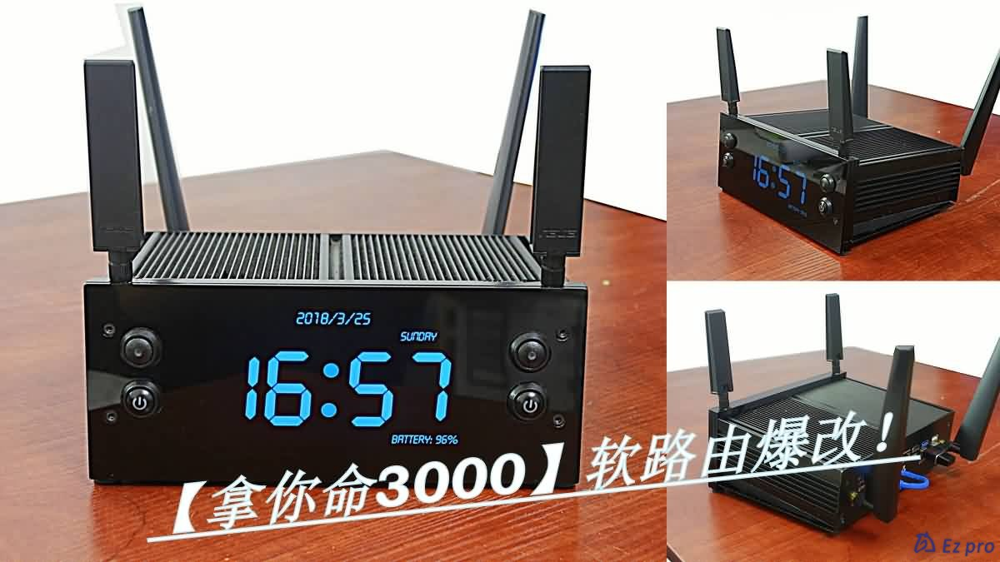

**写在前面：**

看到标题【拿你命3000】，大家是不是有印象？

那一款集合西瓜刀、毒药、火药、硫酸、单车链条、手枪、手榴弹、杀虫剂、嘴？ 的超级武器

没错，发明者就是   -----   【达闻西】

为什么我会把它命名为【拿你命3000】，其实，小时候就喜欢折腾一些模型，游戏机，也很喜欢研制一些类似【拿你命3000】的东西，多样集成，

比如把指甲剪、耳扒、小螺丝刀、刀片、小剪刀之类的，集成在一起，长大后发现居然有瑞士军刀这类的东西，当时年纪小，感觉就是为我定制而成的，

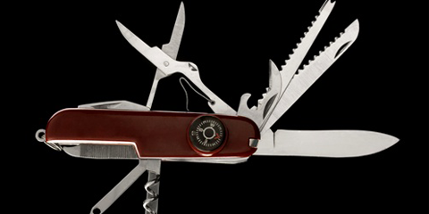

后来其实应用场景不多，慢慢明白任何事物如果过于复杂，就失去了它原本的意义，慢慢的喜欢纯粹一点。

其实就好比我们天天刷手机，刷路由，装系统，对于普通人来说，能上网，就够了，你以为妹纸叫你上房间真的是让你修电脑吗？

折腾这麽多干嘛？

在别人眼里， 我们都是【达闻西】

又或许，我折腾的东西在大家眼里，又是另外一个【达闻西】，不过，这麽帅的【达闻西】，见过吗

随着年纪越来越大，娶妻生娃，每天上班下班，陪老婆小孩，已经很难静下心来，去研究一样与赚钱无关的事物，只要有时间，房间门一关，感觉世界就是我的，当然少不了孩子哭闹，要跟你一起学习研究，乱摆弄工具，

这种动机非常纯净，就是

**瞎折腾** ，这话是老婆大人的原话

很多人说厉害，膜拜，要给我生猴子之类的话，

但是，我老婆就连正眼也没看过这台设备，哈哈，所以只能发到一群死电工聚集的地方来博同情

不过对于一个踏入中年危机的男人来说，或许是一种放松自我，调整心态的健康爱好

如果像【达闻西】一样，被别人研究也能领薪水，我也愿意

闻西的钻研精神值得我们学习，闻西虽然做的产品不一定有用，特别是闻西那只【太阳能手电】

小时候真的惊呆了，不用电池，对于那个玩四驱车电池匮乏（主要是没钱）的年代，这个技术谁不想要？

好了，废话写完了

**我的【拿你命3000】又是什么东西，光看外形，已经很惊艳了吧，一个黑色大盒子，还有4个天线，面板还能显示时钟？ 起码市面上没见过这种东西**

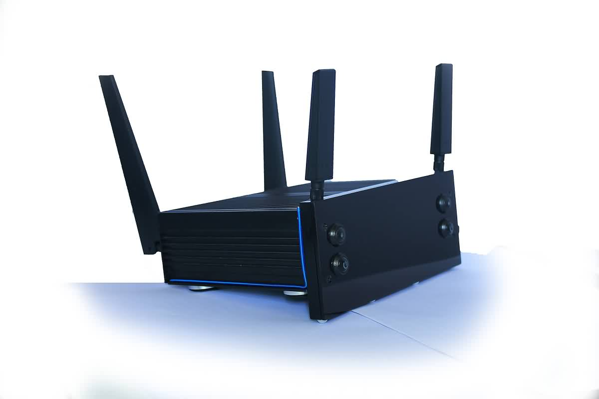

上图为第一版，散热不好，第二版内部改造了，底盖也增高了）

**如果把屏幕关闭，熄屏后面板全黑为一体，体验感很强吧！**

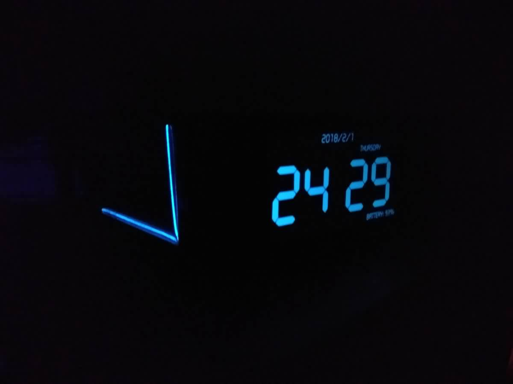 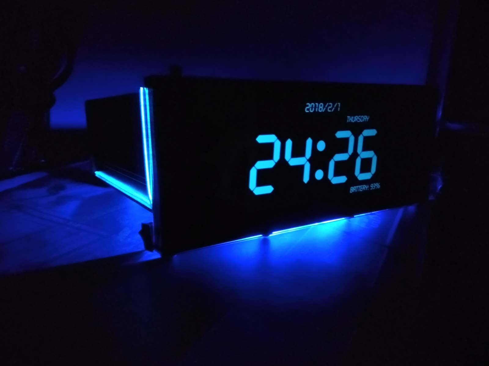

**最早的版本设计了呼吸等，侧面为冷光，底部为LED， 骚劲实足，后来被老婆揍了一顿后才改了，** **因为夜间效果太炫，亮瞎我的狗眼 ，孩子也害怕，所以忍痛阉割****那么，它到底是一款什么东西？**

\1.  是一台软路由

\2.  是一台WiFi无线

\3.  是一台群晖文件存储器

\4.  是一台Window系统电脑

\5.  是一台时钟

\6.  是一台天气预报器

\7.  是一台高清播放器

\8.  是一台网络电台

。。。。。

【拿你命3000】，不局限于是什么，而是功能可以无限扩展叠加，只要你想得出

它基于多网口mini主板，由Window Server2016为基础平台，

通过Hyper-V虚拟机搭建，实现了多系统共存合一

l LEDEX64软路由

l 黑群晖DMS5.2

l window XP

l X86安卓系统

从而实现不同的功能需求，并且通过内置的无线千兆路由为内网桥梁，达到了

l 千兆家庭WIFI网络

l 多媒体服务高清播放

l 红外遥控器操控

l 手机照片自动备份

l 照片/文件自动备份到google photo 或 OneDrive网络硬盘

l 小姐姐下载机

l 各种软件挂机

l 作为电脑映像备份存储

l 踏上云彩，傲游世界

并且，通过面板的5寸显示屏幕，实现了

l 时钟显示

l 主机状态监视器

l 天气预报

l 智能语音助手

l 主机显示屏

等等等，更多功能，就看以后的脑洞与学习

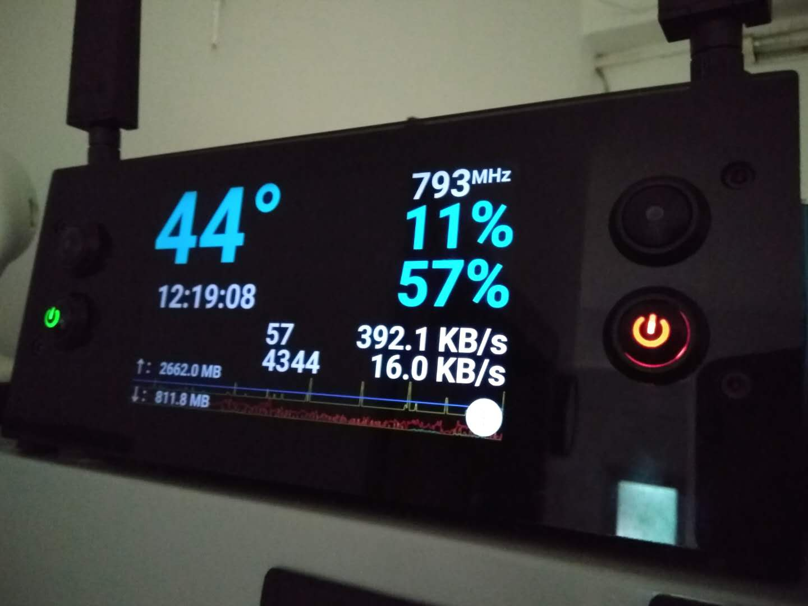 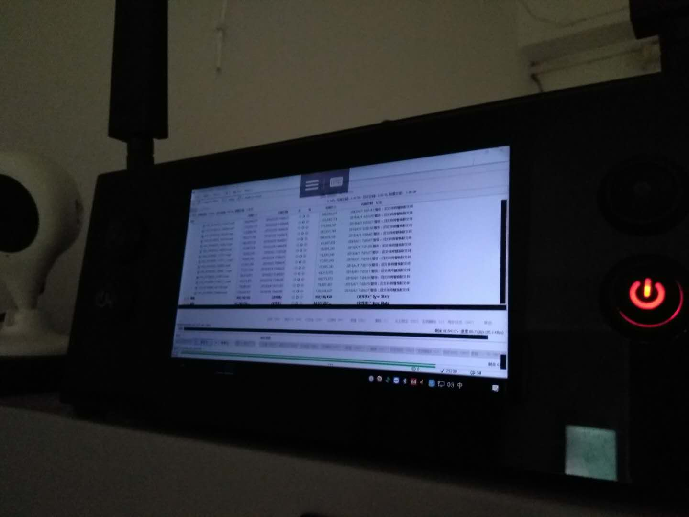

**那么，到现在，我为什么还没有把事情说清楚，因为过于复杂，以我的智商，很难说明白**

**那就把智商拉高8度，如果单从硬件来说，它包含**
**1 集成CPU 显卡和 多网口的 主板****2 内存：12G****3 硬盘：64G Msata+ 双1T2.5寸****4 无线：千兆K2P路由器（没错，就是塞了一个路由器进去）****5 显示屏：努比亚Z7minis****6 遥控器：红外线模块****7 全铝散热机箱+定制的亚克力面板****再说简单一点，它是基于 一台成品软路由（小马路由V5）为基础，通过脑洞，集成了其他周边硬件进去的【拿你命3000】产物****PS：小马哥，祝你大卖，销量有提升别忘记给我奖励哈****就软路由的配置来说，绝对强悍， 加上K2P这个百元无敌手的千兆路由，小型家庭完美胜任，如果你有兴趣，或许可以换成更强大的 HP gen8 来改造，当然，体积也大很多，但是能实现的性能和感官肯定不一样。**

\-----------------------------------------------------------------

\1.  想法

\2.  设计

\3.  制作

\4.  调试

\5.  完工

一共历时3个月，其中修改了2个大版本，3个小版本，

目前正常服役中，稳定性嘛，还有待严酷的夏天来临验证

目前大概的运行情况如下

**满载**
亮屏+双硬盘拷贝+WIFI正常家用 = 大概30W左右，
CPU温度63度，机箱内部温度55度，机箱外部45度

**待机**
灭屏+WIFI正常家用+硬盘待机 = 大概16W左右

CPU温度45度，机箱内部温度43度左右，机箱外部40度

**其中**
主板+CPU+msata 待机10W左右
硬盘一个待机1～2W左右，工作5～7W左右
WiFi无线使用 4～6W左右

好了，下面进入嗮图模式

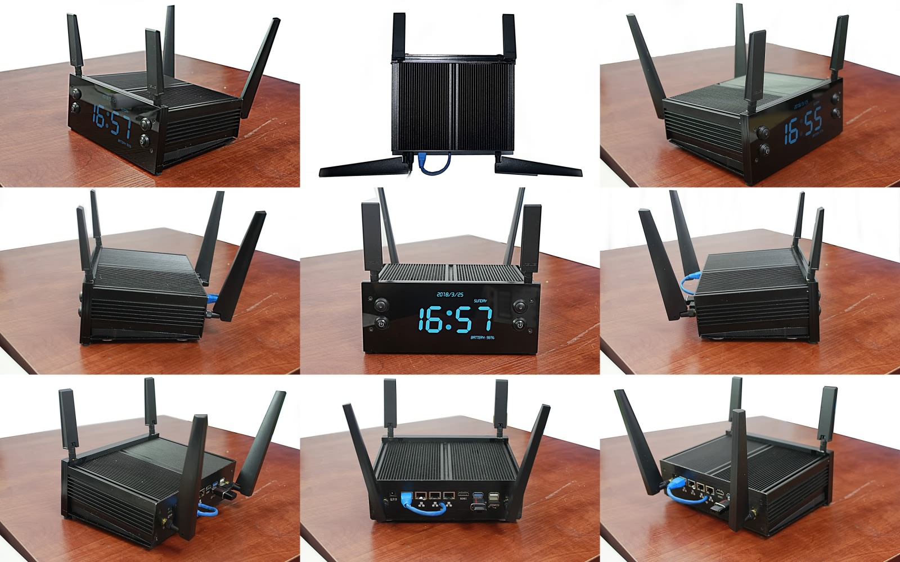

***\*面板，按钮是自己设计，前面的短天线是\** \**华硕，后面长天线是网件\**\**R7000\**\**的，\****

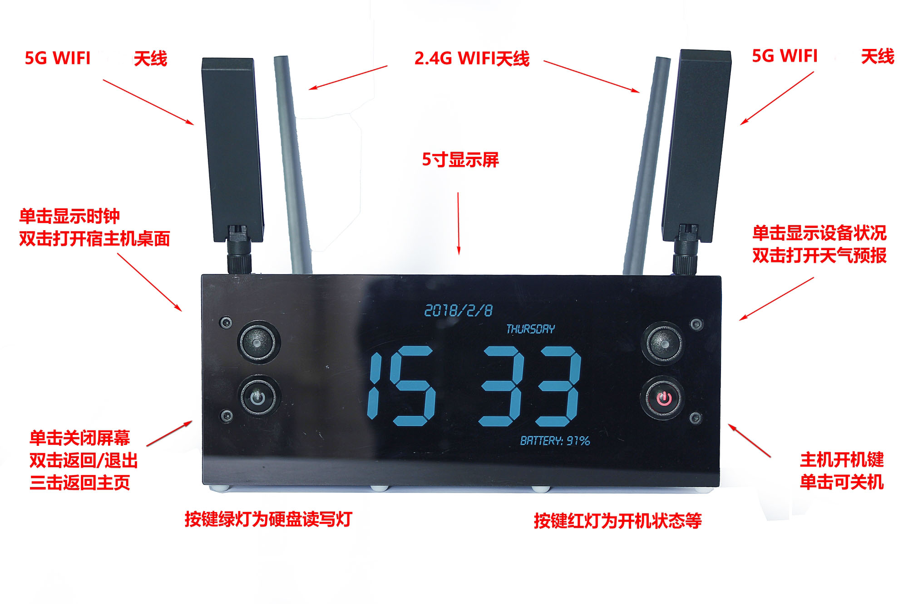

接口介绍

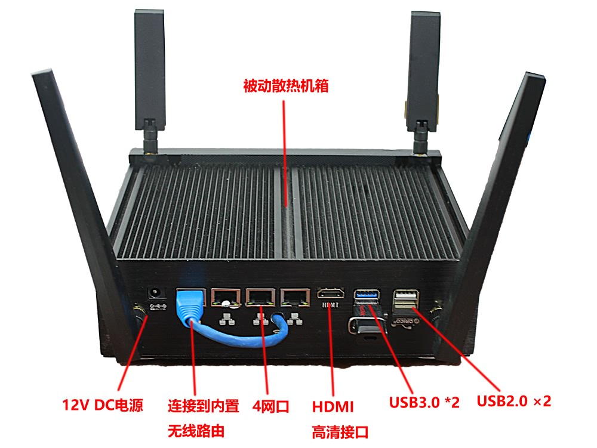

**侧面改装展示，这个改造也是后面突发奇想，最少后机箱全部使用小马路由V5原生，但是散热不好，突然想到增高底盖，镂空，但是基于美观考虑，做了一个斜角的增高，并且加上防尘网**

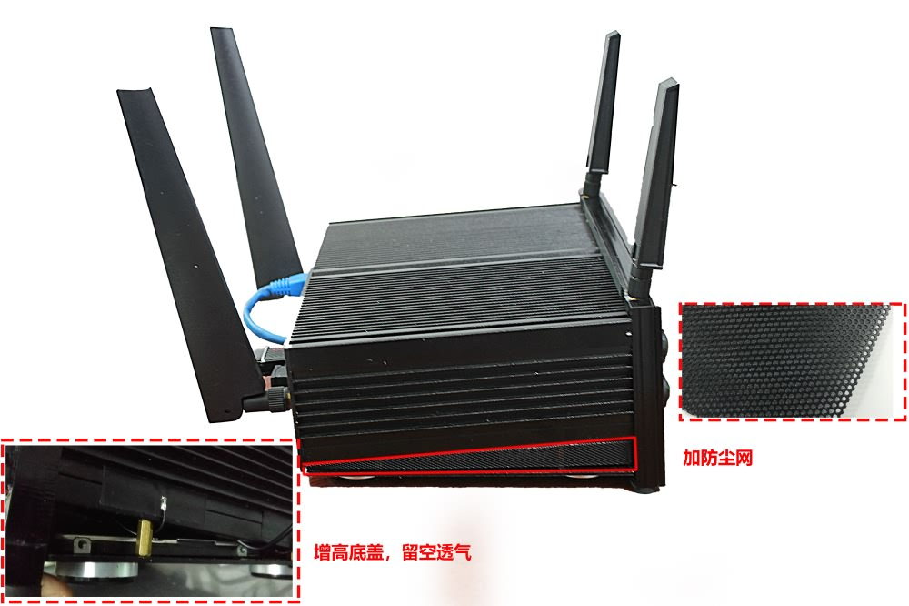

**内部结构展示，空间小，集成度很高，还装了2个硬盘，不服不行**

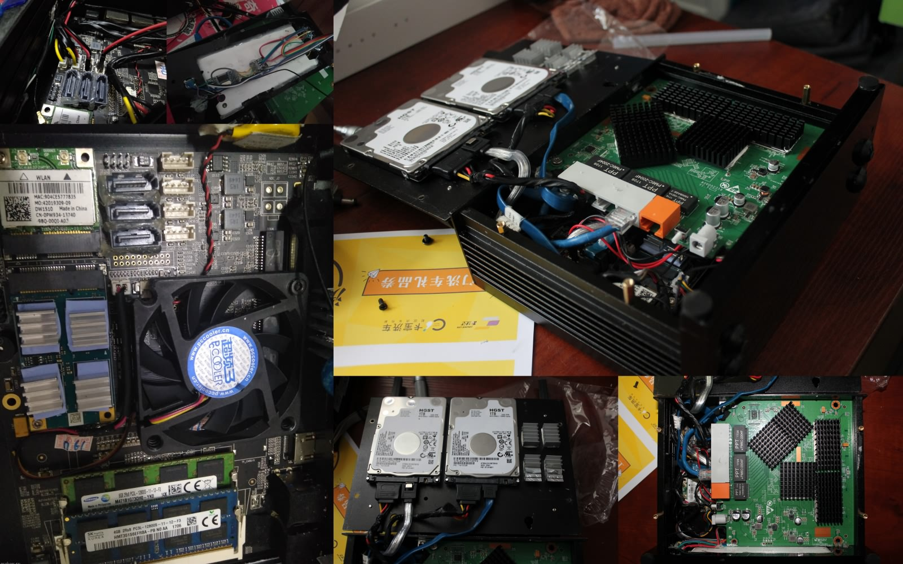

**改装手机为面板显示屏，难度最大就是改装几个按键了，电源，音量+ - , 然后配合安卓root后自定义按键映射，还有tasker自动化应用，来实现不同按键状态的功能显示**

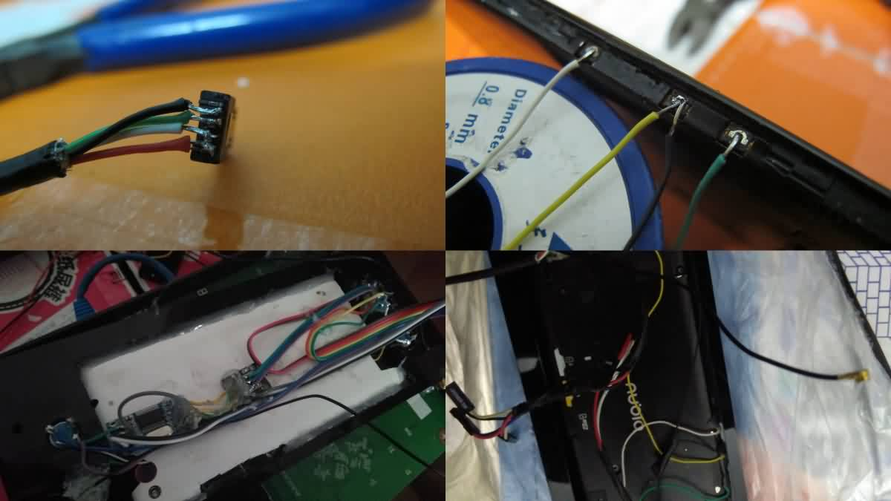 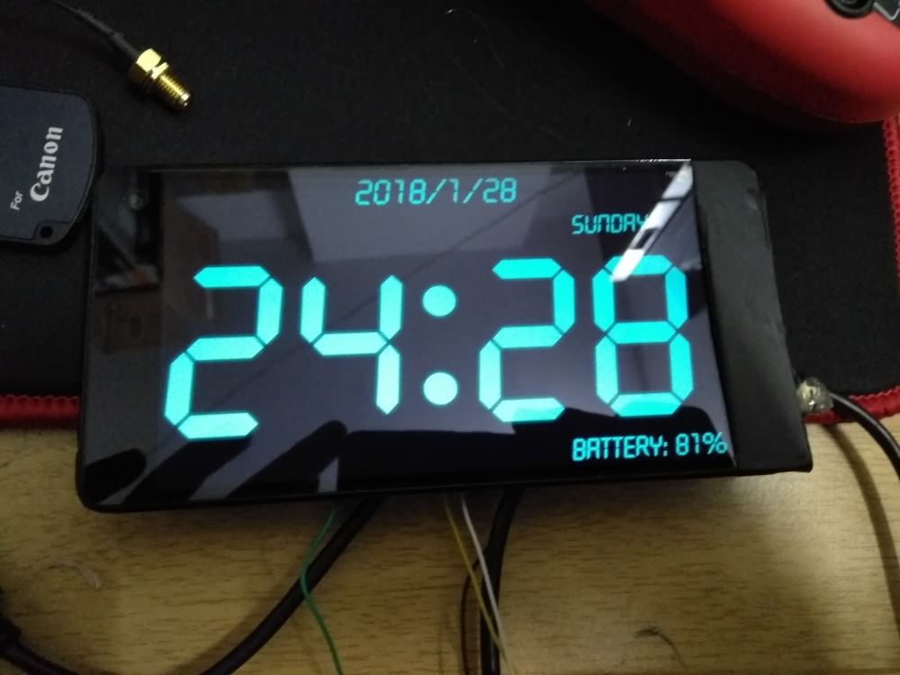

**改装K2P路由器散热，原来是一块大铝片，体积太大，分解分解，再分解，剩下一块主板，5G先天为标准可插拔IPX接口，但是2.4G的需要自己焊接**

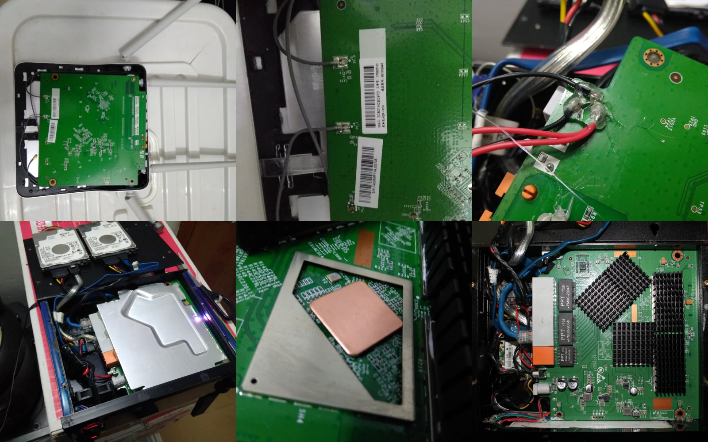

**关键几个配件的连接示意图（这个是第一版，后来改了，仅供参考而已）**

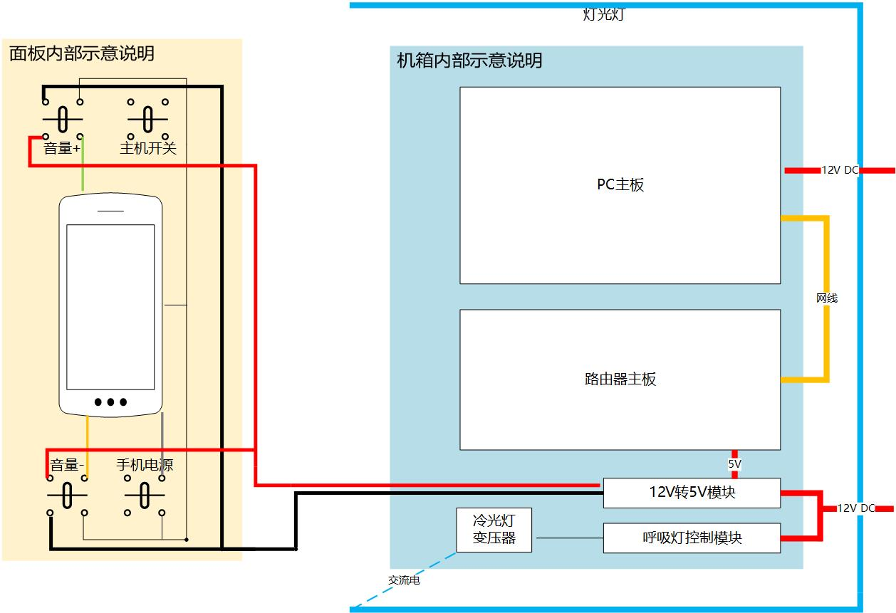

**网络拓扑图**

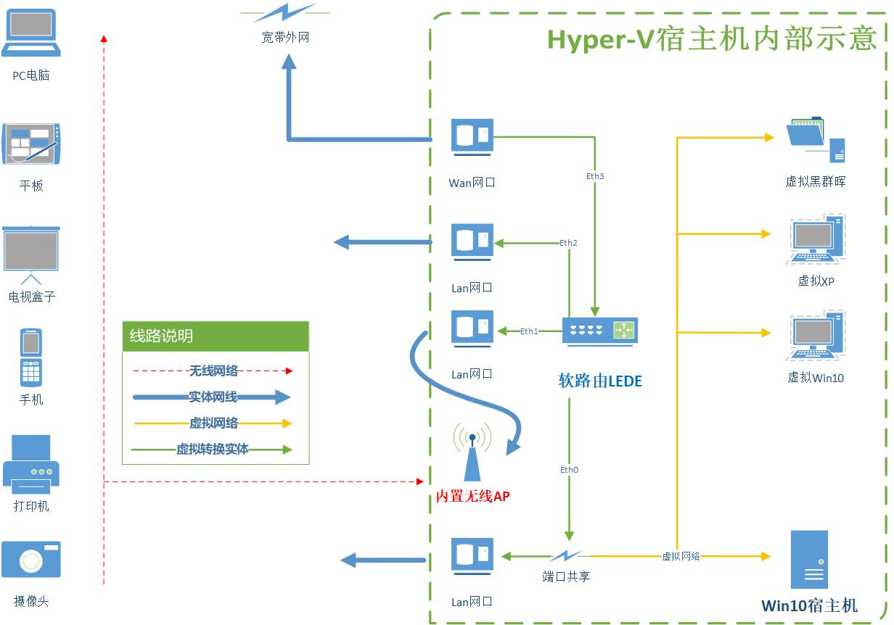

为什么会折腾这台软路由？

呵呵，还不是被大家毒害的

一开始无意看了关于软路由的文章，后来陆续看到这几篇软件应用的文章

l [分享一下虚拟化NAS的几种新玩法](https://www.hi-pda.com/forum/viewthread.php?tid=2226618&from=favorites)

l [合理利用ESXI，整合家庭IT资源，实现Gen8一机多用](https://post.smzdm.com/p/325598/)

l [懒人小白到手可用的--小马NAS、软路由一体机](https://post.smzdm.com/p/453688/)

l [打造Windows + 群晖 + U-NAS 三系统的NAS](http://www.u-share.cn/forum.php?mod=viewthread&tid=7029)

**想想这不就是自己理想中的设备吗？这下好像发现了新大陆，感觉折腾有个方向了，但是对于虚拟机，是小白一个，迟迟未能开始，**

其实本身不缺路由，也无需这麽功能强大的路由，但是心里长草了，岂能方休？

**后来，终于，家里用的小米路由器百兆感觉内网传输 群晖比较慢，下定决定开始折腾了**

**好歹是多年的办公室装机小能手，弄个还不简单？**

**但是软路由没有很好的无线**AP解决方案，一般只能外挂，关于内置的，我也折腾不过少，最终失败，有兴趣了解为什么软路由内置无线AP 功能不合适，可以看我写的一篇文章

**[家用软路由配无线的方案之：为什么minipcie网卡不合适](http://www.myben.cn/842)**

**于是到处寻求方案的时候，发现了下面几篇硬件改装的文章**

l [SV3-26026 软路由亚克力机箱，双频无线方案](http://www.ezpro.pro/thread-111-1-1.html)

l [变废为宝之V3全铝机箱DIY之旅](http://www.ezpro.pro/thread-130-1-1.html)

l [路由，NAS，AP一样也不能少，V1+荣耀路由Pro终极合体](http://www.ezpro.pro/thread-115-1-1.html)

**再次打开一片新大陆，原来机箱也能DIY ，那么，赶紧开始脑洞大开！**

**2018****年，希望能抽点时间，把里面的一些软硬件改造搭建的方法，写成系列教程，**

l **一来希望辛苦的折腾分享出来，能得到大家的认可**

l **二来整理一下思路，巩固一下知识，温故知新**

l **三来算是感谢前人的经验分享**，同时为后面喜欢折腾的人留点参考

**毕竟**，这类文章是少之又少，关于软路由虚拟机，多少人走了弯路，多少人放弃，

真是 【软路由改造，从入门到放弃】

改造过程，

初期主要是需要脑洞大开，但也需要平时的知识积累，

设计和采购配件时需要反复测量和在脑中模拟，如果你会3d建模那就更方便了

改装过程中，难点就是手艺了，如何把设计的，和实际材料加工，异常比较多，小心别把主板烧了

后期调试其实是最痛苦的，整体装机我断断续续只花了一个月，发现问题解决问题反复花了两个月

当然靠硬件改装是不够的，软件系统又需要有专研精神去学，我光研究如果让虚拟机跑起软路由，就花了一个月，唉

那么说说遇到的一些难题

装机不外忽四大选择

**1****。费用**

软路由最初我是2010年第一次听，当时公司跑由不给力，一位网友便建议用闲旧电脑装软跑由，比普通路由强上百倍，虽然当时没折腾，因为软路由对普通人来说，太抽象了，但同时也让我认为，软路由是便宜的，因为闲旧电话可以改装。

那么为什么我会选裸机千元的小马路由V5作改装对象呢？

说出来也是典型的电工思维，

最早原因是小米路由mini的远程迅雷不能用了，加之百兆有线内网跑郡晖速度慢，本来想换个千兆路由，其实当时我有网件4300，但就是用不习惯，后来也上车了k2p，但看上去张牙舞爪的看不习惯，说白了就是老子就想买点什么新玩意，对了，还有个极路由2，小巧做工好，但也是百兆，

反正预算从一百，一点一点加到300，再后来看了几篇软路由的文章被毒害了，决定折腾软路由，多合一主机，

后来预算又增加了，买了小马V2，但到手后，傻了，无线怎么办？老路由都是百兆口的，4300己卖，当时比较固执，非要一台设备上实现无线功能，研究了pcie网卡，又傻了，不支持硬件直通，最后又才买了V5，但折腾一番后，还是放弃pcie网卡做无线，具体为什么，看我这篇文章说明，这里不细说了

那么还能怎么办，只能继续用呗，后来才打开脑洞，曲线救国实现了一台设备

费用就不细算了，有些快乐是无法计量的，以后老老实实用好，用得舒服，就是赚

**2****。空间**

折腾完这一番后，看到市面上的小机箱一点感觉都没有，小马v5本来设计还算不错，可以装一个大硬盘或两个小硬盘，但我就不信邪了，非得把无线路由集成进去，最早集成的是极路由2，小巧，装完还有空间，但百兆性能不够，无线信号也不强，如果当时没上车k2p，可能我就放弃了，先是外挂测了了k2p性能，只能说太强大了，立马产生了想法，但k2p面积大小比小马v5机箱还大一圏，后来上网看拆解图，感觉有戏，

找了个时间拆开一看，又傻了，这散热片太大了，也太高，根本塞不下，但其实主板刚刚好和小马v5内部长度一样，宽度还小点，但苦于不敢拆出散热裸奔，又搁置了一周，

最后实在管不住自己的好奇心，又开始折腾，心想弄坏就算

把散热片裁剪成能放进机箱的尺寸，终于算塞进去了，但太密集，心里也没底，后来测试散热不好

**3****。性能**

软路由如果和普通路由对比，那必须强大，但同时功率也高些，为什么我一开始就找低功率的产品而没用旧电脑改，一是旧电脑不好看，二就是功耗问题。
功耗也是我测试的一个重要环节，选择2。5寸硬盘也和这有关系，
但低功耗意味性能不会太强，不过软路由己经很强大，那么，我的出发点是多功能主机，跑更种虚拟机，
最开始的小马v2是n3700的，软路由，黑群晖，window，勉强够用，但自带的小风扇经常转，cpu满载机率比较大，小马v5是i3 5005，好歹是5代i3，性能纵观目前软路由主板，己经算第一阶梯了

这样我就省了黑群晖和挂机用的电脑

**4****。功能**

既然选择软路由，配置又还可以，当然是想一机多用，做虚拟机跑各种应用，实话说，真的有用的就那么几个，其实根本不需要这麽折腾，无非就是心理长草了，就像别人的玩具总是最好玩一样，不管是否需要，就是想折腾。

秉着我折腾我快乐的原则，既然价格能接受，就花钱买折腾呗。

就像马云说的那样，一开始没想把公司做这么大，

其实我最早就只是想弄个软路由学习学习，但是总觉得可以弄得更好，就走上折腾的道路路

**5****。外观**

每个人的审美都不一样，所以一开始挑选你喜欢的原型，是很重要的，说白了，就是看你认为它有多少可改造性，

反正我看到这台小马V5，就觉得它缺少点什么，

不过话说回来，我之所以这麽大胆去改造，完全基于一个心理，那就是

**不把它当回事，大不了弄坏了就丢掉**

为什么呢？因为我是软路由小白，已经被软路由的概念折磨得不行了，最开始买了一个多月，连虚拟机软路由都没搞好，还发过帖问，

基于koolshare的热情，后来搞明白了

相信每个刚刚接触软路由的人，都有这种感受file:///C:/Users/mexs/AppData/Local/Temp/msohtmlclip1/01/clip_image012.gif

**6****。散热**

为什么最后讲，因为最头痛，一切不以散热为基础的改装，都是耍流氓，

最初步的设计方案，根本没把散热考虑进去，机箱本身是被动散热，一个风扇都没有，其实散热还算不错，但是我上了两个硬盘，还有内置了一个无线路由器，所以热量就上升了，

当初设计的时候是冬天，初步调试完还没什么感觉，但是等差不多完工时，已经是春天了，室内26度，机器就受不了了，发热厉害，特别是我买的东芝msata，特别热，最早没散热的情况下，固态硬盘能飙到83度，机械硬盘65度，CPU 66度，考虑到夏天到来，肯定受不了，所以停用了接近一个月想方案。

后来优化内部空间，增加风扇，漏空底盖，多处增加散热片，才把温度压下来，在如此小的空间，要考虑散热，真是难度极大，

夏天来了才算是真正的考验。

**实践的步骤****1.  首先你得有台设备，如果是看了本文而去买的，感觉不太实际，因为从0开始，很难，建议放弃，起码有一台能够正常运转的软路由，熟悉软路由的软硬件结构，把设备安装好，系统跑起来，起码要能开机对吧，搞虚拟机的套路，由于我第一次用虚拟机软路由，虚拟机考虑系统是用EXSI 还是 Window+Hyper-V ，还是纯Hyper-V，反正就是装完又删，删完又装就半个月过去了，看着黑乎乎的盒子，真要崩溃，最后要选择好软路由的系统，我是基于window的，非esxi****2.  接着让它能联网，网上教程很多，但是不是这漏一点，就是那漏一点，反正教程我没少重复看，就是上不了网，这就花了半个月，然后要让LAN口能输出网络，又花了半个月，再将第二个LAN口调通又花了半个月，然后折腾无线应用，又折腾了半个月，好吧，如果你调不通网络过，不用继续了，起码完成这两部，一个软路由就能用啦。****3.  接着做的就是锦上添花了，就是大概设计要怎么合理添加功能，如果你不需要花哨的前面板显示器，其实就不用看本片文章了，如果需要装逼面板和周边的配套，那么就要看看利用什么设备来设计，首先看大小要符合机箱，安装的位置，会不会有冲突，另外按键的改装是否合理和满足需求，这里讲究的是自己在脑中的模拟，俗称【意淫】****4.  大概的设计方案有了后，就需要做一些定制，最好能画3D图，不过学得来可能不想玩了，如果你的机箱完全能不改装的情况下实现你所要的功能那最好，不过那是不可能，怎么会有现成的机箱能满足骚动的你呢？最简单就是亚克力的定制，淘宝很多，也比较便宜，图纸设计当然需要自己动手了，不会，那就现在学现用吧，没有什么事情能阻挡骚动的你！****5.  把设计打样和采购小配件的时候，一般需要一周，那么也不能闲着，把需要改动的电路部分拿出来动动手，如我是把手机的数据线，音量加减，电源都进行了改装引线，烙铁在所难免，年纪大了带眼镜，眼神不好容易出错，还有千万要把手机断电进行，烙铁这玩意对手工技术要求比较高，还是那句话，不会就学，真的骚动起来，包皮都能学会自己割。****6.  东西都到期后就是开工组装了，想必修修补补是有的，先装起来吧，如果确实有设计缺陷很严重，在做第二版的设计，另外注意说的是，工具记得齐全，用起来才舒服，比如手机屏幕的按键， 电源供电，路由器的wifi接口，这些改装起来也是很非精力。****7.  硬件装好后就是软件的调试了，这里最重要是一些扩展性的功能，因为一个虚拟机和软路由在第一步就已经调试好了，比如手机与电脑间的通讯，手机端按键的功能事项，以及路由器后台设置（设置成AP模式之类）****8.  最后肯定是失败了，file:///C:/Users/mexs/AppData/Local/Temp/msohtmlclip1/01/clip_image050.gif 然后塞床底吃灰啦，拿出陈年老TP-LINK 继续用****好吧，上述纯粹扯蛋，如果看一篇文章你就能做出来，那真是奇才，****想改装好一样东西，需要平时的积累，包括软硬件的知识，手工技术，各类软件的应用，最重要还是要有一个需求点，把不同知识组合起来。** **装逼到此结束**

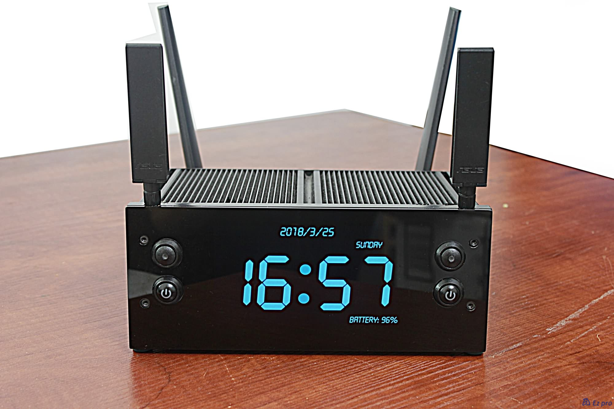 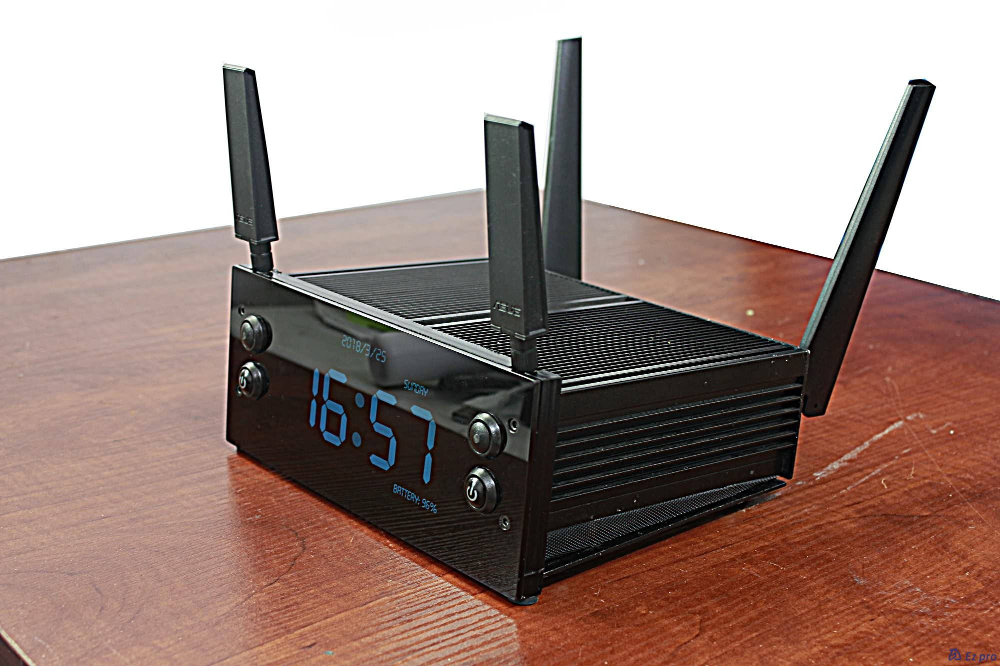 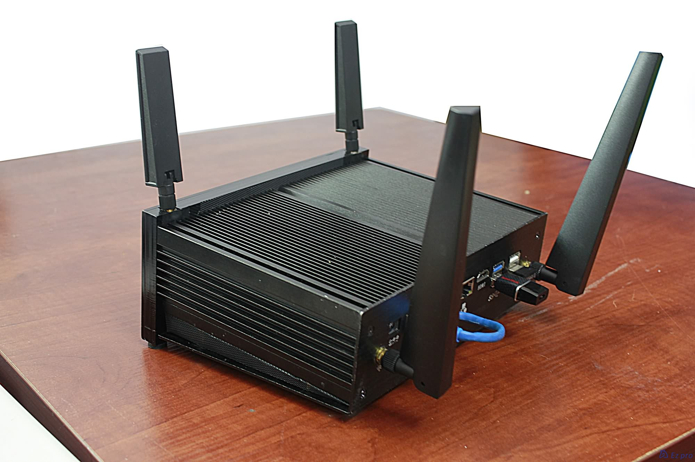 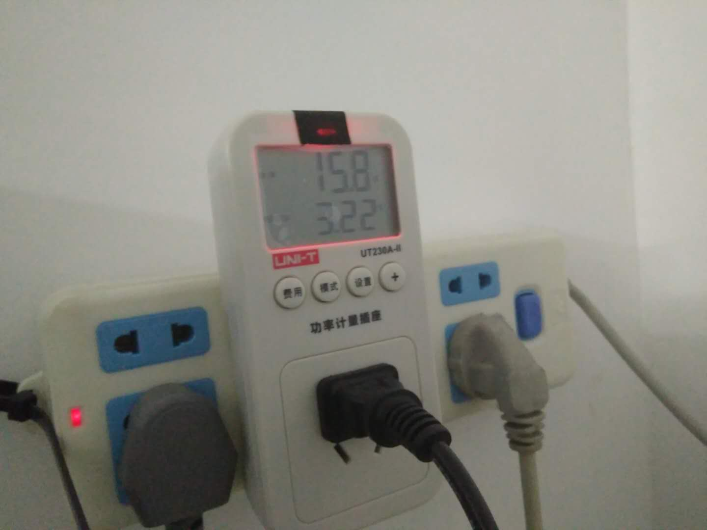