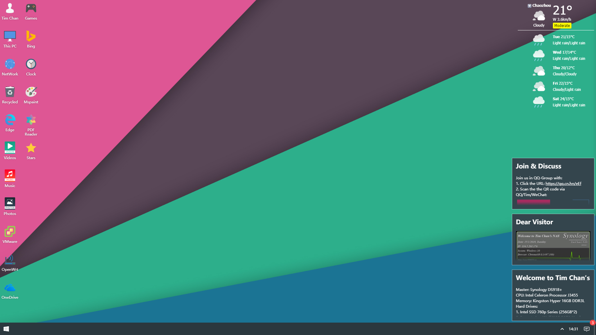
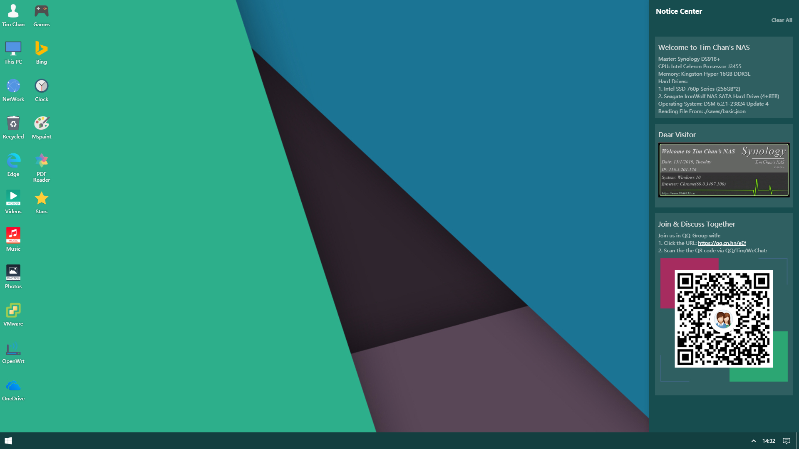
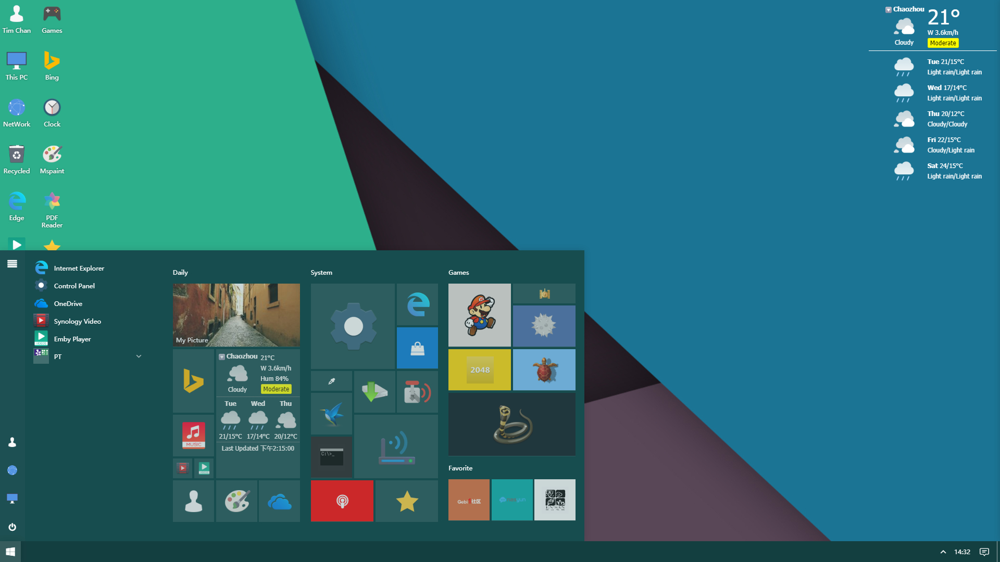
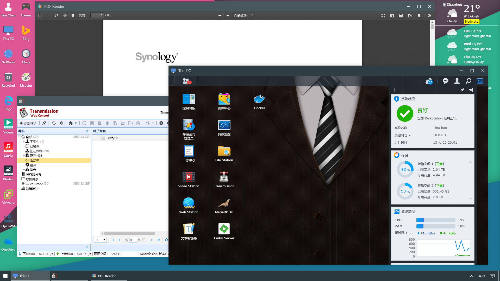
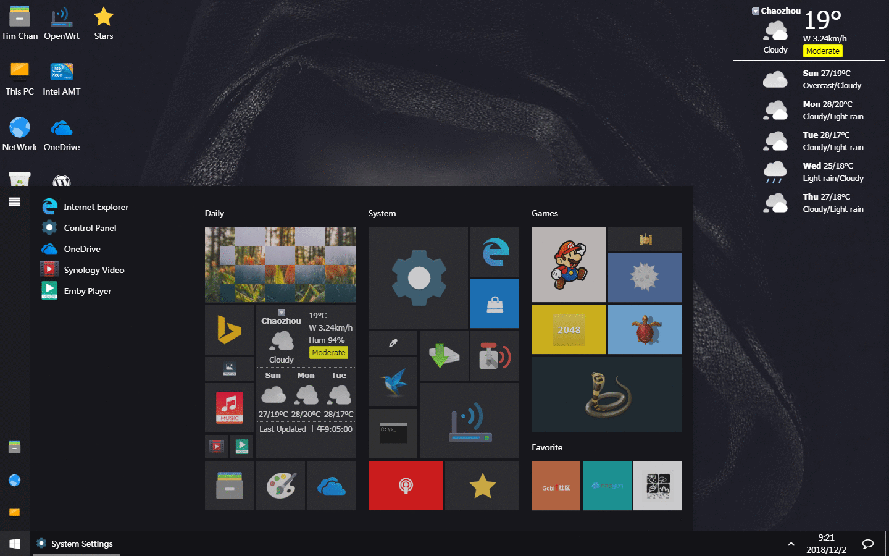
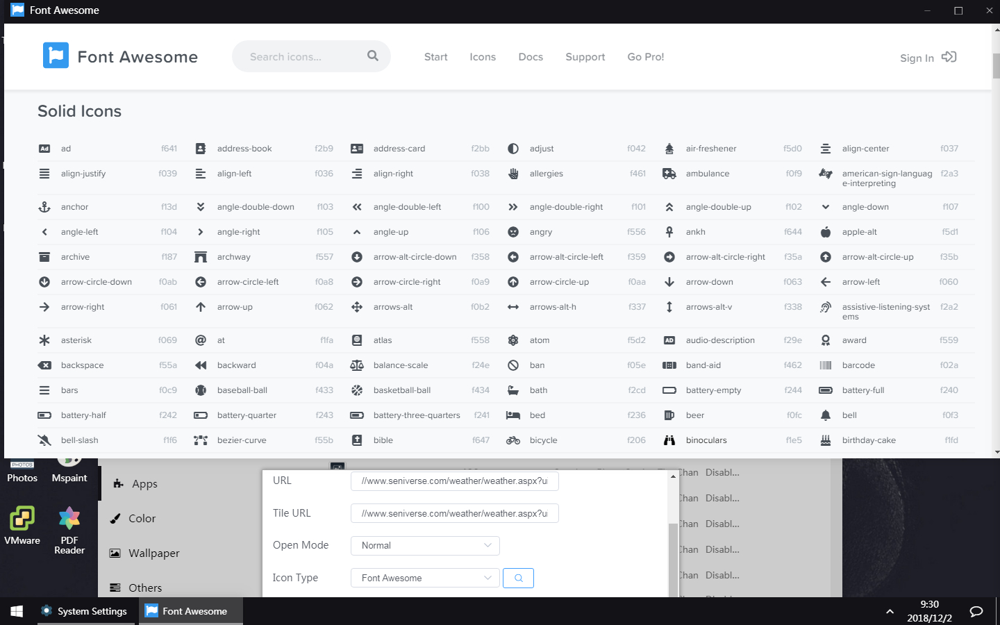

# 仿Windows10的主页模版

**使用环境：群晖DS918+， 系统版本：DSM 6.2.1-23824 Update 4；**

**理论上所有支持webstation的都可以使用****。**

**预览地址：https://www.9366333.cn/**

页面都是通过框架打开的，这样就可以不用记端口、不用记子域名、甚至不会占用多一个浏览器窗口... 界面也非常接近原版windows10，挺唬人的！目前这个方案自己比较满意~

使用方法：
由于当地443端口还没封，所以分配了443端口给Web Station，绑定阿里云ddns，部署了ssl证书，所以访问顶级域名就是这个页面了。
群晖里面需要设置一下才能正常，这是自己折腾比较久摸索出来的...
** 注意：使用443端口就必须使用https方式打开，框架里面也必须是https的网页才能正常打开。跨域无法访问，我也解决不了。

**1. 控制面板 - 安全性  (解决页面打开黑屏的问题)**

  □ 忽略 IP 检查来加强浏览器兼容性
  ☑ 提高对跨网站请求伪造攻击的保护。
  ☑ 启动 HTTP 内容安全策略（CSP）标题以提高安全性
  ☑ 不允许 DSM 被 iFrame 嵌入
    \- 允许特定网站使用 iFrame 嵌入 DSM
    \- 允许的网站 - 新增 - 你的动态域名/顶级域名（建议有绑定哪些域名的都添加进去，带www跟不带，都添加。） - 确定

**2. NAS安装Web Station**

  环境使用：PHP7.0+Apache HTTP Server2.4，
  其中：Web Station - </>PHP设置 - PHP7.0  - 编辑
  把所有的项目都勾选， 然后点确定

**3. 下载源码，解压到NAS的Web根目录**
  
  GitHub下载源码或者下载我修改的样式，修改成自己喜欢的样式、图标、排版风格即可。

**4. 来源及下载**  

  旧版源码：
      **链接:** https://pan.baidu.com/s/1AmJtCtNgxszHcHd6stsQ3w
      提取码:jz3c

WIN10 UI（2.1.9 英文）.zip：https://www.90pan.com/b2037155
WIN10 UI（2.1.9 中文）.zip：https://www.90pan.com/b2037156

20200117新版：  [20200117-win10-ui-master.zip](tools/20200117-win10-ui-master.zip) 

=====================================================

YLUI 是WIN10UI 的延申：https://ylui.yuri2.cn/

WIN10UI ： http://win10ui.yuri2.cn/

 **5. Windows 10 UI 使用方法**

  可视化编辑修改后，右键 - 系统(System) - 数据(Data) - 复制配置文件覆盖 “basic.json”
  配置文件路径：./saves/basic.json

  请自行查看Github手册文档，更多使用交流技巧也欢迎加群讨论：http://t.cn/RQfdtYy

**6. 一大波预览图(点击大图模式预览)** 

\- 完美仿Win10的开始菜单，并支持可视化自定义

 \- 完美的多窗口

\- 支持拖甩、文件夹归类

\- 支持中英文

\- 移动端自适应是必须的

**作者最近的开发更新记录：**

2.1.9修正2.1.8磁贴hover在chrome浏览器下的样式bug
2.1.8yl.app.js 添加更多常量定义，方便代码提示修正一些文档和代码的单词拼写错误添加菜单和磁贴开启动画删除默认的启动消息
2.1.7支持根据版本号自动更新缓存
2.1.6APP封面将会在页面加载完毕（或10秒后）才消失，类似于手机APP的加载逻辑；添加loading动画
2.1.5支持ctrl+f5重载并刷新缓存（f5依然是刷新桌面）替换最大化、最小化、还原、关闭、消息的图标（修复360浏览器图标显示不正常的bug）压缩按钮间距底部时间样式优化，鼠标悬浮显示完整时间
2.1.4修正子菜单图标样式bug修正背景图片宽高比计算算法添加默认图床app
2.1.3可选url参数，使用本地缓存初始化桌面。如https://www.9366333.cn/?load=ylui-storageonLoad文件更好的注释，以及针对加载缓存的更新修正子菜单没有缩进的bug
2.1.2过滤其他窗体事件类型新增子窗体API simpleMsg, getVersion更多基础设置注释使用经典壁纸桌面新增代码库图标增加FA应用，配置图标时提供快捷方式