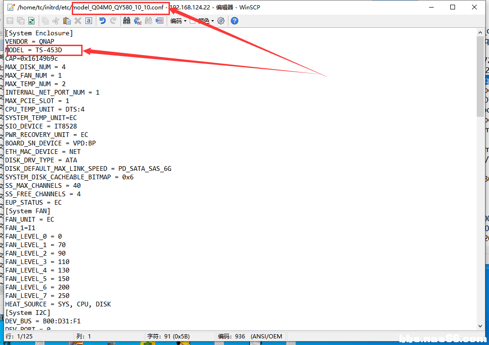

# 基于老骥伏枥母盘方案破解qnap系统记录@XXX

**以下仅为本人基于‘老骥伏枥’母盘对于qnap破解的记录。当然方法很多，仅记录我使用的一种。希望对大家体验qnap有所帮助，同时感谢给予帮助的rMT大佬和制作自动补丁脚本大佬，表述能力有限，不懂的进QQ群带上问题私聊我。****[点击入群](https://jq.qq.com/?_wv=1027&k=vf7ODX1h)**

**1.准备工作，我们需要用到SSH工具winscp，鉴于部分新人，我建议使用我一样的工具进行（SSH使用xshell，winscp）**
**
2.下载附件：链接：https://pan.baidu.com/s/1YSpBeITIFCtkzUEQ9gm-kQ** **提取码：nas6** 
**
3.将下载的‘QNAP-BOOT自动补丁.img’使用写盘工具写入U盘**
**
4.BIOS设置U盘为第一启动。插好键盘，显示器，网线开机**
**
5.选择‘系统救援’如下图**

**6.去官网找到你需要的系统下载链接如下图**

**7.SSH登录到nas（ip可以再你路由器上面找，账号：tc 密码：123456）**

**8.使用winscp登录到NAS（账号：tc 密码：123456）**

**9.双击打开‘my_create_qnap_boot'进行修改**

**10.修改’my_create_qnap_boot‘如下图，由于我们不知道对应型号的model文件名字，所以修改后直接保存**

**11.再xshell里面执行’my_create_qnap_boot‘ 输入：sudo ./my_create_qnap_boot**

**12.执行后提示CP model失败，因为我们下载的固件并没有这个名字的model文件，那么我们进winscp去找到我们需要的model文件名字，先刷新一下再依此打开 /initrd/etc 如图**

**13.再etc下面会看见很多model文件，我们挨个双击打开，找到自己需要的文件**

**14.将文件名记录，并再次打开’my_create_qnap_boot‘补上开始未知的model文件名**

**15.再次执行’my_create_qnap_boot‘会提示错误，我们使用命令将SDA3卸载后再执行就好了
再ssh里面输入：sudo umount /mnt/sda3，再次输入 my_create_qnap_boot即可**

**16.接下来我们需要将model文件修改成我们nas对应的参数，首先我们要获取自己nas的信息
SSH输入：lspci -tv**

**17.将获取到的信息，复制到PC新建一个TXT文本备用**
**
18.获取boot disk端口信息，这个很重要，一定要正确。**
**输入：dmesg 如下图，我们成功的获取到了U盘就插在PORT3上面，将这个PORT3记录到刚才的TXT文本备用**

**19，修改model，这里我们仅需要修改System disk，网卡和Boot Disk，具体如下图
使用vi命令对model文件进行编辑：sudo vi initrd/etc/model.conf**

**20.回到TXT文本，将获取到的信息由16进制转换为10进制，不知道这么转换的可以：** [点击在线转换工具](https://tool.oschina.net/hexconvert/)

由图所示，我nas的sata有两个，由于脸黑，主板原生sata挂壁，所以这里只有显示扩展的sata接口，
USB: 14.0 Intel Corporation Atom Processor Z36XXX/Z37XXX, Celeron N2000 Series USB xHCI  这里，14.0进行16进制转10进制，14=20 0=0
于是得到：B00: D20:F0（没有空格，因为: D会识别成表情，所以我加了一个空格）
SATA：1c.2-[03]  00.0 ASMeida Technology inc. AD=SM1062 Serial Controller  这里 1c.2进行16进制转10进制，1c=28 2=2
于是得到：B00: D28:F2（没有空格，因为: D会识别成表情，所以我加了一个空格）
其实还有个原生sata是 13.0 但是我的挂了， 13.0 进制16进制转10进制  13=19 0=0 得到 B00: D19:F0
网卡：1c.0 00.0 intel Corporation I211 Gigabit Network Connection 这里1c.0进行16进制转10进制，1c=28 0=0 得到B00: D28:F0（没有空格，因为: D会识别成表情，所以我加了一个空格）
**21.已经转换了信息，我们对model进行修改，如图****修改SATA部分，分原生和扩展sata接口**
**A.扩展**
    将原本的DEV_BUS =  修改成B00: D28:F2 （没有空格，因为: D会识别成表情，所以我加了一个空格）这里是ASM扩展出来的sata，主板仅有两个SATA接口，所以DEV_PORT = 0 第二个System disk DEV_PORT = 1 
**B:原生**
   将原本的DEV_BUS = 修改成B00: D19:F0 （没有空格，因为: D会识别成表情，所以我加了一个空格）这里是原生sata 我们NAS共4个sata接口，其中两个扩展，两个原生，所以原生的DEV_PORT =0 第二个=1

**修改网卡部分，网卡这里很简单，直接将DEV_BUS修改成我们NAS的即可**

**修改Boot disk部分** **要注意，我们用过获取到的信息可知，USB转换后DEV_BUS =B00: D20:F0** （没有空格，因为: D会识别成表情，所以我加了一个空格） **U盘插在PORT3上面，所以USB配置这里不能出现PORT=3否则出错。**

**如图，我们需要修改DISK_BUS_TYPE = MMC 我们使用了USB引导，那么需要修改成DISK_BUS_TYPE = USB，
再DISK_BUS_TYPE = USB下面添加USB端口信息 DEV_PORT =3
将DEV_BUS = B00: D28:F0**（没有空格，因为: D会识别成表情，所以我加了一个空格）**修改成我们的USB信息为：DEV_BUS = B00:** **D20:F0**（没有空格，因为: D会识别成表情，所以我加了一个空格） **修改完成如下：**
**[Boot Enclosure]
VENDOR = QNAP
MODEL = BOOT
MAX_DISK_NUM = 1
[Boot Disk 1]
DISK_DRV_TYPE = USB
DEV_BUS = B00: D20:F0**（没有空格，因为: D会识别成表情，所以我加了一个空格）**
DEV_PORT = 3**

**21.修改好model文件后保持。按键盘 esc后输入  :wq!  这里需要输入’：‘别忘记了**

**22.打包完成引导的制作，输入：sudo ./re_packing**

**23.待提示完成后输入sudo reboot重启**

**
**
**24.插入硬盘，设置系统后开启系统的SSH验证Boot disk是否再正确的端口，最新系统SSH有个调试界面，按图片进入**

**输入：get_suid 两次反馈一样即可，如不一样，跳到上面修改Boot disk和找U盘插入端口重新修改**

**两次反馈不一样，Boot Disk错误或者PORT错误，重新找跳到第：18，20，21步骤重新找**

**正确的反馈，两次一样**

**25.完成了，通过上面24个步骤我们就可以制作自己喜欢的系统，所有X86的机型都可以用此母盘和方法制作，同时有两个注意事项，**
**A.Boot disk修改和查找，如果错误可能会出现卡登录界面，无法登录，部分型号boot disk错误也能进去，不过我建议还是修改正确**
**B.再进行16进制转换10进制的时候，建议使用一个TXT文本记录，这样填写不容易出错**
**C.每一个SATA控制器端口PORT= 需按照0 1 2 3 4 5 6 7 这样填写，包括pcie转接卡和板载转接卡**
**
**
**
**
**注意，如果你做好了引导又想修改model这么办？**
**1.进入系统救援**
**2.连接SSH**
**3.输入****sudo ./repacking_boot ex**
**4.vi编辑model文件 输入命令 sudo vi USINGBOOT/initrd/etc/model.conf**
**5.完成编辑后输入sudo ./repacking_boot pa**
**6.重启sudo reboot即可**