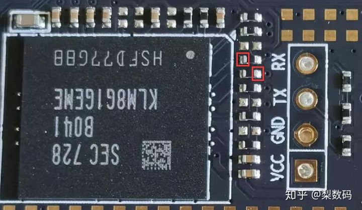
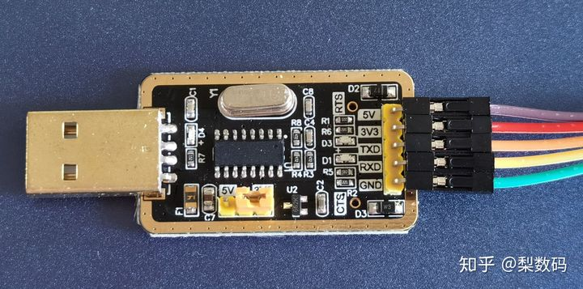

## 玩客云内置 eMMC 存储刷入 armbian

https://zhuanlan.zhihu.com/p/144850658


玩客云是前两年挺火的一款矿机，还白送迅雷离线下载功能。不过现在挖矿功能早就凉凉了，所以也就可以拿来刷成别的系统玩，这里写一下把 armbian 刷入内置 eMMC 存储的方法。

总体来说玩客云刷机难度不大，但是繁琐，只适合有折腾能力，并且手头有闲置硬件的玩一玩，晶晨 S805 这方案的 CPU 部分是真的性能差，别看是四核，然而是上古级别的 Cortex-A5 架构，四核加起来可能还没现在手机单核强。

至于没有硬件的，那也别还想着专门买一个来刷机玩，加点钱买个斐讯 N1 盒子，或者捡个二手树莓派之类，可玩性和便利性都吊打玩客云。

------

### 准备工具：

USB 转 TTL 线一根

双公头 USB 线一根

闲置 U 盘一个，或者读卡器配合存储卡也行

晶晨刷机软件 USB Burning Tool

所需软件下载地址，其中 update.img 文件为安卓固件包，zip 文件为 armbian 固件：

```text
百度云盘链接：https://pan.baidu.com/s/1RNBZGNbM1ZubrRuSegZ4kQ 
提取码：okts
天翼云盘备份：https://cloud.189.cn/t/Z3a6jmYviYzu（访问码：aib8）
```

------

玩客云的拆机十分简单，有接口那一侧，外层塑料挡板是双面胶粘上去的，使用撬棒或者一字批起子之类，从缝隙入手，慢慢转圈撬开即可，挡板弹性挺大， 并不容易搞坏。

然而二层挡板就是 6 颗螺丝下掉完事，主板是卡在壳子的卡槽里的，可以捏住 SD 卡槽部分的主板空白位，用点力即可把主板拔出来。

拆机全家福


玩客云要刷 armbian 的话，需要先刷一个安卓固件作为过渡包，下载文章开头链接里提供的 USB Burning Tool 软件并安装好，再下好安卓过渡包 update.img

注意区分USB口

玩客云有两个 USB 口，这两个口刷机时的功能不同，本文为了后面称呼方便，在此就把左边靠近网口的称为一号口，右边靠近 HDMI 的称为二号口。

晶晨刷机软件 USB Burning Tool 装好后打开，左上角点击 “文件”，然后选择导入烧录包，选择下载的 update.img 文件导入，然后确认右边配置里的擦除 flash 和擦除 bootloader 都是勾选上的，并且选择擦除所有。


确认配置没问题后就点击开始，让软件进入等待状态。

用双公头 USB 线，插上二号口，把玩客云主板连上电脑。

然后短接 emmc 芯片边上，如下图所示的两个点，用啥都行，镊子或者找根导线剥掉两头外皮都可以：




要注意的是玩客云的主板目前已知有两个版本，我手头这个是新版布局，短接点在 emmc 芯片边上。还有一种旧版的如下图，刷机短接点在主板背面的中间位置，注意区分，两种主板外观差别挺明显的。


短接两个触点的同时插上电源，然后如果顺利的话，刷机软件会发现设备，自动开始刷入流程。短接成功还有个显著的提示，就是主板指示灯不会亮。

短接失败了也不会怎么样，软件没反应而已，可以放心大胆的多次尝试。

刷机软件有反应后就可以松开短接，等自动刷完提示成功即可：


刷机成功后就拔掉刷机的双公头线，电源也断开。

然后就是连接 TTL 了，新版主板的 TTL 接口就在 emmc 存储边上，刷机短接点边上，也标了对应针脚功能，十分的简单明了：

新版TTL


旧版主板的话，TTL 位置在 USB 接口边上，也没标针脚参数，可以按下图所示连接：

旧版TTL


具体怎么把 TTL 引出来那就是自己动手，八仙过海了，可以用导线引出来，也可以焊针脚上去之类。

旧版的 TTL 很容易焊接，但新版的会发现默认主板没有把 TTL 针脚的孔打穿，被锡堵住了，这个就比较蛋疼了，而且边上还有不少小电容。所以对于自己手艺没自信的，其实可以在主板背面焊接，同样有效，我就如下图走个野路子，在背面焊了针脚：


把 TTL 模块连上电脑，如图我用的是 CH340G 模块，还需要 VCC 切换到 3.3V 跳线。如果是第一次使用的话先装好驱动，然后去设备管理器里查看 COM 口序号，我这是 COM4，并且把设备属性里的位/秒改成 115200，流控制设定为无：

CH340G模块

修改参数

**TTL 模块和玩客云的接法如下：**

```text
模块-------------------玩客云
RX-------------------------TX
TX-------------------------RX
GND------------------------GND
VCC 不用接，空着
```

连好 TTL 后玩客云先不要通电，打开 putty 软件，选择串口设置，把串口名称改成自己 TTL 模块对应的（比如我这是 COM4），然后波特率 115200，流量控制选择无：


会话选项里连接类型选择串口，点击打开：


打开后默认情况下 putty 窗口是黑屏，因为没数据，这时候把玩客云主板通上电，会在 putty 窗口里看到很多数据，稍等一会，如果看到如图类似的一堆黄色文字提示的话，就代表之前刷进去的安卓系统正常：


然后电源再次拔掉，第一次主要是看一下刷的安卓正不正常。

putty 窗口在整个刷机流程里都不用关，一直开着就好了。

用 Etcher 或者 USBWriter 这类烧录软件，把 armbian 镜像烧录到 U 盘里，插到玩客云的一号口上，也就是靠近网口的那个 USB。

接上电源，通电后立即在 putty 窗口里狂按回车，看到画面连续出现 m8b_m201 开头的设备名称时，就是中断成功了。中断其实也就是打断默认系统的启动过程。

这里要注意的是由于硬件版本不同，中断显示的硬件名字也会有的不一样，我这个是 m8b_m201C_512M，有的会是 m8b_m201_1G 之类，都是正确的。

先来刷入 uboot，玩客云的网卡很蛋疼，不刷特定 uboot 的话无法驱动起来，刷 uboot 总共三句命令，依次执行即可：

```text
usb start;fatload usb 0 12000000 u-boot.bin 

store rom_write 12000000 0 60000 

saveenv
```

三条命令执行完后把玩客云断电重启一次，重新进入中断模式。注意由于刷了新的 uboot，所以有的设备名称会改变，比如我的就会从 m8b_m201C_512M 变成 m8b_m201_1G，这个没有任何影响。

依次再执行下面的八条指令，一条一条依次复制粘贴执行：

```text
setenv bootfromrecovery 0

setenv bootfromnand 0

setenv start_mmc_autoscript 'if fatload mmc 0 11000000 s805_autoscript; then autoscr 11000000; fi;'

setenv start_usb_autoscript "if fatload usb 0 11000000 s805_autoscript; then autoscr 11000000; fi; if fatload usb 1 11000000 s805_autoscript; then autoscr 11000000; fi;"

setenv start_autoscript 'if usb start; then run start_usb_autoscript; fi; if mmcinfo; then run start_mmc_autoscript; fi;'

setenv bootcmd 'run start_autoscript; run storeboot'

setenv firstboot 1

saveenv
```

八条命令全部执行完成后又一次拔掉玩客云电源。这一串命令是为了添加 USB 优先启动。

再一次插上电源，网线也可以插上，这时候看 putty 窗口输出内容，一切顺利的话就会自动搜索 USB 设备并进行引导，稍等一会就会进入登陆界面了，armbian 默认用户名为 root，密码 1234。

登陆后会提示说密码太弱了，要强制改密码，先输入一次原始密码 1234，然后输入两次自己要改的密码即可。然后还会提示要新建个用户，直接 Ctrl+C 取消，然后重新登录进去就能进行系统操作了，如下图，IP 处也能看到分配的局域网 IP：


要将系统写入 eMMC 的话，运行以下命令，先把脚本给予权限：

```text
chmod 755 /root/fstab

chmod 755 /root/install.sh
```

然后联网安装一个依赖的软件包：

```text
apt-get -y install abootimg
```

如果暂时没条件联网的，我也在固件里打包了一个本地安装包，直接执行即可本地安装：

```text
dpkg -i abootimg.deb
```

最后执行写入脚本：

```text
/root/install.sh
```

自动就会开始将系统写入 eMMC 存储中，耐心等待，看到如下图界面则表示写入完成了:


写入 eMMC 成功后可以输入 poweroff 关机，拔掉 U 盘，TTL 继续留着，断电重启即可自动进入板载存储里的系统了。用户名 root，密码为之前自己设定的，因为写入 eMMC 其实就是把 U 盘里运行的 armbian 拷贝一份过来。


如下图界面即为运行正常：


确认系统运行正常后，这时候 TTL 可以撤了，全部收工，玩客云主板也可以塞回壳子里去了。

后面就可以直接使用普通 SSH 客户端连接玩客云操作了，armbian 本质就是 ARM 版的 Debian，各种操作命令都和 Debian 一样的，文章里提供的这个固件是基于 Debian10 的，。

玩客云是刷不死的，放心折腾好了，反正搞炸了就是短接重刷安卓即可。步骤看着洋洋洒洒一大串十分麻烦，其实操作过一遍后就熟练了，后面重刷起来分分钟。

最后要吐槽的是网上关于玩客云的刷机教程实在是混乱不堪，各种错误百出，固件版本也是乱七八糟，光是整理这篇文章都费了半天劲。

虽然刷完了，但我还是要说这破玩意儿折腾起来不值，配置太低坑又多，不要指望说能搞什么正经项目，本文刷的固件其实也都不完善，存在网卡速率问题，最大只能跑到三百多兆，而正常的固件是可以跑满千兆的，只不过不当 NAS 的话，网速差异日常使用影响也不大。

------

### 参考来源：

[将 armbian 刷入玩客云 emmc](https://link.zhihu.com/?target=https%3A//7th-heaven.me/2019/12/16/SetupArmbianToTheEMCCOfOneThingCloud/%3F__cf_chl_jschl_tk__%3D6f5aef6d583ebba867b52cbfeada1bc9f3a28298-1590237847-0-AS8-ZlLV6QvVRZx3zt31wH0aGOBPpp3ITQBMLsEYKRBwLM78ItwbWS57Q3_wPCsGSXSUSj-VmQXKTM3gipxq1lOUJuJAtTp9f4opuEx5RGqJMz698I-Jr4KSwmZM9Fm_peYcnWOpD8msQQ8bQwT4UTChBUR6SoBfDCyz1rjrG0YTIGp_GOftSX3s1MVBsq1wE7nLbqHcuSiPngrdyzy2F_QZloI6ej2FLLuXv5QA1P2IPnF3KbnACpOCSJq4oY3kACmCKjgD8x6TdYKV2l_o4jgQ3B7ikDBTMHfofJfPrACLdWwZl4IcPPzCPDogPnhaCMkKXVGsSOYSDBi_tcLVfAM)

[【2020.05.23】玩客云 armbian 高版本内核 Linux 5.7.0 自编译版本 Ubuntu 20.04 LTS](https://link.zhihu.com/?target=https%3A//www.right.com.cn/forum/thread-4031529-1-1.html)

[玩客云简单刷机办法，安卓,armbian, 刷进 EMMC, 纯净版, 双系统, 千兆, 游戏机, 都有了](https://link.zhihu.com/?target=https%3A//www.right.com.cn/forum/thread-4023909-1-1.html)

[玩客云刷 armbian 到 EMMC 中, 刷机成功过程总结](https://link.zhihu.com/?target=https%3A//www.right.com.cn/forum/thread-2803127-1-1.html)

[[小白版\] 玩克云刷 Armbian_5.99 千兆网卡，屏幕可显示，可写入 EMMC](https://link.zhihu.com/?target=https%3A//www.right.com.cn/forum/thread-4031647-1-1.html)

发布于 2020-05-31