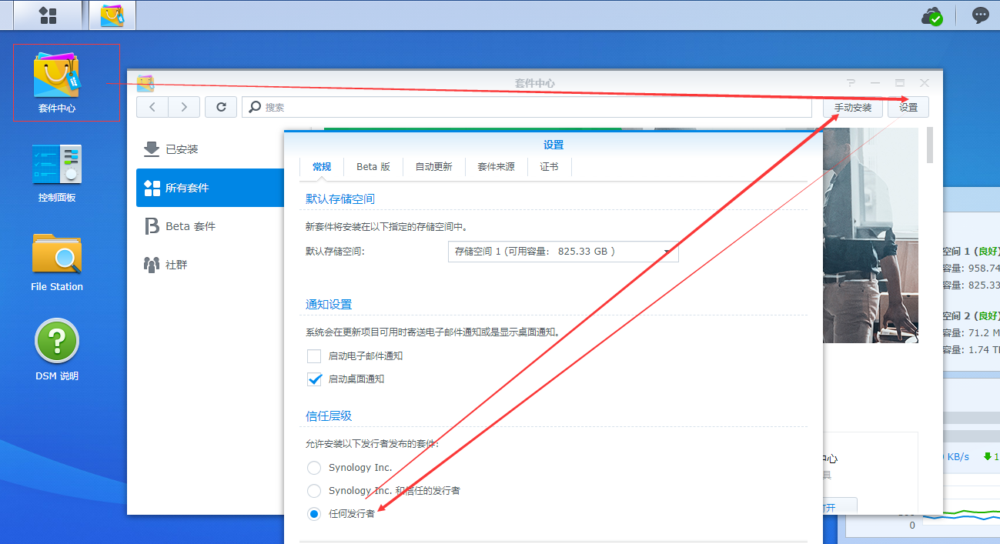
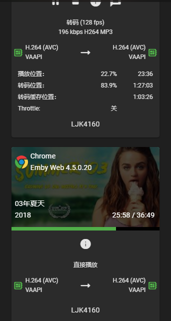

# 白嫖emby

https://blog.jkliu.co/nas/2020-08-24/free_rmby.html

## 一.搭建mb3admin.com伪站点,让你访问这个域名时返回如下的json数据,伪站点必须配置ssl,证书用下面这两个

本地下载证书,[emby白嫖证书.7z](https://blog.jkliu.co/usr/uploads/2020/08/3222002413.7z)
然后搭伪站点:

https://www.mb3admin.com/admin/service/registration/getStatus或https://mb3admin.com/admin/service/registration/getStatus返回

```
{"cacheExpirationDays": 7,"message": "Device Valid","resultCode": "GOOD"}
```

https://www.mb3admin.com/admin/service/registration/getStatus或https://mb3admin.com/admin/service/registration/getStatus返回

```
{"featId":"","registered":true,"expDate":"2099-01-01","key":""}
```

https://www.mb3admin.com/admin/service/registration/getStatus或https://mb3admin.com/admin/service/registration/getStatus返回

```
{"deviceStatus":"","planType":"","subscriptions":{}}
```

## 二.修改群晖的hosts和加入根证书

进入群晖ssh,获取root权限

```
sudo su -
```

编辑/etc/hosts,加入伪站点

```
vi /etc/hosts
```

添加如果是在群晖本机安装那就是127.0.0.1,如果是局域网其他主机就填伪站点的ip

```
127.0.0.1 mb3admin.com www.mb3admin.com
```

加入证书

```
curl https://raw.githubusercontent.com/s1oz/embyonekey/master/mb3admin.com.cert.pem >> /etc/ssl/certs/ca-certificates.crt
```

## 三.安装套件并激活高级权限

然后手动安装emby套件.进入https://emby.media/nas-server.html
选择x64然后下载,并到群晖安装


第一步下载的证书有个mb3admin.com.cert.pem改后缀为mb3admin.com.cert.pem.crt
然后安装到电脑里再用电脑web访问emby,
在emby输入密钥激活，比如以下密钥，可随意修改其中一个，跟别人不同，有绿色勾就成功了
7c329828cba89631c068a5a8ae33cee3

然后测试硬解是否生效,转码两边都有一个绿色芯片,没有提示软解,搞定!


最后附上安卓破解客户端
链接: https://pan.baidu.com/s/1hKjgbEv76e0HGbcApHvoFQ 提取码: rrmi