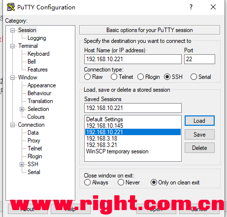
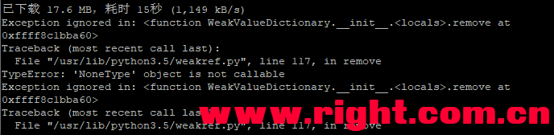
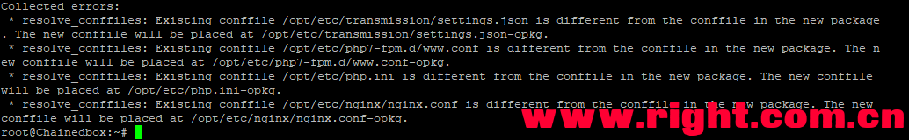
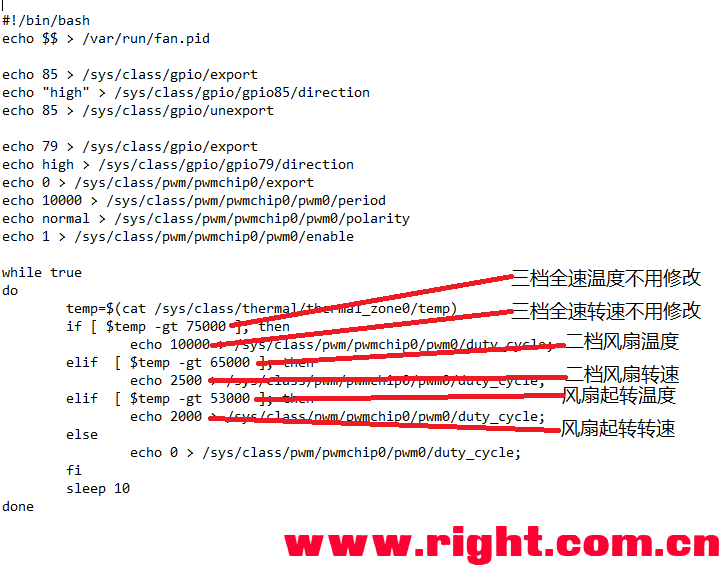
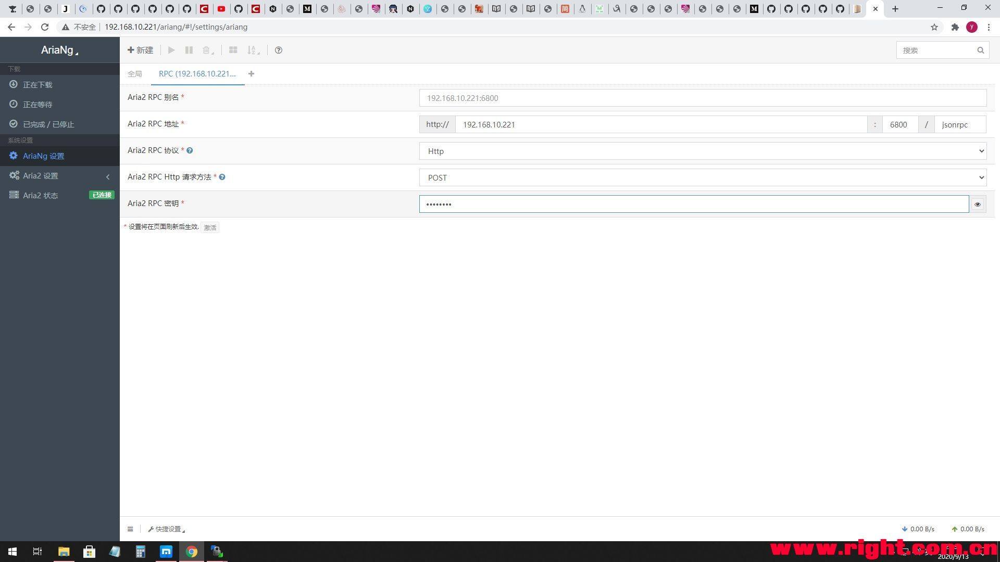
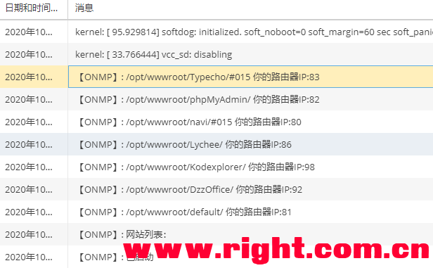

## 科普一下Ride_Wind大佬打包我家云最新固件使用

https://www.right.com.cn/forum/thread-4053775-1-1.html

部分内容来自大佬博客：https://blog.windtech.cf/大佬博客打不开了，分享一下内核：
链接：https://pan.baidu.com/s/1HQAACEQdYUPy7iXyXoSqzQ 提取码：jzrd
天翼云: https://cloud.189.cn/t/vA736bn2EfEb 访问码 ：3997
tg群目前有158人哈哈：
https://t.me/joinchat/TkfykMrEpKZGMFct

相关帖子
我家云硬改折腾记录+硬改指难+改USB2.0或换JMS578带3.5盘+omv设置休眠+风扇降噪
https://www.right.com.cn/forum/thread-3486158-1-1.html

我家云不掉盘后使用了许多固件，让人放心的还是Ride_Wind大佬完善打包的镜像，值得一提的是Ride_Wind大佬的固件有 Zram Swp，下面针对最新的镜像说说：
镜像地址（欢迎大家下载收藏）：7月31日更新
[https://cloud.windtech.cf/Chaine ... _Navi_200731_fix.7z](https://cloud.windtech.cf/Chainedbox/Armbian_Mix_With_Navi_200731_fix.7z)
特别给出 webpad 大佬共享的刷机教程：1刷机（我家云刷机都一样，以下内容基于最新固件）

附件：  [chainedbox线刷教程.pdf](tools\chainedbox线刷教程.pdf) 

2刷机完成后，断开电源，usb，连接网线接通电源，我家云会通过路由器DHCP获取IP地址；
3 Ride_Wind大佬的固件第一次启动后浏览器无法直接访问，需要用ssh工具连接（比如我使用putty连接），用户名root 密码1234 ；

4 自动扩容完成后，提示是否安装导航选择否（导航就是web的显示界面，这个随便，后面会讲如何重装更新导航），提示是否删除，点删除；（扩容完成后就可以用winscp等工具通过scp方式连接了）
5 升级内核文件deb，命令如下：

1. wget https://cloud.windtech.cf/Chainedbox/kernel/linux-dtb-current-rockchip64_20.11.0-trunk_arm64.deb
2. wget https://cloud.windtech.cf/Chainedbox/kernel/linux-image-current-rockchip64_20.11.0-trunk_arm64.deb
3. \#从Ride_Wind大佬的服务器下载我家云的专用内核到默认root目录下
4. \#wget https://cloud.windtech.cf/Chainedbox/UAS/linux-image-current-rockchip64_20.11.0-trunk_arm64.deb
5. \#上面注释掉的一行是专门提供给硬改过USB3.0不掉盘，支持UAS的芯片的内核
6. dpkg -i linux-*.deb
7. \#安装默认root目录下刚下载的内核文件
8. apt-mark hold linux-dtb-current-rockchip64 linux-image-current-rockchip64
9. \#锁定内核文件，防止升级的时候 我家云 的专用内核被通用内核替换导致不开机
10. rm -rf linux-*.deb
11. \#删除默认root目录下刚下载的内核文件，当然也可以用winscp等工具保存之后再删除

*复制代码*

6 升级完内核文件deb，在ssh 输入reboot 重启，
7 安装最新的web导航页（或者重装导航），如果前面安装了固件集成的导航，怕新导航有Bug的可以跳过；

1. cd /opt
2. \#进入opt目录，opt目录是导航软件的目录，qbt，transmission等软件都在这个目录下
3. /opt/etc/init.d/rc.unslung stop
4. killall easyexploere
5. killall filebrowser
6. \#停掉导航页面的相关软件
7. rm -rf /opt/*
8. \#删除opt下所有文件
9. wget https://cloud.windtech.cf/Chainedbox/%E5%AF%BC%E8%88%AA/20200731/entware_navi.tgz
10. \#下载导航包到当前opt目录
11. wget https://cloud.windtech.cf/Chainedbox/%E5%AF%BC%E8%88%AA/20200731/install_navi.sh
12. \#下载导航包脚本到当前opt目录
13. chmod +x install_navi.sh
14. \#赋予导航包脚本执行权限
15. ./install_navi.sh
16. \#执行导航包脚本，安装导航

*复制代码*

8升级armbian系统，ssh工具连接我家云，输入命令apt update 完后 执行apt upgrade 按y，等待，如果出现下图bug提示：

复制粘贴

1. wget -O /usr/lib/python3.5/weakref.py https://raw.githubusercontent.com/python/cpython/9cd7e17640a49635d1c1f8c2989578a8fc2c1de6/Lib/weakref.py
2. 

*复制代码*

再次执行apt update 完后 看是否还有更新，如果还有执行apt upgrade 按y，等待
reboot
重启后ssh 执行htop看看吧。
9 想升级导航页工具的老哥可以执行 opkg update 和 opkg upgrade 可以升级，目前以知问题：升级后web版的ssh、filebrowser打不开。（不希望遇到bug 朋友最好跳过此步）
升级完成后提示下图应该可以无视，这是软件的配置文件去留问题，想了解的朋友可以按照提示目录看看去。

10风扇散热问题
后来大佬提供了一个新版fan脚本 

附件：  [fan.rar](tools\fan.rar) 

解压后放到sbin目录下替换，重启生效；
如果部分网友还不满意这个风扇控制逻辑，
可以用我修改的fan脚本 

附件：  [ranfan.rar](tools\ranfan.rar) 

，因为大部分网友会发现，让风扇固定低转速散热效果更好噪声更小。（用了脚本后要观察一下风扇在一档是否正常起转，因为每台机器风扇损耗不一样）实际上我觉得我家云整体温度由内置硬盘决定，比如夏天28度左右的室温，3T日立硬盘运转到温度稳定时，硬盘温度有60度左右，这时候只要保证风扇静音低速旋转，可以缓慢抽出热风就可以了；另一方面cpu跑满100%的可能性不多，温度严重超标时候风扇强力运转一下就可以了。

11说说固件使用碰到的一些小问题
omv 用户名admin 密码openmediavault
omv 关闭log 防止写flash 保护flash

1. service rsyslog stop
2. \#暂停log服务
3. systemctl disable rsyslog
4. \#关闭log
5. \#systemctl enable rsyslog
6. \#开启log
7. reboot

*复制代码*

Aria2认证失败未连接问题
打开/opt/etc/aria.conf 文件查看rpc-secret=Passw0rd？
将Passw0rd填入Aria-Ng设置RPC栏的密钥里，注意是0不是o。

荔枝相册初始化问题
依次填localhost   root 123456  lychee  lychee
会弹出创建用户和密码框

qbt 用户名admin 密码adminadmin

下载目录问题
可以用winscp等工具看看 sharedfolders 文件夹下的目录，如果omv里共享的目录是 downloads ，那么下载目录 /sharedfolders/downloads

测试硬盘速度的一个方法
time dd if=/dev/zero bs=1024 count=1000000 of=/sharedfolders/downloads/1Gb.file
写1G数据到 /sharedfolders/downloads/ 文件名1Gb.file，根据情况自己修改文件目录。
可道云 进入后可以直接升级，提示失败，等等约一分钟可以成功，可道云可以直接访问/sharedfolders/downloads/目录

卸载jellyfin
如果你确定不用jellyfin，可以执行apt remove jellyfin 命令。

端口
可道云 98
lychee 86

下载目录问题
刷机驱动DriverAssitant_v4.6和刷机工具AndroidTool_Release：