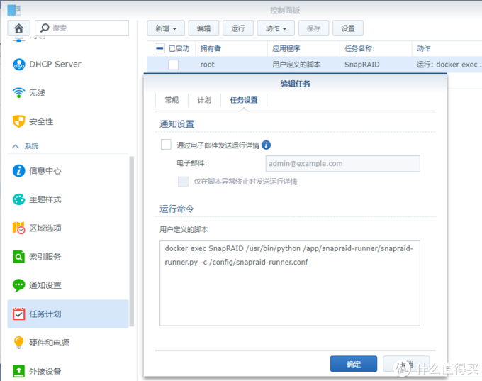

# 群晖 利用 Docker 运行 SnapRAID 的详细记录

https://post.smzdm.com/p/awxq3gdg/

## 开始之前

于 DSM 6.1.7 系统测试通过

最优方式应该是原生程序运行，期待未来会有人编译做出 spk 安装包我是弄不来了。

SnapRAID 这软件我也是刚刚开始使用，据说适合存有大量大文件并很少改动的家庭媒体中心。

详细优缺点，自行搜索了解

------

## SnapRAID 是什么

SnapRAID 是一个目录级别的冗余存储方案，它与 RAID 的原理有相似的地方，但它并不是 RAID。SnapRAID 

### 与 RAID 的主要区别有：

- SnapRAID 不会对数据进行条带化存储。RAID 通常会使用[数据条带化](https://en.wikipedia.org/wiki/Data_striping)，一个文件可能会被分散存储到多块磁盘上，这样的优点是读取的时候可以加速（多块磁盘同时读取），但条带化也是上节所说的 data lock-in 的根源——你不能拆出一块盘单独读写。
- SnapRAID 是工作于文件系统之上的。RAID 工作于文件系统之下，直接对磁盘区块进行操作，用磁盘区块上的比特计算校验数据，而 SnapRAID 是通过读取文件系统里的文件之后再进行计算的。
- SnapRAID 是非实时的。RAID 每时每刻都在工作，磁盘区块上的数据一旦发生变更就会重新计算校验数据，而 SnapRAID 可以在用户选择的时间进行重新计算。

### SnapRAID 相比 RAID 的优点主要有：

- 数据独立。不需要对磁盘做特殊处理，可以直接将已有数据的磁盘（甚至可以是不同文件系统的）加入 SnapRAID，SnapRAID 也不会改变这些已有的数据；一个文件不会被分散到多个磁盘，随时可以拆下来一块磁盘正常读写里面的数据；当[磁盘阵列](https://www.smzdm.com/fenlei/cipanzhenlie/)收到文件读写请求时，也只需要一块磁盘响应，而不是所有的磁盘全部从待机状态启动，开始寻道。
- 抗灾能力。当磁盘列阵中同时损坏的磁盘数量超出预期而无法修复数据时，SnapRAID 的抗灾能力更强。例如：在 3 + 1 的 RAID 场景下，坏一块没事，如果同时坏了两块，所有的磁盘上的数据都将无法读取（因为条带化）；但如果是 3 + 1 的 SnapRAID，就算同时坏两块，剩下两块里的数据依然可以正常读取。
- 配置灵活。标准的 RAID 等级中，RAID 5 最多承受 1 块磁盘同时损坏，RAID 6 最多承受 2 块磁盘同时损坏；而 SnapRAID 可以配置 1 到 6 块校验盘，最多承载 6 块磁盘同时损坏，因此可以组建更大的磁盘阵列而不提升风险（维持数据盘与校验盘的比例不变）。更重要的是，无论是增加还是减少磁盘，SnapRAID 都可以无痛完成，无需清空磁盘数据。
- 恢复误删文件。由于 RAID 是实时计算校验数据的，当文件被删除时，这一改动立刻就会被同步到校验数据里；而 SnapRAID 在用户请求的时候才进行同步，因此用户可以用 SnapRAID 从校验数据重新构建被误删除的文件。当然了，更可靠、更持久的的误删除防护还是应该用[增量备份](https://wzyboy.im/post/1106.html)来完成。
- 空间利用率高。在磁盘阵列中，校验盘的大小应大于等于数据盘中最大的那块。使用 SnapRAID 时，你可以「[超售](https://en.wikipedia.org/wiki/Resource_contention)」。比如数据盘是 6 TB 的但是只装了一半（3 TB），你把 4 TB 的磁盘作为校验盘也是可以的（因为此时校验数据最多只有 3 TB），只要在校验文件膨胀到接近 4 TB 的时候将校验文件挪到更大的磁盘里即可。同样的，校验盘里未被校验文件填满的剩余空间也可以用来存储一些「丢了也无所谓」的不重要数据。此外，由于 SnapRAID 工作于文件系统之上，你可以选择性地排除掉一些不想做冗余的目录和文件，以节省空间。

摘录自：目录级别的冗余存储：SnapRAID（[链接](https://wzyboy.im/post/1186.html)）

​               使用经验可以参考博文，非常受用

------

## 安装

使用这个 Docker 镜像： [链接](https://hub.docker.com/r/xagaba/snapraid)

Docker 注册表里边搜索 snapriad ，选择 **xagaba/snapraid** 项目

Docker

1）需要配置一个 /config 目录存放 **snapraid.conf** ， **snapraid-runner.conf** 两个配置文件**（文件于文末提供）**

2）需要保护的目录挂载到 /mnt 下

3）按挂载的路径配置好 snapraid.conf 文件， snapraid-runner.conf  按需改动，我默认配置了校验完成后进行[数据擦洗](https://en.wikipedia.org/wiki/Data_scrubbing)同时开启了 log。

4）环境变量 PUID ，PGID 用 **SSH** 登陆机器，输入 id 命令可以得知。应该都是统一的数字，跟图片设置就行

​      这个设置事关文件读写权限，配置好减少隐患与后续可能的麻烦

PUID & PGID

------

## 使用

软件需要使用 **docker exec** 参数传递命令来操作

以下命令均于 SSH 连接到机器上运行

sync 命令建立校验数据，视乎[硬盘](https://www.smzdm.com/fenlei/yingpan/)数据量所需的时间可能要数小时

> sudo docker exec SnapRAID snapraid sync

数据校验

### 常用的 SnapRAID 命令：

- snapraid sync：根据数据盘生成校验盘；
- snapraid diff：查看有哪些数据需要 sync；
- snapraid status：查看磁盘阵列的状态；
- snapraid scrub：进行[数据擦洗](https://en.wikipedia.org/wiki/Data_scrubbing)，提早发现磁盘阵列中的错误。

摘录自：目录级别的冗余存储：SnapRAID（[链接](https://wzyboy.im/post/1186.html)）

官方使用手册：[链接](https://www.snapraid.it/manual)

------

## 计划任务

该 Docker 镜像自带的 corntab 计划任务，默认每天北京时间 08:30 定时运行（容器是 UTC 时间）

​      想更灵活的自定时间可以用 

> sudo docker exec SnapRAID crontab -r 

​    命令把容器的 corntab 计划删了，改用[群晖](https://pinpai.smzdm.com/2315/)

[关注](https://pinpai.smzdm.com/2315/)

品牌

粉丝：

- 

  商品百科

- 

  好价

- 

  社区文章

自带的任务计划

### **手动运行的效果**

> fejich@PVE-DSM:~$ sudo docker exec SnapRAID /usr/bin/python /app/snapraid-runner/snapraid-runner.py -c /config/snapraid-runner.conf
>
> 2019-08-05 00:51:03,168 [INFO  ] ============================================================
>
> 2019-08-05 00:51:03,169 [INFO  ] Run started
>
> 2019-08-05 00:51:03,169 [INFO  ] ============================================================
>
> 2019-08-05 00:51:03,169 [INFO  ] Running diff...
>
> 2019-08-05 00:51:03,175 [OUTPUT] Loading state from /config/snapraid.content...
>
> 2019-08-05 00:51:03,175 [OUTPUT] Comparing...
>
> 2019-08-05 00:51:03,176 [OUTPUT] add F06中孔铁油缸-4.0s.PDF.pdf
>
> 2019-08-05 00:51:03,176 [OUTERR] WARNING! UUID is unsupported for disks: 'mnt1', 'mnt2', 'mnt3'. Noons.
>
> 2019-08-05 00:51:03,176 [OUTPUT] 
>
> 2019-08-05 00:51:03,177 [OUTPUT] 14 equal
>
> 2019-08-05 00:51:03,177 [OUTPUT] 1 added
>
> 2019-08-05 00:51:03,177 [OUTPUT] 0 removed
>
> 2019-08-05 00:51:03,178 [OUTPUT] 0 updated
>
> 2019-08-05 00:51:03,178 [OUTPUT] 0 moved
>
> 2019-08-05 00:51:03,178 [OUTPUT] 0 copied
>
> 2019-08-05 00:51:03,178 [OUTPUT] 0 restored
>
> 2019-08-05 00:51:03,178 [OUTPUT] There are differences!
>
> 2019-08-05 00:51:03,479 [INFO  ] ************************************************************
>
> 2019-08-05 00:51:03,479 [INFO  ] Diff results: 1 added,  0 removed,  0 moved,  0 modified
>
> 2019-08-05 00:51:03,480 [INFO  ] Running sync...
>
> 2019-08-05 00:51:03,482 [OUTPUT] Self test...
>
> 2019-08-05 00:51:03,858 [OUTPUT] Loading state from /config/snapraid.content...
>
> 2019-08-05 00:51:03,859 [OUTPUT] Scanning disk mnt1...
>
> 2019-08-05 00:51:03,859 [OUTPUT] Scanning disk mnt2...
>
> 2019-08-05 00:51:03,860 [OUTPUT] Scanning disk mnt3...
>
> 2019-08-05 00:51:03,860 [OUTPUT] Using 0 MiB of memory for the file-system.
>
> 2019-08-05 00:51:03,860 [OUTERR] WARNING! UUID is unsupported for disks: 'mnt1', 'mnt2', 'mnt3'. Noons.
>
> 2019-08-05 00:51:05,860 [OUTPUT] Initializing...
>
> 2019-08-05 00:51:05,860 [OUTPUT] Resizing...
>
> 2019-08-05 00:51:05,860 [OUTPUT] Saving state to /config/snapraid.content...
>
> 2019-08-05 00:51:05,860 [OUTPUT] Saving state to /mnt1/snapraid.content...
>
> 2019-08-05 00:51:05,870 [OUTPUT] Verifying /config/snapraid.content...
>
> 2019-08-05 00:51:05,870 [OUTPUT] Verifying /mnt1/snapraid.content...
>
> 2019-08-05 00:51:05,871 [OUTPUT] Syncing...
>
> 2019-08-05 00:51:06,093 [OUTPUT] Using 32 MiB of memory for 32 cached blocks.
>
> 2019-08-05 00:51:06,095 [OUTPUT] 100% completed, 1 MB accessed in 0:00
>
> 2019-08-05 00:51:06,102 [OUTPUT] 
>
> 2019-08-05 00:51:06,102 [OUTPUT] mnt1  0% |
>
> 2019-08-05 00:51:06,102 [OUTPUT] mnt2  0% |
>
> 2019-08-05 00:51:06,103 [OUTPUT] mnt3  0% |
>
> 2019-08-05 00:51:06,103 [OUTPUT] parity  0% |
>
> 2019-08-05 00:51:06,103 [OUTPUT] raid 28% | *****************
>
> 2019-08-05 00:51:06,103 [OUTPUT] hash  9% | *****
>
> 2019-08-05 00:51:06,103 [OUTPUT] sched 60% | *************************************
>
> 2019-08-05 00:51:06,103 [OUTPUT] misc  0% |
>
> 2019-08-05 00:51:06,104 [OUTPUT] |______________________________________________________________
>
> 2019-08-05 00:51:06,104 [OUTPUT] wait time ([total](https://pinpai.smzdm.com/1439/)
>
> [关注](https://pinpai.smzdm.com/1439/)
>
> 
>
> 品牌
>
> 
>
> 粉丝：
>
> 
>
> - 
>
>   商品百科
>
> - 
>
>   好价
>
> - 
>
>   社区文章
>
> , less is better)
>
> 
>
> 2019-08-05 00:51:06,104 [OUTPUT] 
>
> 2019-08-05 00:51:06,104 [OUTPUT] Everything OK
>
> 2019-08-05 00:51:06,108 [OUTPUT] Saving state to /config/snapraid.content...
>
> 2019-08-05 00:51:06,109 [OUTPUT] Saving state to /mnt1/snapraid.content...
>
> 2019-08-05 00:51:06,111 [OUTPUT] Verifying /config/snapraid.content...
>
> 2019-08-05 00:51:06,111 [OUTPUT] Verifying /mnt1/snapraid.content...
>
> 2019-08-05 00:51:06,413 [INFO  ] ************************************************************
>
> 2019-08-05 00:51:06,413 [INFO  ] All done
>
> 2019-08-05 00:51:06,430 [ERROR ] Failed to send email because smtp host is not set
>
> 2019-08-05 00:51:06,430 [INFO  ] Run [finish](https://pinpai.smzdm.com/6485/)
>
> [关注](https://pinpai.smzdm.com/6485/)
>
> 
>
> 品牌
>
> 
>
> 粉丝：
>
> 
>
> - 
>
>   商品百科
>
> - 
>
>   好价
>
> - 
>
>   社区文章
>
> ed successfully

### 群晖计划任务

自定义脚本

> docker exec SnapRAID /usr/bin/python /app/snapraid-runner/snapraid-runner.py -c /config/snapraid-runner.conf

使用上边的命令，配置好定期运行。即可愉快自动工作。

