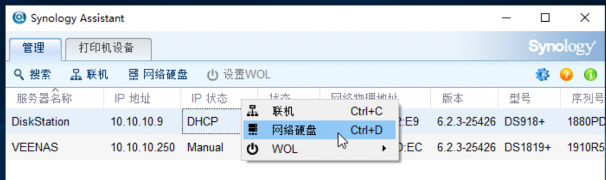

# 群晖助手在win10下映射网络驱动器失败的解决方法

## 首先我们来看看映射网络驱动器失败会有什么提示

## 解决方法

1.打开WIN10控制面板选择程序

2.找到里面的SMB 1.0/CIFS File Sharing Support勾上，重启电脑

## 现在就已经可以成功添加群晖磁盘的网络驱动器了

 

------

原文地址：https://www.vediotalk.com/archives/15516