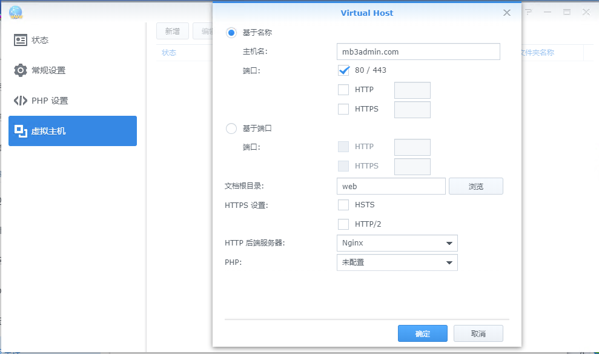
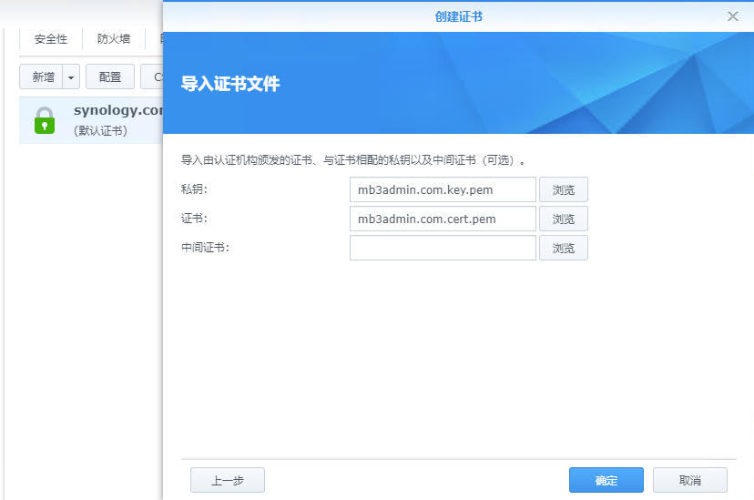
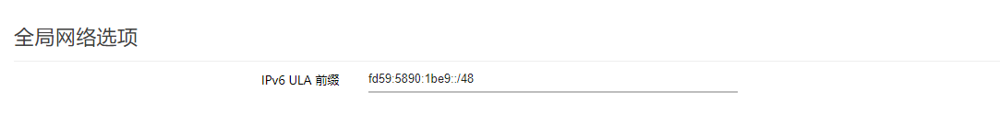
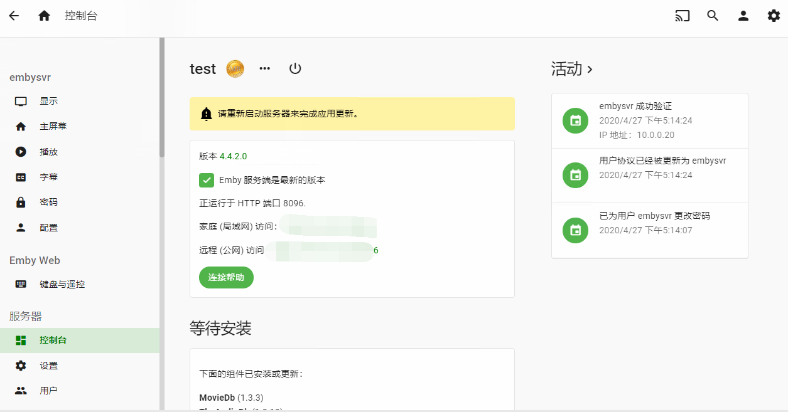
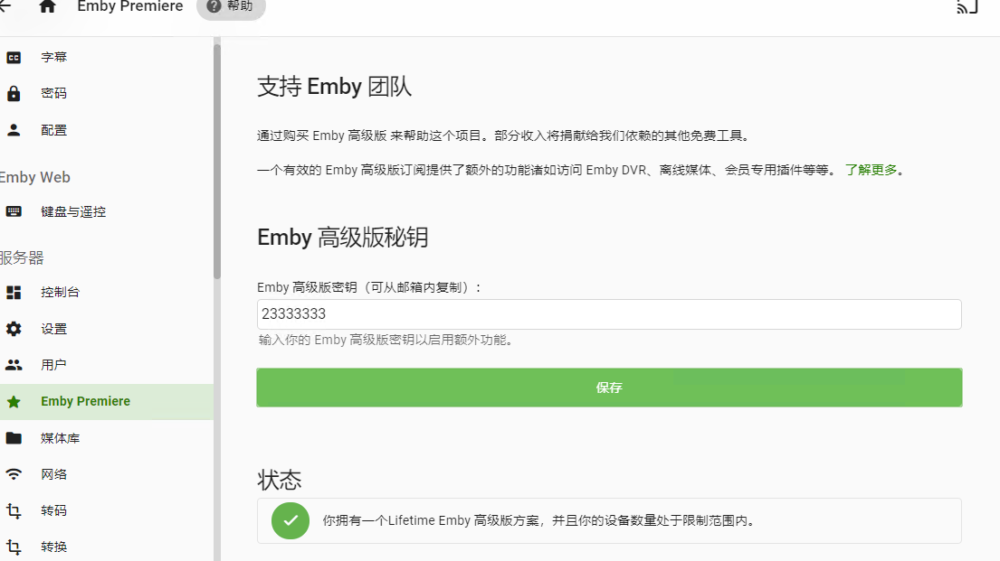
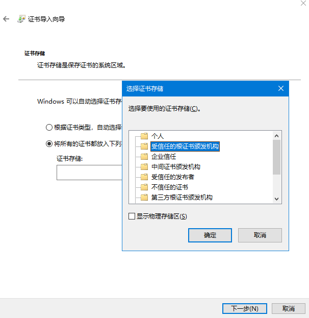

# 群晖搭建局域网Emby Premiere服务器，节约119刀！

http://www.xzccc.com/blog/?id=52#cmt39

### embyonekey

- 群辉emby套件版服务端一点五键白嫖
- 左点点右点点,算你一点五键吧

# 提前说下

啥也不会瞎捣鼓的 
所以~~~ 
请保证在未在Web Station中新建任何虚拟主机 
请按照说明路径正确设置 
出啥问题我也不负责 
看不到图片或者脚本无法下载运行的 
请科学好raw.githubusercontent.com网址

### 步骤说明


\0. 在群辉中安装好Web Station跟EMBY 
\1. 打开Web Station如图所示新建虚拟主机 
[](https://github.com/s1oz/embyonekey/blob/master/webstation.png)

\2. 打开群辉控制面板-安全性-证书 
点击新建-添加新证书-导入证书-选择下载的私钥跟证书 
证书下载地址

```
https://raw.githubusercontent.com/s1oz/embyonekey/master/mb3admin.com.cert.pem
https://raw.githubusercontent.com/s1oz/embyonekey/master/mb3admin.com.key.pem
```


[](https://github.com/s1oz/embyonekey/blob/master/cert0.png)

\3. 保存后在配置中将mb3admin.com的证书设置为刚导入的的证书 
[](https://github.com/s1oz/embyonekey/blob/master/cert1.png)

#### 劫持mb3admin伪站

如搭建伪站的NAS地址为10.0.0.10 则如下填写,根据自己实际情况修改,目的就是劫持域名到搭建的伪站上

```
10.0.0.10 mb3admin.com
```

如有使用ipv6,请将ipv6地址一起加入,可以避免白嫖时而有效时而无效 
举例OP.根据网络-接口-全局网络选项中的IPv6 ULA 前缀来填写 
[](https://github.com/s1oz/embyonekey/blob/master/ULA.png)
如我的是fd59:5890:1be9::/48 搭建伪站的的IP是10.0.0.10,末尾是10,所以如下填写

```
fd59:5890:1be9::10 mb3admin.com
```


如在主路由劫持,无需其他设置,直接修改hosts即可 
如有旁路由,可能需要额外在旁路由上修改hosts(可能,未尝试) 
如没有在路由劫持,需修改将每个客户端劫持到伪站

1. OP 梅林类路由可以直接在路由中直接修改hosts文件 
   登陆ssh输入以下命令 `vi /etc/hosts` 
   i 进入编辑状态 
   添加 `10.0.0.10 mb3admin.com` `:wq` 保存退出 
   登陆OP-网络-DHCP/DNS-HOSTS 和解析文件 保存并应用
2. 群辉可以直接登录修改 
   登陆ssh输入以下命令 `vi /etc/hosts` 
   i 进入编辑状态 
   输入 `10.0.0.10 mb3admin.com` `:wq` 保存退出
3. Windows修改只是路径不同 
   直接打开`C:\Windows\System32\drivers\etc\`目录 
   修改文件夹中的hosts文件

### 接下来运行这条脚本

以root用户执行命令：


```
wget -N --no-check-certificate "https://raw.githubusercontent.com/s1oz/embyonekey/master/embyonekey.sh" && chmod +x embyonekey.sh && ./embyonekey.sh
```


运行完毕 
可以输入以下命令测试

```
nginx -t
```

查询是否报错

```
curl https://mb3admin.com/admin/service/registration/validateDevice
curl https://mb3admin.com/admin/service/registration/validateDevice/666
```

ssh中运行命令查看是否正确返回值

#### 祝大家玩得开心


如图,打开即可拥有会员黄标 

[](https://github.com/s1oz/embyonekey/blob/master/ko.png)

在Emby Premiere中输入任何秘钥都可以激活成功 

[](https://github.com/s1oz/embyonekey/blob/master/ko1.png)

#### 客户端证书安装

如服务器正常白嫖后,客户端还是无法正确显示,一般是证书不正确,请在客户端安装证书

```
https://raw.githubusercontent.com/s1oz/embyonekey/master/guomi.cer
```

下载此链接文件名为guomi.cer的证书文件后安装相应设备上

Windows请安装此目录下 
[](https://github.com/s1oz/embyonekey/blob/master/window.png)


IOS需要安装后在设置--通用--关于手机--证书信任设置中把证书信任

## 感谢 时光轴 星辰 不会魔法的思思 教程引路