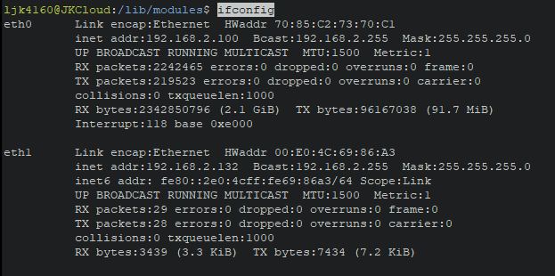
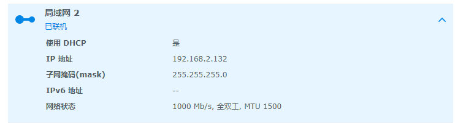

# 解决群晖插usb网卡无法使用.

## 一.手动安装网卡套件

rtl8152/8153/8156套件
这里我只提供918其他型号自己到github下载
[r8152-apollolake-2.13.0-1.spk](https://blog.jkliu.co/usr/uploads/2020/08/2467994524.spk)

根据https://www.synology.com/en-global/knowledgebase/DSM/tutorial/Compatibility_Peripherals/What_kind_of_CPU_does_my_NAS_have查看机型.例如918是Apollolake,
接着到https://github.com/bb-qq/r8152/releases页面下载Apollolake的套机
r8152-apollolake-2.13.0-1.spk,
然后进群晖套件中心手动安装这个spk即可

## 二.启用网卡

插入usb网卡发现没反应,然后装了网卡套件还是没用,进命令行

```
sudo ifconfig eth1 up
```

接着

```
ifconfig
```


查看多了一个网卡了,确定是usb网卡,进面板也多了一个局域网2

搞定!