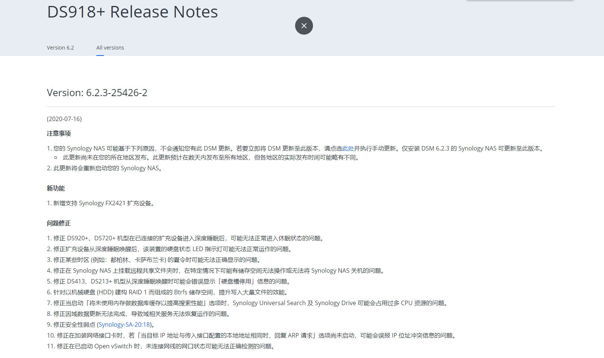
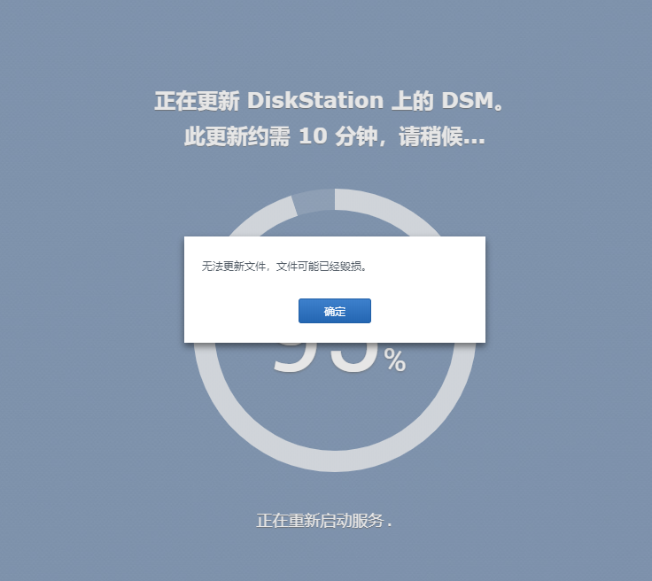
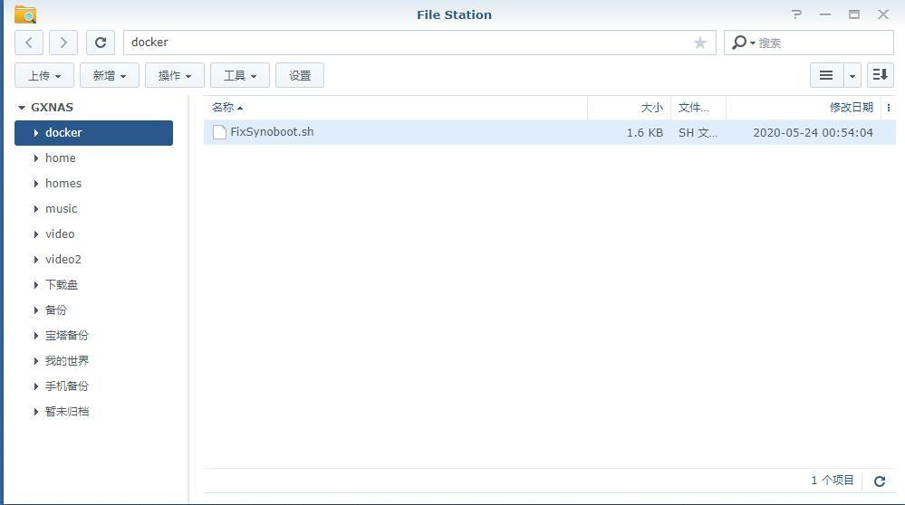
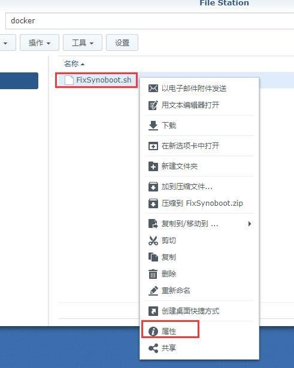
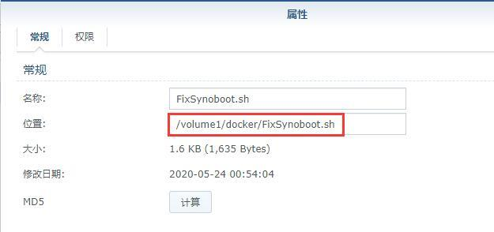
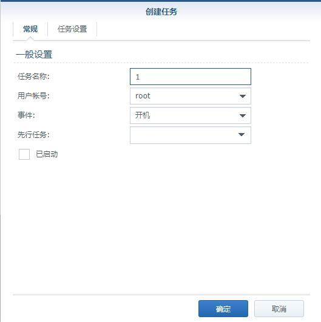
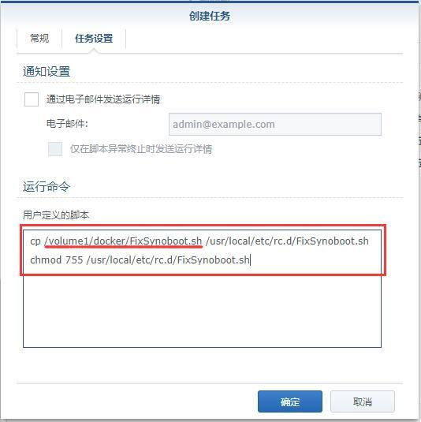
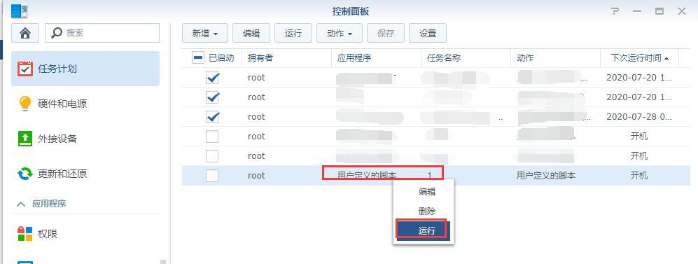
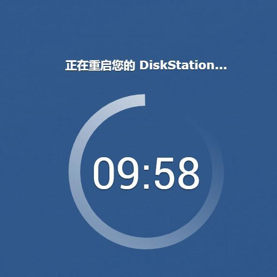
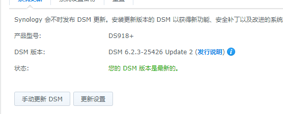

# 黑群晖升级到6.23-25426up2报错文件毁损（卡95%）的解决方法

DSM6.23-25426up2已经在官网上架好几天了，不同地区的用户接收版本升级推送的时间可能会有不同。

[](https://wp.qiniu.gxnas.com/wp-content/uploads/2020/07/999284eb6c9181b52eacdee235f9e357.png)

 

白群用户早就升级了，黑群用户手痒痒了也想升级（使用二合一系统的可以默默的走开了，二合一系统不支持升级的！），于是估计有不少用户升级到95%的时候，就咯噔一下弹出这个信息。

[](https://wp.qiniu.gxnas.com/wp-content/uploads/2020/07/fb1443d03d1552fdb665e32cd3e59bac.png)

 

解决方法如下：

1、先点 [这里](https://wp.gxnas.com/wp-content/uploads/2020/07/FixSynoboot.sh) 下载补丁到电脑上；

备份：  [FixSynoboot.sh](tools/FixSynoboot.sh) 

[](https://wp.qiniu.gxnas.com/wp-content/uploads/2020/07/072d006f34f6737f704fe7cd801b617f.jpg)

 

 

2、把刚才下载的补丁文件，上传到群晖的文件夹（注意不要上传到中文的文件夹，我这里上传到docker这个文件夹下），然后在群晖的File Station找到这个文件，点右键-属性；

[](https://wp.qiniu.gxnas.com/wp-content/uploads/2020/07/e344c6472857396130097e1c10fe5f13.jpg)

 

 

3、在“位置”这里会显示这个文件实际保存的路径，记住这个路径，后面需要用到；

[](https://wp.qiniu.gxnas.com/wp-content/uploads/2020/07/f7ce85de93c5617e2a3252f811b2f49d.jpg)

 

 

4、打开群晖的控制面板-任务计划，新增-触发的任务，用户自定义脚本；

[](https://wp.qiniu.gxnas.com/wp-content/uploads/2020/07/3cfba7c5558ae2b25821c797a232f14f.jpg)

 

 

5、在弹出的创建任务窗口-常规，任务名称随意写，但是不要与现有的任务名称重名，我这写的任务名称是1；

[](https://wp.qiniu.gxnas.com/wp-content/uploads/2020/07/b836db501b624aa5da695d0b50056107.jpg)

 

 

6、点任务设置，在用户定义的脚本输入以下两行命令（并按照个人实际情况修改）后，点“确定”：

```
cp /volume1/docker/FixSynoboot.sh /usr/local/etc/rc.d/FixSynoboot.sh
chmod 755 /usr/local/etc/rc.d/FixSynoboot.sh
```

 

需要注意的是：上面的命令行不要全部照搬！下划线的这行写的是上面第3步获取到的路径，请自行修改；

 

[](https://wp.qiniu.gxnas.com/wp-content/uploads/2020/07/63d9b90d9808e4ddc24c2331ddd6775d.jpg)

 

 

7、回到任务计划的列表，找到刚才添加的1，点右键，运行；

[](https://wp.qiniu.gxnas.com/wp-content/uploads/2020/07/deb77b7fcd6ee6af0b2c992355eaeea9.jpg)

 

 

8、点：是；

[](https://wp.qiniu.gxnas.com/wp-content/uploads/2020/07/ca7724498403de38829ae36fc9149b75.jpg)

 

 

9、群晖右上角，点人头像图标，选：重新启动；

[](https://wp.qiniu.gxnas.com/wp-content/uploads/2020/07/bfd92386a1b48076792e68b596846499.jpg)

 

 

10、重启好了以后，再去更新，你会发现，不再卡95%了；

[](https://wp.qiniu.gxnas.com/wp-content/uploads/2020/07/bdc2d12f90867717d1bbc5bc01bb614f.jpg)

 

 

11、完美升级！

[](https://wp.qiniu.gxnas.com/wp-content/uploads/2020/07/e1aaef260db7f48558149ce9b0c2c3d8.png)

------

PS：博主用的是DS918+的系统，所以以DS918更新为例。黑群晖的DS3615、DS3617、DS918升级到6.23-25426up2遇到卡95%的问题均可使用本补丁。