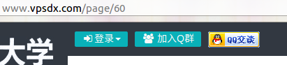
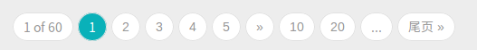
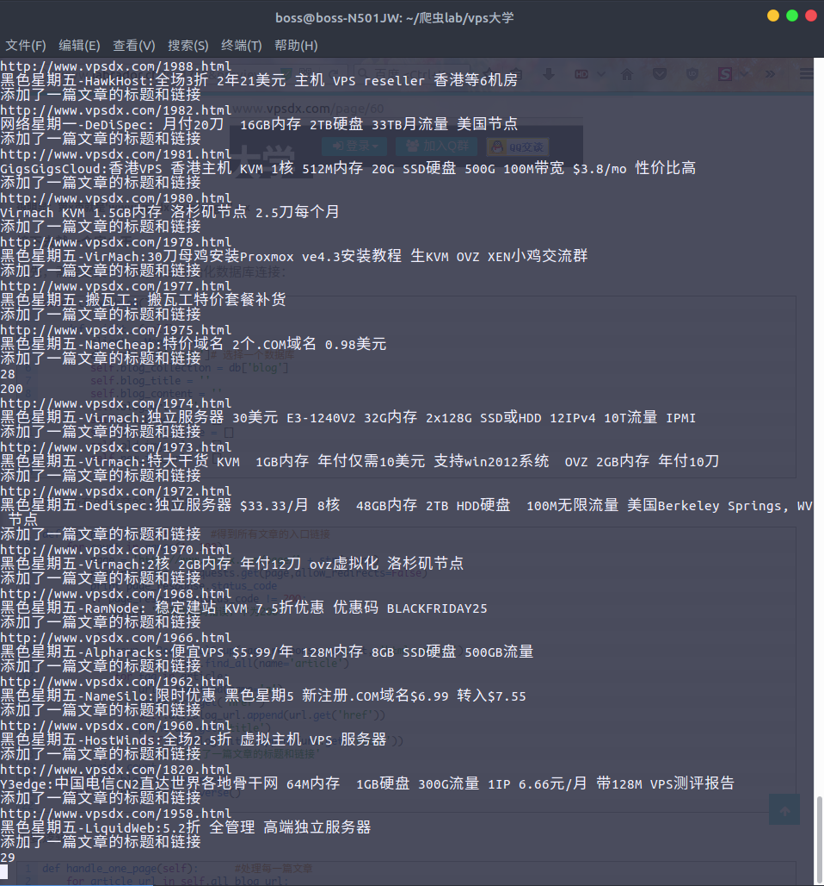
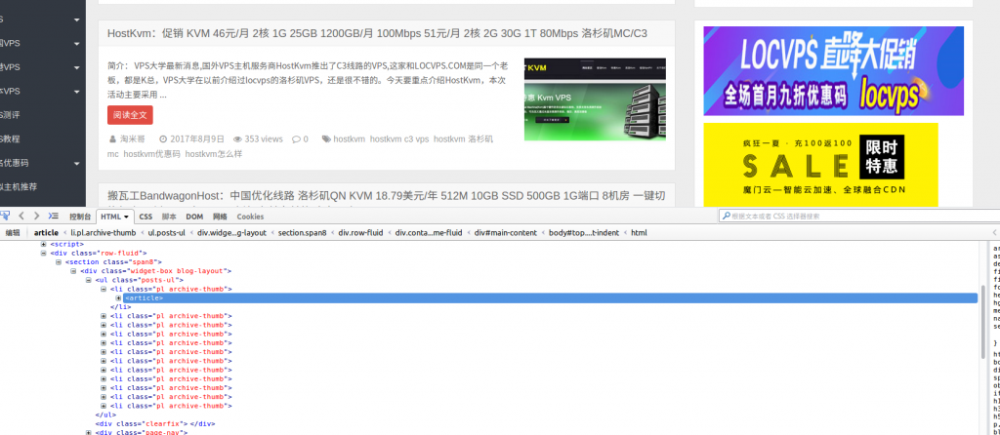

# 采集wordpress并自动发布文章

[https://blog.oliverxu.cn/2018/11/11/%E9%87%87%E9%9B%86wordpress%E5%B9%B6%E8%87%AA%E5%8A%A8%E5%8F%91%E5%B8%83%E6%96%87%E7%AB%A0/](https://blog.oliverxu.cn/2018/11/11/采集wordpress并自动发布文章/)


> ***这是一篇去年的老文章了，我的博客的域名从xujh.top->ikeji8.com->xujh.top，建站程序从wordpress变为了typecho静态博客。最近，我将把之前的文章慢慢迁移过来\***

最近我的博客新开了，一直在申请Google AdSense， 结果申请一次被拒一次，google发邮件说我的内容太少了， 这就让我很不爽了，虽然被拒绝的原因可能是其他的比如网站建站时间短等等，但是我还是想瞬间把我的博客的内容给增加上去，再一看，群里那些基友用的都是wordpress建站，OK，造个小爬虫吧！ 虽然网上有自动采集文章的插件，但是你不觉得那个太low了吗！(虽然我的爬虫也很low) 好了，闲话少说，进入主题。

## 首先，需要确定一个目标网站，我爬的是xxx大学的博客。

## 网站分析

先看看我们要爬取的站点

首先，这是一个垃圾站点，请让我鄙视一下。

爬虫运行的步骤：

1. 爬取所有文章的入口链接和标题
2. 提取每一篇文章中的需要的内容
3. 一篇文章爬取结束后将数据写入数据库
4. 将需要发布的文章自动发布到WP博客中

## 开始了，ARE YOU READY！

首先需要找到所有文章链接，我们来分析一下网页的规律



很明显：第x页就是'www.vpsdx.com/page/' + x

接下去就一个字：干

首先，需要定义一个类, 并且初始化数据库连接：这里我用的是mongodb，只因为他简单，适合我这样的小白。

```
class crawl_blog():
    def __init__(self):
        client = MongoClient()
        db = client['vpsdx']# 选择一个数据库
        self.blog_collection = db['blog']
        self.blog_title = ''
        self.blog_content = ''
        self.blog_url = ''
        self.all_blog_url = []
        self.all_blog_title = []
        self.old_img_urls = []
        self.new_img_urls = []
```

然后获取所有的文章的入口链接，分析页面采用BeautifulSoup。

```
def get_blog_url(self):     #得到所有文章的入口链接
    for count in range(1, 100):
        page = 'http://www.vpsdx.com/page/' + str(count)
        page_response = requests.get(page,allow_redirects=False)
        print page_response.status_code
        if page_response.status_code != 200:
            print '网页状态码错误，不为200'
            break
        else:
            soup = BeautifulSoup(page_response.content, 'html.parser')
            article = soup.find_all(name='article')
            for tag in article:
                url = tag.find(name='a')
                print url.get('href')
                self.all_blog_url.append(url.get('href'))
                print url.get('title')
                self.all_blog_title.append(url.get('title'))
                print '添加了一篇文章的标题和链接'
        print count
    self.all_blog_url.reverse()
    self.all_blog_title.reverse()
```


结果图

主要逻辑，这里就不多说了，太简单了。

```
def handle_one_page(self):      #处理每一篇文章
    for article_url in self.all_blog_url:
        if self.blog_collection.find_one({'文章网址': article_url}):
            print u'这个页面已经爬取过了' 
        else:
            index = self.all_blog_url.index(article_url)
            self.blog_url = article_url
            print "文章的网址是: {b8c66bcbce874cbcdfdaa03ff0f908635b9ef0379cd01189ad5fe3f67980b247}s" {b8c66bcbce874cbcdfdaa03ff0f908635b9ef0379cd01189ad5fe3f67980b247} self.blog_url
            self.blog_title = self.all_blog_title[index]
            print "文章的标题是: {b8c66bcbce874cbcdfdaa03ff0f908635b9ef0379cd01189ad5fe3f67980b247}s" {b8c66bcbce874cbcdfdaa03ff0f908635b9ef0379cd01189ad5fe3f67980b247} self.blog_title            
            self.get_article_content(self.blog_url)
            self.change_url()       #更改内容中的图片链接
            self.blog_content = str(self.blog_content)
            self.publish_article(self.blog_title,self.blog_content)
            print '成功发表文章'
            post = {
                        '文章标题': self.blog_title,
                        '文章网址': self.blog_url,
                        '文章内容': self.blog_content,
                        '图片旧地址': self.old_img_urls,
                        '图片新地址': self.new_img_urls,
                        '获取时间': datetime.datetime.now()
                }
            self.blog_collection.save(post)
            print u'插入数据库成功, 倒计时5s进行下次爬取'
            time.sleep(5)
            self.blog_title = ''
            self.blog_content = ''
            self.blog_url = ''
            self.old_img_urls = []
            self.new_img_urls = []
```


现在我们分析下如何提取文章中的内容，找到我们需要的标签，发现在标签中还有我们不想要的广告，因此，我们需要对其进行处理，处理方法也很简单，把不需要的tag给去除掉就可以。



```
def get_article_content(self, url):
    self.blog_content = ''
    browser = webdriver.PhantomJS()
    browser.get(url)
    soup = BeautifulSoup(browser.page_source, 'html.parser')
    article_tag = soup.find('div', class_='entry')
    all_children_tag = article_tag.find_all(recursive=False)
    for i in all_children_tag:
        print i.name

        try:
            if i['class'][0] == u'gggpost-above':
                i.decompose()  
                print '检测到广告，正在删除'
            else:
                pass
        except:
            pass


        try:
            if i['type']== u'text/javascript':
                i.decompose()  
                print '检测到广告，正在删除'
            else:
                pass
        except:
            pass


        try:
            if i['class'][0] == u'old-message':
                i.decompose()  
                print '检测到广告，正在删除'
            else:
                pass
        except:
            pass

        print 50*'*'
    print '成功去除广告'
    self.blog_content = str(article_tag)
```


下面这一步也比较重要，每篇文章中有图片链接，基本上很多博客都用了CDN加速，大部分的CDN都提供了防盗链设置，所以，如果直接用原来博客中的链接是行不通的，因为访问图片的时候会需要提供浏览器的refer。所有需要将原文章中的图片下载到本地，并将它上传到自己使用的云存储中，我用的是七牛云。

```
def change_url(self):
        self.blog_content = BeautifulSoup(str(self.blog_content), 'html.parser')
        #获取所有具有特定class属性的a标签
        a_tag = self.blog_content.find_all(name='a', class_='highslide-image')
        print 50*'*'
        for a in a_tag:
            try:
                #获取原图的链接并且下载
                old_url = a['href']
                response = requests.get(old_url)
                index = a_tag.index(a)
                filename = str(index) + '_' + old_url.split('/')[-1]
                with open(filename, 'ab') as f:
                    f.write(response.content)   
                self.old_img_urls.append(old_url)
                new_tag = self.blog_content.new_tag("img")
                a.replace_with(new_tag)
                #将图片上传到七牛云
                self.up_load(filename, filename)
                new_tag['src'] = '你的七牛云域名' + filename
                print '成功更换图片的链接'
                self.new_img_urls.append(new_tag['src'])
            except:
                print '获取图片失败，可能是图片的链接错误，正在跳过'
```


代码写的比较丑，我就不贴出来了。还望各位大胸弟们支持下。

欢迎学习研究Python的朋友们加入：Python技术交流群：[681976114](https://shang.qq.com/wpa/qunwpa?idkey=52487b5750a623ff1fa9cbad6ae98a9b030c6e5cd42d55dca65ff1703a24e538)