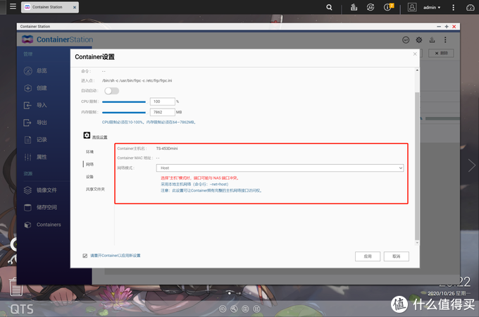
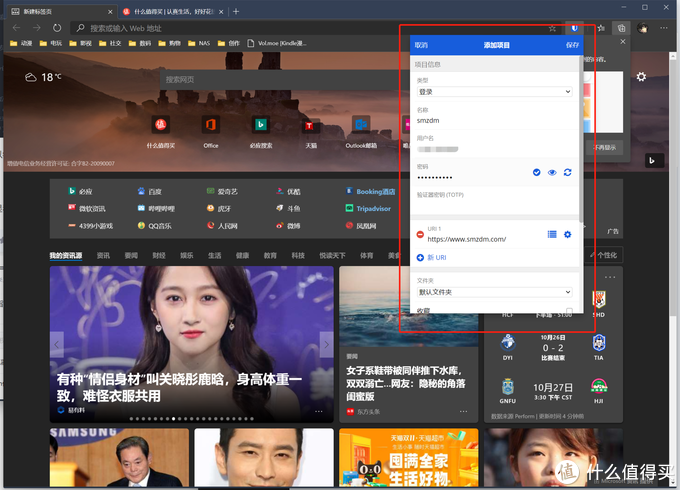

## FRP内网穿透 SSL证书 手把手教你在威联通NAS上搭建Bitwarden密码管理服务

https://post.smzdm.com/p/a3g7d57n/

## 前言

自从将NAS升级为TS-453Dmini后，就总想在上面多折腾点东西。毕竟J4125的性能还算不错，作为一台7x24小时运行的设备，不榨干它的性能感觉有点不舒服。这次折腾我将目光投向了密码管理服务这一块。我相信有很多用户都在使用诸如1Password、LastPass 这样的密码管理服务来统一管理自己的密码。这里我选择Bitwarden的原因很简单，开源、免费，完全自主可控，而且功能强大。网上其实已经有一些教程教你如何在NAS上搭建Bitwarden服务。但是那些教程几乎都是群晖的，虽然和威联通的搭建方式差别大不，但是完全套用到威联通上还需要一定的消化理解。而且有些教程写的太简单的，部分关键步骤一带而过。本文结合我自身的条件，尽可能详细地讲述了在威联通NAS上自建Bitwarden服务的方法。如果大家都相似的需求，希望本文可以提供一些有用的信息。折腾门槛自然是有的，但是整个过程其实并不复杂。

## 准备工作

想要在威联通NAS上部署Bitwarden，还需要一些先决条件。如果你不具备这些条件，或者没打算继续投入资金折腾，那么就没必要继续往下看了。这些先决条件就是：域名、证书和公网IP，没有公网IP还可以用其他方式实现内网穿透。
域名可以去腾讯云或者阿里云申请，现在域名都很便宜的，几十块钱就能买好几年。在阿里云或者腾讯云申请完域名后，就可以顺便在这里申请证书了，都是有免费的证书可以申请的。公网IP这个是比较麻烦的，各地不同运营商对公网IP的管控不一样，有些地方可能就是不给公网IP，那么就需要考虑内网穿透了。

我的情况是我在很久之前就在阿里云申请了域名，然后证书也不是什么难事，但是我却没有公网IP。好在我有一个云服务器，可以用来进行内网穿透。所以在没有公网IP的时候，购买一个云服务器就是必要条件了。其实在威联通NAS上部署Bitwarden还是很简单的，但是要把这个服务用起来，就必须要以HTTPS的方式进行外网访问。为了实现这个目的，就需要域名、证书、公网IP(内网穿透)了。这样以来复杂程度一下子就提高了。
好了下面就详细讲述下，我在有一台威联通NAS、一个阿里云购买的域名、一个云服务器的前提下，如何实现利用Bitwarden搭建私有密码管理服务的吧。

## SSL证书申请

因为我已经有域名了，而且域名本身也没什么好说的，所以域名的申请就略过了。Bitwarden强制要求使用HTPPS访问，HTTP下访问连登录和注册都没法完成。因此，我们需要申请SSL证书。SSL证书的免费申请方法有很多，如果你用的是阿里云或者腾讯云等服务，那么申请一个免费的SSL证书会变得更简单。下面以阿里云为例。
在产品里面搜索SSL证书，点击选购证书进入证书购买页面。看到默认的证书的价格是不是被吓到了，不用担心，点击单个域名，再点击DV域名级SSL，接着就会出现免费版，点击这个后，价格就会归零了，证书的有效期是一年，时间过了需要重新申请证书。

不要犹豫，点击购买并付款，当然实际上支付的是零元，购买证书完毕后进入控制台进行证书申请。在申请页面主要是需要填写要绑定的域名，其他信息都可以不用修改。

然后就到了验证页面，因为我们的证书和域名都是在阿里云申请的，所以在域名管理控制台可以看到已经自动添加了一条_dnsauth主机记录。再点击验证，就会提示域名验证成功，后面我们就可以使用这个域名以HTTPS的方式访问我们的网站服务了。

证书申请完毕后，就可以点击下载将证书下载到本地已备后面使用。下载的时候，选择服务器类型为Apache的那个文件即可。解压证书压缩包可以看到里面有三个文件，其中两个文件才是后面我们真正需要的。

## Bitwarden服务

有了SSL证书之后，我们就可以着手在内网搭建起可以使用HTTPS访问的Bitwarden服务了。在威联通NAS上搭建Bitwarden最简单的方式当然是使用Docker了。打开威联通的Container Station，搜索Docker镜像Bitwarden，第一个结果就是Bitwardenrs/server，选择这个镜像安装。

以Docker的方式安装Bitwarden过程非常简单，配置的时候只需要关注三个参数即可。一是配置内网访问的端口，可以任意设置(不要设置成已经使用的端口或者系统占用的端口)，我这里设置成9000。

二是映射Bitwarden的data目录。这里会保存Bitwarden运行中产生的各种数据。

三是给Bitwarden设置SSL证书。在一个步骤中，我们映射了data目录，在这个目录下新建一个cert目录，并将上一节下载的文件解压，把XXXX.key和XXXX_public.crt这两个文件放到NAS的cert目录下，并添加环境变量ROCKET_TLS，内容为{certs=”/data/cert/XXXX_public.cer”,key=”/data/cert/XXXX.key”}。

完成上面这三个步骤后，创建并运行Bitwarden Docker服务，稍等片刻，使用[https://NASIP:9000](https://nasip:9000/)这个地址访问，不出意外的话就可以看到我们在内网成功搭建的Bitwarden服务了。

网上有一些群晖搭建Bitwarden的教程，是通过反向代理的方式实现HTTPS的访问。而我们这里直接将Bitwarden配置成HTTPS访问，感觉更简单一些。

## frp内网穿透

Bitwarden服务搭建好了，而且还可以通过HTTPS访问，但是想要真正把这个服务用起来，还要实现外网访问。有公网IP的话，实现这个目的要简单一些，否则就要考虑内网穿透了。而实现无公网IP内网穿透的前提，还需要有一个云服务器，算起来也是一笔花销。不过我想玩NAS的人，应该有不少人都会有一台云服务器吧。内网穿透我这里选择frp，frp 是一个高性能的反向代理应用，可以帮助您轻松地进行内网穿透，对外网提供服务，支持 tcp, http, https 等协议类型，并且 web 服务支持根据域名进行路由转发。

frp实现内网穿透主要涉及服务器端和客户端两个方面的配置。首先是服务器端，到这个地址：[github.com/fatedier/frp/releases](https://github.com/fatedier/frp/releases)下载云服务器对应的最新frp安装包。大部分情况下，需要下载的是frp_0.34.1_linux_amd64.tar.gz这个安装包。

在云服务器终端运行下面的命令下载并解压frp：

> wget https://github.com/fatedier/frp/releases/download/v0.34.1/frp_0.34.1_linux_amd64.tar.gz
> tar -zxvf frp_0.34.1_linux_amd64.tar.gz

然后可以看到压缩包里面有客户端frpc、服务端frps二进制文件，以及一些配置文件。这里我们只需要用到服务端的程序。注意，网上有不少教程还在使用一键搭建frp的脚本，不过这个脚本作者已经不维护了，下载的服务端程序是很老的版本，后面搭配新的客户端程序可能会出问题。所以还是老老实实从官网下载吧。修改frp服务端的配置文件frps.ini，内容如下：

> [common]
> bind_port = 7000 #与客户端绑定的进行通信的端口
> vhost_https_port = 8080 #访问客户端web服务自定义的端口号

然后直接后台启动frps进行测试，测试成功后就可以加入开机启动了。

> nohup ./frps -c ./frps.ini &

这里为了方便演示，配置项比较简单，没有加入身份验证。需要身份验证功能的话，可以参照官方文档进行设置：[gofrp.org/docs/features/common/authentication](https://gofrp.org/docs/features/common/authentication/)。服务端程序完成配置并已经启动，下面要回到客户端了。frp客户端需要在NAS里面进行配置，最简单的方式自然是使用Docker了。在Container Station，搜索Docker镜像frpc，我们需要的镜像是snowdreamtech/frpc。

Docker的配置也很简单，首先将网络模式设置成Host。

然后在NAS上新建一个frpc.ini配置文件，并将/etc/frp/frpc.ini映射到这个文件。我这里将配置文件放到了/share/Container/container-station-data/application/frpc/frpc.ini这个位置。

frpc.ini配置文件的具体内容如下：

> [common]
> server_addr = XXX.XXX.XXX.XXX
> server_port = 7000
>
> [bitwarden]
> type = https
> local_ip = 192.168.123.186
> local_port = 9000
> custom_domains = XXXX.XXX

common字段里面，server_addr是你云服务器的公网IP，也是frp服务端的IP。server_port和frp服务端设置的bind_port保持一致。

bitwarden字段里面，type 设置成https，local_ip其实就是你的NAS的内网IP，也是bitwarden的内网IP，local_port就是在搭建bitwarden时指定的端口号，custom_domains是你的域名地址。

配置完成后，就可以开启frp客户端进程了，看到下面的log就说明客户端成功和服务端连上了。

> [service.go:288] [dc99a67b7d6f4b2a] login to server success, get run id [dc99a67b7d6f4b2a], server udp port [0]
> [proxy_manager.go:144] [dc99a67b7d6f4b2a] proxy added: [bitwarden]
> [control.go:180] [dc99a67b7d6f4b2a] [bitwarden] start proxy success

下面，我们还差最后一步，就是在阿里云控制台，添加一个记录，将域名解析到云服务器的公网IP。完成这一步后，我们就可以在外网通过域名+vhost_https_port端口的方式访问内网的bitwarden服务了。

## bitwarden体验

下面就简单体验一下我们自建的bitwarden服务是否能正常工作吧。首先访问自建bitwarden网站，使用邮箱创建一个新的账号。然后登陆bitwarden的管理页面，是不是和官方bitwarden一模一样。

我这里使用Microsoft Edg测试自建的bitwarden服务。Microsoft Edg要安装Bitwarden
插件。

插件要登录bitwarden服务器，点击右上角的设置按钮，将服务器地址设置为自建的bitwarden服务器地址。

然后使用邮箱和密码登陆，能正常登陆的话，就说明我们自建bitwarden服务基本成功了。

在插件里面添加一个项目，这里就以什么值得买的登陆为例。设置完毕后，在什么值得买登录页面，就可以使用插件进行账户密码自动填充了。我这里只是简单演示。

Bitwarden提供了多平台客户端的支持，包括桌面应用、浏览器扩展、手机客户端等等，几乎覆盖所有使用场景。作为一个开源项目，对于私有化部署的只需要添加密码库地址就可以正常使用，还是挺方便的。

## TS-453Dmini

最后再介绍一下我用来搭建Bitwarden服务的NAS硬件平台——TS-453Dmini。这是一款4盘位NAS，采用了J4125四核心处理器，基础频率为2.00GHz，最高睿频J为2.7GHz，性能上相比J3455有着不小的提升。TS-453Dmini支持DDR4内存，又折腾需求的建议直接加到8GB以上，玩起来会比较省心。

接口方面，TS-453Dmini相比TS-453Bmini也有着不小的升级。最明显的也是最实用的升级，应该就是将TS-453Bmini的两个Gigabit 以太网络端口升级成了两个2.5G以太网络端口。对于那些在家里布局了万兆内网的用户来说，无疑会给内网传输速度带来更大的提升。此外，TS-HDMI接口也从1.4升级到了2.0，使得这台NAS具备了4096 x 2160 @ 60Hz的视频输出能力。

TS-453Bmini的由于风道结构设计的不是很合理，经常被大家吐槽为闷罐。这一代的TS-453Dmini重新设计了风道，变为由上往下，经过CPU位置，散热效率比之上代TS-453Bmini有大幅度提升。实测下来，相同的散热环境下，TS-453Dmini的系统温度要比TS-453Bmini低4℃。

硬盘方面，我使用的是西部数据的NAS红盘。西数红盘采用独家NASWare 3.0技术，该技术可提高 NAS 存储性能，减少 NAS 系统中的常见硬盘问题。西数红盘的功耗经过优化，不仅可大幅节省电耗，而且还可降低小型 NAS 环境中的硬盘运行温度，因此硬盘总体可靠性和性能更高，NAS 拥有成本更低。

天猫精选[**QNAP 威联通 TS-453Dmini 4盘位NAS存储（J4125）**](https://go.smzdm.com/6eacd66cdce79dc3/ca_bb_yc_163_a3g7d57n_10869_1727_173_0)3699元起实时价格5小时前已更新[去购买](https://go.smzdm.com/6eacd66cdce79dc3/ca_bb_yc_163_a3g7d57n_10869_1727_173_0)

京东[**西部数据(Western Digital)红 Gb/s 256M AS)硬盘 6T (WD60EFAX)**](https://go.smzdm.com/7b121eb03165b2c8/ca_bb_yc_163_a3g7d57n_10869_1727_173_0)1194元[分期免息 | 3期](https://www.smzdm.com/p/29771812/)[去购买](https://go.smzdm.com/7b121eb03165b2c8/ca_bb_yc_163_a3g7d57n_10869_1727_173_0)

## 后记 

内网穿透这个东西我之前折腾的比较少，本来以为会比较麻烦。但是实际操作下来感觉还是挺简单的。整个Bitwarden服务的搭建还算顺利，几乎没有遇到什么卡壳的问题。有了自建的Bitwarden服务，密码管理就更加省心了。不过表面上说是免费的服务，但是除了NAS这种硬件投入，域名和云服务器这类软件投入都是额外的付出。不过无论是域名还是云服务器其实都还可以做更多事情。当然，NAS也可以用来做更多事情。TS-453Dmini的性能不错，有空可以再跑几个有用的服务玩玩。