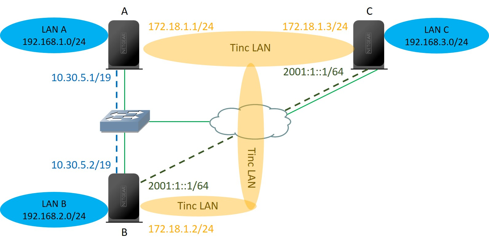

# OpenWRT Tinc配置

### 1. 背景介绍

在寝室部署了一个Netgear WNDR4300，固件版本为OpenWRT *Chaos Calmer 15.05.1*。同时在实验室也部署了两个Netgear WNDR4300，固件版本也为OpenWRT *Chaos Calmer 15.05.1*。现在设寝室的路由器为C，实验室的路由器分别为A、B，每个路由器的大概设置如下表所示(IP均为虚构！)：

| 设备 | 位置   | WAN IPv4     | WAN IPv6     | LAN IPv4       | LAN IPv6    |
| :--- | :----- | :----------- | :----------- | :------------- | :---------- |
| A    | 实验室 | 10.30.5.1/19 | 2001:1::1/64 | 192.168.1.0/24 | 2001:1::/64 |
| B    | 实验室 | 10.30.5.2/19 |              | 192.168.2.0/24 | 2001:1::/64 |
| C    | 寝室   | 2.3.4.56/24  | 2001:2::1/64 | 192.168.3.0/24 | 2001:2::/64 |

需求分析：

- **设备[ A | B ] -> IPv4 LAN**之间进行通信，虽然**设备[ A | B ] -> IPv4 WAN**在同一个局域网，但是设备**设备[ A | B ] -> IPv4 LAN**之间无法直接进行通信
- **设备[ A | B ] -> IPv4 LAN**与**设备[ C ] -> IPv4 LAN**进行通信，因为中间隔离了无数的网络，所以也不能直接进行通信
- 设备**[ A | B | C ] -> IPv6 LAN** 之间可以相互通信的，但是需要在ip6tables上进行访问控制，例如文件共享samba等服务，还是不建议直接暴露在IPv6网络中
- 因此需要[Tinc](https://www.tinc-vpn.org/) VPN来解决上述问题，建立site-to-site VPN，将**设备[ A | B | C ] -> IPv4 LAN**进行互联。

最终实现的结果如图1-1所示：

- 绿色线代表物理链路
- 蓝色虚线代表将**设备A、B**之间的IPv4 Tinc虚拟链路
- 墨绿色虚线代表**设备B、C**之间的IPv6 Tinc虚拟链路
- 橙色区域代表Tinc建立的虚拟局域网，**LAN A、LAN B、LAN C**之间可以通过该虚拟局域网进行路由。



**图1-1 拓扑**


------

### 2. 配置步骤

#### 软件包安装

在**设备[ A | B | C ]**上均安装tinc

```
opkg update
opkg install tinc
```

#### 配置文件修改-1

在OpenWRT下，tinc配置文件适配了[UCI](https://wiki.openwrt.org/doc/uci) 系统，配置文件为`/etc/config/tinc`，通用配置文件如下

```
config tinc-net NETNAME
        option enabled 1
        
        ## Daemon Configuration (cmd arguments)
        option generate_keys 1
        option key_size 2048
        option logfile /tmp/log/tinc.tinc.log
        option debug 3

        ## Server Configuration (tinc.conf)
        option AddressFamily any

        list ConnectTo NODENAME_2
        option GraphDumpFile /tmp/log/tinc.tinc.dot
        option Interface tun0
        option Name NODENAME
        option PrivateKeyFile /etc/tinc/NETNAME/rsa_key.priv

config tinc-host NODENAME
        option enabled 1
        option net NETNAME
        option Port 6565
        option Subnet 192.168.X.0/24
```

- 在**设备[ A | B | C ]**上，**NETNAME**需要相同的，现在设**NETNAME**为`tinc`

- 在**设备[ A | B | C ]**上，**NODENAME**是不同的，**设备A**、**设备B**、**设备C**的**NODENAME**分为`nodeA`、`nodeB`、`nodeC`

- 在**设备[ A | B | C ]**上，`option Subnet 192.168.X.0/24`字段是不同的，**设备[ A | B | C ]**的`option Subnet 192.168.X.0/24`字段

  应该分别为`option Subnet 192.168.[ 1 | 2 | 3 ].0/24`

- **设备[ A | B | C ]**均使用虚拟机网卡`tun0`进行通信

- Tinc缺省使用`655`端口，这里**设备[ A | B | C ]**均使用端口`6565`

- 其他设置可以具体参考官方配置

#### 配置文件结构

非OpenWRT系统下，Tinc**完整的配置文件目录结构**如下所示

- /etc/tinc/NETNAME/
  - rsa_key.priv
  - tinc-up
  - tinc-down
  - tinc.conf
  - hosts/
    - NODENAME1
    - NODENAME2
    - NODENAME3

在OpenWRT系统下，没有`tinc.conf`文件，该文件被映射为`/etc/config/tinc`，所以其**完整的配置文件目录结构**如下

- /etc/config/tinc
- /etc/tinc/NETNAME/
  - rsa_key.priv
  - tinc-up
  - tinc-down
  - hosts/
    - NODENAME1
    - NODENAME2
    - NODENAME3

在**设备[ A | B | C ]**上，均需要使用命令`/etc/init.d/tinc start`首次服务，来生成配置文件，生成配置文件目录如下，网络名称为`tinc`； `rsa_key.priv为`节点的RSA私钥文件；`nodeA`或`nodeB`或`nodeC`为节点的公钥文件；`tinc-up`、`tinc-down`启动脚本需要手动添加，并且需要添加执行权限；`hosts`目录下的其他节点公钥文件，也需要手动拷贝过来。

- /etc/tinc/tinc/
  - rsa_key.priv
  - hosts/
    - node[A|B|C]

#### 虚拟网卡添加

需要在**设备[ A | B | C ]**均添加一个虚拟网卡，用来进行虚拟通信，在`/etc/config/network`中添加

```
config interface 'tinc'
	option ifname 'tun0'
	option defaultroute '0'
	option peerdns '0'
	option proto 'none'
```

#### 配置文件修改-2

```
tinc-up`、`tinc-down`脚本需要添加执行权限，脚本中以`ip`开头的命令使用需要安装`ip-full`，若没有安装使用命令`opkg install ip-full
```

`tinc-up`脚本添加

- `$INTERFACE`为代表上文虚拟网卡的变量
- `$ip`为分配给虚拟机网卡的IP地址，**设备[ A | B | C ]**虚拟机网卡使用的IP地址段为`172.18.1.0/24`，如图1-1中橙色部分所示
- `ip route add 192.168.X.0/24 dev $INTERFACE`为添加到其他节点路由条目的命令

```
#!/bin/sh
ip='172.18.1.X'
ip link set $INTERFACE up
ip addr add $ip/24 dev $INTERFACE
ip route add 192.168.X.0/24 dev $INTERFACE
ip route add 192.168.X.0/24 dev $INTERFACE
```

`tinc-down`脚本添加，关闭虚拟网卡，添加的IP地址以及路由条目会自动消失

```
#!/bin/sh
ip link set $INTERFACE down
```

公钥文件`hosts/node[A|B|C]`修改，下文以**设备A**为例，`Address`为连接所用的IP地址，`Subnet`字段为宣告的可路由地址，关于虚拟网卡IP的路由，路由精度宣告为32，虽然其掩码为24，但是只有一个该网段的地址，所以为`Subnet = 172.18.1.1/32`。还要添加需要宣告的其他IP地址范围。

```
Address = 2001:1::1/64
Subnet = 172.18.1.1/32
Subnet = 192.168.1.0/24
Port = 6565
-----BEGIN RSA PUBLIC KEY-----
………………
-----END RSA PUBLIC KEY-----
```

#### 配置文件交换

- **设备[ A | B ]**之间使用IPv4建立连接，**设备[ A | B ]**的`/etc/tinc/tinc/hosts`目录下需要有彼此的公钥文件，因为使用**IPv4**连接，所以公钥文件中`Address`字段为**IPv4地址**！
- **设备[ B | C ]**之间使用IPv6建立连接，**设备[ B | C ]**的`/etc/tinc/tinc/hosts`目录下需要有彼此的公钥文件，因为使用**IPv6**连接，所以公钥文件中`Address`字段为**IPv6地址**！
- **设备[ A | C ]**没有直接的WAN连接，因此不需要交换公钥文件。
- 在**设备[ A | B | C ]**上，非本设备的公钥文件中`Subnet`、`Port`等字段不要添加或者修改

只有交换过公钥文件的节点的局域网直接可以相互通信，例如**设备B-> IPv4 LAN**可以访问**设备[ A | C ] -> IPv4 LAN**。但是**设备[ A | C ] -> IPv4 LAN**之间不可相互访问，即使添加了路由。

#### 防火墙设置

**在设备[ A | B | C ]**的网页管理端进行如下操作

- 在`Network > Interfaces > NETNAME > Firewall Settings`设置中 ，创建新的防火墙区域`tinc`
- 在 `Network > Firewall > General Settings > Zones`设置中，编辑防火墙区域`tinc`，使其能和区域`lan`进行相互转发
- 在`Network > Firewall > Traffic Rules`设置中，打开TCP、UDP的6565端口，如果为了保证安全性，可以限制源和目的IP地址

#### 服务启动

在**设备[ A | B | C ]**分别执行命令重启tinc服务，服务启动后，服务最终读取的配置文件为`/var/tinc`，该目录根据`/etc/config/tinc`与`/etc/tinc/`生成的

```
/etc/init.d/tinc restart
```

如果**设备[ A | B | C ]**能分别ping通彼此的**IPv4 LAN**，则搭建成功

#### 排错

如果连接失败，请查看错误信息日志`/tmp/log/tinc.tinc.log`

------

### 3. 配置文件样例

下面只列出在**设备[ A | B | C ]**有不同的配置文件，下文`/etc/config/tinc`也删除了大部分相同的内容，完整配置参考[官方文档](https://www.tinc-vpn.org/documentation/tinc.conf.5)

#### 设备A

##### /etc/config/tinc

```
config tinc-net tinc
        list ConnectTo nodeB
        option Name nodeA
         option Interface tun0
        option PrivateKeyFile /etc/tinc/tinc/rsa_key.priv

config tinc-host nodeA
        option enabled 1
        option net tinc
        option Port 6565
        option Subnet 192.168.1.0/24
```

##### tinc-up

```
#!/bin/sh
ip='172.18.1.1'
ip link set $INTERFACE up
ip addr add $ip/24 dev $INTERFACE
ip route add 192.168.2.0/24 dev $INTERFACE
ip route add 192.168.100.0/24 dev $INTERFACE
```

##### /etc/tinc/tinc/hosts/nodeA

```
Address = 10.30.5.1
Subnet = 172.18.1.1/32
Subnet = 192.168.1.0/24
Port = 6565
-----BEGIN RSA PUBLIC KEY-----
………………
-----END RSA PUBLIC KEY-----
```

##### /etc/tinc/tinc/hosts/nodeB

```
Address = 10.30.5.2
Subnet = 172.18.1.2/32
Subnet = 192.168.2.0/24
Port = 6565
-----BEGIN RSA PUBLIC KEY-----
………………
-----END RSA PUBLIC KEY-----
```

#### 设备B

##### /etc/config/tinc

```
config tinc-net tinc
        list ConnectTo nodeA
        list ConnectTo nodeC
        option Name nodeB
        option Interface tun0
        option PrivateKeyFile /etc/tinc/tinc/rsa_key.priv

config tinc-host nodeB
        option enabled 1
        option net tinc
        option Port 6565
        option Subnet 192.168.2.0/24
```

##### tinc-up

```
#!/bin/sh
ip='172.18.1.2'
ip link set $INTERFACE up
ip addr add $ip/24 dev $INTERFACE
ip route add 192.168.1.0/24 dev $INTERFACE
ip route add 192.168.100.0/24 dev $INTERFACE
```

##### /etc/tinc/tinc/hosts/nodeA

```
Address = 10.30.5.1
Subnet = 172.18.1.1/32
Subnet = 192.168.1.0/24
Port = 6565
-----BEGIN RSA PUBLIC KEY-----
………………
-----END RSA PUBLIC KEY-----
```

##### /etc/tinc/tinc/hosts/nodeB

```
Address = 10.30.5.2
Address = 2001:1::1
Subnet = 172.18.1.2/32
Subnet = 192.168.2.0/24
Port = 6565
-----BEGIN RSA PUBLIC KEY-----
………………
-----END RSA PUBLIC KEY-----
```

##### /etc/tinc/tinc/hosts/nodeC

```
Address = 2001:2::1
Subnet = 172.18.1.3/32
Subnet = 192.168.3.0/24
Port = 6565
-----BEGIN RSA PUBLIC KEY-----
………………
-----END RSA PUBLIC KEY-----
```

#### 设备C

##### /etc/config/tinc

```
config tinc-net tinc
        list ConnectTo nodeB
        option Name nodeC
        option Interface tun0
        option PrivateKeyFile /etc/tinc/tinc/rsa_key.priv

config tinc-host nodeC
        option enabled 1
        option net tinc
        option Port 6565
        option Subnet 192.168.100.0/24
```

##### tinc-up

```
#!/bin/sh
ip='172.16.1.3'
ip link set $INTERFACE up
ip addr add $ip/24 dev $INTERFACE
ip route add 192.168.1.0/24 dev $INTERFACE
ip route add 192.168.2.0/24 dev $INTERFACE
```

##### /etc/tinc/tinc/hosts/nodeB

```
Address = 2001:1::1
Subnet = 172.18.1.2/32
Subnet = 192.168.2.0/24
Port = 6565
-----BEGIN RSA PUBLIC KEY-----
………………
-----END RSA PUBLIC KEY-----
```

##### /etc/tinc/tinc/hosts/nodeC

```
Address = 2001:2::1
Subnet = 172.18.1.3/32
Subnet = 192.168.3.0/24
Port = 6565
-----BEGIN RSA PUBLIC KEY-----
………………
-----END RSA PUBLIC KEY-----
```

------

### 4. 总结

在`/etc/tinc/NETNAME/hosts`目录下，以本节点的公钥文件中宣告的内容为准。

例如：节点nodeA、nodeB之间建立tinc链路，nodeA的IP地址为`10.1.1.1/24`，nodeB的IP地址为`10.1.1.2/24`

- 在节点nodeA，nodeA的公钥文件内容如下

  ```
  Address =10.1.1.1
  Subnet = 192.168.1.0/24
  Port = 6565
  -----BEGIN RSA PUBLIC KEY-----
  ………………
  -----END RSA PUBLIC KEY-----
  ```

  nodeB的公钥内容如下

  ```
  Address =10.1.1.2
  Subnet = 192.168.2.0/24
  Port = 6565
  -----BEGIN RSA PUBLIC KEY-----
  ………………
  -----END RSA PUBLIC KEY-----
  ```

- 在节点nodeB，nodeB的公钥文件内容如下

  ```
  Address =10.1.1.2
  Subnet = 192.168.2.0/24
  Port = 6565
  -----BEGIN RSA PUBLIC KEY-----
  ………………
  -----END RSA PUBLIC KEY-----
  ```

  nodeA的公钥内容本应该与在nodeA的公钥相同的，但是如果添加了其他条目。如下所示，添加了`Subnet = 192.168.3.0/24`，即使添加了该路由条目，在nodeB也无法与该地址段进行通信，因为nodeA不认为这是它宣告的地址范围。

  ```
  Address =10.1.1.1
  Subnet = 192.168.1.0/24
  Subnet = 192.168.3.0/24
  Port = 6565
  -----BEGIN RSA PUBLIC KEY-----
  ………………
  -----END RSA PUBLIC KEY-----
  ```

------

### 5. 参考

- https://wiki.openwrt.org/doc/howto/vpn.tinc
- [http://zhiwei.li/text/2015/06/17/tinc-vpn%E9%85%8D%E7%BD%AE%E5%8F%98%E9%87%8F/](http://zhiwei.li/text/2015/06/17/tinc-vpn配置变量/)
- http://ostolc.org/site-to-site-vpn-with-tinc.html
- https://github.com/qmcclab/blog/blob/master/2013-09-20-a-mesh-network.md
- http://www.rendoumi.com/ling-wai-yi-chong-vpnfang-shi-tinc/
- http://www.rendoumi.com/ling-wai-yi-chong-vpnfang-shi-tinc/