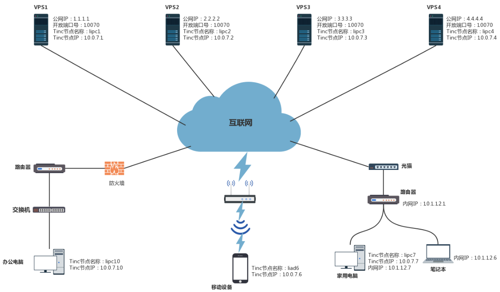
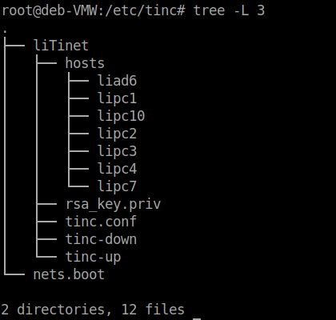
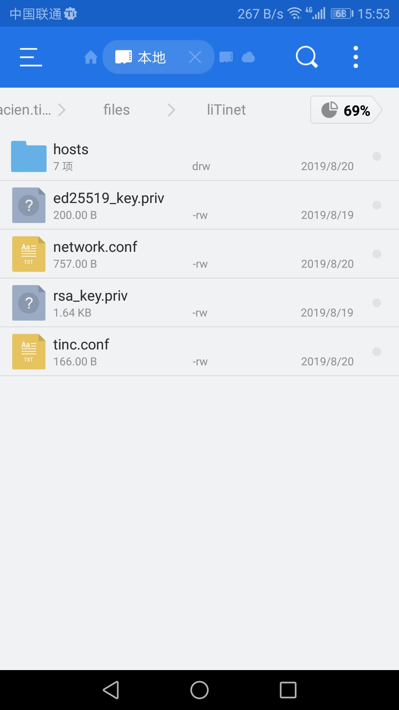
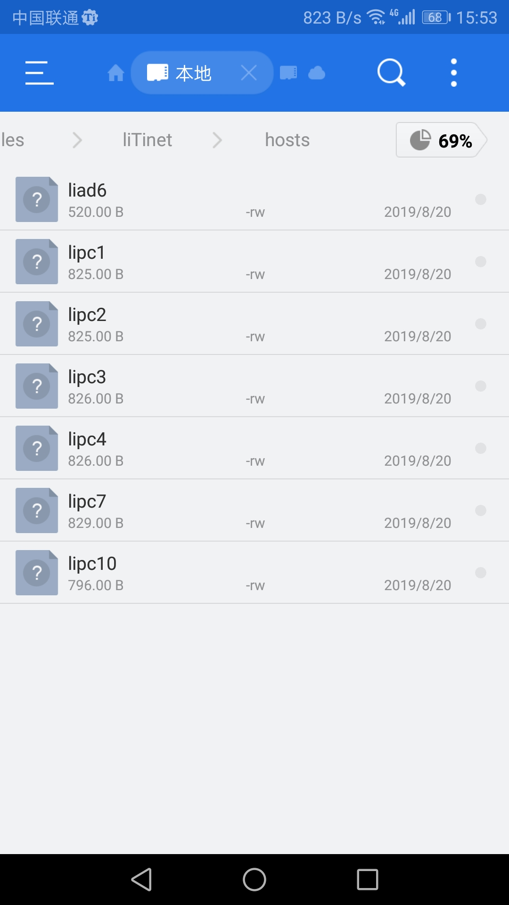
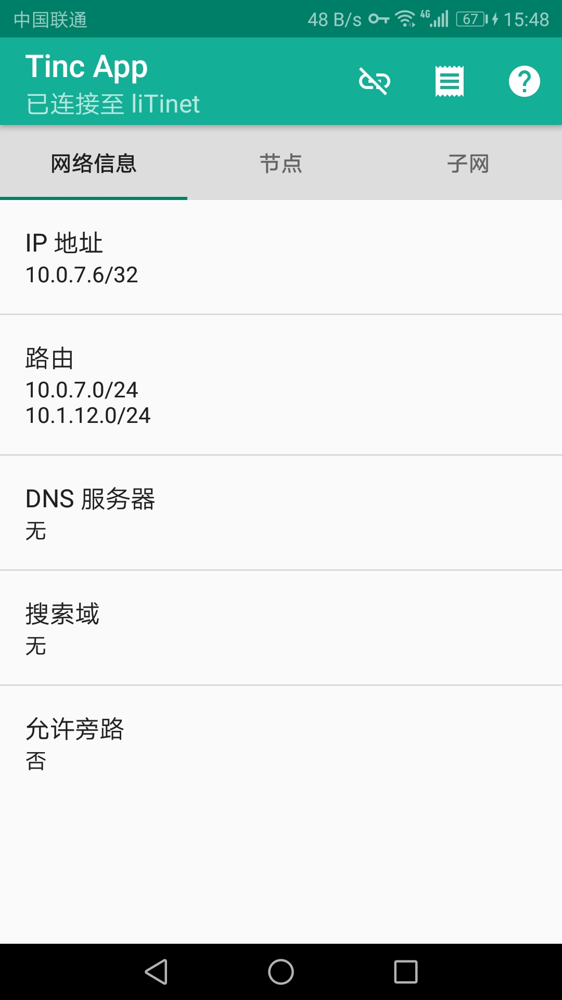
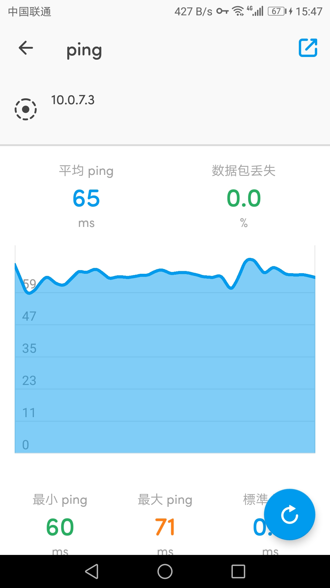
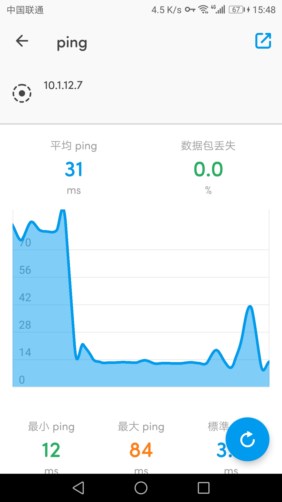
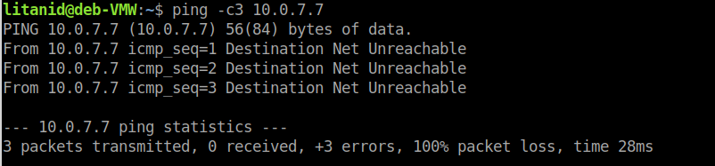
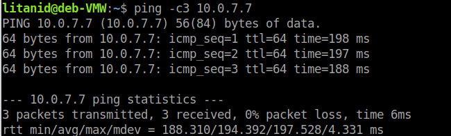
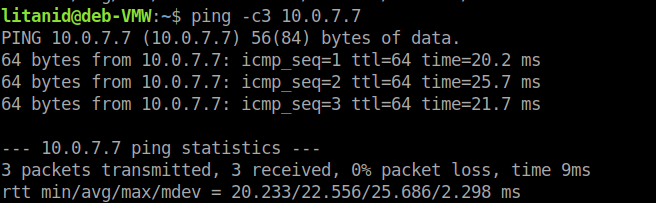

# Tinc VPN 大局域网实现备忘录

随着公网 IPv4 地址的匮乏，如今各处上网大部分都处于宽带商大内网当中，互连和便捷成了最大问题。为了实现单位、家里、手机等设备的无缝连接，较长时间以来，我一直在苦苦追寻和试用相关 VPN ，譬如 ZeroTier 、n2n 、Tinc 等。我的要求很简单，就是单位电脑和家里电脑可以互连和访问，手机可以随时随地连接单位和家里电脑，众多设备之间最好可以 Peer-to-Peer 。ZeroTier 需要第三方节点支持，不受控，n2n 虽说可以 P2P ，但是v1、v2版本又不兼容，实际使用没那么顺畅。Tinc 可以 P2P ，虽然配置繁琐一点，但没那么复杂，又多平台支持，经过一段时间试用，基本满足日常需求，实现私人大内网。下面记录相关实现过程。

## 一、Tinc 介绍

详细介绍和说明请参阅官网：（https://www.tinc-vpn.org/），此处粘贴相关介绍如下：

Tinc VPN 是一个网状结构的虚拟局域网软件，基于P2P的技术，可以实现流量直接到达目标机器，而不像传统 VPN 那样必须经过中间的服务端。适合连接的两个机器速度快于到服务器的速度的情况。

有如下优点：

1.加密，身份验证和压缩 可选择使用zlib或LZO压缩所有流量，并使用LibreSSL或OpenSSL对流量进行加密，并使用消息验证代码和序列号保护流量不被更改。

2.自动全网状路由 无论您如何设置 [tinc](https://www.yiwan.pro/index.php/ltd_documents/tag/tinc) 守护进程以相互连接，VPN流量始终（如果可能）直接发送到目标，而不通过中间跃点。

3.NAT遍历 只要VPN中的一个节点允许公共IP地址上的传入连接（即使它是动态IP地址），tinc就能够进行NAT遍历，允许对等体之间的直接通信。

4.轻松扩展您的VPN 当您想要向VPN添加节点时，您只需添加一个额外的配置文件，无需启动新的守护进程或创建和配置新设备或网络接口。

5.能够桥接以太网段 您可以将多个以太网段链接在一起以像单个段一样工作，从而允许您运行通常仅通过Internet在LAN上运行的应用程序和游戏。

6.多操作系统运行（支持平台：https://www.tinc-vpn.org/platforms/）并支持IPv6。

## 二、安装

PC端各系统版本在（https://www.tinc-vpn.org/download/）下载安装， Android 平台在（https://tincapp.pacien.org/）下载安装， iOS 平台在（https://www.tinc-vpn.org/packages/cydia/）下载安装。

以下我的系统环境 Debian 示例，其他平台请详细阅读官方说明文档。

Debian 系统下，可在终端直接输入命令 `aptitude install tinc` 安装。

## 三、规划

Tinc 有三种工作模式：路由器Route、交换机Switch及集线器Hub。默认模式是路由器模式。没什么特殊要求的话就直接采用默认模式。

确定 Tinc 专项局域网网络名称：liTinet，根据自己喜好改。

确定 Tinc 专项局域网网络网段：10.0.7.0/24

确定好各节点名称和IP。

我的网络拓扑及各节点配置具体如下：

网络拓扑及各节点配置

## 四、详细配置

所有节点（不包含移动设备如Android手机）在安装好 tinc 后，均需手动或自动在系统 /etc/tinc/ 文件夹下建立和产生如下目录和文件：

[](https://pich.yiwan.pro/YiWan/201908/ScreenshotPicPick20190822190400001.png)

每个节点的hosts文件夹内容相同，不同的是外面的文件，nets.boot 文件可以不用改动。

以下仅以节点lipc1、lipc7、lipc10为例说明具体文件的内容：

### （一）节点lipc1

#### 1.设置 tinc.conf 文件

```yaml
Name = lipc1 #对应节点主机名字，随便取， Name 是本节点的名字
AddressFamily = ipv4 #表示监听哪种协议的端口（默认都监听） #AddressFamily = <ipv4|ipv6|any> (any)
BindToAddress = * 10070 #10070为监听端口，与hosts目录下相应文件一致，默认监听端口是655
Interface = tun0 # 创建的设备名（类似虚拟网卡）
Device = /dev/net/tun
#Mode = <router|switch|hub> (router) # 用来指定工作方式（默认是路由器）
ConnectTo = lipc2 #主动连接到哪个节点
ConnectTo = lipc3
ConnectTo = lipc4
```

#### 2.编辑 hosts/lipc1 文件

```yaml
Address = 1.1.1.1 10070    #公网IP地址，如果没有公网IP或不知道，则不设置，格式为 Address = <IP address|hostname> [<port>] [recommended]
Subnet = 10.0.7.1/32  #节点所在内网网段，如没有内网网段则设置为单独地址。
```

#### 3.执行命令:

```yaml
tincd -n liTinet -K4096       #liTinet为设置的Tinc网络名称
```

为lipc1 生成 RSA 公钥和私钥，这将在 /etc/tinc/liTinet 下创建私钥文件 rsa_key.priv ，并自动追加公钥到上一步创建的 hosts/lipc1 文件，打开 hosts/lipc1 文件，末尾已经添加了公钥。

#### 4.编辑 tinc-up 文件

```yaml
#!/bin/sh
ip link set $INTERFACE up  #启动接口，$INTERFACE = tun0，由 tinc.conf 传入
ip addr add 10.0.7.1/24 dev $INTERFACE  $INTERFACE # 设定tinc网卡地址为 10.0.7.1
ip route add 10.0.7.0/24 dev $INTERFACE  # 添加路由项，当其地址是网段时则添加。
ip route add 10.1.12.0/24 dev $INTERFACE
```

#### 5.编辑 tinc-down 文件

```yaml
#!/bin/sh
ip route del 10.1.12.0/24 dev $INTERFACE
ip route del 10.0.7.0/24 dev $INTERFACE
ip addr del 10.0.7.1 dev $INTERFACE
ip link set $INTERFACE down
```

为 tinc-up 文件的逆向命令。

#### 6.更改 tinc-up、tinc-down 文件权限

```bash
chmod 755 /etc/tinc/liTinet/tinc-*
```

### （二）节点lipc7

步骤整体同上，细节不同，因为 lipc7 没有公网，且在内网当中。

#### 1.tinc.conf 文件

```yaml
Name = lipc7
AddressFamily = ipv4
Interface = tun0
Device = /dev/net/tun
ConnectTo = lipc1
ConnectTo = lipc2
ConnectTo = lipc3
ConnectTo = lipc4
```

#### 2.hosts/lipc7 文件

```yaml
Subnet = 10.0.7.7/32
Subnet = 10.1.12.0/24  #节点同时处于 10.1.12.0/24 网段当中
```

#### 3.tinc-up 文件

```yaml
#!/bin/sh
ip link set $INTERFACE up
ip addr add 10.0.7.7 dev $INTERFACE
ip route add 10.0.7.0/24 dev $INTERFACE    #注意与节点lipc1的不同
```

#### 4.tinc-down 文件

```yaml
#!/bin/sh
ip route del 10.0.7.0/24 dev $INTERFACE
ip addr del 10.0.7.7 dev $INTERFACE
ip link set $INTERFACE down  
```

### （三）节点lipc10

步骤整体同上，lipc10 没有公网，也处于内网当中，但此处不暴露关联所在内网。

#### 1.tinc.conf 文件

```yaml
Name = lipc10
AddressFamily = ipv4
Interface = tun0
Device = /dev/net/tun
ConnectTo = lipc1
ConnectTo = lipc2
ConnectTo = lipc3
ConnectTo = lipc4
```

#### 2.hosts/lipc10文件

```yaml
Subnet = 10.0.7.10/32
```

#### 3.tinc-up 文件

```yaml
#!/bin/sh
ip link set $INTERFACE up
ip addr add 10.0.7.10 dev $INTERFACE
ip route add 10.0.7.0/24 dev $INTERFACE
ip route add 10.1.12.0/24 dev $INTERFACE
```

#### 4.tinc-down 文件

```yaml
#!/bin/sh
ip route del 10.1.12.0/24 dev $INTERFACE
ip route del 10.0.7.0/24 dev $INTERFACE
ip addr del 10.0.7.10 dev $INTERFACE
ip link set $INTERFACE down
```

## 五、启动和关闭

各节点一样。

```bash
tincd -n liTinet -D --debug=3 # 以排错方式启动
tincd -n liTinet -k # 关闭
```

各节点在以排错方式启动后，如无错误，均能 ping 通对方，则表示配置成功，可以设置成为引导时启动。

设置为引导时启动：

```bash
systemctl enable tinc@liTinet.service
```

至此，Tinc 大局域网搭建完成。

## 六、Android 节点配置

Android 节点端配置些许不同，具体见 App 使用说明。

1.下载安装 Tinc App 后，启动：

[](https://pich.yiwan.pro/YiWan/201908/Screenshot20190822200746.jpg)

选择“生成节点配置和密钥”，设置网络名同上为 liTinet ，节点名为 liad6 ，密码为空或随意。

2.修改配置目录下 network.conf 文件

增加修改如下两处即可，其他内容根据实际需要修改：

```yaml
Address = 10.0.7.6/32
Route = 10.0.7.0/24
Route = 10.1.12.0/24
```

3.修改配置目录下 tinc.conf 文件

```yaml
Name = liad6
Mode = router
AddressFamily = ipv4
LocalDiscovery = yes
ConnectTo = lipc1
ConnectTo = lipc2
ConnectTo = lipc3
ConnectTo = lipc4
```

4.在配置目录下 hosts/liad6 文件末尾添加

```yaml
Subnet = 10.0.7.6/32
```

其他默认。

将 liad6 文件拷贝至其他节点 hosts 目录下，其他节点相应的文件也要拷贝到 Android 手机配置目录 hosts 目录下。

[](https://pich.yiwan.pro/YiWan/201908/Screenshot20190820155315.jpg)

[](https://pich.yiwan.pro/YiWan/201908/Screenshot20190820155323.jpg)

所有节点重启服务，则可互相访问。

[](https://pich.yiwan.pro/YiWan/201908/Screenshot20190820154819.jpg)

[](https://pich.yiwan.pro/YiWan/201908/Screenshot20190820154745.jpg)

[](https://pich.yiwan.pro/YiWan/201908/Screenshot20190820154859.jpg)

## 七、相关使用经验

1.如上配置后，除 lipc7 外其他节点八九成是不能直接访问和 ping 通 10.1.12.1 和 10.1.12.6 两台内网主机的，此时可以尝试在路由器 10.1.12.1 上设置经 10.1.12.7 到 10.0.7.0/24 网段的静态路由。

2.如出现以下错误：

[](https://pich.yiwan.pro/YiWan/201908/ScreenshotPicPick20190822195639001.png)

则可能相应节点宕机了，尝试重启服务。

3.原本处于同一物理网络的节点，直接 ping 时延较低，但 ping tinc节点IP时时延较长，此时Tinc网络正在协商路由，过一段时间后再尝试发现时延与直接 ping 相差无几，证明 Tinc 是支持 P2P 的。

[](https://pich.yiwan.pro/YiWan/201908/ScreenshotPicPick20190823083912001.png)

一分钟不到的 ping 值：

[](https://pich.yiwan.pro/YiWan/201908/ScreenshotPicPick20190823084056001.png)