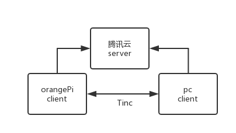
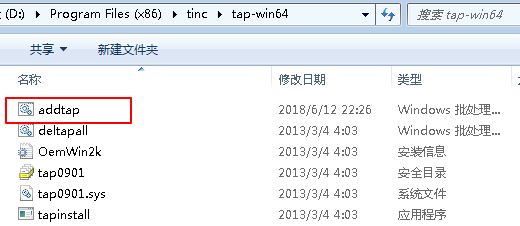
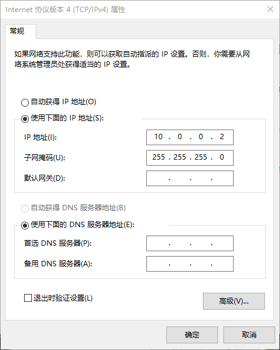
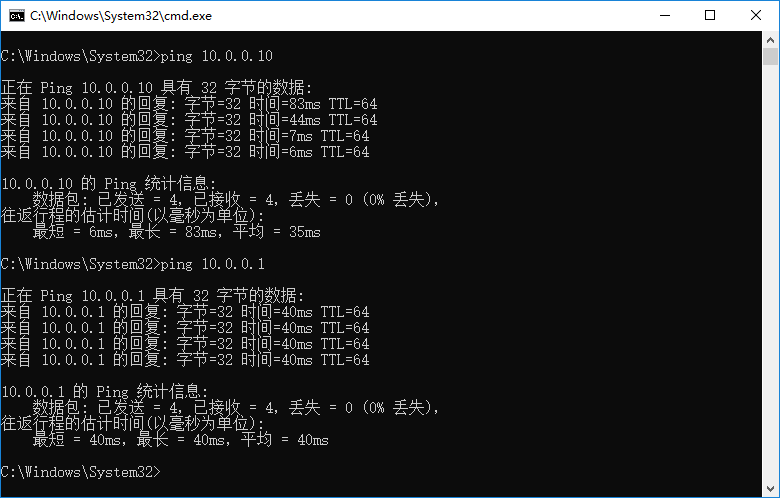

# **Tinc VPN 折腾日记**

https://wuzk.tk/2018/09/13/2018/20180913/

自从开始折腾VPS之后就忍不住各种买买买，截至当前手上一台腾讯云、一台搬瓦工、家里一台orangePi。orangePi接了一块500G的硬盘，想实现私有云，但是一上来就给难住了，家里的网没有公网IP。于是想到了搭建VPN的不过有些坑的是腾讯云的带宽也就1M的小水管，肯定不行，搬瓦工的机器位于美国速度还不错但是流量有限制，也被pass了。后来发现[Tinc VPN](https://www.tinc-vpn.org/)可以完美解决这些问题，于是写篇日志记录下。


## Tinc的优点

Tinc的优点是极其突出的，这里我就厚颜的使用官网的机翻来表示下。

- 加密，身份验证和压缩
  可选择使用zlib或LZO压缩所有流量，并使用LibreSSL或OpenSSL对流量进行加密，并使用消息验证代码和序列号保护流量不被更改。
- 自动全网状路由
  无论您如何设置tinc守护进程以相互连接，VPN流量始终（如果可能）直接发送到目标，而不通过中间跃点。
- NAT遍历
  只要VPN中的一个节点允许公共IP地址上的传入连接（即使它是动态IP地址），tinc就能够进行NAT遍历，允许对等体之间的直接通信。
- 轻松扩展您的VPN
  当您想要向VPN添加节点时，您只需添加一个额外的配置文件，无需启动新的守护进程或创建和配置新设备或网络接口。
- 能够桥接以太网段
  您可以将多个以太网段链接在一起以像单个段一样工作，从而允许您运行通常仅通过Internet在LAN上运行的应用程序和游戏。
- 多操作系统运行并支持IPv6

Tinc可以解决带宽不足或是中心服务器位置偏远等问题，因为一旦组成VPN后节点间的通信尽可能的不通过中心服务器，而是点对点通信。这一切的实现只需要一个具有公网IP（即使是动态IP）的中心服务器即可。这是多么让人激动的特性，下面来具体介绍一下搭建的过程，具体的配置请参考[官方文档](https://www.tinc-vpn.org/documentation/)，本文仅做最简配置。

## 服务端tencent

在本文需要配置三个节点：tencent、orangePi和pc，它们共同组成一个名为cloud的网络。具备公网IP的tencent当中心节点，orangePi和本人的pc连接tencent。之后pc与orangePi点对点通信。




我服务端使用的是Debian，直接apt install tinc完成安装，其他系统的安装可以参考[下载页面](https://www.tinc-vpn.org/download/)。这里我tinc版本是1.0.34的，另外需要注意的是配置过程需要用到sudo权限或直接使用root用户。

```
## 进入配置目录
cd /etc/tinc/
## 网络目录名可任意，但其他节点须与服务端节点相同
sudo mkdir cloud
cd cloud/
## 目录名固定，这里存放各个节点的配置文件
sudo mkdir hosts
## 开始配置cloud
sudo vim tinc.conf
## 极简配置如下，其他配置默认
Name = tencent
Interface = vpn
## 配置tencent节点，对应tinc.conf中的Name
sudo vim hosts/tencent
## 填写公网IP和vpn节点IP，这里我使用10.0.0.1
Address = 你的公网IP
Subnet = 10.0.0.1/32
## 生成密钥，-n 网络名
sudo tincd -n cloud -K
## 编写拨号脚本，注意与Subnet中的IP相同
sudo vim tinc-up
#!/bin/bash
ifconfig $INTERFACE 10.0.0.1 netmask 255.255.255.0
## 编写断线脚本
sudo vim tinc-down
#!/bin/bash
ifconfig $INTERFACE down
## 赋予脚本执行权限
sudo chmod +x tinc-*
```

以上就是服务端的全部配置但是，tinc.conf的具体配置参数可查阅[官网Main-configuration](https://www.tinc-vpn.org/documentation/Main-configuration-variables.html#Main-configuration-variables)。tencent主机配置参数可查阅[官网Host-configuration](https://www.tinc-vpn.org/documentation/Host-configuration-variables.html#Host-configuration-variables)

## Linux客户端orangePi

家中的orangePi使用的是Ubuntu的系统所以安装tinc也较为简单，使用apt install tinc即可。其配置与服务端的配置步骤相同。同样是确保用户具备sudo权限或是直接使用root。

```
## 进入配置目录
cd /etc/tinc/
## 网络须与服务端节点相同
sudo mkdir cloud
cd cloud/
## 目录名固定，这里存放orangePi节点和服务端节点的主机文件
sudo mkdir hosts
## 开始配置cloud
sudo vim tinc.conf
## 极简配置如下，其他配置默认
## ConnectTo = 服务端节点名，本例为tencent
Name = orangePi
Interface = vpn
ConnectTo = tencent
## 配置orangePi节点，对应tinc.conf中的Name
sudo vim hosts/orangePi
## 填写orangePi节点vpn的IP，需唯一
Subnet = 10.0.0.10/32
## 生成密钥，-n 网络名
sudo tincd -n cloud -K
## 编写拨号脚本，注意与Subnet的IP相同
sudo vim tinc-up
#!/bin/bash
ifconfig $INTERFACE 10.0.0.10 netmask 255.255.255.0
## 编写断线脚本
sudo vim tinc-down
#!/bin/bash
ifconfig $INTERFACE down
## 赋予脚本执行权限
sudo chmod +x tinc-*
```

客户端与服务端的配置大同小异，只需添加ConnectTo = 服务端节点名，以及注意拨号脚本的IP即可。另外还要交换hosts节点的文件，将服务端的hosts里的tencent文件复制到客户端hosts里，将客户端hosts里的orangePi复制到服务端hosts里，让服务端和客户端都可以相互的连接对方。

## Windows客户端pc

网上大多教程均没提及关于Windows客户端如何配置，其实有一个[官网示例](https://www.tinc-vpn.org/examples/windows-install/)可供参考，这里我就提一下。首先[下载](https://www.tinc-vpn.org/download/)Windows版的tinc。在安装过程三项可选，直接全选。然后指定安装目录。之后进入安装目录，这里的步骤就开始和以上类似起来。

- 新建网络目录，本例为cloud

- 进入cloud目录后，创建hosts目录

- 在cloud目录下新建文件tinc.conf，输入如下内容

  ```
  Name = pc
  Interface = vpn
  ConnectTo = tencent
  ```

- 在hosts目录下新建文件pc，输入如下内容，将节点IP配置为10.0.0.2，

  ```
  Subnet = 10.0.0.2/32
  ```

- 在安装目录下以管理员身份启动cmd，输入tincd -n cloud -K，生成密钥

- 待密钥生成完毕后，与orangePi一样获取并保存服务端tencent的hosts文件至pc文件处，将pc文件上传至服务端的tencent的hosts文件夹下。

- 在安装目录tap-win64下以管理员身份运行如图所示文件

- 接着去网络中心找到类似的TAP网络适配器

- 

- 修改其名称为tinc.conf中的Interface值，本例为vpn，接着右键属性设置ipv4的地址，此地址应与hosts中pc的Subnet值相同，本例为10.0.0.2如图所示

## 启动服务

Linux下启动tinc 需要使用命令tincd -n 网络名，故本例的启动为tincd -n cloud 若是想首先开机启动则需要使用systemctl enable tinc@网络名，本例为systemctl enable tinc@cloud。Windows下需要在安装目录下以管理员身份运行cmd输入tincd -n cloud，如果成功会生成一个tinc.cloud的服务，服务默认是开机自动启动的。下面来一张图片可以明显的看到，pc连服务端的速度明显慢于连orangePi，意味pc与orangePi是直连的。

## 写在最后

可以看到很多的配置都是重复的，为了简化配置我编写了一个shell脚本可以帮助快速配置。使用简单而且Windows和Linux皆可用，不懂Windows如何运行sh脚本的可以参考[这篇文章](https://jingyan.baidu.com/article/8cdccae947f83e315413cd05.html)。[点此下载shell文件](https://wuzk.tk/2018/09/13/2018/20180913/tinc.sh)至指定目录，Windows为安装目录，Linux为/etc/tinc，然后执行脚本按照提示输入对应的信息即可，注意Windows需要管理员权限，Linux需要支持sudo或以root身份。以本文为例做个简单的示范：

```
## 输入网络名
Enter the network name:cloud
## 输入网口名
Enter Interface Name:vpn
## 输入本地节点名
Enter local node name:pc
## 是否为客户端节点
Is client node?(y/n):y
## 输入服务端节点名（上步填n则无此项）
Enter server node name:tencent
## 输入公网IP（为y时此项必填，n可以直接回车）
Enter public IP address(can be empty):
## 输入本节点的IP
Enter local node ip:10.0.0.2
```

之后就会完成配置，注意这个脚本仅用于自动完成配置，不会启动服务，所以还需与服务端交换host文件和步骤5，Windows下仍要配置ip(部分条件下需要手动生成密钥)，希望各位用的愉快。