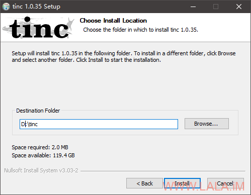

# TincVPN：组建虚拟局域网

TincVPN是一个P2PVPN，即两端可以直接通信，虚拟局域网内只需要一台机器（VPS）能够有外网访问的能力即可，一旦两端建立起连接，流量就不会再经过VPS。

其实TincVPN可以代替ZeroTier，虽然ZeroTier免费版也足够用，但用着ZeroTier的公共Moon/WEB面板，总感觉差了点意思。而TincVPN就是全部资源都归自己管，当然部署起来也就会麻烦许多。

在Debian10（VPS）上安装配置TincVPN（用作服务端）：

```
apt -y install tinc net-tools
```

开启IPv4转发：

```
echo "net.ipv4.ip_forward = 1" >> /etc/sysctl.conf && sysctl -p
```

创建一个名为imlala的虚拟网络（目录）：

```
mkdir -p /etc/tinc/imlala && mkdir -p /etc/tinc/imlala/hosts
```

新建tinc.conf配置文件：

```
nano /etc/tinc/imlala/tinc.conf
```

网络名就是imlala，网卡接口名vpn，使用switch模式，以及如下的加密方式：

```
Name=imlalaInterface=vpnMode=switchCipher=aes-256-cbcDigest=sha512
```

新建hosts文件，这个文件名必须和tinc.conf内的Name一致：

```
nano /etc/tinc/imlala/hosts/imlala
```

写入如下配置：

```
Address = 你的VPS公网IPSubnet = 10.0.0.1/32
```

完成之后生成密匙对：

```
tincd -n imlala -K4096
```

按两下回车全部保持默认配置，生成完成之后，对应的文件路径：

```
/etc/tinc/imlala/rsa_key.priv # 私钥/etc/tinc/imlala/hosts/imlala # 公钥
```

配置虚拟网卡tinc-up：

```
nano /etc/tinc/imlala/tinc-up
```

写入：

```
#!/bin/shifconfig $INTERFACE 10.0.0.1 netmask 255.255.255.0
```

配置虚拟网卡tinc-down：

```
nano /etc/tinc/imlala/tinc-down
```

写入：

```
#!/bin/shifconfig $INTERFACE down
```

给执行权限：

```
chmod +x /etc/tinc/imlala/tinc-*
```

启动：

```
systemctl start tinc@imlalasystemctl enable tinc@imlala
```

在第二台Debian10上（我这边还是VPS）上安装配置TincVPN（用作客户端）

安装和之前一模一样：

```
apt -y install tinc net-tools
```

同样和之前一样新建一个imlala的目录以及hosts目录：

```
mkdir -p /etc/tinc/imlala && mkdir -p /etc/tinc/imlala/hosts
```

新建tinc.conf配置文件：

```
nano /etc/tinc/imlala/tinc.conf
```

写入如下配置，其中需要注意的是ConnectTo的值需要指定为服务端的网络名称，如果你和我一样配置了加密，那么加密方式也需要和服务端对应：

```
Name=node_usInterface=vpnMode=switchConnectTo=imlalaCipher=aes-256-cbcDigest=sha512
```

新建hosts文件：

```
nano /etc/tinc/imlala/hosts/node_us
```

写入：

```
Subnet = 10.0.0.2/32
```

生成密匙对：

```
tincd -n imlala -K4096
```

配置虚拟网卡tinc-up：

```
nano /etc/tinc/imlala/tinc-up
```

写入：

```
#!/bin/shifconfig $INTERFACE 10.0.0.2 netmask 255.255.255.0
```

配置虚拟网卡tinc-down：

```
nano /etc/tinc/imlala/tinc-down
```

写入：

```
#!/bin/shifconfig $INTERFACE down
```

给执行权限：

```
chmod +x /etc/tinc/imlala/tinc-*
```

启动TincVPN：

```
systemctl start tinc@imlalasystemctl enable tinc@imlala
```

现在我们需要交换公钥，首先把服务端的公钥复制到客户端内：

```
scp /etc/tinc/imlala/hosts/imlala root@vpsip:/etc/tinc/imlala/hosts
```

再把客户端的公钥复制到服务端内：

```
scp /etc/tinc/imlala/hosts/node_us root@vpsip:/etc/tinc/imlala/hosts
```

这样两台Linux之间就实现了内网互通。

接下来最主要的是如何把TincVPN放到Windows上运行（当作客户端。）因为我的主力机都是Windows，所以这非常关键。其实配置起来大同小异，我主要是参考了官方的这个文档：

https://www.tinc-vpn.org/examples/windows-install/

首先下载安装包：

https://www.tinc-vpn.org/packages/windows/tinc-1.0.35-install.exe

安装的时候一定要勾选TAP-Win64：


默认安装在C盘，建议Win10换到别的盘符，避免后续配置的时候遇到一堆需要管理员权限的问题：



进到安装软件的根目录，打开tap-win64目录，用管理员权限运行addtap.bat：


安装驱动：


之后打开网络连接看看有没有新增加一个TAP设备：


回到软件根目录，新建一个网络（文件夹）我这边建立文件夹名称为imlala，然后在imlala这个文件夹内再新建一个hosts文件夹。

接着在imlala这个文件夹内新建一个tinc.conf，配置内容如下：

```
Name=node_familyInterface=vpnMode=switchConnectTo=imlalaCipher=aes-256-cbcDigest=sha512
```

在hosts文件夹内新建一个node_family文件（名字必须和tinc.conf内的Name一致）写入如下配置：

```
Subnet = 10.0.0.3/32
```

之后用管理员权限打开CMD或者PowerShell，进入到软件根目录，生成密匙对：

```
d:cd tinc./tincd -n imlala -K4096
```

最后和服务端（VPS）交换公钥，也就是把node_family公钥文件上传到VPS的/etc/tinc/imlala/hosts目录。

同理，服务端上的imlala公钥文件下载到本地的hosts文件夹下即可。

可能有点懵？目录结构，软件根目录结构：


在imlala文件夹下的结构：


hosts文件夹下就是服务端的公钥文件/客户端公钥文件：


还没完，还有非常关键的几个步骤，注意到我们之前在tinc.conf配置的虚拟网卡接口名是：

```
Interface=vpn
```

现在需要打开Windows的网络连接界面，把TAP-Win32 Adapter V9这个设备的名称改为vpn：


接着为这个设备配置IP，配置的IP必须和node_family文件内的保持一致：


创建服务：

```
tincd -n imlala
```

最后在Windows的计算机管理，启动服务：


现在测试，三台机器应该都可以相互Ping通：


在第二台客户端机器内测试Ping，一切正常：

