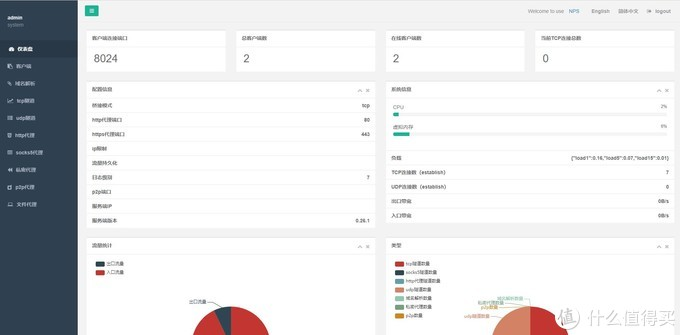
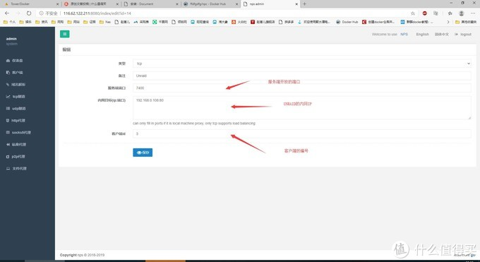

# UNRAID教程：配置内网穿透NPS

https://post.smzdm.com/p/ax0rq824/

# UNRAID教程：配置内网穿透NPS

2020-02-13 22:40:05 10点赞 77收藏 14评论

> 小编注：此篇文章来自[**#原创新人#**](https://post.smzdm.com/p/433063/)活动，成功参与活动将获得额外50金币奖励。

一款轻量级、高性能、功能强大的内网穿透代理[服务器](https://www.smzdm.com/fenlei/fuwuqi/)。支持tcp、udp、socks5、http等几乎所有流量转发，可用来访问内网网站、本地支付接口调试、ssh访问、远程桌面，内网dns解析、内网socks5代理等等……，并带有功能强大的web管理端。

[github项目地址](https://github.com/cnlh/nps)：

[中文文档](https://ehang.io/nps/documents)：

## 使用理由

内网穿透工具有不少，比如Frp、lanproxy、Holer等，现在介绍一下猪脚个n[ps](https://pinpai.smzdm.com/161140/)，支持web图形化管理。

## 首页展示

## 首要条件

需要安装在一个有公网IP的服务器上，系统为Linux/Windows/Mac均可。

## 安装服务端 

1. [NPS的GitHub页面地址](https://github.com/cnlh/nps)
2. [进入releases安装页面](https://github.com/cnlh/nps/releases)
3. 找到需要的版本，我这里用的服务器是centos 7，那么也就是Linux的64位版本，右键复制链接找到下载地址。
4. 连接到服务器输入代码：

> wget https://github.com/ehang-io/nps/releases/download/v0.26.2/linux_amd64_server.tar.gz

> tar -zxvf linux_amd64_server.tar.gz

> cd nps/

> ./nps start

 5.输入服务器的IP地址加8080端口号，即可进入NPS的后台界面

  默认用户名：admin 默认密码：123

6.登录后台，添加一条客户端

7.点击客户端上的加号，复制红框中的代码  -server=你服务器的IP:8024 -vkey=123456（添加客户端的时候填写复杂一点的验证码）

## 安装的客户端 

1.打开UNRAID后台DOCKER，点击ADD CONTAINER。

2.在新页面选择高级模式，点击BASIC VIEW。

3.填写容器参数，点击APPLY创建NPS客户端DOCKER。 

> ffdfgdfg/npc

> https://hub.docker.com/r/ffdfgdfg/npc

4.打开服务端web，查看客户端是否连接成功，status显示绿色online就成功了。

5.创建TCP隧道

6.输入服务器IP+创建的TCP开放端口号进入UNRAID（如111.111.111.111:7400）。