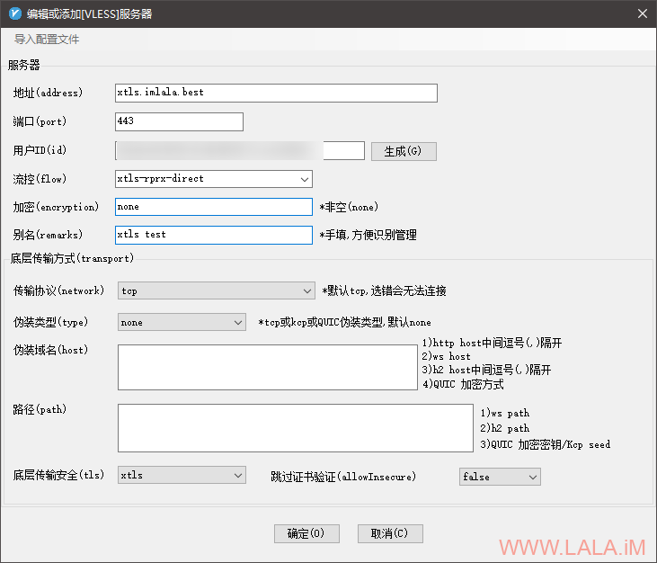

## Xray+VLESS+XTLS+NginxSNI分流/443端口复用

https://lala.im/7666.html


我这两年一直都用的Vmess，也挺好的没出什么问题，就是偶尔碰到“过节”的时候，比如国庆啊啥的，会经常阻断我。平时都挺正常的。。

但是不知道从什么时候开始，大概也就最近半年吧，我这里的网络也不知道是什么情况，一天要被阻断无数次。。偶尔来一次，一次来个几分钟也还可以接受，现在天天都来，就有点难受了。。

最近这半个月更是出了个莫名其妙的问题，我手机上面的配置从来没改动过，但是就经常连不上，而且一连不上可能是几天都连不上。。

所以我想试着换个方法，看看能不能缓解我这个问题。

认真考虑了一番，我决定试试目前比较新的Vless+XTLS，正好也尝尝鲜，折腾一下嘛。

由于我之前也配置过Vless，我知道这个协议本身没有加密最好配TLS用，所以一般这个协议是直接用443端口，但是我几台VPS上面肯定还要放点其他的东西，直接把443端口给占了，我就不能拿来建站了。

当然直接让Vless走别的端口是最简单的，比如8443之类的，但是这样的话我总觉得有点不够优雅。。所以我在想一个可以顾全大局的配置方案，那么最终我目前用的就是这篇文章内的方案了：用Nginx做SNI分流，让443端口可以复用，这样一来就完美解决了443端口的问题。

废话就不多说了，下面就把我部署过程写上来，如果对你有帮助，那真是极好的。

首先需要安装nginx和nginx的stream模块，这个模块在Debian上有软件包可以直接安装：

```
apt -y update
apt -y install curl git nginx libnginx-mod-stream python-certbot-nginx
```

接下来安装xray，由于我的机器内之前装过旧版的v2ray，所以我先把旧版的这些文件删了：

```
rm -rf /usr/bin/v2ray /var/log/v2ray /etc/v2ray /etc/systemd/system/v2ray.service
systemctl daemon-reload
```

如果你是全新的机器那就直接执行下面这个脚本即可：

```
bash <(curl -L https://raw.githubusercontent.com/XTLS/Xray-install/main/install-release.sh)
```

接下来我们首先编辑nginx的主配置文件：

```
nano /etc/nginx/nginx.conf
```

在http块的外部加入如下配置（也就是下面的这个配置独立出来：）

```
stream {
        map $ssl_preread_server_name $imlala_xray {
                xtls.imlala.best xtls;
                wordpress.imlala.best wordpress;
                typecho.imlala.best typecho;
        }
        upstream xtls {
                server 127.0.0.1:50001; # xray服务端口
        }
        upstream wordpress {
                server 127.0.0.1:50010; # 你的第一个网站的ssl端口
        }
        upstream typecho {
                server 127.0.0.1:50011; # 你的第二个网站的ssl端口
        }
        server {
                listen 443      reuseport;
                listen [::]:443 reuseport;
                proxy_pass      $imlala_xray;
                ssl_preread     on;
        }
}
```

上面这个配置有3个域名：

1.xtls.imlala.best

2.wordpress.imlala.best

3.typecho.imlala.best

第一个upstream的域名是必须的，也就是你需要更换这个域名为你自己的。

而第二第三到第N个upstream后面的是其他网站的域名，如果你在这台服务器上有运行其他网站并且绑定了不同域名那这里就改成你自己的域名，没有的话可以忽略。这里只是做一个SNI分流的示范。

特别需要注意的是，由于在stream块内监听了443端口，其他nginx的配置文件内不能再有监听443端口的listen，否则nginx启动会报错。

除此之外SNI分流如果要正常工作的话，前提是你的其他nginx配置文件内原本监听443端口的listen需要改为你在upstream内指定的端口。

接下来搭建一个用于vless的回落站点，也可以说是伪装站点，这里随便搞个静态页面就行，我这里就弄了个小游戏：

```
cd /var/www/html
git clone https://github.com/tusenpo/FlappyFrog.git flappyfrog
```

注：这个游戏过于暴力，建议你们不要使用，可能会导致域名加速被墙。。。

现在新建一个nginx配置文件，用于回落站点：

```
nano /etc/nginx/conf.d/fallback.conf
```

写入如下配置：

```
server {
        listen 80;
        server_name xtls.imlala.best;
        if ($host = xtls.imlala.best) {
                return 301 https://$host$request_uri;
        }
        return 404;
}

server {
        listen 127.0.0.1:23333;
        server_name xtls.imlala.best;
        index index.html;
        root /var/www/html/flappyfrog;
}
```

这里需要注意是，回落站点不需要配置ssl，如果vless将请求回落到这个站点的话，这个站点是自动支持ssl的。

你只需要保证回落站点的server_name和stream块内配置的xray服务端域名是同一个即可。例如本文内的：xtls.imlala.best

此外，在之前就说过listen不能监听443端口，这里你可以改任意一个其他没有占用的端口，例如上面这个配置中的23333端口，那么23333端口就是回落端口。

现在我们需要使用certbot签发一个ssl证书，之前说过回落站点不需要ssl，所以这里的certbot使用下面的命令，仅生成证书不修改nginx的配置文件：

```
certbot certonly --nginx
```

将生成好的证书复制到xray的配置目录：

```
cp /etc/letsencrypt/live/xtls.imlala.best/fullchain.pem /usr/local/etc/xray/fullchain.pem
cp /etc/letsencrypt/live/xtls.imlala.best/privkey.pem /usr/local/etc/xray/privkey.pem
```

由于xray通过systemd管理，而systemd内的用户是nobody，所以证书的所有者也要改为nobody，否则xray没有权限读取证书文件：

```
chown nobody:nogroup /usr/local/etc/xray/fullchain.pem
chown nobody:nogroup /usr/local/etc/xray/privkey.pem
```

生成一个uuid，复制下来：

```
cat /proc/sys/kernel/random/uuid
```

编辑xray的配置文件：

```
nano /usr/local/etc/xray/config.json
```

清空里面的配置，改为如下配置：

```
{
    "log": {
        "loglevel": "warning"
    },
    "inbounds": [
        {
            "listen": "127.0.0.1", # 仅监听在本地防止探测到下面的50001端口
            "port": 50001, # 这里的端口对应nginx内的upstream端口
            "protocol": "vless",
            "settings": {
                "clients": [
                    {
                        "id": "7f46753a-6a4b-4284-94c0-760340f96f1e", # 填写你的UUID
                        "flow": "xtls-rprx-direct",
                        "level": 0
                    }
                ],
                "decryption": "none",
                "fallbacks": [
                    {
                        "dest": "23333" # 回落站点的端口号
                    }
                 ]
            },
            "streamSettings": {
                "network": "tcp",
                "security": "xtls",
                "xtlsSettings": {
                    "alpn": [
                        "http/1.1"
                    ],
                    "certificates": [
                        {
                            "certificateFile": "/usr/local/etc/xray/fullchain.pem", # 你的域名证书
                            "keyFile": "/usr/local/etc/xray/privkey.pem" # 你的证书私钥
                        }
                    ]
                }
            }
        }
    ],
    "outbounds": [
        {
            "protocol": "freedom"
        }
    ]
}
```

确认上面这些配置无误后，设置nginx/xray开机自启：

```
systemctl enable nginx xray
```

重启nginx和xray使新的配置生效：

```
systemctl restart nginx xray
```

服务端到这里就全部完成了，接下来是客户端。windows客户端推荐使用v2rayn。

v2rayn目前有一个问题是，v2ray-core在4.33已经移除了这个协议，你需要手动把xray的core下载解压到v2rayn的根目录：

https://github.com/XTLS/Xray-core/releases/download/v1.1.4/Xray-windows-64.zip

不需要删除原来的v2ray.exe也不需要重命名xray.exe，解压就OK了，参考这里：

https://github.com/2dust/v2rayN/issues/1181

然后打开v2rayn添加vless服务器：

[](https://lala.im/wp-content/uploads/2020/12/lala.im_2020-12-24_15-08-14.png)

如果按照这篇文章部署，并且确认你的配置无误的话还是连接不上，首先检查你的服务器防火墙是否放行了80/443端口。

你还可以简单验证一下回落配置，用浏览器直接访问你的域名，如果正常的话应该能访问到这个小游戏：

[](https://lala.im/wp-content/uploads/2020/12/lala.im_2020-12-24_15-19-48.png)

这套配置比较繁琐，如果你在部署的过程遇到了什么问题，评论的时候请不要把一大坨xray或者nginx配置粘贴上来回复，这样不方便阅读，更不方便别人解决你的问题，你应该找一个在线的剪切板服务，把配置代码写到剪切板里面，评论的时候给出剪切板的地址。