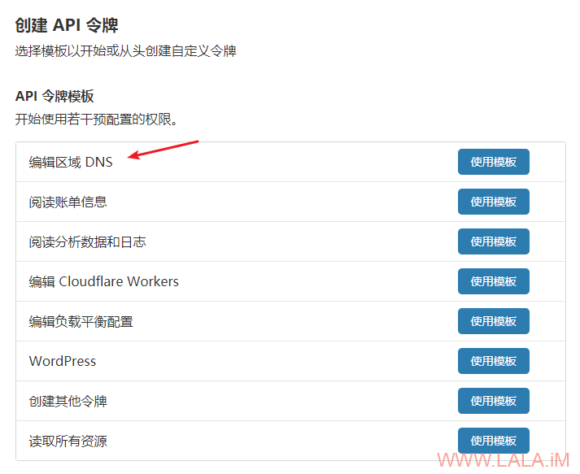
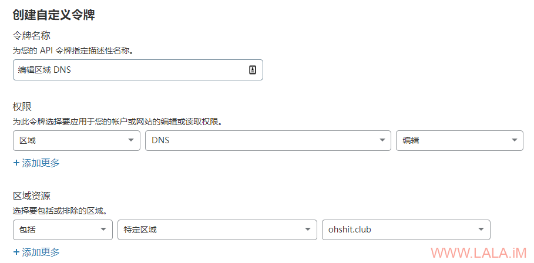
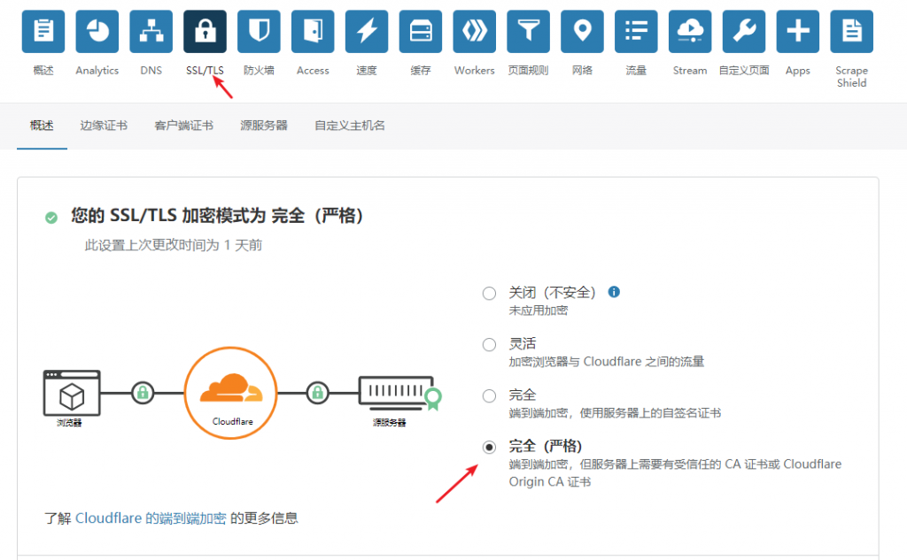
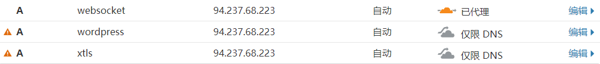
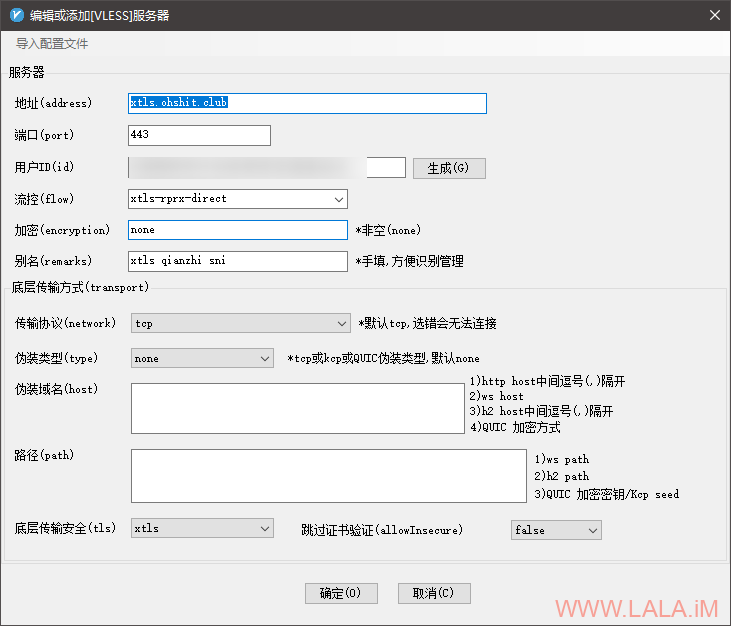
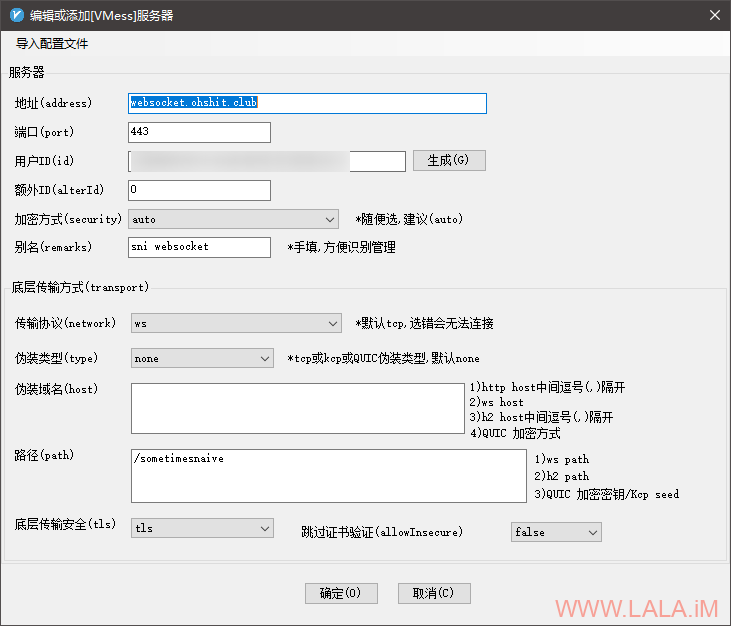
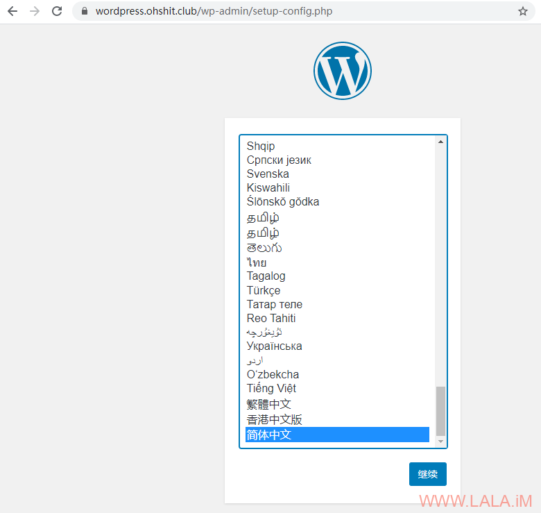
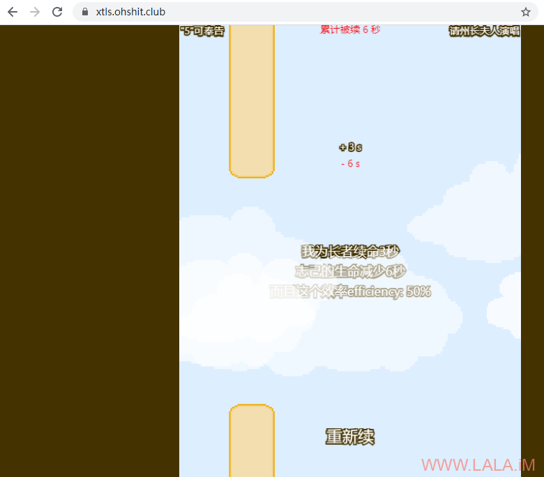

## Xray前置SNI分流/回落WebSocket+CDN

https://lala.im/7737.html

xray在1.2.2版本增加了回落支持sni分流的功能，那么我们现在就可以把xray作为前置来进行sni分流了，不再需要用到nginx的stream模块。

这篇文章主要介绍一下xray回落sni分流的配置，额外加了一点料，同时配置了一个websocket+cdn。不是说不支持cdn嘛，那我们就曲线救国，给它回落到支持cdn的协议。当然这不是今天这篇文章的重点。。。

[重要]在开始配置之前，你需要准备一个域名并把域名接入到cloudflare。打开cloudflare账户api创建页面：

https://dash.cloudflare.com/profile/api-tokens

按下图选择API模板：

[](https://lala.im/wp-content/uploads/2021/02/lala.im_2021-02-28_17-00-52.png)

按下图配置API权限和域名：

[](https://lala.im/wp-content/uploads/2021/02/lala.im_2021-02-28_17-03-07.png)

按下图把SSL/TLS模式改为严格：

[](https://lala.im/wp-content/uploads/2021/02/lala.im_2021-02-28_17-04-52.png)

然后添加3个解析记录：

[](https://lala.im/wp-content/uploads/2021/02/lala.im_2021-02-28_17-06-32.png)

注意websocket这个A记录后面要打开云朵图标，这里简单介绍一下这3个A记录的用途：

xtls.ohshit.club用于vless协议连接以及默认回落的站点。

wordpress.ohshit.club用于回落sni分流到你的网站或是博客。

websocket.ohshit.club用于回落到websocket套cdn。

做完上面这些准备工作后，现在开一台小鸡，系统选择Debian10，咱们首先安装certbot。

这里不要使用包管理器安装certbot，因为包管理器安装的版本太旧，后续我们需要用到的功能不支持，所以按照官方目前推荐的做法，先装snap：

```
apt -y update
apt -y install snapd
snap install core
snap refresh core
```

然后通过snap来安装certbot：

```
snap install --classic certbot
```

做一个软链接方便使用：

```
ln -s /snap/bin/certbot /usr/bin/certbot
```

安装cloudflare的dns插件：

```
snap set certbot trust-plugin-with-root=ok
snap install certbot-dns-cloudflare
```

安装nginx和一些常用工具：

```
apt -y install curl git nginx
systemctl enable --now nginx
```

安装xray，这里为了方便就直接安装为root用户了，可以省去后续对权限的一些更改：

```
bash -c "$(curl -L https://github.com/XTLS/Xray-install/raw/main/install-release.sh)" @ install -u root
```

现在来申请一个通配符证书，创建如下目录：

```
mkdir -p ~/.secrets/certbot
```

在目录内新建cloudflare.ini文件：

```
nano ~/.secrets/certbot/cloudflare.ini
```

在cloudflare.ini内写入如下配置，xxxxx换成你之前申请的cloudflareapi密钥：

```
dns_cloudflare_api_token = xxxxx
```

使用下面的命令申请证书，注意把ohshit.club换成你自己的域名：

```
certbot certonly \
--dns-cloudflare \
--dns-cloudflare-credentials ~/.secrets/certbot/cloudflare.ini \
--deploy-hook='systemctl restart xray' \
-d *.ohshit.club
```

现在准备搭建一个用于默认回落的站点：

```
cd /var/www/html
git clone https://github.com/tusenpo/FlappyFrog.git flappyfrog
```

新建nginx站点配置文件：

```
nano /etc/nginx/conf.d/fallback.conf
```

写入如下配置，注意把xtls.ohshit.club换成你自己的域名：

```
server {
        listen 80;
        server_name xtls.ohshit.club;
        if ($host = xtls.ohshit.club) {
                return 301 https://$host$request_uri;
        }
        return 404;
}

server {
        listen 127.0.0.1:23333;
        server_name xtls.ohshit.club;
        index index.html;
        root /var/www/html/flappyfrog;
}
```

现在准备配置sni分流的站点，这里拿wordpress做演示，安装mariadb和php：

```
apt -y install mariadb-server
apt -y install php7.3-fpm php7.3-mysql php7.3-mbstring php7.3-zip php7.3-curl php7.3-gd php7.3-ldap php7.3-xml php7.3-imagick
```

设置mariadb和php-fpm开机自启：

```
systemctl enable --now mariadb php7.3-fpm
```

初始化mariadb：

```
mysql_secure_installation
```

创建数据库和用户：

```
mysql -u root -p
CREATE DATABASE wordpress CHARACTER SET utf8mb4 COLLATE utf8mb4_unicode_ci;
GRANT ALL PRIVILEGES ON wordpress.* TO wordpress@localhost IDENTIFIED BY '设置你的数据库用户密码';
FLUSH PRIVILEGES;
quit
```

下载wordpress源码解压给予正确的权限：

```
cd /var/www
wget https://wordpress.org/latest.zip
unzip latest.zip
chown -R www-data:www-data wordpress
```

新建nginx站点配置文件：

```
nano /etc/nginx/conf.d/wordpress.conf
```

写入如下配置，注意把wordpress.ohshit.club换成你自己的域名：

```
set_real_ip_from 127.0.0.1;
real_ip_header proxy_protocol;

server {
        listen 80;
        server_name wordpress.ohshit.club;
        if ($host = wordpress.ohshit.club) {
                return 301 https://$host$request_uri;
        }
        return 404;
}

server {
        listen      127.0.0.1:23334 proxy_protocol;
        server_name wordpress.ohshit.club;
        root        /var/www/wordpress;
        index       index.php;
        client_max_body_size 0;

        location / {
                try_files $uri $uri/ /index.php?$args;
        }

        location ~ \.php$ {
                include snippets/fastcgi-php.conf;
                fastcgi_param HTTPS "on";
                fastcgi_pass  unix:/var/run/php/php7.3-fpm.sock;
        }
}
```

测试你的nginx配置是否正确：

```
nginx -t
```

没有问题的话重载nginx：

```
systemctl reload nginx
```

现在准备配置xray，首先生成一个uuid：

```
xray uuid
```

现在编辑xray的配置文件：

```
nano /usr/local/etc/xray/config.json
```

写入如下配置：

```
{
    "log": {
        "loglevel": "warning"
    },
    "inbounds": [
        {
            "listen": "127.0.0.1",
            "port": 23335, // websocket监听端口号
            "protocol": "vmess",
            "settings": {
                "clients": [
                    {
                        "id": "afeccc9c-7058-40b2-82a7-f9b8400e77e3" // 填写你生成的UUID
                    }
                ]
        },
            "streamSettings": {
                "network": "ws",
                "wsSettings": {
                    "path": "/sometimesnaive" // 此处的path因与下面配置的保持一致
                }
            }
        },
        {
            "listen": "0.0.0.0",
            "port": 443, // 监听443端口作为前置
            "protocol": "vless",
            "settings": {
                "clients": [
                    {
                        "id": "afeccc9c-7058-40b2-82a7-f9b8400e77e3", // 填写你生成的UUID
                        "flow": "xtls-rprx-direct",
                        "level": 0
                    }
                ],
                "decryption": "none",
                "fallbacks": [
                    {
                        "dest": "23333" // 与nginx监听的默认回落站点端口号一致
                    },
                    {
                        "name": "wordpress.ohshit.club", // sni分流站点的域名
                        "dest": "23334", // 与nginx监听的分流站点端口号一致
                        "xver": 1
                    },
                    {
                        "name": "websocket.ohshit.club", // websocket套cdn的域名
                        "path": "/sometimesnaive", // path与上面配置的保持一致
                        "dest": "23335" // 端口号与上面配置的保持一致
                    }
                 ]
            },
            "streamSettings": {
                "network": "tcp",
                "security": "xtls",
                "xtlsSettings": {
                    "alpn": [
                        "http/1.1"
                    ],
                    "certificates": [
                        {
                            "certificateFile": "/etc/letsencrypt/live/ohshit.club-0001/fullchain.pem", // 你的域名证书
                            "keyFile": "/etc/letsencrypt/live/ohshit.club-0001/privkey.pem" // 你的证书私钥
                        }
                    ]
                }
            }
        }
    ],
    "outbounds": [
        {
            "protocol": "freedom"
        }
    ]
}
```

最后重启xray即可：

```
systemctl restart xray
```

客户端这块的配置，为了简便就直接用v2rayN好了。

直接通过vless+xtls连接：

[](https://lala.im/wp-content/uploads/2021/02/lala.im_2021-02-28_18-34-14.png)

通过回落到websocket套cdn的连接：

[](https://lala.im/wp-content/uploads/2021/02/lala.im_2021-02-28_18-35-20.png)

验证sni分流，通过浏览器访问wordpress的域名如果正常就可以显示wordpress的安装界面：

[](https://lala.im/wp-content/uploads/2021/02/lala.im_2021-02-28_18-37-33.png)

验证默认回落，通过浏览器访问xtls的域名如果正常可以显示出这个小游戏的界面：

[](https://lala.im/wp-content/uploads/2021/02/lala.im_2021-02-28_18-39-08.png)

参考文献：

https://github.com/XTLS/Xray-core/issues/243
https://certbot-dns-cloudflare.readthedocs.io/en/stable/
https://certbot.eff.org/docs/using.html#renewing-certificates