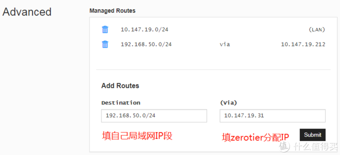
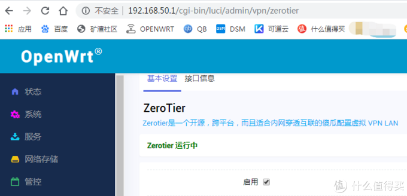
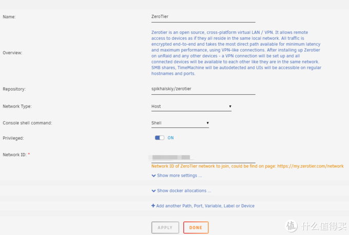
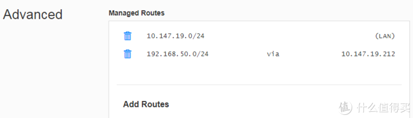
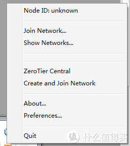
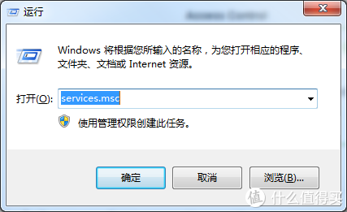
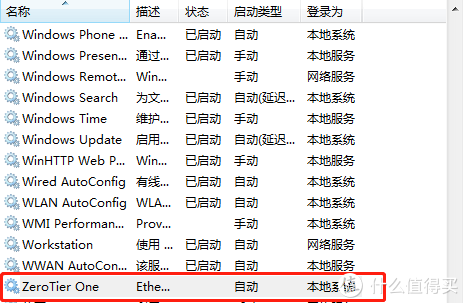

# ZeroTier一机安装搞定局域网所有设备访问，让你外网访问NAS如内网般丝滑

https://post.smzdm.com/p/a4wmrk7k/

【写作说明】：之前听很多人推荐过zerotierone，都说特别好用，后面因为公司电脑使用一直提示node id :unkown，就一直放在一边，直到前段时间偶然找到了解决方案，才又捡了起来。经过一些测试后，感觉效果还是特别的不错，所以拿出来和大家分享一下。

【网络环境说明】：目前的使用环境是在公司（电信宽带）访问家里设备（也是电信宽带），测试效果足够跑满带宽，由于我也没得多条宽带去测试，所以据听说的zerotier跨[运营商](https://www.smzdm.com/fenlei/taocanjiliuliangka/)访问效果不理想的说法，大家在需要用到的时候可以去测试一下。

## 安装方式一：[路由器](https://www.smzdm.com/fenlei/luyouqi/)安装

楼主家的路由器刷的是OPENWRT的固件，固件是全功能版本的，所以自带了zerotier的客户端，而且站内的zerotier安装教程也比较多，我就不再重复了，只说几个注意事项给大家。

如标题所说，楼主的目标是在一台机器上安装zerotier，以这台机为桥访问所有的内网设备，所以在openwrt上和zerotier的管理中心都需要进行设置：

openwrt端，在启用后注意勾选【自动允许客户端NAT】

zerotier里面需要注意的地方有两个，一个是分配给openwrt端的IP，如图，我的是10-147-19-31

  将这个IP和你路由器的网段填到zerotier的网络设置advance里面

经过这样设置之后，就可以愉快地在外网设备上使用内网的IP地址来访问自己局域网里面的所有设备啦。比如说路由器：（这是在公司电脑访问的，地址跟我在家用的同一地址）

再看看直接访问我的un[raid](https://pinpai.smzdm.com/17827/)：

是不是特别丝滑，跟在局域网里面一样的访问，再也不用记一堆的端口，设置各种端口转发了。

另外，NAS可用的FTP，SMB等访问照样可以直接设置，跟内网设备同样设置即可。

## 安装方式二：NAS等设备安装 

试过了OPENWRT上安装，那么如果路由器不够智能，无法安装，我们也可以考虑直接在NAS等设备上安装，然后以同样的方式设置路由表，比如说unraid:

不需要太多额外的设置，只需要填好network ID就可以，由于本身unraid就位于局域网中，不需要另外设置就可以通过unraid的网络访问到内网的其他设备，我们照样在zerotier的设置中心设置，注意把IP设置成UNRAID的IP，内网网段设置不变，如图是我已经设置好的：

实测访问效果同安装在OPENWRT

## 关于电脑上zerotier报错的解决方案 

如图，部分windows版本会出现加入网络后，再打开客户端显示如下：

即使重新加入网络也无法正常使用，偶然间看到网友说是因为zerotier的服务无法自行启动造成的，那么解决方案就很简单了，手动启动该服务就行。使用WIN+R键，输入services.msc，点击确定运行：

然后往下拉，找到zerotier的服务，右键启动即可：

这样操作之后过个几秒钟，zerotier就顺利连接入网了。

  

## 总结

zerotier使用起来还是很方便的，把路由表加入之后才是满血模式，不要一台一台机器进行安装，也不需要记一个一个的IP，外网访问无公网下的利器，甚至从某种程度上来说，还要优于公网访问哦。