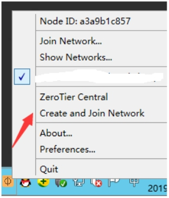

# Zerotier组网基础教程

   Zerotier路由器端设置错误可能会导致网络问题，路由器DHCP失效，有线无线均无法获取IP，需手动设置ip为同一个lan网段，进入路由，关闭zerotier后重启路由即可恢复！！

正式教程
一、路由器端：
1、登陆网址：https://www.zerotier.com/，点击Login。（推荐谷歌等浏览器，ie可能无法打开登录页面）

2、点击页面Create An Account，创建一个账号。（注册登录自行解决）

 

3、登录后，点击上方Networks菜单。

 

 

4、点击Create a Network创建一个网络。点击新创建的网络ID进入设置页面，

 

5、拉倒Advanced标签下，随意选择一个自己喜欢的网段。（我这里选择了192.168.192.*，后面会以此为例子。）

 

6、不要关闭zerotier网站页面，进入路由器VPN-》zerotier，点击启用，把上面创建的网络ID填入ZeroTier Network ID中，点击保存&应用按钮。

 

7、回到zerotier网站页面，拉倒Members标签，最前面打勾，稍等片刻可看到随机分配一个ipv4地址，记录下来。

 

8、拉倒Advanced标签下，在Destination文本框填入路由器内网IP段

比如路由器地址是192.168.0.1，那么这里就填192.168.0.0/24，路由器地址是192.168.1.1，那么这里就填192.168.1.0/24，以此类推，（不懂计算网络号的请示用C类地址按照教程填，大佬随意）

***\*(Via)\**** 文本框填入刚才zerotier分配给路由器的IP。

表示内网网段的IP都从路由器转发。填完后点击提交，如图上面会多一条记录、

 

9、回到路由器页面，勾选自动允许客户端NAT，然后点击保存&应用。（路由器端设置完成）

 

***\*二、PC端设置\****

***\*出门在外，需要连回家，但是别人的或者公司路由无法操作，只需在手机或者办公电脑上安装zerotier的客户端软件，加入网络即可。\****

1、点击顶部Download按钮，进入程序下载页面。

 

2、选择对应系统的软件（windows如下），点击下载、

 

3.安装程序最后一步，保持打勾，点击finish按钮。

 

 

4、在弹出界面点击LogIn,深入账号密码登录。如果没弹出，右击右下角zerotier图标，点击Create and join Network菜单就会弹出。（不想通过登录方式加入网络的见后面备注）

 

5、选择对应的网络点击后面的Join即可加入网络（使用账号密码加入的，无需回zerotier网站授权）。

 

6、如果需要在家连接办公司电脑，则需要办公室电脑的zerotier开机启动。右击右下角zerotier图标，点击Preferences菜单，在界面勾选Launch ZeroTier On Startup，点击OK即可。

 

***\*设置完毕！\****

***\*备注：\****如果不想通过账号密码添加。

击右下角zerotier图标，点击Join  Network菜单，在文本框中填入网络ID，点击Join，回到zerotier网站页面，勾选设备前面的复选框，获取到ip后即可。

  