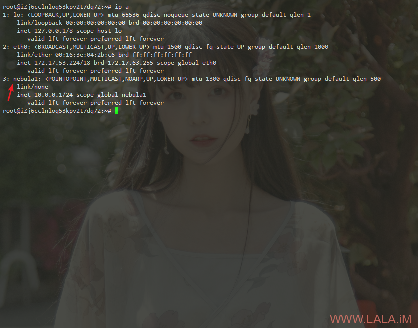
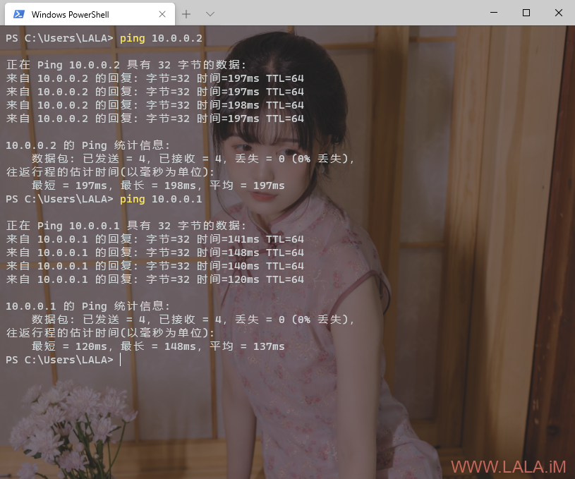

## 使用Nebula组建虚拟局域网/内网穿透

https://lala.im/7242.html


nebula是slack开源的一款overlay网络工具，简单点理解就像一个p2pvpn，和tincvpn类似。

nebula还具有一定的打洞能力，可以用来做内网穿透。本文介绍一下简单的搭建和使用方法。

用到3台机器：

1.阿里云香港，用作lighthouse（灯塔）节点。

2.upcloud圣何塞，普通节点。

3.家里的windows10电脑，普通节点。

目标是3台机器可以互相通信。

阿里云/upcloud的机器系统都是Debian10，首先安装supervisor用于进程守护：

```
apt -y update
apt -y install supervisor
systemctl enable supervisor
```

接着在这两台机器内下载好二进制文件/解压：

```
mkdir -p /opt/nebula && cd /opt/nebula
wget https://github.com/slackhq/nebula/releases/download/v1.2.0/nebula-linux-amd64.tar.gz
tar -xzvf nebula-linux-amd64.tar.gz
```

在灯塔节点上执行下面的命令颁发证书（这将生成ca.crt和ca.key）

```
./nebula-cert ca -name "imlala"
```

添加灯塔节点（这将生成lighthouse.crt和lighthouse.key）

```
./nebula-cert sign -name "lighthouse" -ip "10.0.0.1/24"
```

添加普通节点（生成的东西和上面的一样，就是一对证书）

```
./nebula-cert sign -name "upcloud" -ip "10.0.0.2/24"
./nebula-cert sign -name "home" -ip "10.0.0.3/24"
```

在灯塔节点上新建配置文件：

```
nano config.yml
```

写入如下配置：

```
pki:
  ca: /opt/nebula/ca.crt
  cert: /opt/nebula/lighthouse.crt
  key: /opt/nebula/lighthouse.key

static_host_map:
  "10.0.0.1": ["你的服务器公网IP:4242"]

lighthouse:
  am_lighthouse: true
  interval: 60

listen:
  host: 0.0.0.0
  port: 4242

punchy:
  punch: true

cipher: chachapoly

tun:
  dev: nebula1
  drop_local_broadcast: false
  drop_multicast: false
  tx_queue: 500
  mtu: 1300

logging:
  level: info
  format: text

firewall:
  conntrack:
    tcp_timeout: 12m
    udp_timeout: 3m
    default_timeout: 10m
    max_connections: 100000

  outbound:
    - port: any
      proto: any
      host: any

  inbound:
    - port: any
      proto: any
      host: any
```

接下来新建supervisor配置文件：

```
nano /etc/supervisor/conf.d/nebula.conf
```

写入如下配置：

```
[program:nebula]
priority=1
directory=/opt/nebula
command=/opt/nebula/nebula -config config.yml
autostart=true
autorestart=true
redirect_stderr=true
stdout_logfile=/var/log/supervisor/nebula.log
```

然后update一下就可以跑起来了：

```
supervisorctl update
```

如果正常的话，通过ip a应该可以看到一个名为nebula1的接口：

[](https://lala.im/wp-content/uploads/2020/07/lala.im_2020-07-27_16-18-07.png)

这样灯塔节点就配置完成了。

接下来配置upcloud的普通节点，首先我们需要把之前在灯塔节点上生成的对应节点的证书保存过来。

需要注意的是ca.crt也是需要保存过来的，这里我直接就用scp传过来：

```
scp ca.crt upcloud.crt upcloud.key 服务器公网IP:/opt/nebula
```

然后只需要新建一个配置文件稍微改改就行：

```
nano config.yml
```

写入如下配置（需要改动的地方我加了注释：）

```
pki:
  ca: /opt/nebula/ca.crt
  cert: /opt/nebula/upcloud.crt # 对应你这个节点的证书
  key: /opt/nebula/upcloud.key # 对应你这个节点的密钥

static_host_map:
  "10.0.0.1": ["灯塔节点服务器的公网IP:4242"]

lighthouse:
  am_lighthouse: false # 普通节点这里需要改为false
  interval: 60
  hosts:
    - "10.0.0.1" # 普通节点需要在这里指定灯塔节点的内部IP，这里不是灯塔节点的公网IP

listen:
  host: 0.0.0.0
  port: 4242

punchy:
  punch: true

cipher: chachapoly # 加密方式必须一致

tun:
  dev: nebula1
  drop_local_broadcast: false
  drop_multicast: false
  tx_queue: 500
  mtu: 1300

logging:
  level: info
  format: text

firewall:
  conntrack:
    tcp_timeout: 12m
    udp_timeout: 3m
    default_timeout: 10m
    max_connections: 100000

  outbound:
    - port: any
      proto: any
      host: any

  inbound:
    - port: any
      proto: any
      host: any
```

最后还是和之前一样配置一下supervisor跑起来就行了。

windows的配置也大同小异，大概说明一下吧。

1.安装TAP驱动：https://openvpn.net/community-downloads/

2.下载对应架构的二进制文件解压：

https://github.com/slackhq/nebula/releases/download/v1.2.0/nebula-windows-amd64.zip

3.用sftp或者其他你知道的方法把灯塔节点上生成的证书保存到本地。

4.复制一份本文在上述列出的普通节点的配置文件，改动如下所示的内容：

```
pki:
  ca: C:/Users/LALA/Desktop/nebula/nebula-windows-amd64/ca.crt
  cert: C:/Users/LALA/Desktop/nebula/nebula-windows-amd64/home.crt
  key: C:/Users/LALA/Desktop/nebula/nebula-windows-amd64/home.key
```

5.使用powershell以管理员（必须是管理员）的身份执行下面的命令启动即可：

```
cd C:/Users/LALA/Desktop/nebula/nebula-windows-amd64
./nebula.exe -config config.yml
```

6.nebula也可以在windows上把自身安装成服务，这样后续就不需要用到powershell了：

```
./nebula -service install -config C:\Users\LALA\Desktop\nebula\nebula-windows-amd64\config.yml
```

启动服务：

```
./nebula -service start -config C:\Users\LALA\Desktop\nebula\nebula-windows-amd64\config.yml
```

重启/停止/卸载服务：

```
./nebula -service restart
./nebula -service stop
./nebula -service uninstall
```

最后简单测试一下：

[](https://lala.im/wp-content/uploads/2020/07/lala.im_2020-07-27_16-16-14.png)

