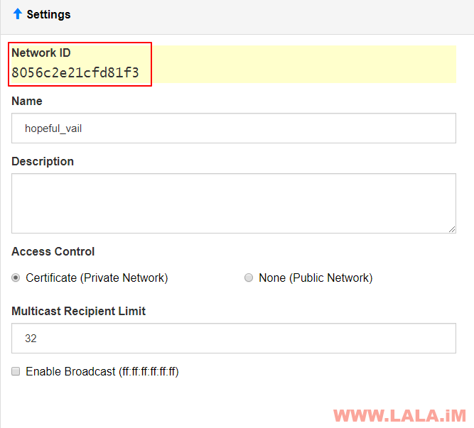

## 利用ZeroTier建立IPv6隧道

https://lala.im/5015.html


我不知道是哪位带哥把我之前写的那个用WireGuard建立IPv6隧道的文章到处宣传，搞的现在油管上面有几个阿婆主都用我那个文章做视频。。。我谢谢您的好意了，麻烦以后别免费帮我提高浏览量，我只想一个人安安静静的写点辣鸡文章，好吗，mua~

还有就是我搞IPv6隧道本意不是拿来翻墙（怪我之前没说清楚。）我是打算用来挂PT，提高连通性的。包括这篇文章也是如此。

ZeroTier本身是一个P2P组网的工具，很多玩群晖的都是拿来搞内网穿透，因为支持IPv6还有自定义路由的功能，所以我决定拿来做一个IPv6隧道，实际效果非常不错，可以看下图，我用qBittorrent下的PT种子能够连接上很多IPv6用户，这样就舒服了呀：

[](https://lala.im/wp-content/uploads/2019/02/lala.im_2019-02-24_13-17-54.png)

开始之前你需要做一下准备工作：

1.去ZeroTier的官网注册一个账号：https://my.zerotier.com/

2.买一台VPS，并且至少需要有/64的IPv6block，像什么DO啊，Vultr啊，应该都是可以免费给你提供的，我这边就拿Vultr做示范。如果你的VPS没有/64的地址段，发个TK找商家要一下应该也能要到，IPv6现在就跟不要钱一样。。

为什么需要IPv6地址段？之前我用WireGuard搞的隧道是基于NAT的，但实际上在IPv6这个协议栈上面NAT完全没有必要，因为IPv6可用地址空间太多太多，根本用不完。当然最主要的是我发现这个ZeroTier不能用NAT的方法，如果用NAT的话会有MTU的问题。。。

3.系统我这边用的Debian9，因为需要用到一个ndppd的包，这个包CentOS7没有，只能去编译，我这边就偷懒了~

首先在ZeroTier的网站上面创建一个网络：

[](https://lala.im/wp-content/uploads/2019/02/lala.im_2019-02-24_12-55-01.png)

记住你创建的这个网络ID：

[](https://lala.im/wp-content/uploads/2019/02/lala.im_2019-02-24_12-55-33.png)

在VPS内安装一些需要用到的包：

```
apt -y update
apt -y install curl sudo net-tools
```

装一下这个ndppd：

```
apt -y install ndppd
```

如果是CentOS7，去Github下载0.2.4的旧版编译（0.2.5不能用有BUG）：

```
yum -y groupinstall 'Development Tools'
wget https://github.com/DanielAdolfsson/ndppd/archive/0.2.4.tar.gz
tar -xzvf 0.2.4.tar.gz
cd ndppd-0.2.4
make && make install
```

修改内核参数：

```
echo "net.ipv6.conf.default.forwarding = 1" >> /etc/sysctl.conf
echo "net.ipv6.conf.all.forwarding = 1" >> /etc/sysctl.conf
echo "net.ipv6.conf.all.proxy_ndp = 1" >> /etc/sysctl.conf
echo "net.ipv6.conf.all.accept_ra = 2" >> /etc/sysctl.conf
sysctl -p
```

然后一条命令安装ZeroTier：

```
curl -s https://install.zerotier.com/ | sudo bash
```

将你的这台VPS加入到之前创建的网络内（网络ID换成你自己的）：

```
zerotier-cli join 8056c2e21cfd81f3
```

设置权限：

```
zerotier-cli set 8056c2e21cfd81f3 allowGlobal=true
zerotier-cli set 8056c2e21cfd81f3 allowDefault=1
```

回到ZeroTier的WEB页面刷新一下，你现在应该可用看到有一台设备等待验证，允许：

[](https://lala.im/wp-content/uploads/2019/02/lala.im_2019-02-24_13-00-13.png)

然后找到下图的位置，把这个ZeroTierRFC4193勾上：

[](https://lala.im/wp-content/uploads/2019/02/lala.im_2019-02-24_13-00-52.png)

回到之前验证设备的地方，你可以看到多出来一个以fdxxxx开头的内网IPv6，复制这个地址：

[](https://lala.im/wp-content/uploads/2019/02/lala.im_2019-02-24_13-01-03.png)

在Managed Routes这里添加一条路由：

```
::/0 route 你的fd开头的内网IPv6
```

如图所示：

[](https://lala.im/wp-content/uploads/2019/02/lala.im_2019-02-24_13-01-52.png)

然后看到Vultr的IPv6信息页面，得知自己的IPv6地址段，如图：

[](https://lala.im/wp-content/uploads/2019/02/lala.im_2019-02-24_13-02-34.png)

复制你自己的IPv6地址段，回到ZeroTier的Managed Routes，再添加一条路由：

```
你的IPv6地址段:ff::/80 route LAN
```

如图所示：

[](https://lala.im/wp-content/uploads/2019/02/lala.im_2019-02-24_13-03-43.png)

现在你的Managed Routes看上去应该是这样子的：

[](https://lala.im/wp-content/uploads/2019/02/lala.im_2019-02-24_13-04-05.png)

接着勾选Auto-Assign from Range，并把你之前填写在Managed Routes上面的IPv6地址段复制粘贴到这里的第一个输入框：

[](https://lala.im/wp-content/uploads/2019/02/lala.im_2019-02-24_13-04-25.png)

等几秒它会自动帮你计算并附加一个新的外网IPv6地址到设备内，就像这样：

[](https://lala.im/wp-content/uploads/2019/02/lala.im_2019-02-24_13-04-38.png)

现在回到VPS内，使用ifconfig查看一下这个IPv6地址是否附加成功，另外确定你的这台机器的外网网卡名字，比如我这台现在是ens3：

[](https://lala.im/wp-content/uploads/2019/02/lala.im_2019-02-24_13-05-21.png)

新建一个ndppd的配置文件：

```
nano /etc/ndppd.conf
```

写入：

```
route-ttl 30000

address-ttl 30000

proxy ens3 {
   router yes
   timeout 500
   autowire no
   keepalive yes
   retries 3
   promiscuous no
   ttl 30000
   rule 2001:19f0:6401:847:ff::/80 {
      auto
      autovia no
   }
}
```

注：对应的外网网卡名字，IPv6地址段修改为你自己的，如图所示：

[](https://lala.im/wp-content/uploads/2019/02/lala.im_2019-02-24_13-06-03.png)

这个ndppd它有一个作用？像DO/Vultr这些商家，它虽然给你了一个IPv6block，但他们不会帮你去全部路由这些IP，这时候我们就需要ndppd去帮助我们自己路由。

配置完成之后，启动：

```
systemctl start ndppd
```

查看运行状态，这里有一个坑，你会发现初次运行的时候，它不能正常加载配置文件，这样就导致路由根本不能生效：

[](https://lala.im/wp-content/uploads/2019/02/lala.im_2019-02-24_13-06-31.png)

重新启动一次即可：

```
systemctl restart ndppd
```

再查看一下，确保这个ndppd一定要是正常工作的，否则待会IPv6隧道打不通：

[](https://lala.im/wp-content/uploads/2019/02/lala.im_2019-02-24_13-06-51.png)

现在打开Windows的ZeroTier客户端，右键选择加入网络：

[](https://lala.im/wp-content/uploads/2019/02/lala.im_2019-02-24_13-07-17.png)

输入你的网络ID，并勾选下面的三个框框（一定要勾选）：

[](https://lala.im/wp-content/uploads/2019/02/lala.im_2019-02-24_13-07-35.png)

如果是Win10的话，等几秒会弹出一个这样的提示，点是：

[](https://lala.im/wp-content/uploads/2019/02/lala.im_2019-02-24_13-07-53.png)

回到ZeroTier的web页面上，刷新一下页面，你会看到一个新的设备请求加入这个网络，允许：

[](https://lala.im/wp-content/uploads/2019/02/lala.im_2019-02-24_13-08-32.png)

稍等几秒它就会给你的这台Win10设备附加一个公网的IPv6了：

[](https://lala.im/wp-content/uploads/2019/02/lala.im_2019-02-24_14-17-16.png)

这样隧道就建立好了，我们可以在本机PING一下支持V6的站点测试：

[](https://lala.im/wp-content/uploads/2019/02/lala.im_2019-02-24_13-11-06.png)

然后去IPV6测试站测试一下，舒服了：

[](https://lala.im/wp-content/uploads/2019/02/lala.im_2019-02-24_13-11-55.png)

当然你也可以用这个ZeroTier实现IPv4翻墙的功能，但我测试了没什么卵用。而且很麻烦要配NAT。没什么特殊需求的话还是别折腾了。

最后说一下，这个不需要你的本地有IPv6！不然怎么还能叫隧道呢？

参考文献：

https://zerotier.atlassian.net/wiki/spaces/SD/pages/7110693/Overriding+Default+Route+Full+Tunnel+Mode