# 家庭WiFi布网实战：ZeroTier 从此摆脱没有公网IP带来的烦恼，让内网穿透见鬼去吧！

https://post.smzdm.com/p/alpzrnx8/

## 1.需求

对于公网IP、内网穿透想必大家都有所了解。有公网IP的[童鞋](https://www.smzdm.com/fenlei/tongxie/)也还是要做DDNS动态解析，还得去整个域名，没有公网的就更难受了，先得买个VPS之类的云主机，再做内网穿透，关键云主机的上行带宽一般都是超级小水管(有钱买带宽的可以略过本文)，可以说完全不够用。

需求这就来了，那就是需要在没有公网IP时达到多网相互访问，同时访问速度相较于宽带的上行速度不能差太多。当前接触过能做到这些的就是ZeroTier，简单说下这玩意的作用，就是用过P2P在互联网上整一个虚拟局域网，把你需要互联的多个网络揉在一起，优点一是不需要公网IP，二是速度取决于拨号带宽的上行速度，电信家用一般是10Mbps，联通的基本50Mbps起步。

## 2.拓补

先上个家里的拓补图

[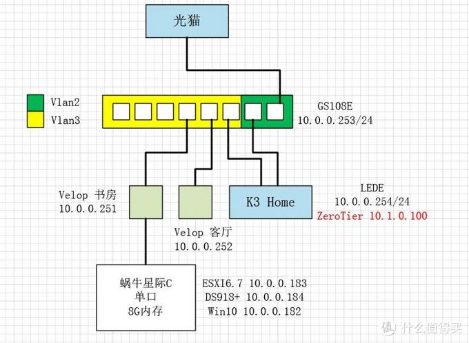](https://post.smzdm.com/p/alpzrnx8/pic_2/)

K3无线为了降温已经关闭，而且有两Velop完全不需要K3提供无线接入，当然家中一堆米家设备这边就不标注了。

[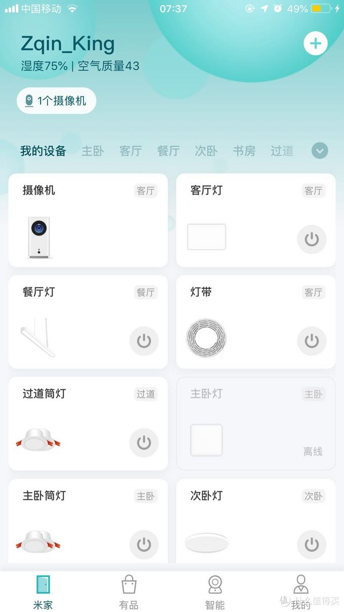](https://post.smzdm.com/p/alpzrnx8/pic_3/)

公司的拓补于家中类似，主路由同样是K3使用的网段是10.1.254/24，上面的ZeroTier给的IP是10.1.0.200。在我的ZeroTier网络中还有一个节点，那就是[手机](https://www.smzdm.com/fenlei/zhinengshouji/)，在户外想要链接这两张网只能通过手机啦，手机的ZeroTier给的IP是10.1.0.150。

[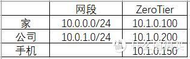](https://post.smzdm.com/p/alpzrnx8/pic_4/)

## 3.部署

### ZeroTier部分

[打开网址](https://my.zerotier.com/login)

[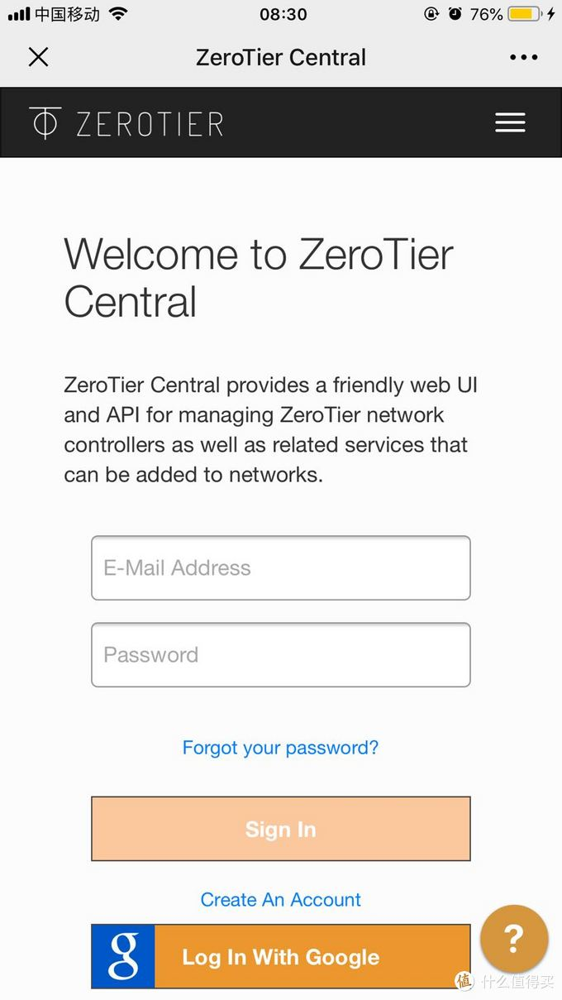](https://post.smzdm.com/p/alpzrnx8/pic_5/)

直接注册账号登陆，右上角点开进去Networks，进入如果没有就Create a Network创建一个

[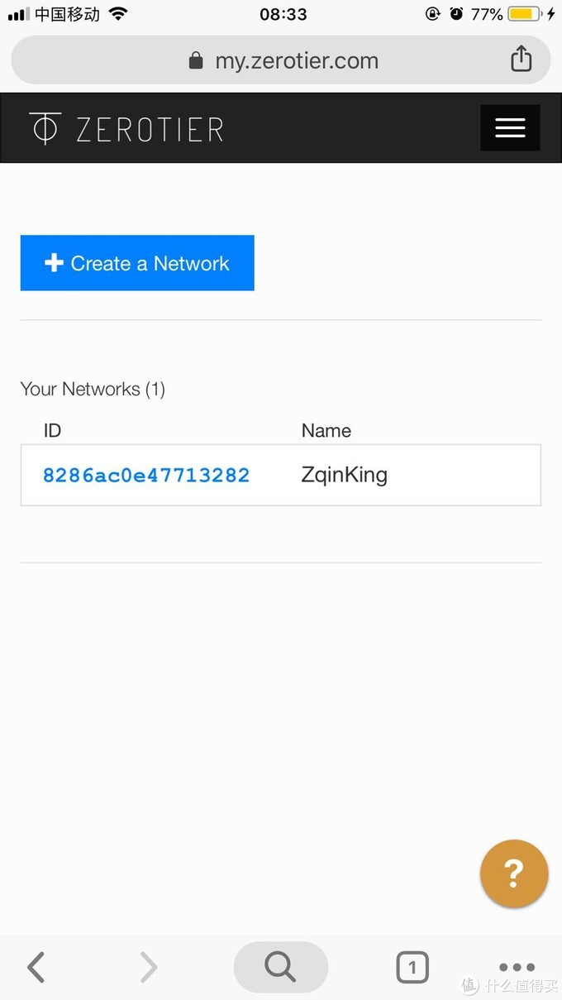](https://post.smzdm.com/p/alpzrnx8/pic_6/)

显示出来的ID就是你过去到的私有网络ID啦，不用担心暴露，这个私有网络加入是需要授权的。获取到ID后就去[路由器](https://www.smzdm.com/fenlei/luyouqi/)操作！获取到ID后就去路由器操作！获取到ID后就去路由器操作！

[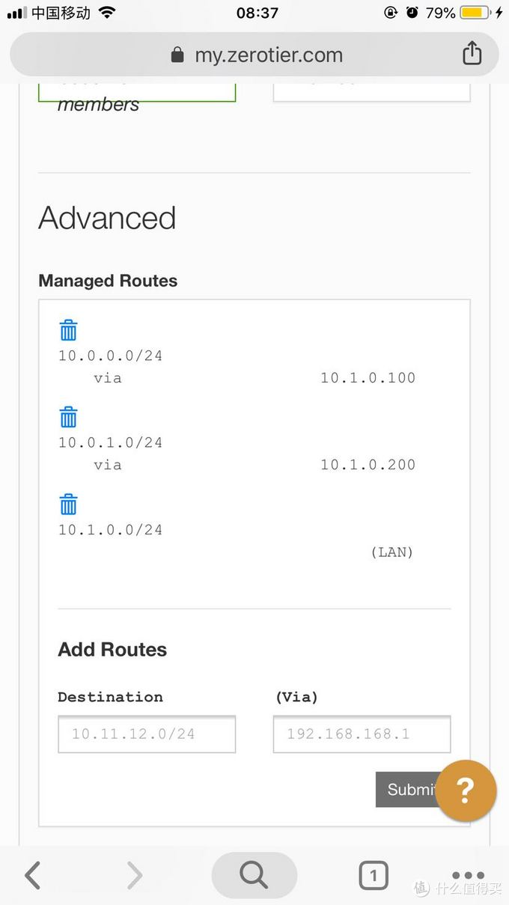](https://post.smzdm.com/p/alpzrnx8/pic_7/)

[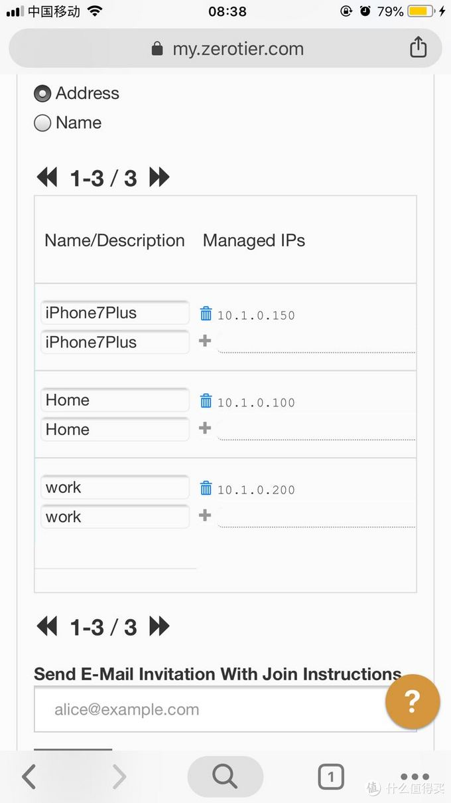](https://post.smzdm.com/p/alpzrnx8/pic_8/)

配置完成基本就是这样。

[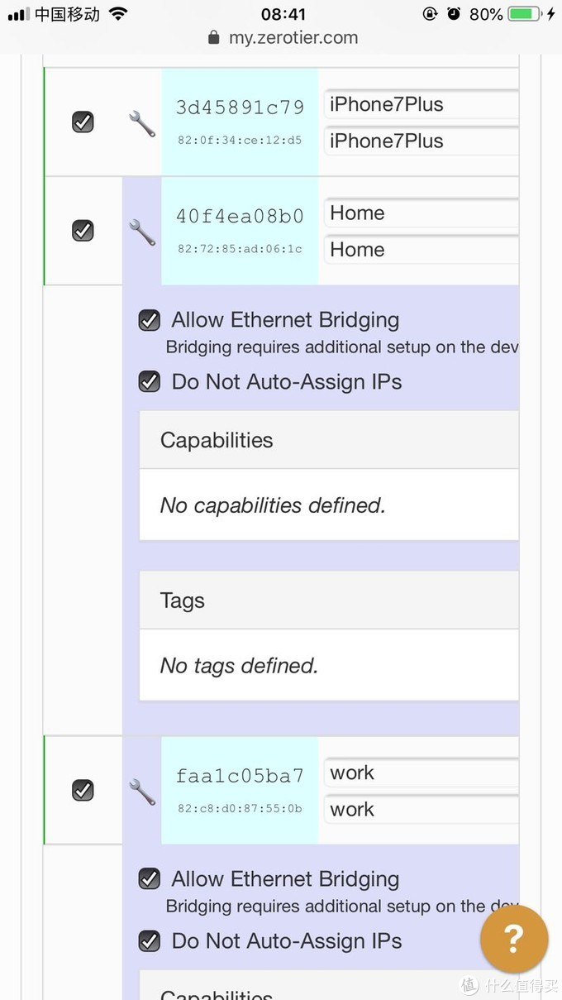](https://post.smzdm.com/p/alpzrnx8/pic_9/)

前面的勾勾表示授权允许进入网络，如果是路由器点开[扳手](https://www.smzdm.com/fenlei/banshou/)把下面的两个勾勾勾上，默认ZeroTier给设备的IP是自动分配的，这边为了好记全部手动修改了。

## 路由器部分

1.两个K3安装的都是KoolShare的[LED](https://pinpai.smzdm.com/54440/)E2.7，已经自带了一个1.2.4的ZeroTier客户端，可以直接使用，软件包中可以更新到最新的1.2.12，直接搜索更新即可，除了更新ZeroTier外还需要更新libminiupnpc，同样在软件包中直接搜索安装即可。

2.进入->服务->ZeroTier，填入在ZeroTier申请到的ID，点击开始，第一次开始接口选择wan就行，这个后面需要变更一次。

[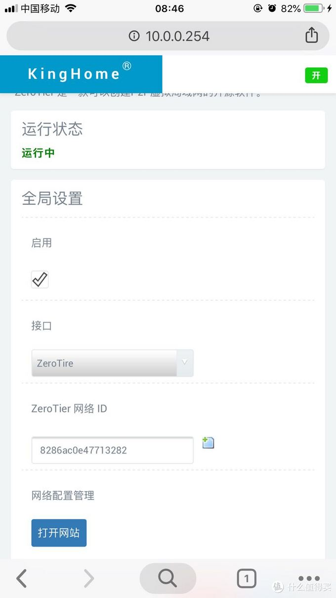](https://post.smzdm.com/p/alpzrnx8/pic_10/)

这个时候需要打开ZeroTier管理网页进行授权，出来的设备那儿最前面的勾勾，勾上即可。

3.进入->网络->接口，添加新接口，协议选静态IP。不要选DHCP，网上其他教程都让选DHCP，其实不对，这玩意获取不到会一直发送DHCP请求，设置的IP就填步骤2页面授权完成之后显示出来的IP，掩码一般默认是255.255.0.0的，网关不需要填，物理接口选zt0升级到1.2.12的是ztrta52pgf。防火墙选不指定或新建，填一个ZeroTier新建一个。

[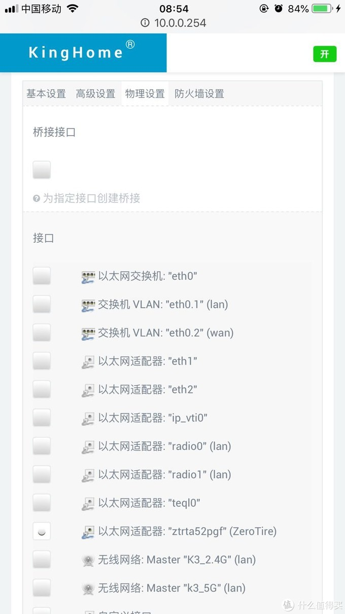](https://post.smzdm.com/p/alpzrnx8/pic_11/)

[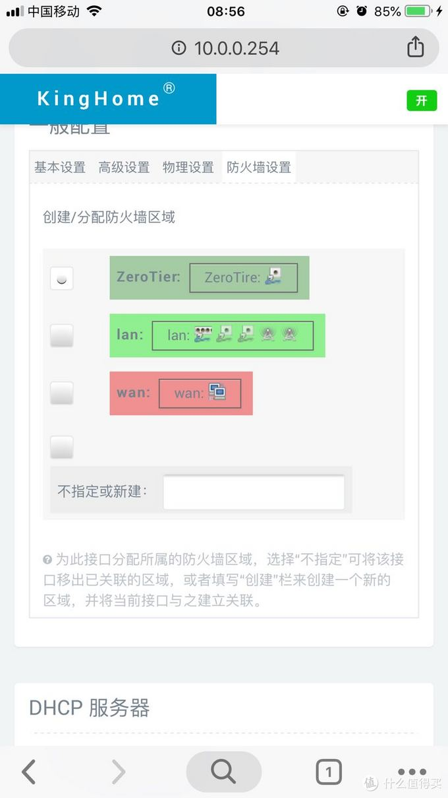](https://post.smzdm.com/p/alpzrnx8/pic_12/)

4.进入->网络->防火墙，把新建的ZeroTier的三个权限都改成接受

[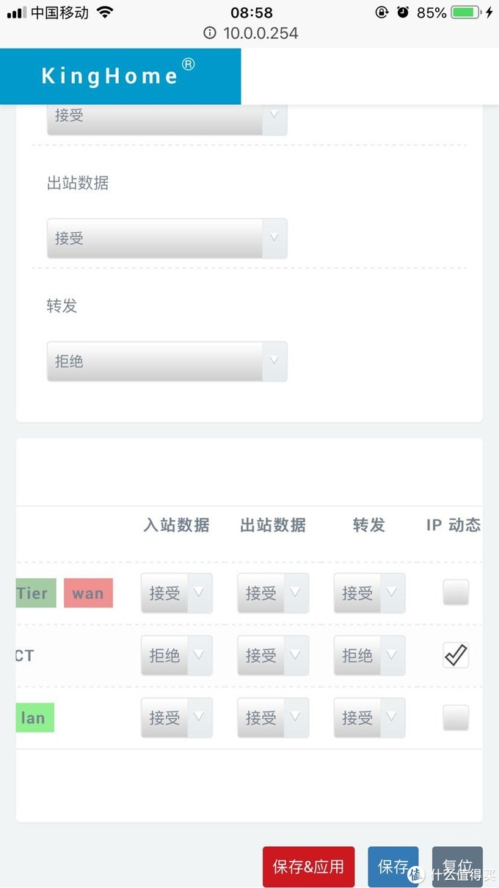](https://post.smzdm.com/p/alpzrnx8/pic_13/)

同时进入Lan把于ZeroTier相互转发的都勾上

[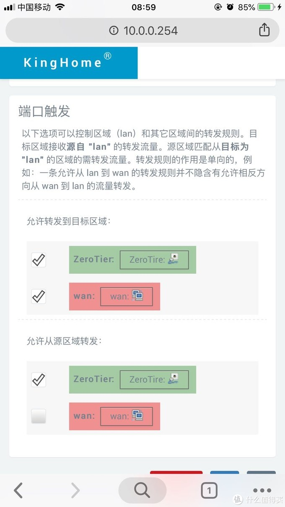](https://post.smzdm.com/p/alpzrnx8/pic_14/)

5.进入->网络->静态路由，配置其他网络的路由，接入ZeroTier的网络只有一个那就不需要配置这个，本文有两个网络段需要接入(10.0.0.0/24 10.0.1.0/24)，所以进行这步配置，手机有几个无所谓，不需要配置。配置原则是，配置除了本机之外的所有网络路由。即家中的需要配置公司网段的路由，公司需要配置家中网段的路由。这边展示一个家中K3的配置。

[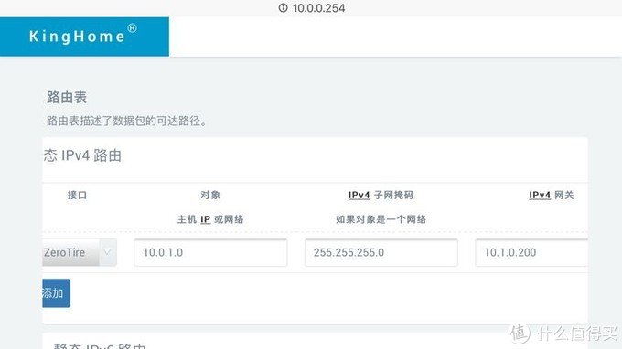](https://post.smzdm.com/p/alpzrnx8/pic_15/)

重启生效，重启生效，重启生效。就因为保存不重启没生效，我折腾了4个小时......

到这儿配置基本就结束了！

## 4.效果



[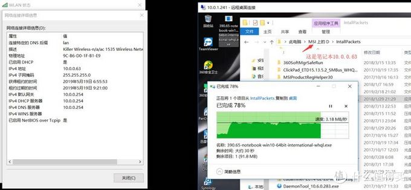](https://post.smzdm.com/p/alpzrnx8/pic_16/)

10.0.0.63直接远程10.0.1.241，拷贝文件基本在25Mbps的速度。