# 小白折腾NAS 篇十：内网穿透.学习记录.一篇小白看得懂的简易教程 — ZeroTier one 唤醒NAS沉睡的灵魂

https://post.smzdm.com/p/a6lr6o8e/

**创作立场声明：**坚持原创.居中立场.

码字不易.如本文对您有帮助，请点赞打赏.关注收藏来一波.

感谢您的支持......

### 文章字数约6K，建议先收藏.在慢慢看哦...

### 依旧先放个目录：

### 目录

### 开篇

### 一、zerotier one 服务端创建及配置

### 二、[威联通](https://pinpai.smzdm.com/3063/)NAS端安装 zerotier one 并加入虚拟网络

### 三、PC端安装 zerotier one 并加入虚拟网络（附远程Qsync同步测试）

### 四、Android端安装 zerotier one 并加入虚拟网络

### 五、ios端安装 zerotier one 并加入虚拟网络

### 六、Transmission 测试

### 结语

## 开篇

今天来说一说内网穿透吧...很多朋友购买了NAS设备...却因为网络运营商无法提供公网IP而苦恼...

没有公网IP确确实实的限制了NAS能力的发挥....也让如我一样的小白用户有一种食之无味弃之可惜的无力感觉...

不能提供远程服务我要nas来干啥...占地方么....它只是一台沉睡的[硬盘盒](https://www.smzdm.com/fenlei/yidongyingpanhe/)..... 

说好的私有云..远程办公..远程学习...远程那啥....统统不能实现.....好气啊.... 

就像一辆硬派越野...每天只是在家里上下班使用...真的是一点灵魂都没有...它会在车库里流泪......

这个比喻也不知道恰当不恰当...

最近参考学习了很多关于内网穿透的方法，诸如花生壳、蒲公英、零遁、frp、ngrok、team viewer、zerotier one等等主流的内网穿透方式，每一种方法都有自己的特点，但是能做到对小白用户友好、安全可靠、操作上易用、并且无广告、而且还免费、速度也还能接受的，就只有 zerotier one 了 .....

在这里也感谢站内外大神们的经验分享....

简单介绍一下吧：zerotier one 是一款功能完善、操作友好，也即是非常好用的内网穿透工具，它能实现虚拟局域网的组建，我们的任何一台设备，只要加入了这个虚拟局域网，那么我们在任何时间地点都能访问内网，也能相互访问，从内网中获取共享的资料文件。

这里不讨论原理以及介绍高深的术语....只以最简单、最直白的文字让小白用户轻松实现内网穿透.....

很简单的.....

今天，就来做个学习记录....跟着我一步一步来...一起来唤醒沉睡中的NAS吧.....

## 一、zerotier one 服务端创建及配置

要想用zerotier one创建一个虚拟的局域网络，那么我们首先要登陆 zerotier 官网，申请注册一个账号，然后在官网创建虚拟网络服务端...

[zerotire 官网](https://zerotier.com/)

[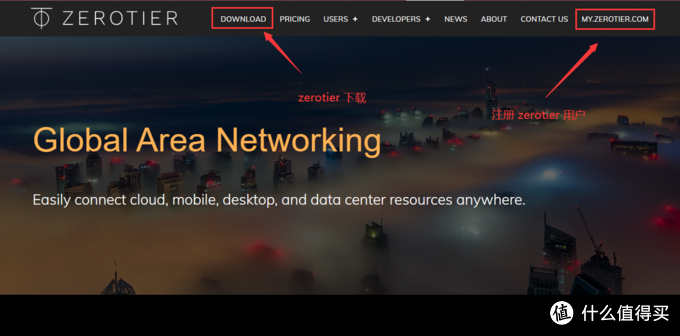](https://post.smzdm.com/p/a6lr6o8e/pic_2/)

官网主页制作精美，我们只要注意一下图中标注的两个地方，左边是 DOWNLOAD ..是各个平台的zerotier one版本，有win、mac、Linux、qnap、synology、ios、Android等等平台的对应版本，下载的时候按照各自的设备平台来对应下载即可，我在下文中也给出了相应的下载链接...

[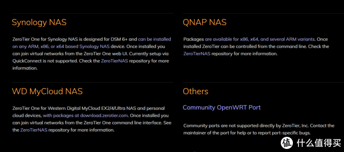](https://post.smzdm.com/p/a6lr6o8e/pic_3/)

下载页面...

那么我们先来注册吧...点击页面右上角的 my.zerotier.com

[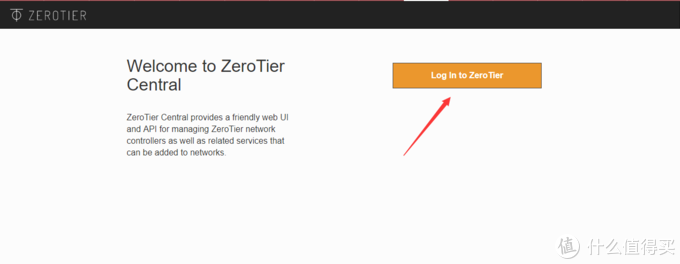](https://post.smzdm.com/p/a6lr6o8e/pic_4/)

点击 log in to zerotier 登录...

[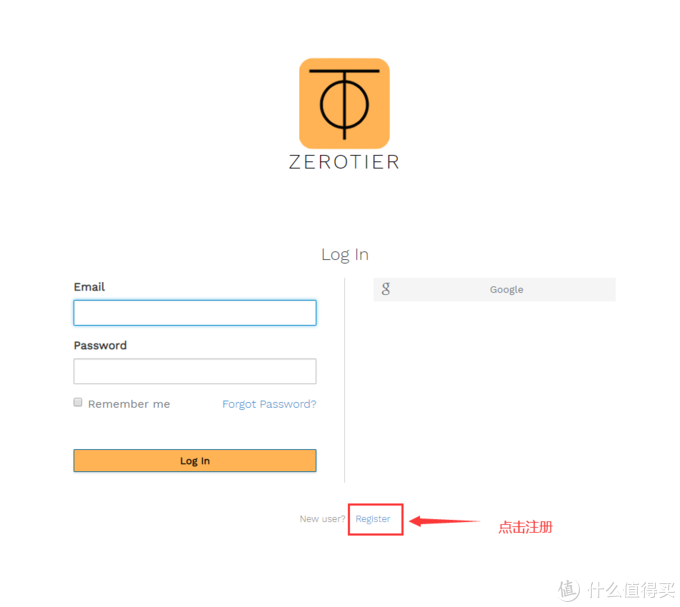](https://post.smzdm.com/p/a6lr6o8e/pic_5/)

点击 register 注册

[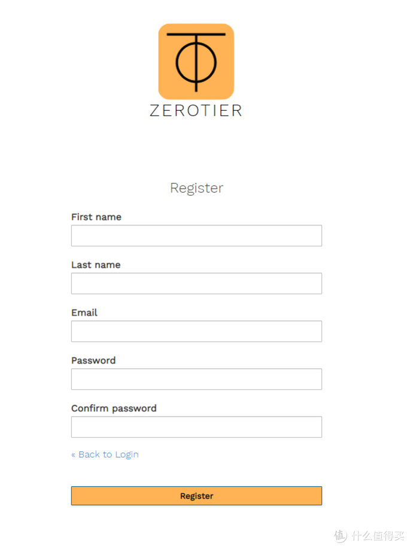](https://post.smzdm.com/p/a6lr6o8e/pic_6/)

注册页面填写上你的用户名、邮箱、设置密码...

好了之后点击页面下方的 register 注册...

[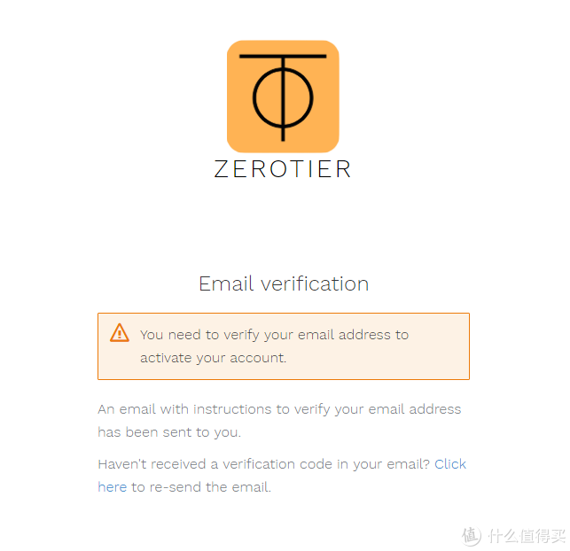](https://post.smzdm.com/p/a6lr6o8e/pic_7/)

提示给你留的邮箱发了一封验证邮件....

我们打开邮箱看看有没有收到验证邮件....

很快，看到邮箱里收到了一封验证邮件，打开邮件，里面有一个链接，点击链接即可...

[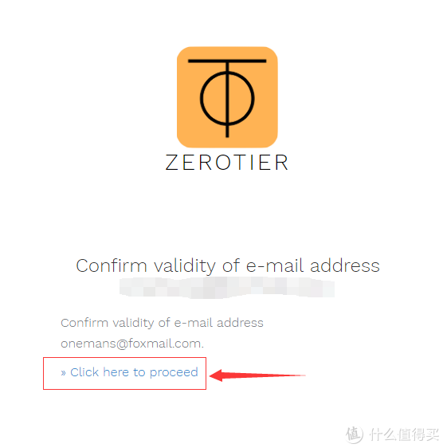](https://post.smzdm.com/p/a6lr6o8e/pic_9/)

点击邮件里的链接后，会转到验证页面....click here to proceed ..点击继续...

[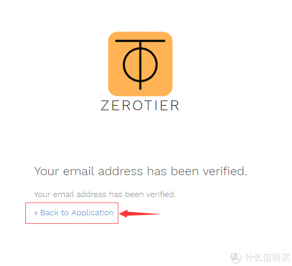](https://post.smzdm.com/p/a6lr6o8e/pic_10/)

验证成功....

[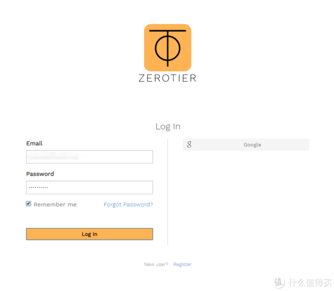](https://post.smzdm.com/p/a6lr6o8e/pic_11/)

用注册好的邮箱地址和密码登陆吧...

登陆后的个人账户页面...免费的free版本可以连接100台设备哦....

点击页面上方的 networks ，我们来创建虚拟网络啦.....

[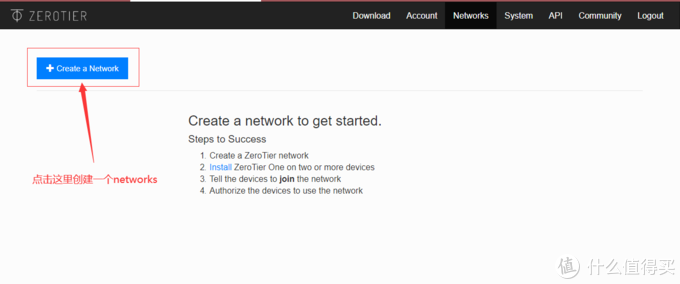](https://post.smzdm.com/p/a6lr6o8e/pic_13/)

点击创建网络...

[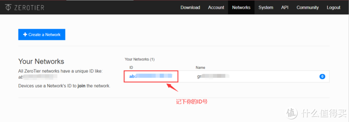](https://post.smzdm.com/p/a6lr6o8e/pic_14/)

创建好了...记住上图中红框里的一串字母数字混合的ID号...

在下文里会统称为“网络ID号”

以后我们每一台设备的连接都要用到这个网络ID号...

好了，服务端就创建好了...很简单吧....

下面我们来看看客户端怎么操作吧.....

## 二、威联通NAS端安装 zerotier one 并加入虚拟网络

首先放个下载链接：

[zerotier arm 版本](https://download.zerotier.com/dist/qnap/) （下载页面包括了 X86 及 X86_64 版本）

x86的威联通用户也可以直接在app center 中下载安装...

[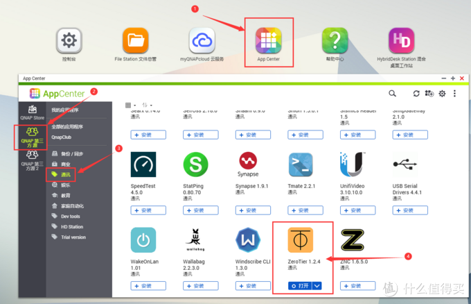](https://post.smzdm.com/p/a6lr6o8e/pic_15/)

在第三方源里找到 zerotier 点击安装，这里我已经安装好了....

好了之后，图标不会出现在桌面上，而且在app center 里点击打开也无法开启...

[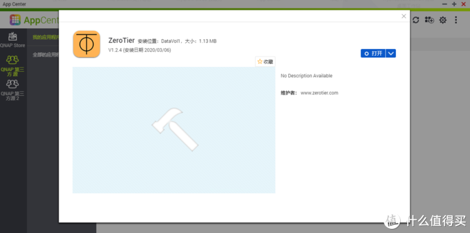](https://post.smzdm.com/p/a6lr6o8e/pic_16/)

点击打开，就会如上图这样.....

原来我们并不需要打开它，安装好以后，它就自己在后台运行着了...

我们要做的，就是把它和虚拟网络服务端连接起来....

那要怎么样才能使用呢...接下来就要用到 winscp 来把NAS加入到我们创建的虚拟网络中去了...

（winscp请自行搜索下载哦....）

[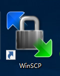](https://post.smzdm.com/p/a6lr6o8e/pic_17/)

这个就是 winscp 了... 安装好以后，打开它....

[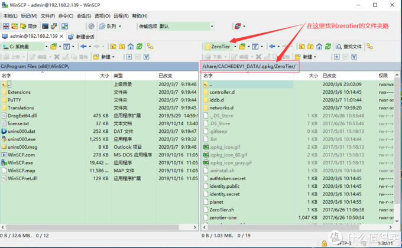](https://post.smzdm.com/p/a6lr6o8e/pic_18/)

登录你的nas后，找到 zerotier [文件夹](https://www.smzdm.com/fenlei/wenjianjia/)....按照图片中标注的路径找即可..

PS：关于第三方app源的添加、winscp的安装以及如何连接NAS，在这里就不重复写了...

具体可以参考一下我的系列文章第四篇：

[**小白折腾NAS 篇四：奔跑吧 QNAP 453Bmini — Download Station & QTransmission 安装与设置详解**](https://post.smzdm.com/p/aoowlr26)大家好，终于有时间在电脑前继续和大家分享QNAP453Bmini的使用心得了，不会做图、画圈圈、标注注释的我现在已是轻车熟路了......做图好难啊啊啊啊啊啊啊啊啊啊啊~~~~~~~~~~~但是我必须坚持......伟大的作品不是靠力量，而是靠坚持来完成的......我坚信坚持就能拿到众测.....[不会拍嗝滴爸爸](https://zhiyou.smzdm.com/member/7806038695/)|*赞*75*评论*100*收藏*572[查看详情](https://post.smzdm.com/p/aoowlr26)

 

找到文件夹后，这里我们要输入一条命令，很简单，就一条....

[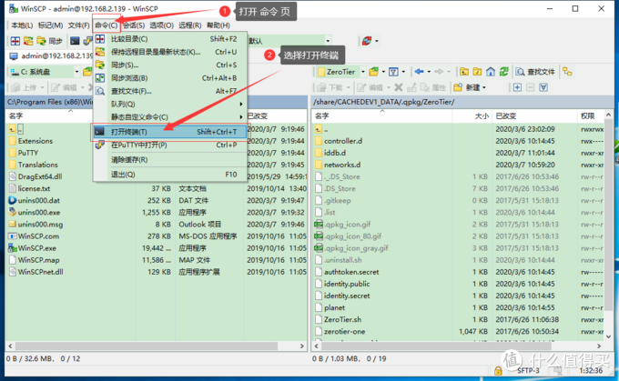](https://post.smzdm.com/p/a6lr6o8e/pic_19/)

如上图所示..在 “命令” 选项页下选择 “打开终端” .....

[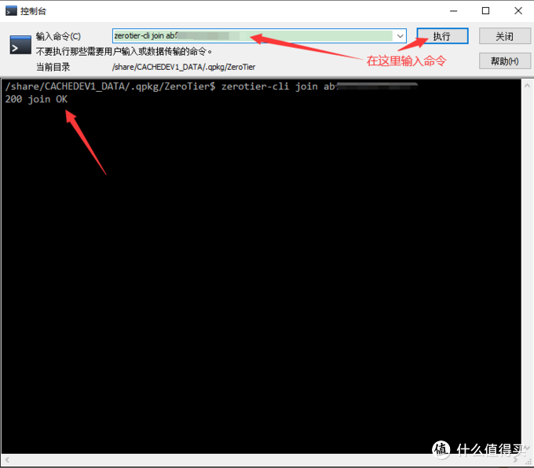](https://post.smzdm.com/p/a6lr6o8e/pic_20/)

在输入命令的框框里输入以下命令..

命令为：zerotier-cli join XXXXXXXXXXX 

然后点击 执行 ...

命令中的 XXXXXX 为我们之前申请创建的 网络ID号 ...

看到图中黑色框框里出现了 200 join ok .. 就是添加成功了.....

让我们回到 zerotier 官网的服务端页面上.....

[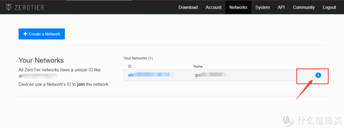](https://post.smzdm.com/p/a6lr6o8e/pic_21/)

看到有一台链接的设备了哦...如果没看到..就手动刷新一下......

我们点进去配置一下...

[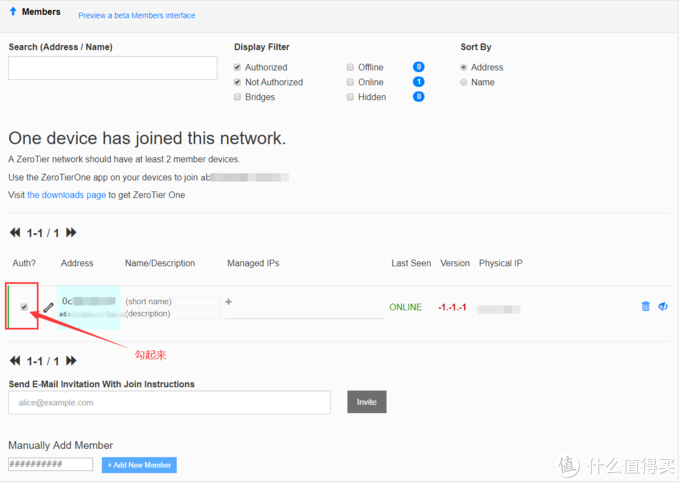](https://post.smzdm.com/p/a6lr6o8e/pic_22/)

进入页面后，往下拉，拉倒 members 这一段，就能看到设备的连接信息了....

如图所示，在设备连接信息的左边，有一个小方框，我们把它勾起来，这样就算是链接完成了....

[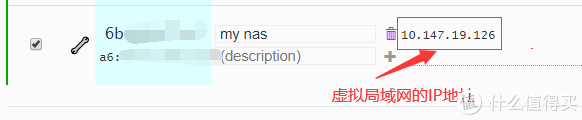](https://post.smzdm.com/p/a6lr6o8e/pic_23/)

一会就会出现虚拟局域网的IP地址了...

我的nas的虚拟局域网地址ip为：10.147.19.126 

记住这个地址哦，以后登录nas就用这个地址了...

这样就算是连接成功了....还是很简单吧...

安装完了，但是还不能测试，因为这只是把NAS加入到了服务端里...

如果我们想用PC端访问NAS，那就必须把PC端也加入到这个虚拟局域网里面来才行...

那就到PC端去安装吧...

## 三、PC端安装 zerotier one 并加入虚拟网络

还是先放上下载链接：

[zerotier win 版本](https://download.zerotier.com/dist/ZeroTier One.msi)

macos的版本可以到官网下载哦...

下载好以后点击安装即可...

安装向导....

[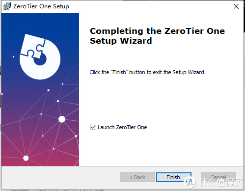](https://post.smzdm.com/p/a6lr6o8e/pic_25/)

好了，pc端安装完成了，赶紧来加入虚拟网络吧....

[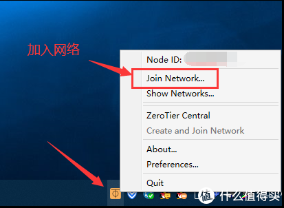](https://post.smzdm.com/p/a6lr6o8e/pic_26/)

运行后会在桌面的右下角显示zerotier的图标...

鼠标右键点它...选择 join network... 加入网络...

[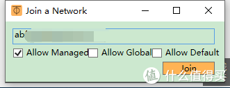](https://post.smzdm.com/p/a6lr6o8e/pic_27/)

会在右下角弹出一个 join network 的小条形框....

把我们之前创建的 网络ID号 填上去即可...

好了以后点击 join ...即可加入了...

[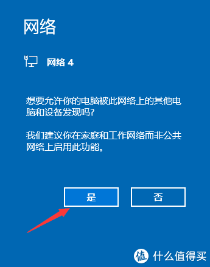](https://post.smzdm.com/p/a6lr6o8e/pic_28/)

点击加入后，会弹出一个新的网络对话框，点击 是 即可...

操作完成.....

那我们又得回到 zerotier 官网的服务端页面上.....

[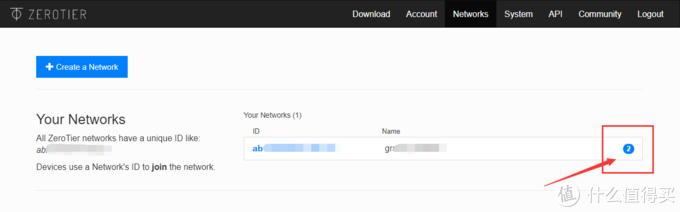](https://post.smzdm.com/p/a6lr6o8e/pic_29/)

看到设备连接数变成 2 了哦 ...

点进去配置吧...

[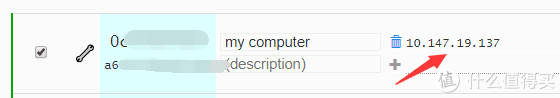](https://post.smzdm.com/p/a6lr6o8e/pic_30/)

把左边的勾勾打起来....

一会就看到了虚拟局域网的ip地址了....我的pc端地址为：10.147.19.137

那我们现在可以来测试一下了...看看的能不能登录nas....

浏览器输入NAS的虚拟局域网的ip地址，我的是 10.147.19.126

回车...

[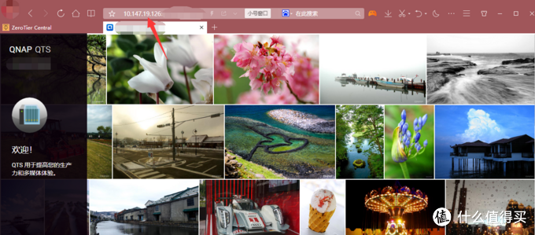](https://post.smzdm.com/p/a6lr6o8e/pic_32/)

效果蛮好的嘛....

试试远程 qsync 看看效果...（以下是到了办公室，把办公室的电脑加入了虚拟局域网之后的操作）

打开Qsync ..

[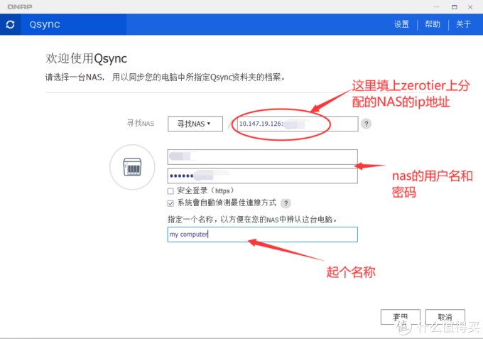](https://post.smzdm.com/p/a6lr6o8e/pic_33/)

填写好nas的虚拟网络ip地址，注意加端口号，这里我用的是我修改后的端口号.....

没改过的可以用默认的端口号....

默认的端口号多少来着...我不记得了...啊哈哈....可以登录nas查看默认端口号...

[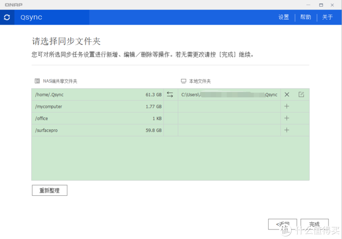](https://post.smzdm.com/p/a6lr6o8e/pic_34/)

在办公室的网络环境下，速度还是很稳的.....

关于Qsync的使用，可以参考我的系列文章第六篇：

[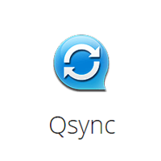](https://post.smzdm.com/p/ar08n82w)[**小白折腾NAS 篇六：疫情防控.我在岗. QNAP 453Bmini — Qsync 开启居家效率办公之路**](https://post.smzdm.com/p/ar08n82w)文章有点长，先附个目录吧...一、先说点题外话二、QsyncCentral简单介绍三、QsyncCentral安装、配置及使用详解1.预设同步共享文件夹2.QsyncCentral安装以及Qsync客户端安装3.Qsync客户端配置及使用四、QsyncCentral一些简单设置五、结语今年注定是不平[不会拍嗝滴爸爸](https://zhiyou.smzdm.com/member/7806038695/)|*赞*25*评论*43*收藏*212[查看详情](https://post.smzdm.com/p/ar08n82w)

 

好了..同步没问题了....这样就办公无忧了...

那么好玩，怎么能少了手机端....

## 四、Android端安装 zerotier one 并加入虚拟网络 

依然先放个下载链接：

[zerotier one 安卓版](https://www.lanzous.com/ia1z7be)

下载完成后安装上就可以了...

[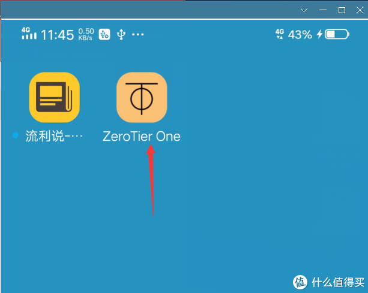](https://post.smzdm.com/p/a6lr6o8e/pic_35/)

安装完成后打开它...

[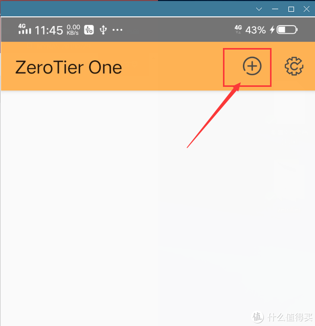](https://post.smzdm.com/p/a6lr6o8e/pic_36/)

点击右上角的 + 号 ，添加...

[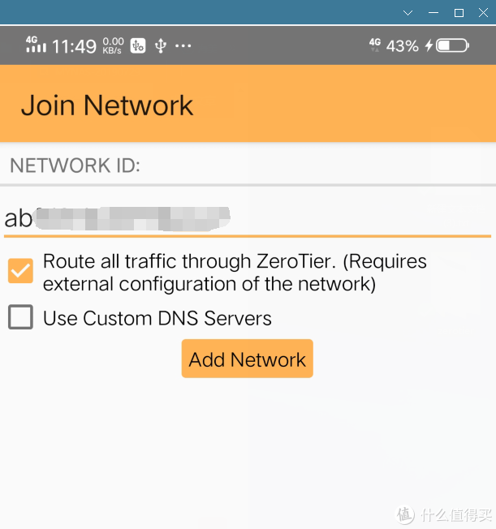](https://post.smzdm.com/p/a6lr6o8e/pic_37/)

把我们之前创建好的 网络ID号 填上去....

点击 add network 加入虚拟局域网...

[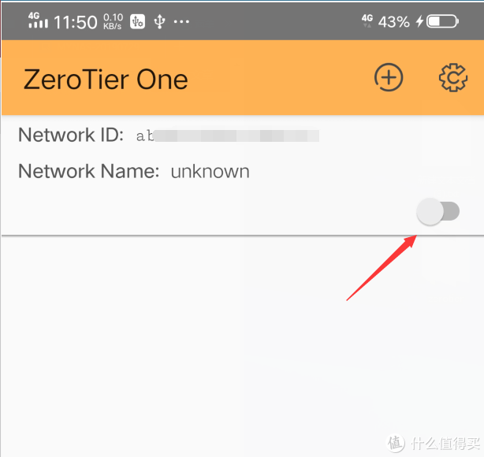](https://post.smzdm.com/p/a6lr6o8e/pic_38/)

这里有一个开关，我们要打开它。如上图所示...

[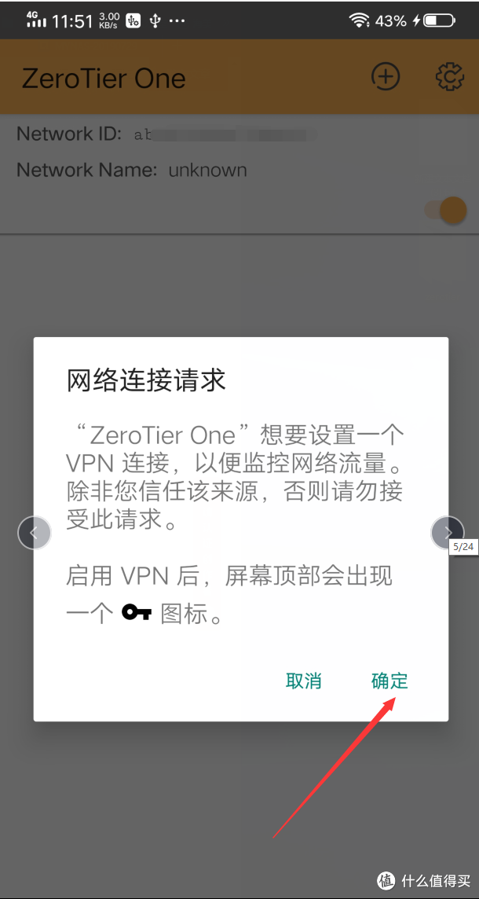](https://post.smzdm.com/p/a6lr6o8e/pic_39/)

会弹出一个连接请求...点确定即可...

[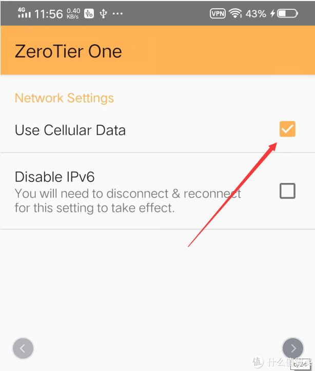](https://post.smzdm.com/p/a6lr6o8e/pic_40/)

在右上角有一个齿轮的图标，点进去，把蜂窝数据打开，就能在4G网络下使用了...

好了，我们又得回到 zerotier 官网的服务端页面上把手机设备勾起来...

[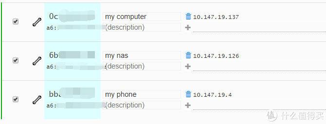](https://post.smzdm.com/p/a6lr6o8e/pic_41/)

把手机端勾起来...一会就出现虚拟局域网的ip地址了...

至此，已经加入了三个设备了哦....

那我们来测试一下吧...手机打开浏览器...

[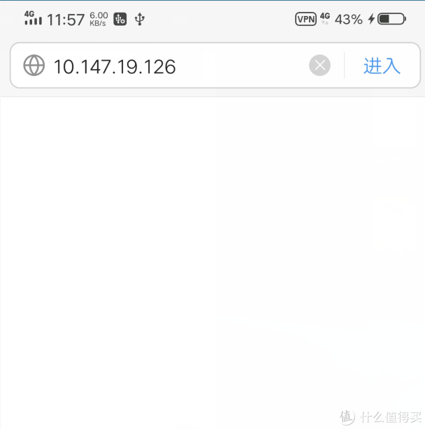](https://post.smzdm.com/p/a6lr6o8e/pic_42/)

输入nas的虚拟局域网ip地址...

速度很快....

[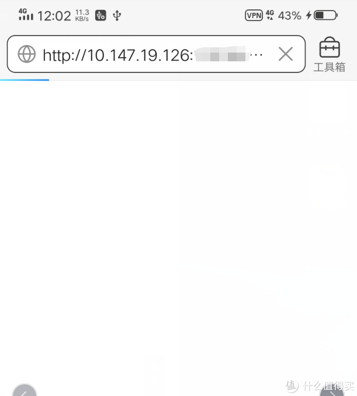](https://post.smzdm.com/p/a6lr6o8e/pic_44/)

有时候4G下会打不开，那就加上端口号....

[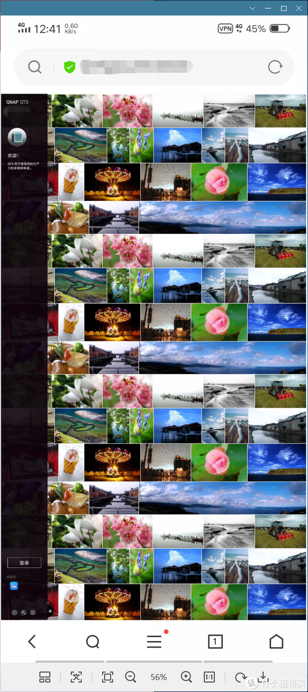](https://post.smzdm.com/p/a6lr6o8e/pic_45/)

4G连接成功.....

[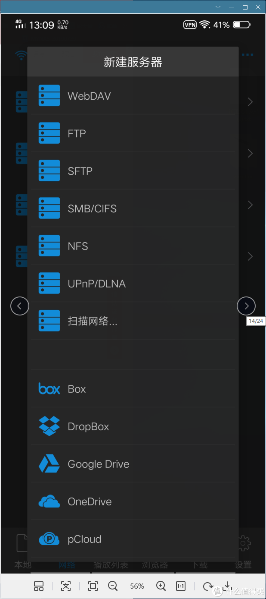](https://post.smzdm.com/p/a6lr6o8e/pic_46/)

也可以用手机访问PC端的共享文件夹哦...

打开nplayer，新建一个smb[服务器](https://www.smzdm.com/fenlei/fuwuqi/)，把PC端的虚拟局域网ip地址输进去.

我的PC端虚拟局域网的ip地址为：10.147.19.137

[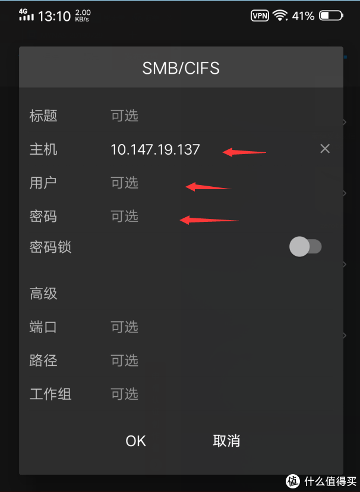](https://post.smzdm.com/p/a6lr6o8e/pic_47/)

我PC端这里没有设密码，所以没有填写...

点击ok ，就能看到PC端的共享文件夹了...

[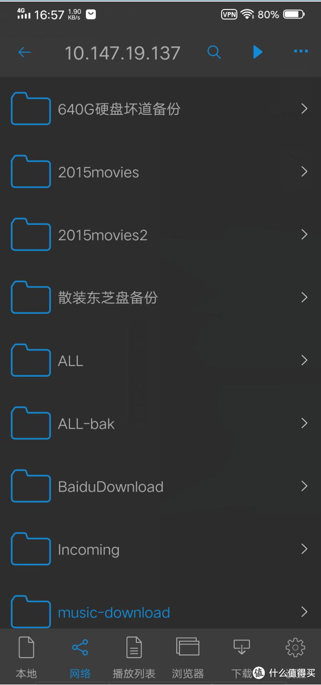](https://post.smzdm.com/p/a6lr6o8e/pic_48/)

打开一个文件试试看吧....

爱情宗师...很好听的一首歌....

再来试试nas端的远程播放....

因为是虚拟局域网，所以这里用smb服务器即可...

新建smb服务器，把地址、端口、用户名和密码都填好后，点击ok，就进去了....这里就不详细写了.....

[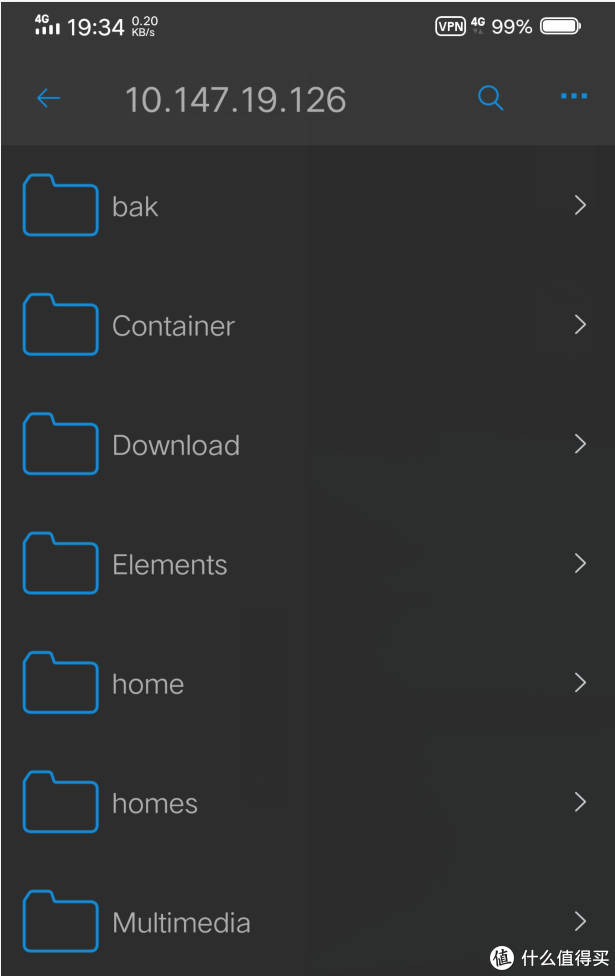](https://post.smzdm.com/p/a6lr6o8e/pic_50/)

nas的共享文件夹出来了...

[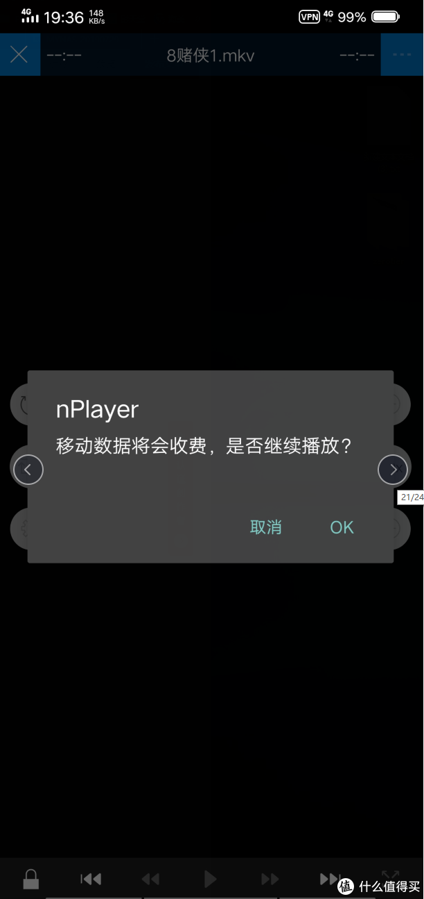](https://post.smzdm.com/p/a6lr6o8e/pic_51/)

4G下测试..找了一部经典的老片子....

也很流畅....

有没有很熟悉....

年轻时候的华仔....

好了，就先测试到这里吧.....

至于安卓[电视盒子](https://www.smzdm.com/fenlei/gaoqingbofangqi/)端，我暂时没有测试，有兴趣的也可以试着安装一下....

..........

关于如何远程观影的详细操作与配置.请参考我的系列文章第七篇，这里就不重复写了：

[**小白折腾NAS 篇七：手机PC电视盒远程学习一篇搞定 — QNAP.威联通.名师精品课堂随身带（极简入门）**](https://post.smzdm.com/p/ag82pz43)文章有点长，依旧附个目录先：目录开篇一、启用并配置WebDAV服务二、PC端简易配置1.完美解码（Potplayer）简易配置2.PC端直接映射网络驱动器（https方式）3.PC端直接映射网络驱动器（http方式）三、安卓Android平台简易配置1.手机端2.盒子端四、ios平台简易配置结语开篇[不会拍嗝滴爸爸](https://zhiyou.smzdm.com/member/7806038695/)|*赞*74*评论*31*收藏*708[查看详情](https://post.smzdm.com/p/ag82pz43)

 

## 五、ios端安装 zerotier one 并加入虚拟网络

由于苹果中国商店已经下架了zerotier one ，所以想要下载的朋友要用国外账户去下载了.....

自己注册一个国外的apple id 账户去下载吧.....有一个国外的apple id 我觉得还是很有必要的...

配置什么的和安卓端是一样一样的....

这里就不详细说了......

不过听说ios端存在连接不上的问题...不知道是什么原因...可能被强了...有兴趣的朋友可以试一下...

美中不足吧....哪怕ios端真的用不了了，那还有PC端和安卓端，也可以解决很多实际问题了......

## 六、Transmission 测试

来试一下大家最关心的下载功能吧... 测试是在PC端下操作的....

找了一个内网环境，把我的 surface pro 加入虚拟局域网，ip地址为：10.147.19.135

然后安装了一个 transmission ..没有端口转发....51413的端口也是关闭的....200M电信网络....

下载一个pt种子看看什么情况...

[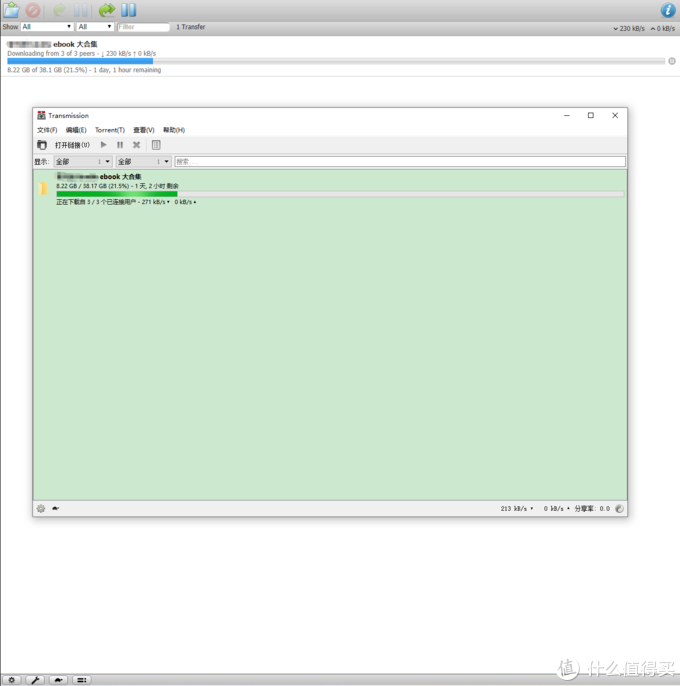](https://post.smzdm.com/p/a6lr6o8e/pic_55/)

下载速度大概 200K — 300K/s 之间.....

[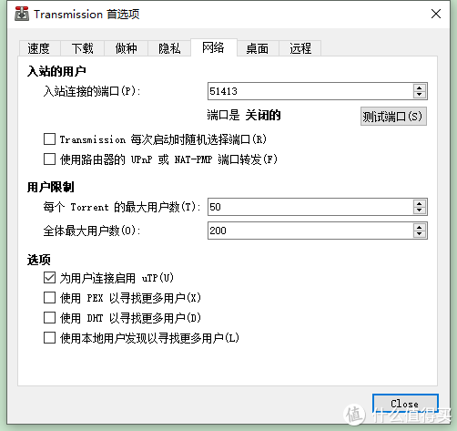](https://post.smzdm.com/p/a6lr6o8e/pic_56/)

51413的端口是关闭的....

我们用手机看看能不能远程操控...

因为是PC端，所以先在tr里设置

[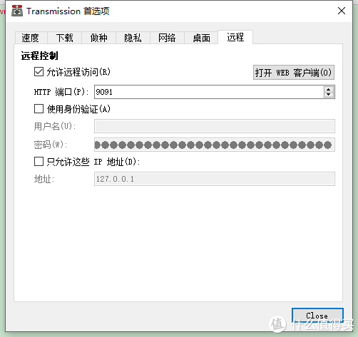](https://post.smzdm.com/p/a6lr6o8e/pic_57/)

默认的远程 http 接口为 9091 ..

用手机4G网络连连看...

[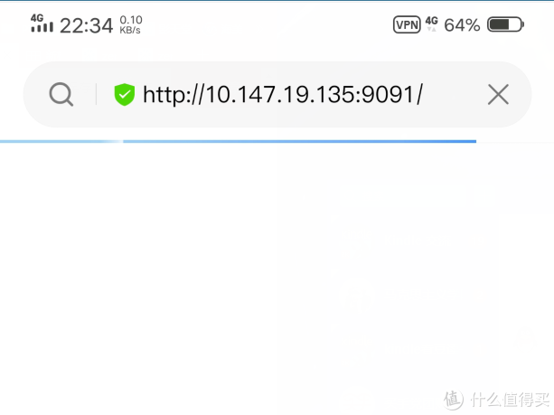](https://post.smzdm.com/p/a6lr6o8e/pic_58/)

输入设备虚拟局域网的ip地址+tr端口号 9091 ...

[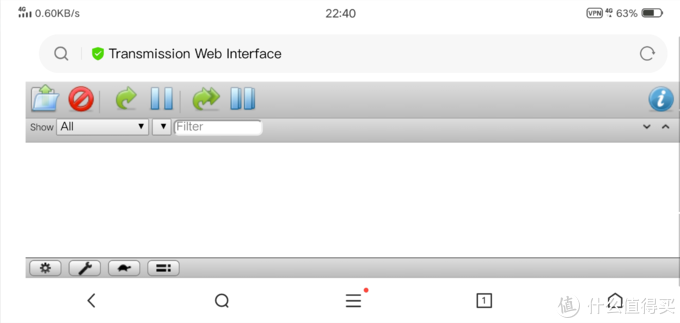](https://post.smzdm.com/p/a6lr6o8e/pic_59/)

顺利登入.....熟悉的界面....

[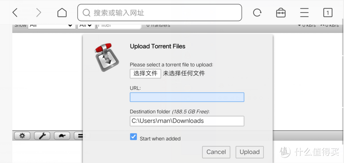](https://post.smzdm.com/p/a6lr6o8e/pic_60/)

各项功能都没问题...

[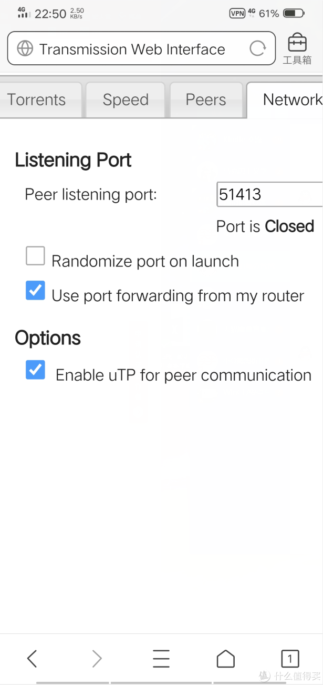](https://post.smzdm.com/p/a6lr6o8e/pic_61/)

51413 端口依旧是关闭着的....

可以远程添加任务.....速度和你原来下载的速度是一样的......

因为设备连上了服务端之后，剩下的就是直连了......

再换一个地方测试吧，到办公的地方测试一下办公场所的内网....

[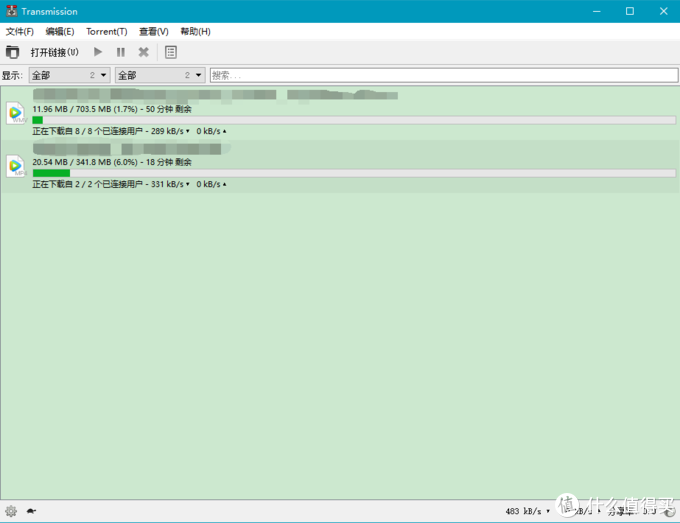](https://post.smzdm.com/p/a6lr6o8e/pic_62/)

这里速度好一些，不知道是不是种子热度关系....

[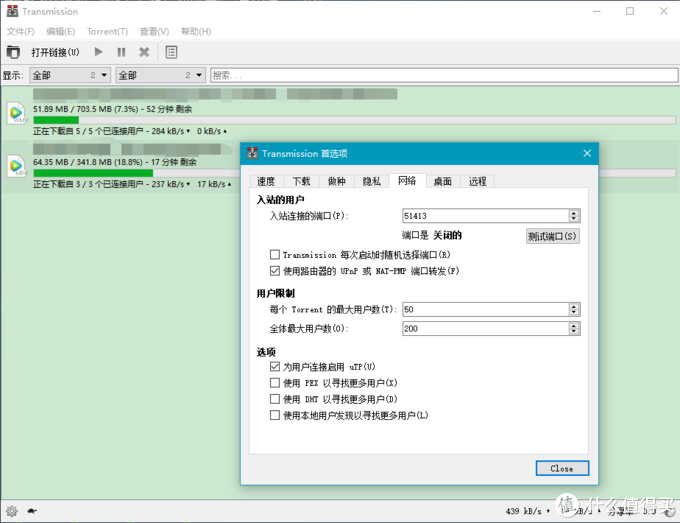](https://post.smzdm.com/p/a6lr6o8e/pic_63/)

51413端口也是关闭的...

远程操作虚拟局域网的tr的web端也没问题....

至于怎么提速.....暂时也还没有具体的解决方案...留待以后再写.....

网络通了自然就有办法的... 

...........................

这里还是要简单来了解一下 zerotier one 的基本原理...

这里我引用一下...也让大家有一个简单的了解...

“zerotier one 节点之间的传输是属于 P2P.UDP 直连，无需服务器中转流量，互联速度仅仅取决于你的设备和其他节点的直连上传带宽（当然握手之初是需要经过中心服务器来当媒婆的，之后就是UDP直连了！）

连上后各个虚拟网卡相当于同一局域网内，无应用的限制了.....

至于有哪些应用场景就需要读者你自己脑洞大开了....

同时官方还给出了让用户自行在有公网ip的机器上搭建moon卫星级服务器，供带组建内网的其它设备握手使用以提高握手速度和稳定性，感兴趣和有条件的朋友可以去探索和折腾了。”

（以上“ ”引号内的内容来自爱问资讯网.）

简单点来理解就是，zerotier 只负责组网，组网完成后，zerotier就完成任务了，之后的设备之间的传输就是点对点的传输了，速度取决于你的设备以及你所处的网络环境.....

因为 zerotier 的服务器是在国外的，如果觉得速度不够或者不稳定，还可以找身边有公网ip的朋友，在他那里设置一个 zerotier 的 moon 服务端，也就是把服务端从国外搬回了国内，可以提高速度和稳定性.....

这里就不详细写了.....

## 结语

好了...今天就先写到这里吧......

zerotier one 确实是一款功能完备的内网穿透工具....点对点的连接方式也让人觉得更安全一些...

在实际使用中..有wifi的地方会比4G网络要流畅...速度会更好一些...

操作上也是极其简便，因为是虚拟局域网..一切操作都像是在家里般...

端口什么的都不用去考虑....

各种nas的应用也可以使用得到...

当然.对比公网ip下的使用，免费版本的 zerotier one 也存在着不稳定和缺点..

但是对于没有公网ip的用户来说，不失为一个很好的内网穿透解决方案....

没有公网ip的朋友也可以用 zerotier one 来安慰一下受伤的心灵...

也让沉睡中的NAS得以苏醒......

好了.今天的学习记录就先到这了....

下篇再见......

........................

码字不易.如本文对您有帮助，请点赞打赏.关注收藏来一波.

感谢您的支持......

2020.3.8. 17:30 ...

（头图来自百度图片...）