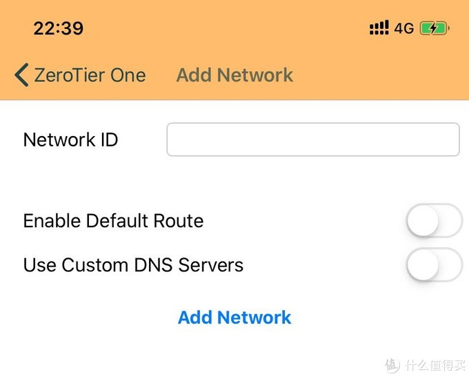
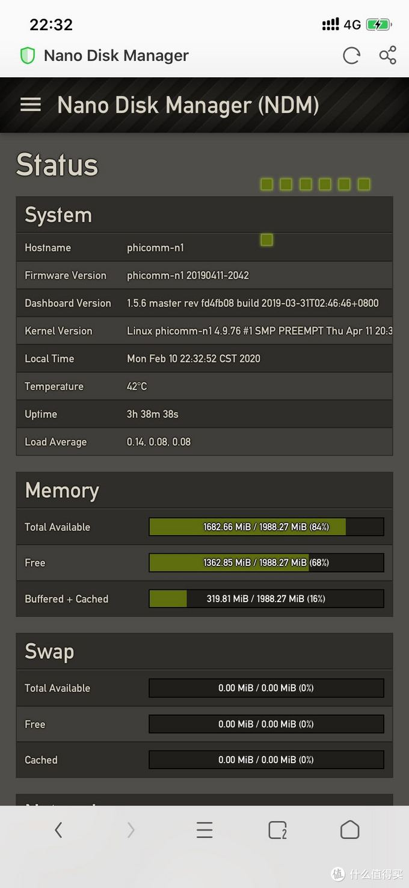

# 小白折腾记：N1小钢炮安装Zerotier 实现远程访问

https://post.smzdm.com/p/a8394x07/

2020年，开年战疫情，假期延长，闲来无事瞎折腾。

N1挖矿已死，闲置已久，本人小白一枚，奈何善于学习，最近趴在网上研究大神们的各种教程。

从刷小钢炮到最终解决了N1小钢炮的远程访问问题，步履维艰，折腾了好几天。

Zerotier是什么就不解释了，小白也解释不清楚，各位自行度娘。

小白只知道N1可以利用Zerotier来实现远程访问，今天要写的也是尽量让小白能看懂的内容。

### 一、N1安装Zerotier准备工作

1、硬件：一台已经成功刷机的小钢炮

可以参考张大妈上“法行天下”的教程，比较详细，适合小白，但实际操作过程中也有需要注意的一些问题，后续再写。

2、软件：Mobaxterm工具，Putty工具也可以，自行度娘下载，下面是以Mobaxterm演示，安装后如下。

3、小钢炮插电开机，插上[网线](https://www.smzdm.com/fenlei/wangxian/)，连上[路由器](https://www.smzdm.com/fenlei/luyouqi/)，与电脑保持在同一局域网下，当然小钢炮已经按照“法行天下”的教程完成了大部分的设置。

### 二、小白级操作——安装Zerotier

操作分两个步骤进行，安装entwarey以及zerotier。

主要参考了张大妈“”上“[Ttiramisu](https://zhiyou.smzdm.com/member/5564696012/)”发布的“N1小钢炮安装zerotier 进行内网穿透”一文，这篇文章写得过于简单，全是代码，初看完全摸不着头脑。

先安装entware，具体操作：启动Mobaxterm，点击“Session”创建会话，选择SSH，输入N1的IP地址（打开路由器后台自行查看即可），其他不用设置，如下图：

进入到对话框，输入N1账户名，一般是“root”，然后回车，会要求输入密码，N1小钢炮的登陆密码，不是其他，注意，此时输入密码是不显示的，不要觉得奇怪，果断输入完后直接回车就可以连接上N1，如下图。

然后可以利用张大妈上“[Ttiramisu](https://zhiyou.smzdm.com/member/5564696012/)”发布的“N1小钢炮安装zerotier 进行内网穿透”一文中的命令先安装entware，再安装zerotier。

安装entware命令，先后输入：

1、rm -rf /opt；

2、mkdir /opt；

3、cd /opt；

4、wget -O - http://bin.entware.net/aarch64-k3.10/installer/alternative.sh | sh

以上，一步一步输入命令回车即可。

注意这一步：将自带opkg改名为opkg_bak暂时停用 灯大固件更新可以改回来免重装系统更新软件（代码为mv /usr/bin/opkg /usr/bin/opkg_bak），输入后说是找不到文件，如下图，直接略过了。

接下来，配置entware环境变量以及检查是否报错，先后输入命令：

1、输入vim /etc/profile，回车后直接在前面/usr/sbin:这行下直接添加下面两行：（第一行为/opt/bin:），（第二行为/opt/sbin:）。

然后保存退出，保存退出操作为：先按ES[C](https://pinpai.smzdm.com/63503/)，然后输入命令为:wq，再Enter回车即可。

然后，使配置生效，输入命令为：source /etc/profile。

检查entware环境安装情况看是否报错，依次输入命令为：opkg update。

回车后，再输入命令opkg list，再回车，无报错就算成功了，如下图。

最后一步安装zerotier，输入安装命令，opkg install zerotier，然后输入启动命令，zerotier-one -d，启动zerotier。

再输入检查命令，zerotier-cli inifo，回车无报错，显示 zerotier版本，至此N1小钢炮成功安装zerotier，参考下图，暂时不要关闭Mobaxterm，下面也会用到。

注意这一步无法操作，再次略过： zerotier配置开启自启命令，输入vim /etc/init.d/S50zerotier.sh，然后写入命令，#!/bin/shzerotier-one -d，最后保存，接下来输入命令，chmod 777 S50zerotier.sh，给予权限。

### 三、[手机](https://www.smzdm.com/fenlei/zhinengshouji/)端安装Zerotier远程访问N1

第一步，度娘“zerotier”选择官网进去，注册Zerotier账号，主要是输入邮箱，虽然是全英文界面，但非常简洁，很容易操作。

然后，进入账户，点击右上方的“network”，进入界面，再点击“create a network”,创建网络，会随机得到一个network id，这个很重要，后面会用到，如下图：

点击network id进入设置界面，里面实际上也不用进行过多设置，下拉到“Members”这个位置，显示“no devices”也就是没有设备连接到网络，接下来就是将N1以及要访问N1的设备连接到Zerotier。

第二步，回到之前的Mobaxterm对话框，如果掉线了，按照之前的操作重新登录连接N1，然后输入命令，zerotier-one -d，启动zerotier，如果已经启动了就不用输入，否则会报错为不能连接端口。

直接输入连接Zerotier命令，zerotier-cli join xxxxxxx，（xxxx即为此前获得的network id），连接成功显示：200 join ok，此时N1即成功连接Zerotier，如下图：

再进入此前在Zerotier网站上创建的network id，会发现“Members”位置已有设备接入，即为N1。

注意，Auth一栏未打钩对应前面为红线，表示还未对设备授权，打钩后会变成绿色，中间位置的IP即作为外网访问之用。

第三步，手机端安装Zerotier，安卓以及iOS均有客户端，本次利用[苹果](https://pinpai.smzdm.com/1687/)端操作，目前苹果端中国区Zerotier已下架，须用美区账号下载，此处下载操作省略。

下载安装成功后点击桌面上的图标进入，再点击右上角的加号进去，输入此前的network id，最后点击下方的add network，手机提示建立VPN，同意即可，即完成，再到网页端进行授权。

网页端勾选两个设备前面的框即完成Zerotier的所有连接操作，胜利在望。

### 四、远程访问N1成功

根据上图，此处N1获得Zerotier自动分配的IP地址为10.244.141.133。

断开手机wifi，利用数据流量，用该IP在苹果手机浏览器登陆N1小钢炮。

成功进入小钢炮的登录页面，输入密码。

“废物”再利用，外网小钢炮登录成功，远程访问大功告成。