#  数据化时代-内网穿透 篇二：Frp轻松设置

https://post.smzdm.com/p/ag87d8pd/

## 前言：

之前给大家分享了一个最简单的内网访问的办法， 使用[华硕](https://pinpai.smzdm.com/1681/)DDNS， 同样原理有很多家DDNS。 被老铁们质疑说不属于内网穿透。这里还是想说下， 因为想写一个专栏，所以把关于内网访问的几种方法就统一放在里面了。 目的达到就可以了，谁会在意那么多细节呢，你们说是不 

附上之前的文章，家里有华硕[路由器](https://www.smzdm.com/fenlei/luyouqi/)/动态公网IP的可以直接试下。

 

[**数据化时代-内网穿透 篇一：最简单的ddns--华硕版**](https://post.smzdm.com/p/a3gvg9k7)【写作说明】：一直叨叨有机会给大家分享一些内网穿透的方法。但是本人严重拖延症，加上不上班，毫无动力。。so。。。今天开始从第一篇写起，内网穿透有很多方法，慢慢的从浅入深分享给大家，软件使用经验纯个人向，不完整，期待与大家一同交流分享。技术有高低，我仍是攀登少年。内网穿透的作用：老生常谈的话题，大家研[刷我滴卡布](https://zhiyou.smzdm.com/member/5515505717/)|*赞*21*评论*26*收藏*199[查看详情](https://post.smzdm.com/p/a3gvg9k7)

 

下面开始今天的分享 

## 软件说明：

Frp：frp 是一个可用于内网穿透的高性能的反向代理应用，支持 tcp, udp 协议，为 http 和 https 应用协议提供了额外的能力，且尝试性支持了点对点穿透。

说人话就是可以通过一个公网[服务器](https://www.smzdm.com/fenlei/fuwuqi/)当作中介，使用一个域名或者IP访问内网的服务 不知道大家能不能理解 

（就是内网穿透， 就完了。哪弄多废话） 

该软件支持Windows、Linux、macOS、ARM 等各种平台。

## 软件要求：

公网服务器1台  （IP访问）   这里可以去阿里云之类的购买vps服务器（买个配置低的就行，自己玩玩。最好是linux系统）

域名一个（使用IP访问的话，可以不需要域名）

以上两个东西需要自己购买，这里单纯给大家分享搭建与使用的经验

## 软件使用方法： 

### 1.安装服务端。  

使用ssh工具连接咱们的公网服务器。 这里我用的是putty https://smzdm.lanzous.com/b015ejg5g

输入[运营商](https://www.smzdm.com/fenlei/taocanjiliuliangka/)给你的公网IP地址 和端口号

[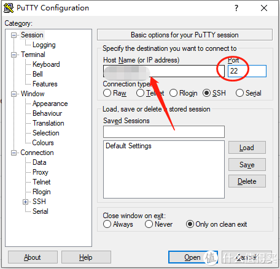](https://post.smzdm.com/p/ag87d8pd/pic_2/)点击open

进入frp下载连接

https://github.com/fatedier/frp/releases

选择你的系统所需要的版本，以linux为例， 右键该连接， 选择复制连接 

[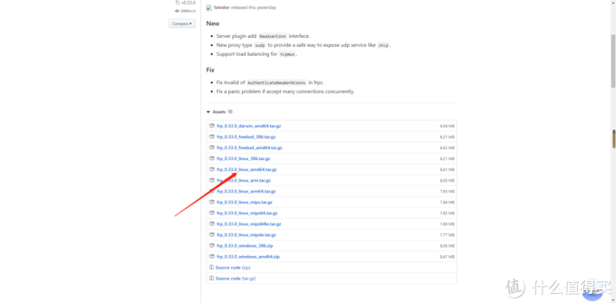](https://post.smzdm.com/p/ag87d8pd/pic_3/)我这里的链接如下。有可能会更新出新的版本，大家选择最新的就行

因为我发文章的时候这个版本刚更新，我下面的图片是之前截好的，所以就按32的版本给大家介绍。不影响使用

终端输入

wget https://github.com/fatedier/frp/releases/download/v0.32.1/frp_0.32.1_linux_amd64.tar.gz

（这里的wget后面是有个空格的注意下） 

[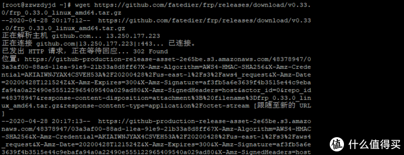](https://post.smzdm.com/p/ag87d8pd/pic_4/)输入完之后，按下回车自动下载

下载完毕后，在输入框输入 ls 查看是否有该文件。  然后 输入

tar -zxvf frp_0.32.1_linux_amd64.tar.gz

[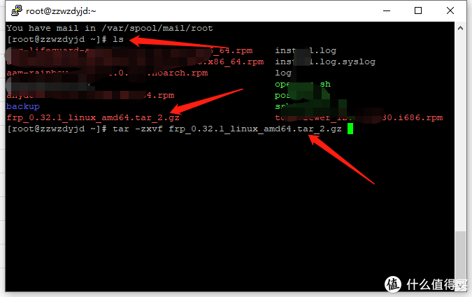](https://post.smzdm.com/p/ag87d8pd/pic_5/)该命令是解压的意思

输入

cd frp_0.32.1_linux_amd64 

再次输入

vim frps.int

[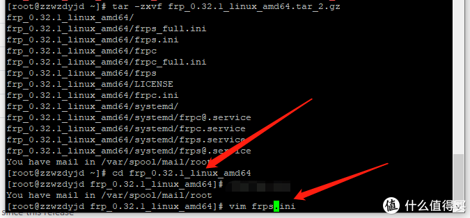](https://post.smzdm.com/p/ag87d8pd/pic_6/)cd是进入文件夹的意思，vim是编辑该文件的意思

[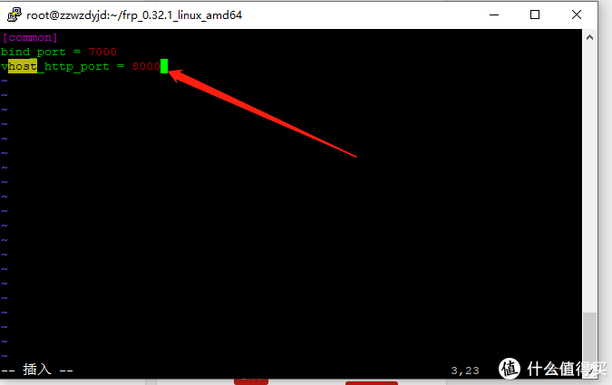](https://post.smzdm.com/p/ag87d8pd/pic_7/)看到里面有些内容

按下 键盘上“i”键 进入编辑模式

[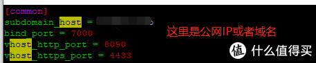](https://post.smzdm.com/p/ag87d8pd/pic_8/)输入成这个样子

然后按下键盘“esc” 输入 :wq   记住有冒号

在界面输入

 ./frps -c frps.ini 

测试服务端，如下图表示服务端启动正常

[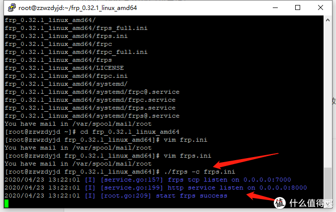](https://post.smzdm.com/p/ag87d8pd/pic_9/)

配置服务端自启动，退出测试状态，终端输入

nohup ./frps -c frps.ini & 

[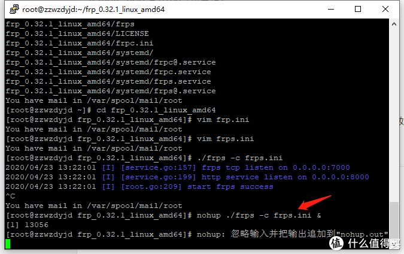](https://post.smzdm.com/p/ag87d8pd/pic_10/)此时服务端已经配置完毕了

 到此为止，服务器端已经配置完毕了。  不过一般云服务器的小伙伴需要设置下进出站规则，把这几个端口你给打开，每家的设置不大一样， 大家可以百度下。

### 2.配置客户端：

这里我以我自己的黑[群晖](https://pinpai.smzdm.com/2315/)为例子。 别的平台原理相同。

 题外话： 我发帖喜欢给大家分享一些思路，但是具体操作感觉有时候自己琢磨一下再相互探讨更有意义 ，希望在这里能和大家一同进步。

下面开始配置：（如果还没设置外网访问的话，这里操作需要本地局域网）

进入群辉的控制面板

[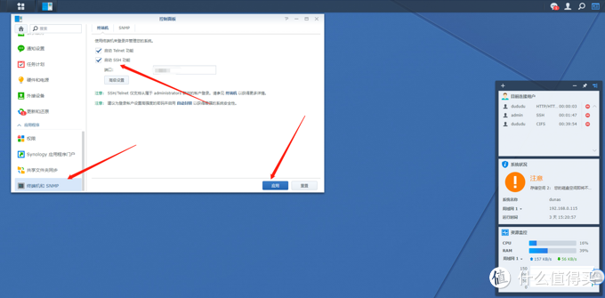](https://post.smzdm.com/p/ag87d8pd/pic_11/)在这里把ssh打开

同样的使用putty连接nas。 在地址栏输入群辉的IP

进去之后

配置root账号

login as：输入admin账号。就是当时登陆群晖输入的账号。输入admin的密码。（输入完按回车）

登录成功后，输入sudo -i

会提示输入密码password，这边还是输入admin密码。

看到root@……：~#这样的信息就是已经进入到root账号了。

设置root账号密码，输入synouser --setpw root password 这里的password最好和admin密码一样，这样不容易搞错。

同样的和刚才下载一样，

终端输入wget https://github.com/fatedier/frp/releases/download/v0.32.1/frp_0.32.1_linux_amd64.tar.gz

（这里的wget后面是有个空格的注意下） 另外我的版本是需要这个软件，还是重复下，按自己的版本下载

[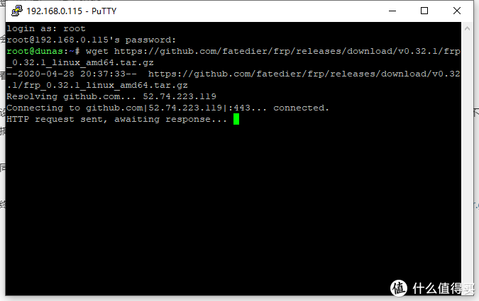](https://post.smzdm.com/p/ag87d8pd/pic_13/)自动下载

下载完毕后，在输入框输入 ls 查看是否有该文件。  然后 输入

tar -zxvf frp_0.32.1_linux_amd64.tar.gz

[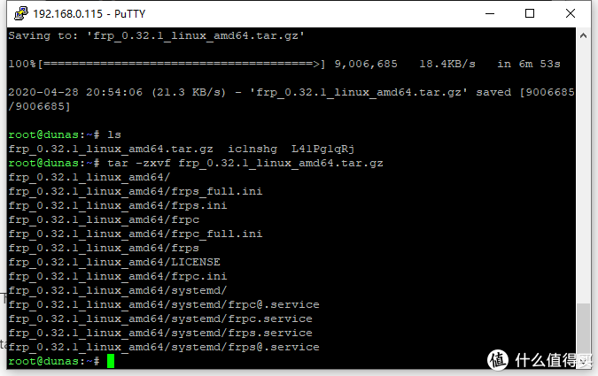](https://post.smzdm.com/p/ag87d8pd/pic_14/)

输入

cd frp_0.32.1_linux_amd64 

vim frpc.int

这里注意下， 这回编辑的是 **frpc 不是frps** 别写错了

[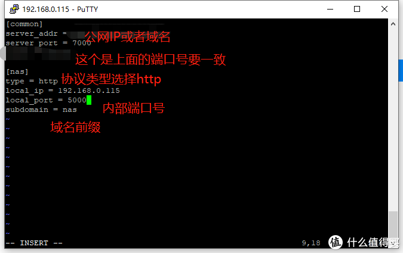](https://post.smzdm.com/p/ag87d8pd/pic_15/)

这里 设置不同的协议，需要设置的端口号也不同， 具体看大家想访问什么，不懂得可以在下面留言我给大家说明。   好几种协议，写起来的话太繁琐了。 

终端输入 

./frpc -c frpc.ini

显示如下表示客户端运行正常

[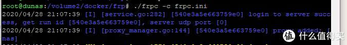](https://post.smzdm.com/p/ag87d8pd/pic_16/)

输入

配置服务端自启动，退出测试状态，终端输入

nohup ./frpc -c frpc.ini & 

## 效果展示：

[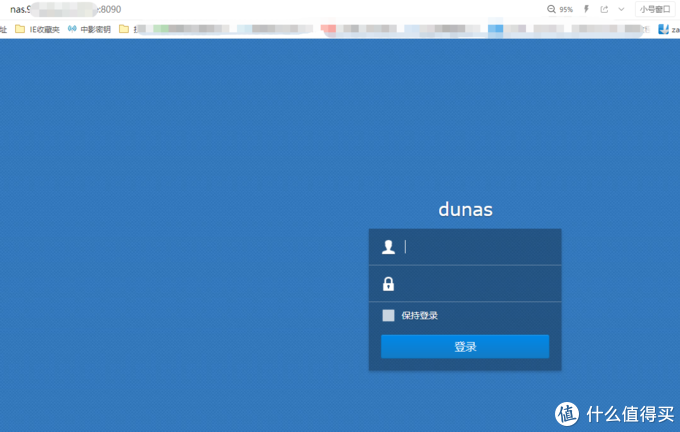](https://post.smzdm.com/p/ag87d8pd/pic_17/)8090是我之前设置的http的端口号还记得么

因为80端口需要备案，所以我设置成了8090 。 大家可以根据需要自己选择端口号。 记得要设置出入规则就好

## 总结：

其实一步步操作下来并不复杂

服务端：下载版本→解压→设置frps.int→启动

客户端：下载版本→解压→设置frpc.int→启动

只是区别一个服务端server文件，一个客户端client文件

另外就是端口的出入规则就好了。  大家有兴趣的可以自己尝试下，有问题可以在评论区相互探讨。 

后续慢慢的我会给大家分享更多的技sao术cao流zuo

最后，希望老铁们三连走一波，碎银子砸我 

 都月底了别藏着了，留给我吧。像我这种看着孩子，还能高产似母猪的作者需要碎银子支持 

 点赞，收藏，打赏一条龙服务。 来他个轮回帝王套

  

未经授权，不得转载