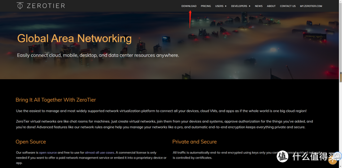
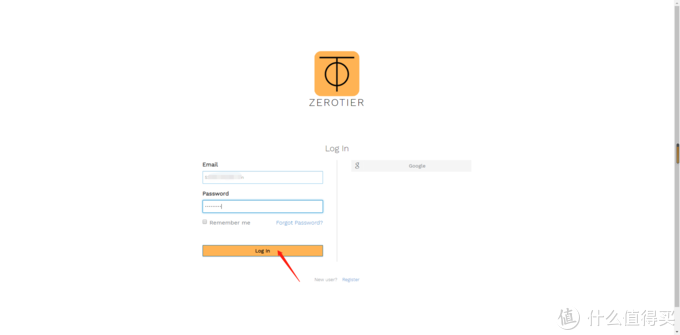
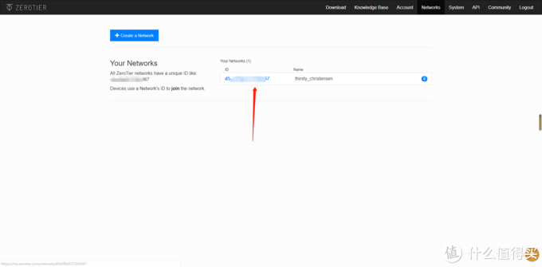
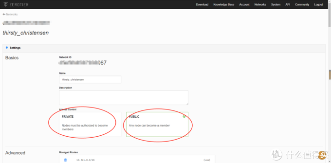
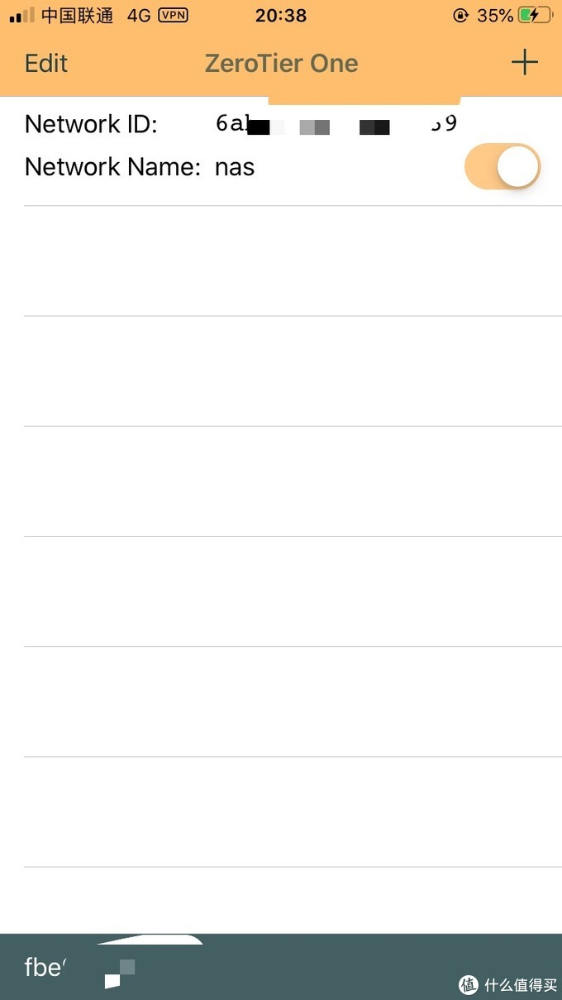

# 数据化时代-内网穿透 篇四：vpn异地组网--zerotier

https://post.smzdm.com/p/aekedpq3/

【写作说明】：旨在分享本人用到的一些好软件，仅限个人使用经验，相对并不完整。技术有高低，我仍是攀登少年。

## 前言：

其实这篇文章在4月就该发出来了。我给忘记了 。 光保存草稿没点发布。

现阶段的小伙伴们通常会有一些访问异地电脑或者nas的需求， 不管是翻阅公司资料，查看nas小姐姐。。诸如此类。  那么 新手小白们如何轻松实现，成为别人眼中的科技大佬** ， 跟上我的脚步，带你装逼带你飞。**

## 推荐原因：

国内[运营商](https://www.smzdm.com/fenlei/taocanjiliuliangka/)并不会为每个人都分配公网IP，毕竟ipv4全球已经用光，给一个少一个 公司的运维也不会给你开通远程管理的权限。

那么当咱们**没有公网IP**的时候该如何访问呢。 这时候vpn不失为一个比较好的选择。 本篇将讲解如何利用 zerotier进行异地组建局域网

优点：安装简单，使用方便，后台直观。免费用户最大可拥有100台设备，无需公网IP，占用资源不高，网速较为可观。

## 实现效果：

免费用户可以组建100台设备的局域网，支持Windows、macOS、Linux、IOS、Android、及一些常见nas平台。

除[手机](https://www.smzdm.com/fenlei/zhinengshouji/)端之外，可与任何平台网络共存，后台运行。 100台设备之间相互访问。

效果直观，设置简单

## 安装教程：

[官网：](https://www.zerotier.com/)

点击download进入下载页面

该网页有各种平台下载方式及地址

往下拉可以看到该软件支持的平台非常多，几乎涵盖了所能用到的所有平台。下面以最基础的windows端，手机端，[群晖](https://pinpai.smzdm.com/2315/)nas端为例，给大家分享教程。 

### windows端：

点击win端的，MSI文件下载至桌面进行安装。

安装过程没啥写的，无脑下一步就好使  最后点击 finish

电脑右下角出现该角标，点击右键显示如图

现在，先把软件放在一边， 咱们需要去网站进行注册 

[进入网站：](https://my.zerotier.com/login)

也可以在刚才的官网右上角，点击my.zeritier.com

点击登录

点击下方register

输入注册信息点击注册

输入刚才注册信息登录

全英文，看不懂？不要慌

虽然全英文不过和咱一点关系没有，不要慌。  看到中间选择的是free 知道是免费版就行了 点击右上角networks

点击蓝字

这里可以先把蓝字复制一下，等会有用。 点击蓝字可以进入。   蓝字代表着你的ID， 所有的客户端均可以通过这个ID加入到你的局域网

这里讲解下 这两个选项的区别。 第一个是如果加入你的局域网，需要你授权。  第二个就是任何人都能加入。 

如果是有些隐私的话，建议选择第一个。 

这一页中间的是添加路由

中间的意思你可以设置一些指定的网络访问到另一个网络的内网里面， 这里不做具体测试，大家有兴趣自己搞看看。

下面蓝色意思你可以选择一个自己想要的局域网IP段。 为了区分你内网和vpn网络。 比方咱们设置了 192.168.192.*  那么有一台机器加入到其中， 设置的IP为 192.168.192.100  那么你其他同局域网机器，需要通过这个IP去访问它

暂时页面就讲这么多，足够咱们基础用了。剩下的内容大家有时间自己可以研究研究 

下面回到PC端， 右键角标，点击join network  在弹出的框里面粘贴刚才复制的蓝字ID

点击join

会提示你出现一个新的网络啥玩意的，点击是 

回到网页端，可以看到出现一个信息

如果开启验证的话，前面会显示虚线

点击那个小框勾选一下， 左侧虚线会变成实线绿色。 说明连接成功

电脑端软件显示如上图

此时电脑端已经安装成功。

### nas端（群晖）：

nas端以群晖为例，在官网下载群晖版本的安装文件， 在群晖套件中心，选择手动安装。

选择安装文件点击下一步就可以，最后选择启动

设为头图

在箭头处输入网页端那个ID点击join

这里因为我之前已经连接上了。 所以上面会有内容， 正常连接成功后应该和我一样， 左侧显示online

回到网页端，开启网络连接

箭头处online显示说明连接成功，  中间的+号那里，可以固定一个IP地址， 建议固定上，方便查找

接下来尝试在windows端使用zerotier提供的IP段访问外部nas感受一下

可以看到nas的局域网我设置的是192.168.191.115

输入IP+端口号完美访问

## 手机端：

在各大应用商店搜索zerotier。  本文用的[苹果](https://pinpai.smzdm.com/1687/)， 安卓使用也差不多。  

下载完毕， 点击右上角+号 添加[服务器](https://www.smzdm.com/fenlei/fuwuqi/) 。 

ID为你的网页版那个ID。 填进去， 然后名字随便； 点addnetwork       左下角是你的ID。 

可以看到网页端已经有了，我为了方便点开了连接，并且设置了一个昵称

把图标点一下， 等待几秒后左上角网络制式那里显示vpn图标

当显示vpn图标时，说明你已经连接该局域网

尝试访问，完美！

## 总结：

这种方法优点是：

1.提供免费最多100台设备。 并且可以设置成访问内网。

2.配置连接较为方便，支持多平台

3.速度相对来说较为稳定。

4.网页端可以设置某一设备是否启用。 可以按需调控。

缺点：

\1. 如果不是自己配置moon的话，服务器在别人那里，终归是有不稳定风险、

（如果小伙伴们有想法搭建在自己的服务器上，后期可以给大家出个教程）

2.每次使用都需要打开vpn，当然也可以设置成自启动在后台。 

3.毕竟是vpn不是域名或者公网IP访问， 如果给别的小伙伴们分享还得网页端同意一下。

总体来说，现阶段用这个软件的话，还是比较好的， 我用了大概2年多了。还是蛮稳定的。

最后，希望老铁们三连走一波，碎银子砸我 

像我这种看着孩子，还能高产似母猪的作者需要碎银子支持 

 点赞，收藏，打赏一条龙服务。 来他个轮回帝王套

未经授权，不得转载