# 无公网IP搞定群晖+ZEROTIER ONE实现内网穿透

https://post.smzdm.com/p/741270/

## 前言

最近刚开始折腾[群晖](https://pinpai.smzdm.com/2315/)，从5.2到6.0再到5.2再到6.1，期间过程曲折复杂，血泪交融，参考了无数文章，重启了无数次机器，拷贝了无数文件，以及损失了无数数据。再次提醒大家，数据一定要做好备份，一定要备份。不能有侥幸心理。还好基本都有备份，只是分布在各个公共网盘上，找起来特别麻烦，这也是想要搭建一个私有云的最初动因。

搜索学习过程中发现网上关于群晖的文章很多很多，但叙述详尽对学习者非常有用的文章大部分都在张大妈这里，所以把自己第一篇原创也发在张大妈。

## 搭建群晖

怎么搭建基本的群晖系统，已经有很多文章，就不再详细叙述。

简单说一下我自己的最终方案，是在一台sony笔记本上搭建了6.1.4系统，然后升级到了6.1.7。i5迅驰cpu，512G硬盘，8G内存，光盘位换成了ssd硬盘，这样一共512G+512G=1T空间。原本想用一台十年前的[台式机](https://www.smzdm.com/fenlei/taishiji/)来搭，但是安装6.x的系统一直出错，安装5.2然后尝试升级到6也失败了（数据也丢了），参考了很多文章之后结论是主板不支持，于是最终放弃了。

搭好的系统如下，内网IP 192.168.x.x

[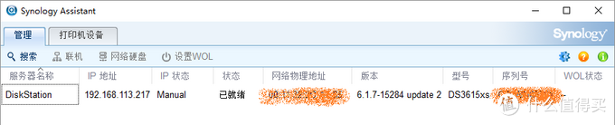](https://post.smzdm.com/p/ap74w02/pic_2/)

在内网把一些基本功能玩了一遍之后，自然就有了在外网访问这台群晖的需求。一样也是查阅了无数文章，研究了无数个方案，最终试验成功用ZeroTier实现了内网穿透，实现在外网访问家里的这台群晖系统。

## 进入正题

### **为什么是Zerotier One** 

要想外网/公网上访问家里的群晖，大致方案有两个：一个是动态域名+公网IP+端口映射。相关文章也很多，限于本文主题就不涉及了。另一个就是内网穿透了，网上常见的方案有很多，比如frp，ngrok，n2n等等，说实话都是没听过的名字（虽然算是相关专业从业人员，但也是很久没有折腾各种黑科技了）。

由于之前有使用hamachi的经验，所以第一个念头就是使用hamachi，搜了一圈发现这个软件已经淡出市场了，而且好像还在墙外，于是就放弃了，不禁还有些唏嘘。搜索新近的方案，如上述那些一看到要搭建各种[服务器](https://www.smzdm.com/fenlei/fuwuqi/)就本能的孩怕，没有去仔细研究了。

内心还是倾向于找类似hamachi的方案。也就是点对点vpn，只用安装客户端，就可以秒互联。因为我的主要需求是自己在外面拿个手机连自己家里的群晖，也不用对大众提供服务，所以这种点对点的方式最适合我。更重要的，我也并不希望家里的机器暴露在公网上，而基于vpn的方案恰好能提供这方面的安全性。这么一来就选中了ZeroTier。

### **ZeroTier方案内网穿透原理**

ZeroTier One的原理跟hamachi基本一样，就是虚拟出一块网卡，连上一个虚拟网络，安装了ZeroTier One客户端的设备可以连入这个网络，经过授权连接成功之后彼此都在同一网段，可以像在局域网一样互相访问，例如访问共享[文件夹](https://www.smzdm.com/fenlei/wenjianjia/)，web server，ftp server，联机游戏（例如打星际），当然也就包括访问群晖。所以如果你的群晖和你的手机连上了这个网络，不论两台设备具体在哪里，都像同一局域网内，从而实现内网穿透，达到从外网访问内网群晖的目的。

[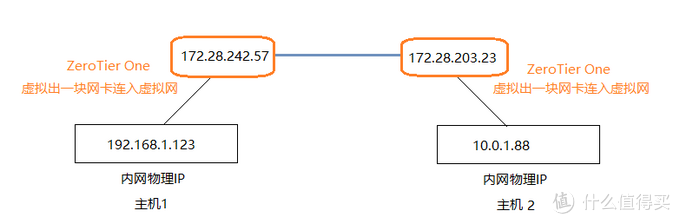](https://post.smzdm.com/p/ap74w02/pic_3/)用画图画了个简陋的原理图

主机1可以是群晖主机，主机2可以是手机或平板。只要主机1和主机2都能连到互联网，安装上ZeroTier One的客户端后，就会在本机虚拟出一块网卡，并获得对应IP，图例中是172.28.x.x网段。经过网络所有人授权后（后面会详细讲解），这两个主机就可以通过172.28.x.x网段互相访问了，由于就像在局域网一样，所以基本没有任何限制，任何基于TCP/IP的网络服务都可以访问到，自然也就可以访问到群晖了。

*注：图中省掉了公网IP，因为公网IP多少不重要，只要主机能上公网，能连上ZeroTier，就能获得172网段IP了，也就可以互联互通了。*

### **ZeroTier One的优势**

相比其他流行方案，ZeroTier One有这么几个优势：

- 免费版支持客户端多。连入同一个网络的客户端不超过100个就都免费
- 速度快，p2p模式。客户端联通之后流量基本不经过服务端/superNode而是点对点传输，传输速度取决于你设备所在宽带上行带宽以及手机端4g上网的速度
- 管理配置简单。不要被全英文的界面吓到，明白原理之后安装配置极其简单

最重要的是支持多种平台。支持win、mac、安卓、苹果，以及多种发型版Linux，比如群晖系统（这也是选择ZeroTier One的重要原因），如下图，可以下载spk文件直接在群晖中部署（**这里有一个大坑，后面会说到**）

[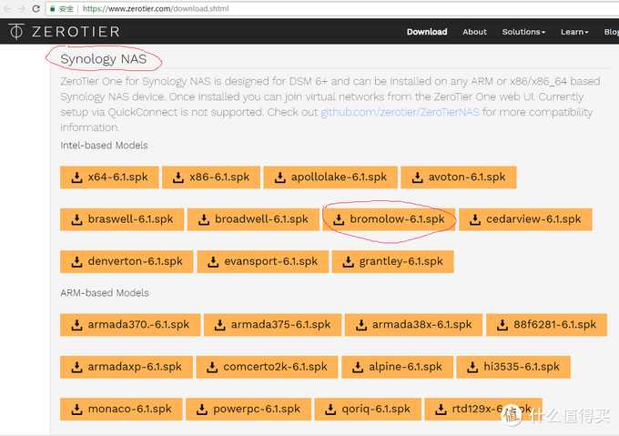](https://post.smzdm.com/p/ap74w02/pic_4/)ZeroTier 直接提供的群晖的安装版

## 实际操作过程 

### **1. 申请网络** 

前文提到安装好ZeroTier One后会虚拟出一块网卡，得到一个虚拟网络网段IP，那么如何让两台或者多台客户端连入同一虚拟网络呢，这就需要先申请一个虚拟网络了。事实上申请这个网络先于安装ZeroTier One的客户端，这是和hamachi不同的地方。

你需要在ZeroTier One网站注册一个账号，注册了账号即可获得这个虚拟网络，然后在网站的网页上即可管理访问权限，许可那些客户端可以访问你的虚拟网络。

由于ZeroTier 网站做的实在不太友好，尤其对英文不太好的同学来说简直就是灾难，所以这个部分会讲解的比较详细。不求甚解的话照做即可，不用去管网站上大量的英文说明信息。

首先访问[ZeroTier网站](https://www.zerotier.com/) ，如果你是百度搜ZeroTier，首先会访问到这里。是不是找不到创建账号的地方？然后往下拉就会越看越犯怵。不用看了，直接点击右上login，或者访问[这里](https://my.zerotier.com/login) 

[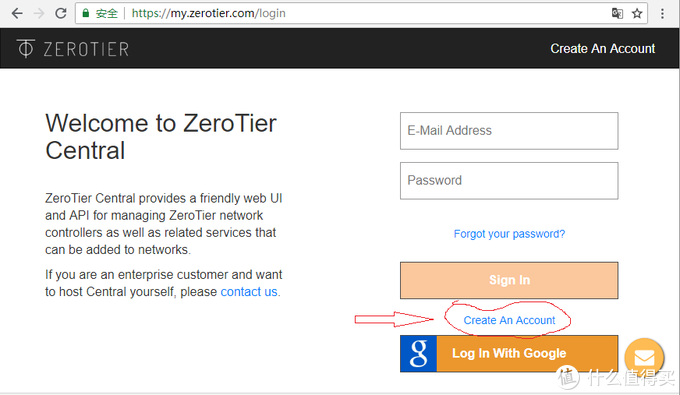](https://post.smzdm.com/p/ap74w02/pic_5/)创建账号

此时就会出现登录/注册页面，点击Create An Account（为了写这篇文章我创建了一个新的账号），到如下注册页面，填入邮箱，密码。点击创建账户(Create An Account按钮）。

[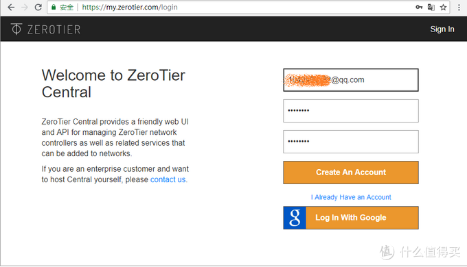](https://post.smzdm.com/p/ap74w02/pic_6/)

之后会进入下图所示页面。什么都不用改，重点的两个信息我圈出来了：一个是你的内部ID(Internal ID，此例中是 f7578543-394a-489a-a7be-ef08d1850b75，基本用不到；另一个就是下面订阅选项，默认免费(Free)即可。免费的最多支持100个客户端，应该够用了。

[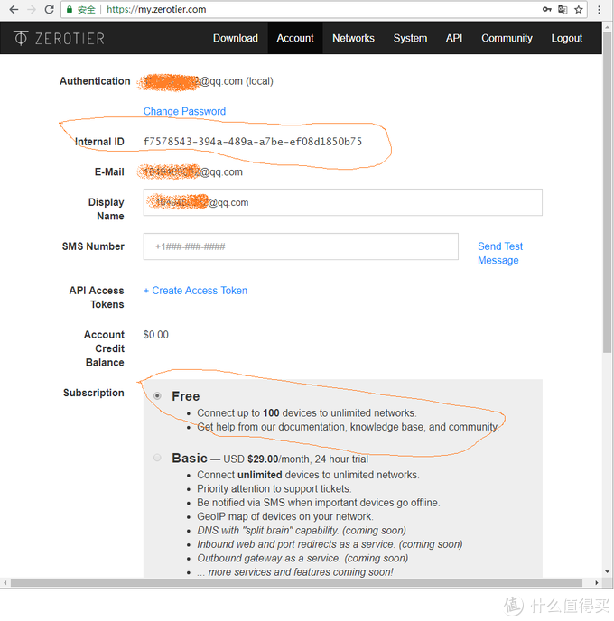](https://post.smzdm.com/p/ap74w02/pic_7/)创建好账号

接下来直接点击最上面菜单中的Network，然后点击Create，即可创建前述之**虚拟网络**——也就是一串id号

[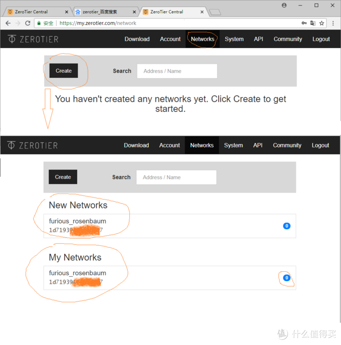](https://post.smzdm.com/p/ap74w02/pic_8/)创建虚拟网络

所谓ZeroTier网络/虚拟网络，就是后面你的群晖以及手机等设备要连入的虚拟网络。连到同一个网络的客户端互相可以直接访问。这一串数字id就是这个网络的本体，上面那个furious_rosenbaum是随机生成的网络名，用来描述网络，当你有多个网络的时候方便记忆和识别。

*注：上图中右侧蓝色的数字即表示当前连入这个网络的客户端数量。新建网络没有客户端连接，所以是零。*

点击My Networks，进入如下页面

[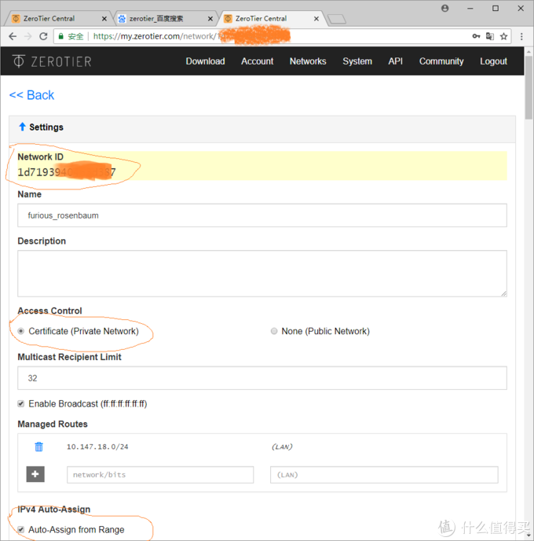](https://post.smzdm.com/p/ap74w02/pic_9/)

理论上这里也是不用修改任何地方，几处重点信息也圈出来了：

- 网络id就是这个网络的唯一标识，后面客户端要加入网络时就是填入这个id号；
- 访问控制(Access Control)默认私有，也就是需要授权才能访问（后面客户端安装配置的部分会讲）；
- IP自动分配，也就是只要连入这个网络的客户端，自动获得此网段IP。

此页面也是管理和监控页面，也就是后面添加或删除客户端，控制那些客户端能加入此网络都可以在此处完成。任何可以联网的设备只要有用户名和密码即可登录ZeroTier One，然后进入此页面对网络进行管理，比如手机，平板，从任何位置都可以访问管理。

*注：所谓“客户端”即安装了ZeroTier One客户端软件的设备。本文到目前为止还没有涉及到客户端安装，也就是说，创建自己的帐号/创建虚拟网络不依赖于具体客户端设备或软件安装，以及之后的权限管理也都不涉及特定客户端，任何一个可以联网的系统都可以操作。这个在你实际使用之后会发现非常有用且方便
*

将页面拉到下面，圈出的部分便是监控和管理的主要操作区域。当前没有客户端连接的时候如下图

[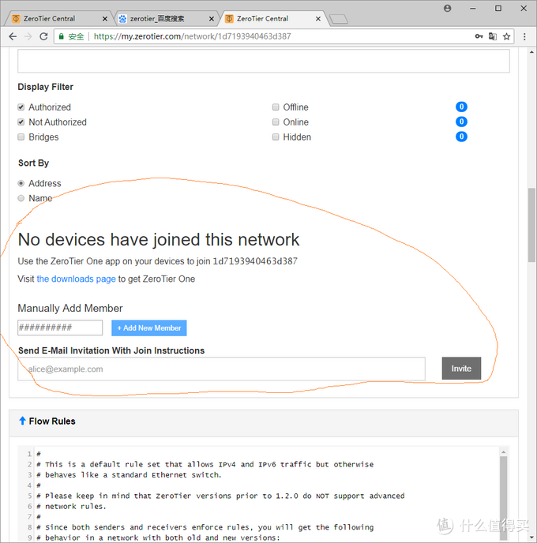](https://post.smzdm.com/p/ap74w02/pic_10/)网络管理和监控

详细解释如下，因为刚刚创建网络还没有客户端加入，所以显示“No devices have joined this network"，当有客户端加入之后便会在此处看到状态，离线，在线，离线时间等等；后面Manually Add Member就是加入其他成员，也就是一开始注册账号时，你得到的那个内部ID可以用来加入其他人创建的网络，或者邀请其他人加入你的网络。其他的部分都可以忽略掉，不用看，没用，越看越晕。

*注：ZeroTier的世界主要有两个概念，一个是用户一个是网络，都是一串数字表示。一个用户可以加入多个网络，多个用户可以加入一个网络。在本文应用实例中，是只有一个人一个网络，所有的设备都是我用自己账号登录ZeroTier后加入自己的网络而连接在一起的。*

### **2.安装Windows客户端**

为了演示方便我先在PC电脑上下载ZeroTier的windows客户端安装，然后加入上面创建的网络。

回到ZeroTier网站顶端，点击最上面菜单第一项Download，进入下载页面

下载页面

找到windows客户端下载，点击ZeroTier One.msi下载安装文件到本地。大约12M

[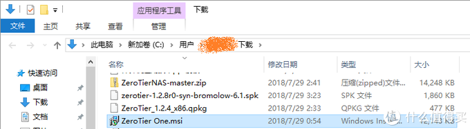](https://post.smzdm.com/p/ap74w02/pic_12/)下载windows客户端

一路按默认设定安装即可（我只好又装了一遍）

[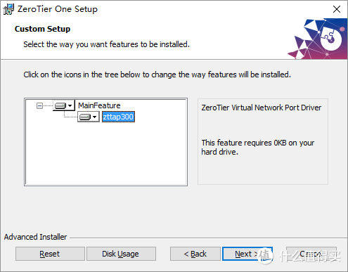](https://post.smzdm.com/p/ap74w02/pic_13/)一路next即可

安装软件的过程可以看做往系统插了一张新网卡，并把网卡连了一根网线，此网线通往ZeroTier的专有网络，逻辑上独立于你当前局域网之外。如果弹出如下窗口，点击是。

[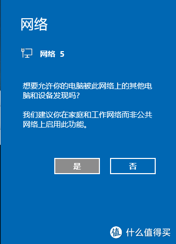](https://post.smzdm.com/p/ap74w02/pic_14/)安装结束后可能会出现的提示，表示新建立了一个以太网口

然后查看系统设备会看到新出现的虚拟网卡ZeroTier One Virtual Port

[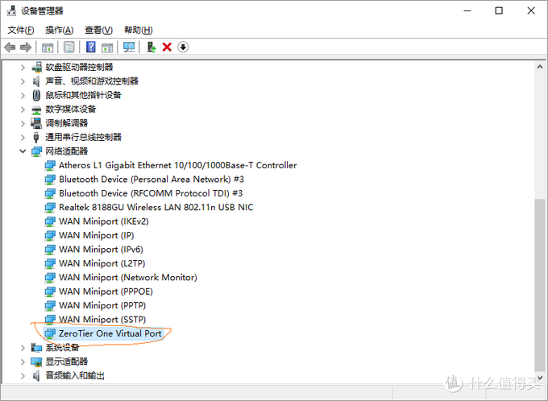](https://post.smzdm.com/p/ap74w02/pic_15/)安装后ZeroTier网卡出现在设备管理器中

安装好后，从菜单运行，不会出主程序窗口，而是在任务栏出现ZeroTier One的小图标，右键点击会出现弹出菜单，在此处点击Join Network...加入刚刚申请的网络

[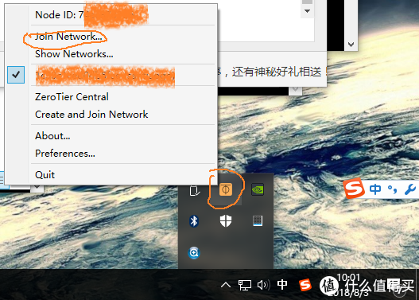](https://post.smzdm.com/p/ap74w02/pic_16/)加入网络

*注：因为我这台Windows主机已经安装过ZeroTier One，所以已已经有节点信息，和曾经加入的网络(id号），为了安全起见就涂抹掉了（我尝试过卸载重装还是会有这些信息，暂时不管了），但不影响你加入新的网络。在此例中就是新申请的网络 1d7193******63d387*

点击 Join Network...会弹出一个小窗，填入新申请这个网络id号，再点击Join即可

[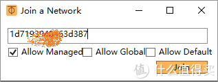](https://post.smzdm.com/p/ap74w02/pic_17/)加入网络

重点来了，此时回到[页面](https://my.zerotier.com/network#) 刷新一下（或者直接从客户端系统栏图标上右键点出菜单，点击**"ZeroTier Central"**进入此页面），将页面拉下来，此时就会看之前No Devices have joined this network的地方出现这个客户端，显示online

[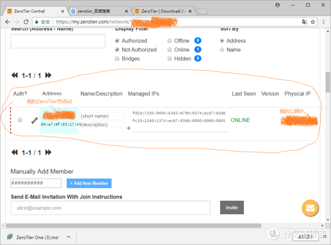](https://post.smzdm.com/p/ap74w02/pic_18/)客户端已经可见

但是别急，此时客户端并未连上这个虚拟网络，需要进一步授权。在此管理页面勾选前面的复选框（auth?列），此时这个客户端就终于连上这个网络了。

[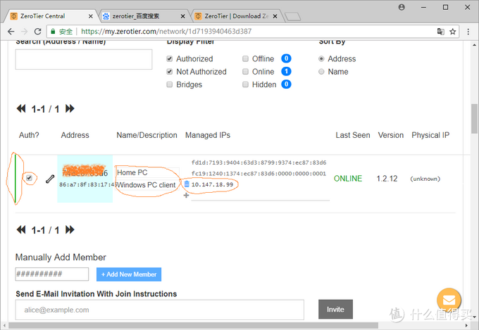](https://post.smzdm.com/p/ap74w02/pic_19/)

可以看到，勾选之后，左侧虚线变成了绿色实线，表示客户端已经连上这个网络(1d7193******63d387）。另外客户端在此虚拟网络中的IP也已经得到，为**10.147.18.99**。中间short name和description的部分，我也填入了相应短名称和描述，这样方便在多个客户端连入后，明确知道各个客户端分别是什么。这个很有用，整个ZeroTier世界里面全是数字，就靠这个描述和名称来标识各个客户端了。

在网页端授权之后，用ipconfig查看一下，这个IP就是网页上那个IP。

*方法：win+r，输入cmd，出现命令行终端，打“ipconfig"回车即可看到当前系统的网络配置情况。*

[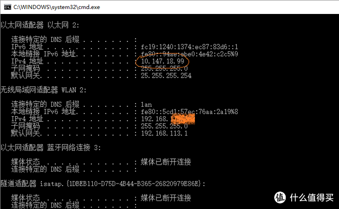](https://post.smzdm.com/p/ap74w02/pic_20/)查看本机IP,多了一个以太网2的连接

详细说明在Windows的安装过程是为了大家理解ZeroTier One客户端的工作原理，网页管理配置的方法。这样在群晖上安装时理解起来就简单了。

### 3. 在群晖上安装ZeroTier One客户端

前述内容虽然看起来复杂， 但是如果理解了再回头看就会觉得非常简单。

整个过程真正的难点是在群晖安装ZeroTier One 客户端。前面提到过，这里有一个大坑——**找不到安装文件！！**

ZeroTier One for 群晖的安装包

如果你点对应的按钮下载，会出现**404错误**。试了ZeroTier群晖下面所有的下载链接，全都是404

[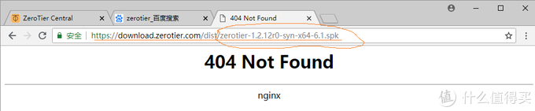](https://post.smzdm.com/p/ap74w02/pic_22/)

官网下载不到安装文件，接着用文件名全网搜也没有搜到别的下载源，这下就傻眼了。让我一度以为是不是ZeroTier也跟群晖闹翻了之类。把所有应用都下架了。。

万般无奈之下只好硬着头皮研究怎么直接在群晖上用源码编译，翻遍了git和zerotier的各种文档，反复尝试才知道，如果要编译，不能直接在群晖系统上操作，只能搭建专门的开发环境，需要自己装一个linux系统了。。

在这里卡了两天，付出时间精力最多，却没有什么可写的，因为

1. 尝试编译没有成功 
2. 没有用不需要——误打误撞找到了这么个[页面](https://download.zerotier.com/RELEASES/) 

[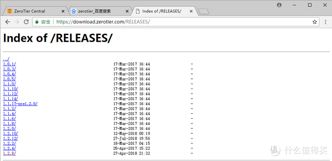](https://post.smzdm.com/p/ap74w02/pic_23/)然后奇迹出现了

是不是很眼熟，当下的心情就是——那画面太美不敢看啊。

[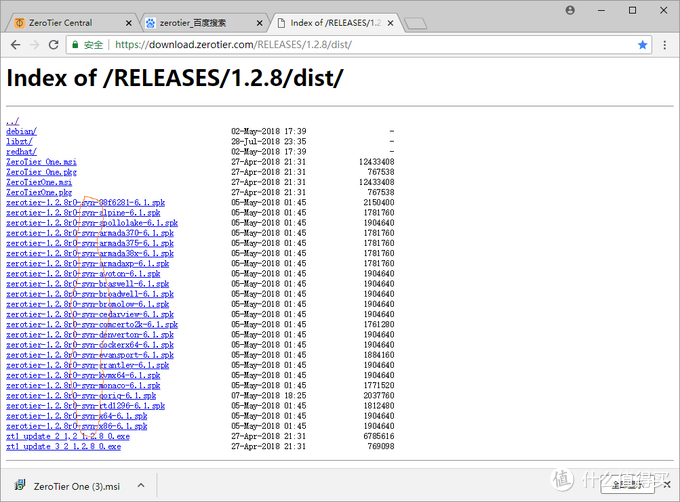](https://post.smzdm.com/p/ap74w02/pic_24/)热泪盈眶啊

所有带syn字段,spk结尾的都是ZeroTier One 给群晖的安装包，有种老鼠掉进米缸的感觉了。

但是如何确定哪个版本还要费一点周折。方法一，可以在这个[平台支持列表](https://www.synology.com/en-us/knowledgebase/DSM/tutorial/General/What_kind_of_CPU_does_my_NAS_have)查询自己cpu类型，决定下载哪个版本。但在这个列表，我却找不到我笔记本i5 cpu对应的版本，所以用方法二：网上下一个putty.exe，然后ssh连到自己群晖的终端。

[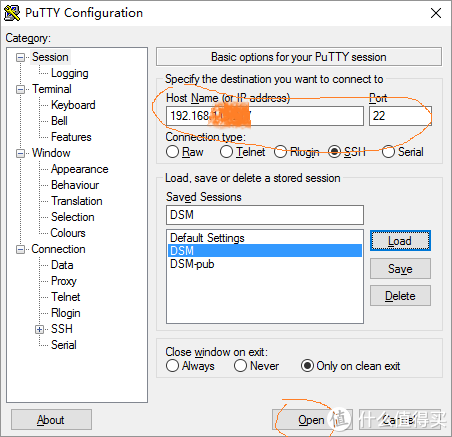](https://post.smzdm.com/p/ap74w02/pic_25/)启动putty

在hostname处输入群晖的IP，点击open。弹出窗口输入群晖用户名密码

[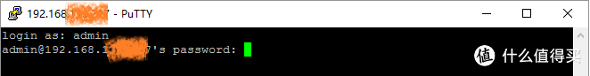](https://post.smzdm.com/p/ap74w02/pic_26/)用户密码同群晖用户密码

登录后打命令uname -ar，就会出现cpu版本信息，大概长这样：

[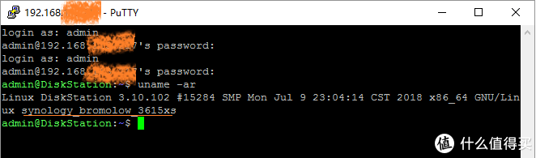](https://post.smzdm.com/p/ap74w02/pic_27/)查询cpu/系统版本号

这就很明显了，我这个安装在笔记本上的群晖6.1.7，是64位系统，bromolow的版本，下载[zerotier-1.2.8r0-syn-bromolow-6.1.spk](https://download.zerotier.com/RELEASES/1.2.8/dist/zerotier-1.2.8r0-syn-bromolow-6.1.spk)就可以了，这回终于没有404了，美滋滋啊。

 

再发一遍就是图中这个东西，看到了吧。

在群晖端安装就相对简单了。登录DSM，打开套件中心，选择手动安装，找到刚刚下载的spk文件，点击下一步

[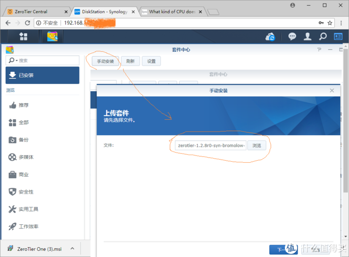](https://post.smzdm.com/p/ap74w02/pic_29/)手动安装

然后会出现ZeroTier One的版本信息

因为我系统里早已安装了ZeroTier One的套件，所以这几步只是演示，可能和第一次安装界面稍有不同。安装过程大约几分钟。安装完成后可以在主菜单找到，点击运行。

[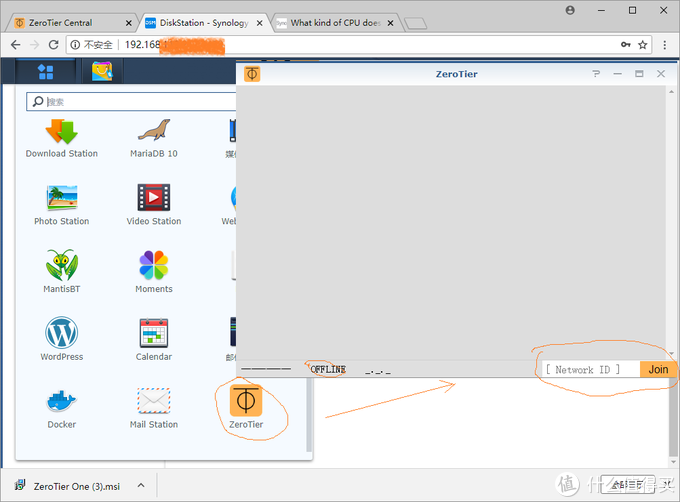](https://post.smzdm.com/p/ap74w02/pic_31/)运行后主界面

运行后主界面基本没有内容， 唯一的操作就是在右下角[Network ID]填入网络id号，然后点击join。

加入后，刷新[ZeroTier](https://my.zerotier.com/network/) 点击网络id进入管理页面

[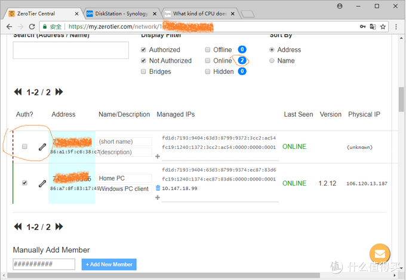](https://post.smzdm.com/p/ap74w02/pic_32/)客户端已上线

和第一个windows客户端一样，可以看群晖的ZeroTier One客户端已经在线online，但未授权，左侧为虚线。点击复选框勾选授权，此时群晖连入虚拟网络

*提示: “在线”("online")的意思就是客户端那一侧ZeroTier One软件已经启动正常运行，在ZeroTier网络上可以看到这个客户端；"授权"是指客户端能不能连入当前这个网络，默认是"未授权"("Not Authorized")状态，需要网络所有者(即创建相应网络的注册账号，此账号登录ZeroTier后才能访问此页面)授权——勾选左边的复选框*

[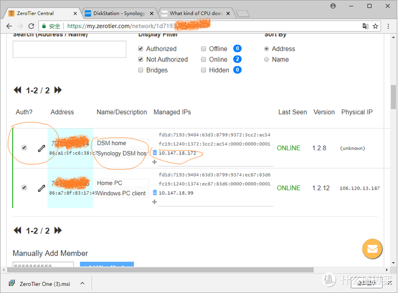](https://post.smzdm.com/p/ap74w02/pic_33/)群晖客户端上线入网

同Windows客户端一样，给群晖客户端填入短名称DSM home表示是家中的群晖主机，在描述中输入Synoloty DSM host，这个可以随便写，只要自己看了知道是那台机器就行。

授权之后群晖就应该已经介入此虚拟网，在PC端打开cmd，命令行ping一下看通了没有。如ZeroTier管理页面所示群晖的ZeroTier网IP是10.147.18.172

[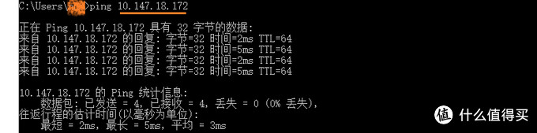](https://post.smzdm.com/p/ap74w02/pic_34/)

ping值很低，可见链路没有经过服务端，两台机器是直接交换数据的（基于ZeroTier那个虚拟网卡）

在此虚拟网测试下群晖，访问10.147.18.172:5000

[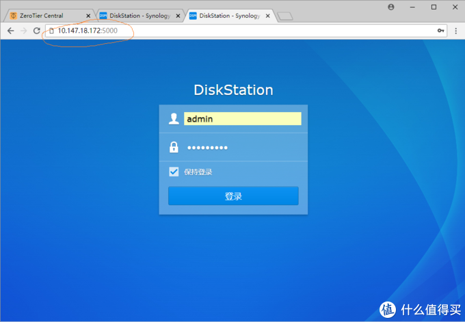](https://post.smzdm.com/p/ap74w02/pic_35/)

登录后一切正常

正如前面反复提到，连上ZeroTier One的虚拟网络（加入同一个网络id)后，经过拥有者授权，所有客户端就像在一个局域网里，所有的端口都是开放可以互相访问的。

[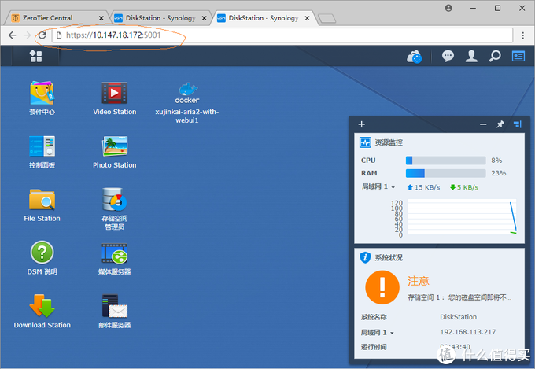](https://post.smzdm.com/p/ap74w02/pic_37/)https可以访问

[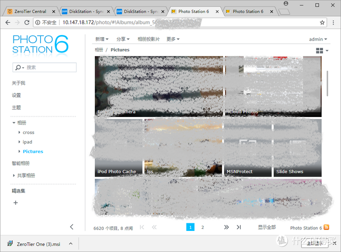](https://post.smzdm.com/p/ap74w02/pic_38/)Photo Station可访问

Video Station可访问

## 外网连接测试 

上面的测试虽然走的ZeroTier网络，但是Windows主机和群晖主机实际都在同一内网。所以还需要测试真正外网连接。模拟在外面用手机连接家里的群晖，看ZeroTier One的内网穿透是否真正实现。

### 手机端安装ZeroTier One客户端

推荐用苹果，安卓系统正常安装流程需要访问google play。为了测试两个系统都安装，现在用安卓系统演示。

在手机上安装ZeroTier One安卓客户端，装好之后大概这个样子

[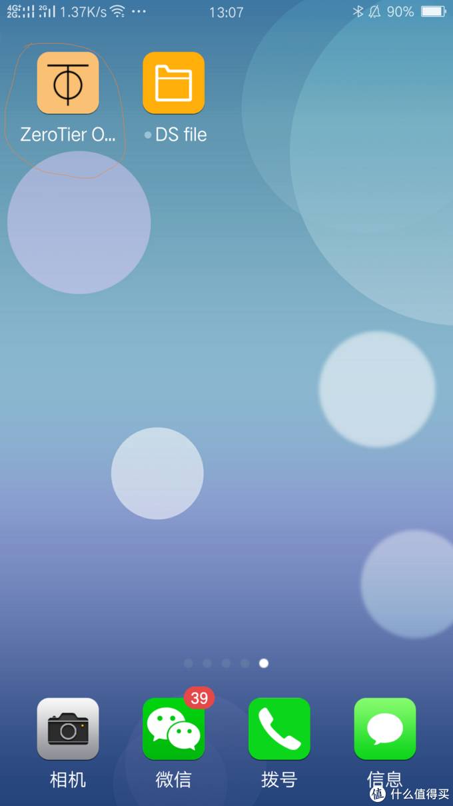](https://post.smzdm.com/p/ap74w02/pic_40/)我是科学上网用google play安装的

用google play装，启动之前先把手机wifi关掉，使用数据上网

[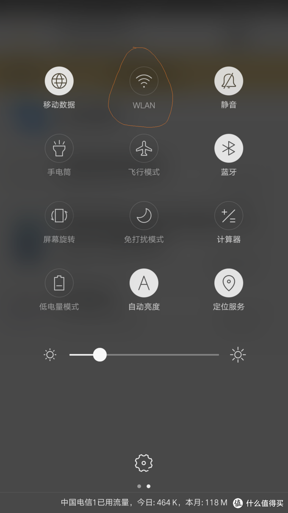](https://post.smzdm.com/p/ap74w02/pic_41/)

启动ZeroTier One应用，点击主界面上方的加号，出现如下界面。输入网络id号，点击Add Network

[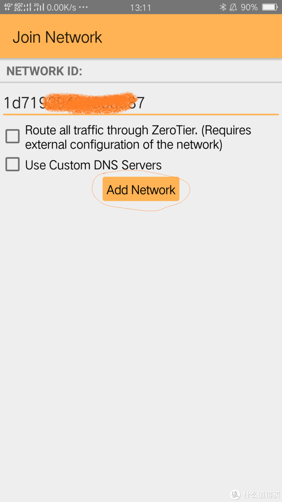](https://post.smzdm.com/p/ap74w02/pic_42/)运行ZeroTier One App

回到主界面会看到新添加的网络。上面那个网络是我之前创建的，也是我实际在用的，暂时可以忽略掉。

下面是今天新申请的用来做演示的网络，现在加入的是这个网络。

[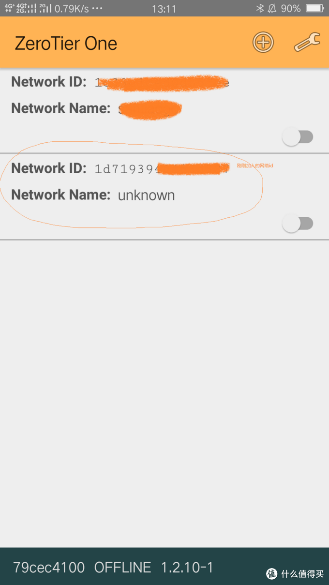](https://post.smzdm.com/p/ap74w02/pic_43/)点击开关打开网络

点击网络id号右下的小开关，会弹出创建VPN连接请求，确认即可

[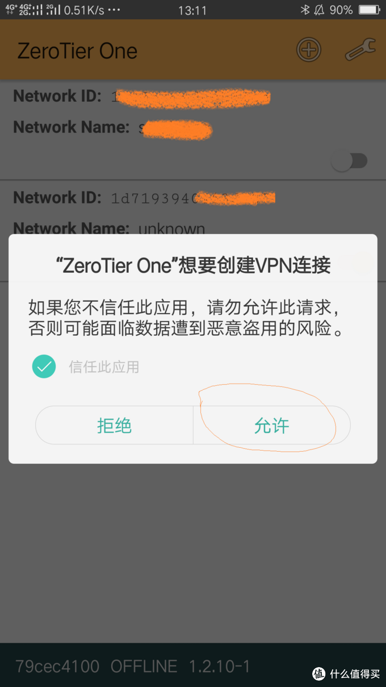](https://post.smzdm.com/p/ap74w02/pic_44/)

手机端的ZeroTier One 安装配置就完成了，接着在网页管理端授权这个客户端使之最终连入虚拟网络。

### 管理页面配置让手机连入虚拟网络 

打开[https://my.zerotier.com/network/1d71*****387](https://my.zerotier.com/network/1d7193940463d387) 刷新，会看到新的手机客户端已经上线，但未被授权。

[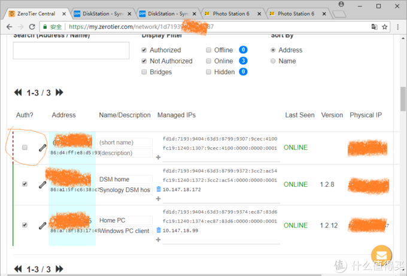](https://post.smzdm.com/p/ap74w02/pic_45/)手机客户端已成功运行

如法炮制，给手机客户端授权，并输入短名称和描述。勾选授权之后，刷新网页如下：

[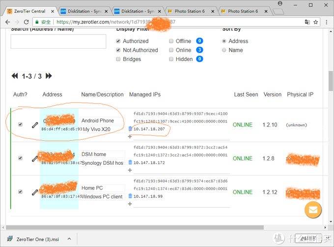](https://post.smzdm.com/p/ap74w02/pic_46/)将手机客户端授权连入ZeroTier网络

*提示: 随着客户端增多，就能发现短名称和描述的作用。在这个页面通过名称和描述就能很清楚分辨各个客户端是什么。不然对着一串数字很容易搞不清楚谁是谁了。*

此时手机、群晖、Windows电脑就像连入同一个[路由器](https://www.smzdm.com/fenlei/luyouqi/)wifi下，各自的IP都都在网段10.147.18.*。

### 测试手机从外网连接家里的群晖

此时人和手机物理上仍然是在家里，但因为手机已经断开家里的宽带，使用数据上网，所以场景等同于手机现在是从外网对家里的群晖进行连接。可以看到手机端已经连上了VPN，打开群晖官家，添加现有设备，即家里的群晖。

[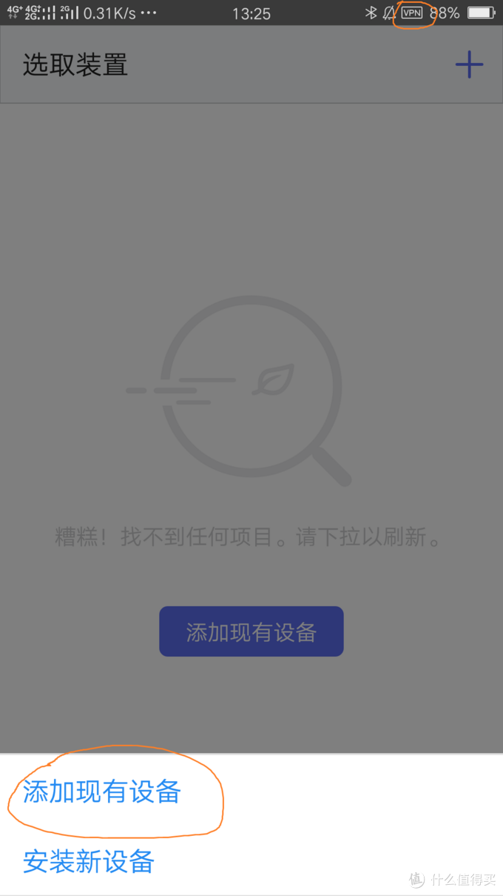](https://post.smzdm.com/p/ap74w02/pic_47/) 群晖管家测试连接

[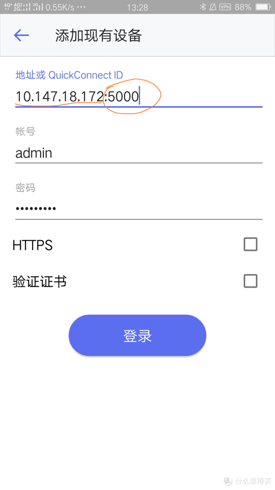](https://post.smzdm.com/p/ap74w02/pic_48/)小提示要输入端口号

连接群晖

输入正确地址端口用户密码，点登录后很快就连上了

[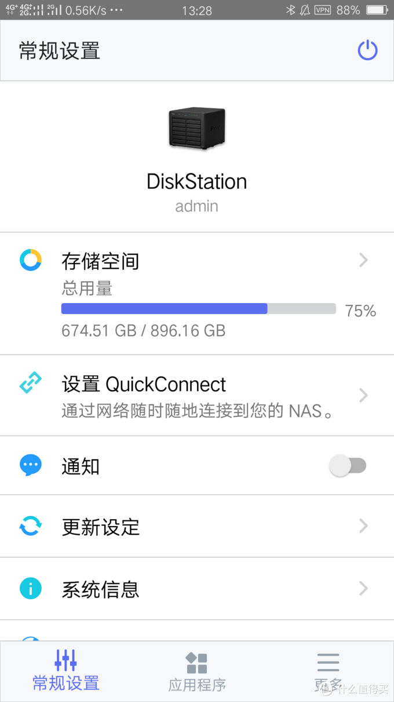](https://post.smzdm.com/p/ap74w02/pic_49/) 登录(穿透)成功

切换到桌面模式可以看到更详细状态。DSM mobile中点击齿轮图标，选择桌面模式

[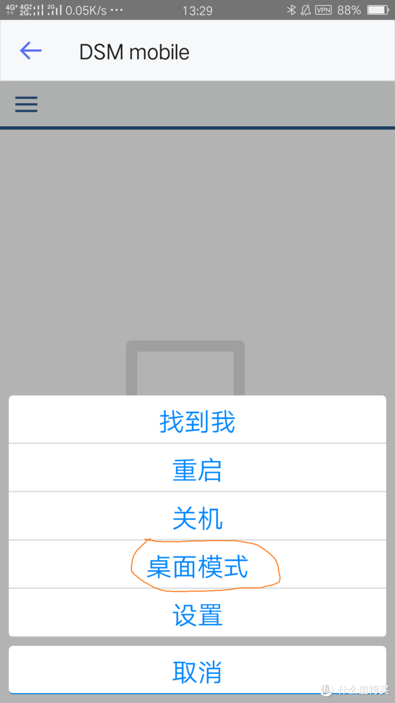](https://post.smzdm.com/p/ap74w02/pic_50/)

[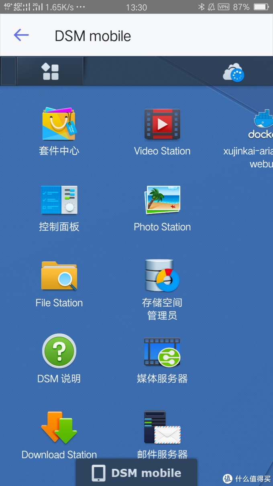](https://post.smzdm.com/p/ap74w02/pic_51/)可以看到各个套件

至此已经证明穿透成功，从外网通过ZeroTier的虚拟网络连上了家里的群晖。

## 小结

第一次发文，没想到写了这么多，写了这么久。一张图一张图的改上传，还老传错，最后花了近八个小时才算基本完成。如果用过softether VPN或者hamachi玩过联网游戏（年龄暴露），那么应该很快可以上手ZeroTier One，基本原理完全一样，ZeroTier的改进是管理虚拟网络是独立于客户端的，可以完全通过网页完成。安装好之后，所有客户端都加入同一个网络id，则如同连入同一个路由器，处于同一个局域网。那么互相访问就跟在局域网一样，在外连接群晖就跟在家连接一样了，只需要通过ZeroTier网络里的IP连接即可。至于其他几种方案，frp，ngrok等，只是看了下文章，没有实际使用所以也不能评判好坏。如果只是从文章的描述来看，个人更倾向于ZeroTier，最大的两个优点，一是不用搭建服务器，二是有一定安全防护机制，一定要虚拟网络拥有者授权，新的客户端才能连入网络。

整个过程看起来很复杂， 理解之后应该很简单。真正的大坑是ZeroTier 官网的spk文件下载链接不对，导致没有安装文件安装。幸好误打误撞找到了文件，spk手动安装还是很顺利的。

补充：

群晖端在DSM里面起ZeroTier One可能起不来，或者加入网络加入不了，点击没反应。可能是跟我切换了网络有关。解决办法是通过putty连接到终端，然后再执行命令行命令离开原有网络加入新网络即可。加入成功后网页管理端就能看到新的客户端。授权时候群晖就连入你创建的ZeroTier的网络了

[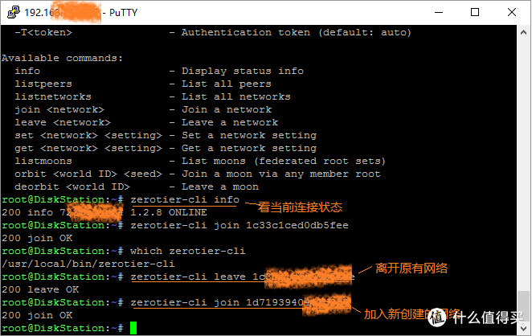](https://post.smzdm.com/p/ap74w02/pic_52/)通过命令行启动ZeroTier One 群晖客户端

**总算写完了，谢谢大家。第一次写文难免会有疏漏，欢迎大家指正。有任何问题也可以在评论提出，会尽力回答。**