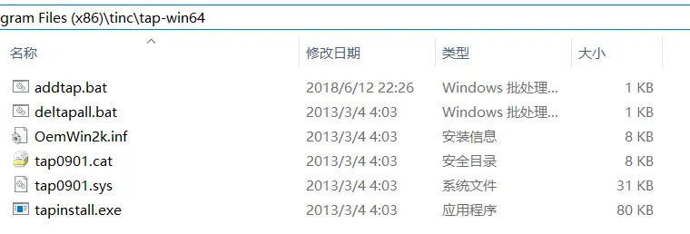
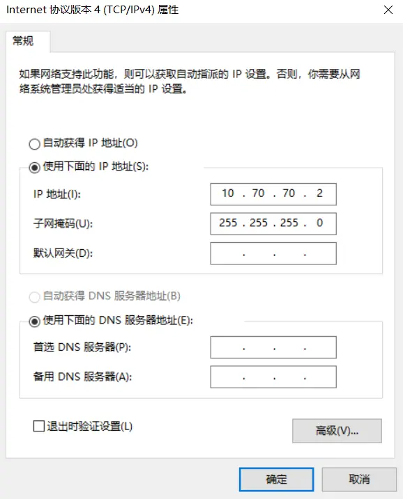
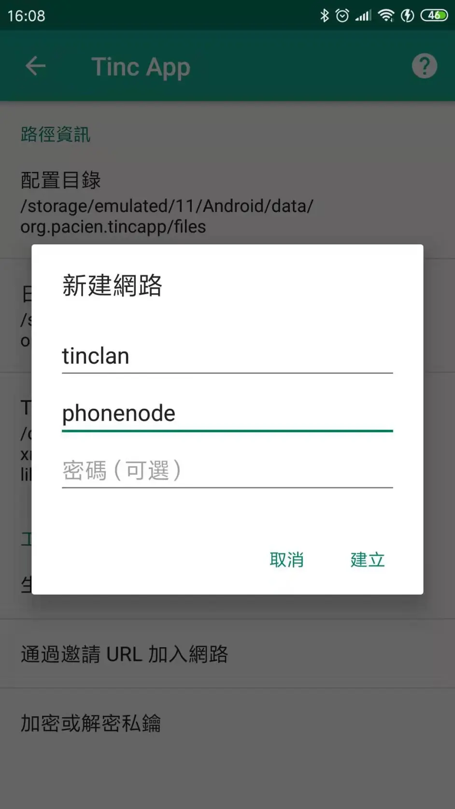

## 欸嘿，使用tinc构建局域网

https://www.bilibili.com/read/cv3364699/

最近苦恼怎么在外面访问家里的nas，找了一圈方法发现tinc，今天就花点时间研究怎么搭建起来。

# Tinc简介

在tinc官网（不再啰嗦）(つω｀)～

# 安装

Linux

tinc 在各个发行版的仓库中都可以找到。

> 例：
>
> Debian/Ubuntu
>
> apt-get install tinc

 

Android

https://tincapp.pacien.org/

windows

{tinc官网}/packages/windows/tinc-1.0.35-install.exe

# 配置

​    因为tincapp好像仅支持tinc的路由模式（router），所以本文采用tinc模式也是这个模式。

​    现在假设我们有：

- ​    一朵阿里云（linux）
- ​     一座内网Windows
- ​    一条安卓手机

目录结构

> linux下的目录结构
>
> /etc/tinc
> └── {$NETNAME}
>   ├── hosts
>   │  ├── {$MAINNODE}
>   │  └── {$NODE}
>   ├── rsa_key.priv
>   ├── tinc.conf
>   ├── tinc-down
>   └── tinc-up

> windows下的目录结构
>
> ..\Program Files (x86)\tinc
> └── {$NETNAME}
>   ├── hosts
>   │  ├── {$MAINNODE}
>   │  └── {$NODE}
>   ├── rsa_key.priv
>   └── tinc.conf

> Android下的目录结构
>
> org.pacien.tincapp/files
>
> └── {$NETNAME}
>   ├── hosts
>   │  ├── {$MAINNODE}
>   │  └── {$NODE}
>   ├── rsa_key.priv
>   ├── ed25519_key.priv
>   ├── network.conf
>
>   └── tinc.conf

上面目录结构的每一项这里不作解释，请看最后的引用链接 (つω｀)～

​    {$NETNAME}、{$MAINNODE}和{$NODE}均是用户自定义名称，

下面的配置中假设：

​    {$NETNAME} 为 tinclan

​    阿里云的节点名为 alinode，即 {$MAINNODE} 为 alinode，节点ip为10.70.70.1，外网ip为 A.B.C.D

​    windows的节点名为 pcnode，节点ip为10.70.70.2

​    手机的节点名为 phonenode，节点ip为10.70.70.3

服务端配置

> `创建``tinc.conf`配置文件：
>
> Name=alinode
>
> Interface=tinciface
> Cipher = aes-256-cbc
> Digest = sha256
> Compression=9

- `Name` 主机名称
- `Interface` 隧道所使用的网卡名称
- `Compression` UDP 数据包压缩级别。可选有 0 (关闭)，1 (fast zlib) 至 9 (best zlib)，10 (fast lzo) 和 11 (best lzo)
- `Cipher` 加密类型。
- `Digest` rsa 加密协议强度。

创建`tinc-up`和`tinc-down`，用`Windows`作为服务端无需这两个文件。

tinc-up

> \#!/bin/sh
> ip link set $INTERFACE up
> ip address add 10.70.70.1/32 dev $INTERFACE
> ip route add 10.70.70.0/24 via 10.70.70.1

tinc-down

> \#!/bin/sh
> ip route del 10.70.70.0/24 via 10.70.70.1
> ip address del 10.70.70.1/32 dev $INTERFACE
> ip link set $INTERFACE down

然后给这两个文件添加执行权限

> chmod +x tinc-*

在tinclan/hosts文件夹中增加alinode的文本文件，往里添加：

> Address=A.B.C.D
> Subnet=10.70.70.1/32

- `Subnet` 宣告的路由地址
- `Address` 服务器的外网 IP，填域名亦可

然后执行以下命令生成私钥（rsa_key.priv）及公钥（在alinode里面）：

> tincd -n tinclan -K 4096

Windows客户端配置

在tinc文件夹下创建tinclan/tinc.conf：

> Name=pcnode
> ConnectTo=alinode
> Interface=tinciface

在tinclan/hosts文件夹中增加pcnode的文本文件，往里添加：

> Subnet = 10.70.70.2/32

生成私钥和公钥（**需要在程序安装目录下以管理员权限执行**）:

> .\tincd.exe -n tinclan -K 4096

然后将服务端的节点配置文件（即alinode）复制到客户端的`hosts`文件夹内，并将客户端的节点配置文件（即pcnode）放到服务端的`hosts`文件夹内。

在安装目录tap-win64下以管理员身份运行addtap.bat文件（如下图）

然后在网络中心找到的TAP网络适配器

将它重命名为tinciface，接着右键属性设置ipv4的地址，此地址应与hosts中pc的Subnet值相同，本例为10.70.70.2（如下图）

参考链接：{tinc官网}/examples/windows-install/

Android客户端配置

打开app点击“小扳手->生成节点配置和密钥”，然后就会生成好上面那样的目录结构。

编辑tinc文件夹下的tinc.conf:

> Name=phonenode
> ConnectTo=alinode

编辑tinc文件夹下的network.conf:

> Address = 10.70.70.3/32
>
> Route = 10.70.70.0/24
>
> AllowBypass = false

往hosts/phonenode里面追加：

> ...
>
> Subnet=10.70.70.3/32

然后将服务端的节点配置文件（即alinode）复制到客户端的`hosts`文件夹内，并将客户端的节点配置文件（即phonenode）放到服务端的`hosts`文件夹内。

# 运行

> \#运行
>
> \#Linux
> tincd -n dock
> \#Windows(需要管理员权限，运行一次之后会自动注册成服务，以后可以在“服务”中启动停止)
> tincd.exe -n dock

> 停止运行
>
> \#Linux
> tincd -n dock -k
> \#Windows(需要管理员权限)
> tincd.exe -n dock -k

> 以调试模式运行（可以帮助我们找到解决连不上等问题的提示(๑•̀ㅂ•́)و✧）
>
> \#Linux
> tincd -n dock -D -d 3
> \#Windows
> tincd.exe -n dock -D -d 3

Android通过app里面运行。

# 参考引用

https://zimiao.moe/posts/53555/

https://wuzk.tk/2018/09/13/2018/20180913/

tinc官网