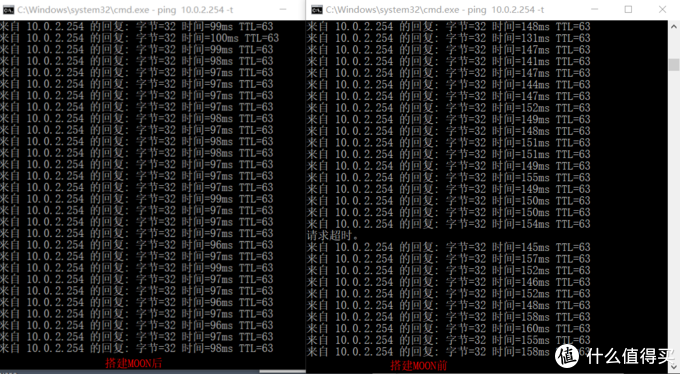

# 远程办公：ZeroTier异地组网及私有Moon转发节点搭建

https://post.smzdm.com/p/adwrepgk/

## 背景

​    疫情之下，远程办公成为了许多公司2020开年复工的第一需求。本文介绍使用ZeroTier这款开源软件对家庭网络和公司网络进行异地组网，使家庭网络内的设备能像在局域网内一样访问公司网络，从而进行远程办公。

​    其实关于ZeroTier之前已经写过一边文章了，只不过那篇文章通篇是在手机上完成的，有些细节之处没有很好的指明。故从新整理一下。同时也给出上篇文章许多值友尝试后效果不佳的解决方案，其主要原因是部分地区[运营商](https://www.smzdm.com/fenlei/taocanjiliuliangka/)限制了UDP流量，使得ZeroTier节点间无法进行P2P穿透，进而迫使ZeroTier节点使用官方的中转[服务器](https://www.smzdm.com/fenlei/fuwuqi/)进行TCP转发。但是ZeroTier是国外的开源软件，在大陆境内未设有相关服务器，导致了TCP转发会出现高延迟、断流等种种问题影响体验。

## ZeroTier注册

ZeroTier官网：https://my.zerotier.com/login

​    在官网上注册账号，以获得ZeroTier网络ID，免费账户可以部署100个ZeroTier节点。一般小公司、工作室这类规模是够用了，大公司基本都铺设了专网搭建了专用的VPN系统。

创建网络ID

​    创建完成之后就能在ID列表内看到你所获得的网络ID，这个ID将被用于你所需要部署ZeroTier节点。join这个ID的所有ZeroTier节点都将处于同一虚拟局域网之中，并且你能决定所有节点的入网情况。

## OpenWrt上配置ZeroTier

带有ZeroTier功能的OpenWrt固件：[ftp://ftp.kingzm.top/ftp/Lede_by_Lean/](ftp://ftp.kingzm.top/ftp/Lede_by_Lean/)

​    这里先说明下为什么用OpentWrt，因为ZeroTier的免费账户仅能部署100个节点，为了节省节点数量公司部分只部署一个节点即可，配置好路由就能从这一个节点访问所有公司网络资源。当然你在Windows上配置一个节点在设置路由也是可以的。Ftp中的固件是基于Lean的开源固件编译的。如有需要定制的固件可在留言中备注。至于怎么安装OpenWrt这里就不在赘述了，站内已经有很多大佬写过教程了。

​    在OpenWrt上配置ZeroTier之前，首先配置网络接口中的Lan接口，**开启IPv6及DHCPv6**，特别是刷了固件的硬路由。因为L大的固件对ZeroTier开启的虚拟接口配置了防火墙，但是ZeroTier在join核心网络并允许节点入网后虚拟接口会发生一次变更，变更会导致Lan口上的IPv4网络全部被封在防火墙内部不能访问。如果是硬路由没法接[显示器](https://www.smzdm.com/fenlei/xianshiqi/)这时候就只能重刷固件，如果是软路由还能接显示器和键盘抢救一下。至于怎么抢救有兴趣的可以自行研究一下，本问就不描述了。开启Lan的IPv6之后记得确认接入设备是否获取到了IPv6地址，fd打头的，非fe80开头。

确认终端PC能获取到IPv6地址

使用IPv6访问OpenWrt并进行后续设置

​    后续配置可直接使用IPv6访问OpenWrt管理页面进行设置。IPv6访问Web需要在地址前后加上中括号“[]”。

- ### 开启OpenWrt上的ZeroTier

​    将之前在ZeroTier官网上创建的Networks ID填入即可。

开启OpenWrt上的ZeroTier功能

- ### 创建接口及防火墙

​    OpenWrt配菜单：网络->接口，点击添加新接口。

添加新接口，选择zt开头的接口

​    配置ZeroTier接口的防火墙

为新接口新建一个防火墙    配置防火墙

选中ZeroTier接口对应的防火墙

如图勾选其他的保留默认配置

- ### ZeroTier官网设置节点允许入网 

​    ZeroTier官网->networks->进入你的ID节点中下拉

允许节点入网并勾选桥接

​    配置虚拟网络桥接路由

仅桥接节点需要配置

- ### 配置OpenWrt中ZeroTier接口IP并对绑定接口进行校验

​    ZeroTier接口设置静态IP，IP就是在官网允许入网后显示出来的IP。掩码一般是255.255.255.0可以在官网根据IPv4 Auto-Assign中显示的信息进行计算。

配置静态IP

核对绑定接口

​    核对绑定接口这步一定不能省略，如果接口已经变更，需要重新勾选后重启下OpenWrt，否则可能导致OpenWrt的IPv4网络可能无法使用。

## 终端PC配置ZeroTier

下载Windows终端：[https://download.zerotier.com/dist/ZeroTier%20One.msi](https://download.zerotier.com/dist/ZeroTier One.msi)

​    安装好之后开启ZeroTier One。

将networks的ID加入

加入网络

​    点击join之后进入ZeroTier官网勾选允许设备入网即可。

​    如果以上配置均已配好且终端PC能ping通OpenWrt下桥接的子网时即表示ZeroTier虚拟局域网已经配置成功了。

## 配置ZeroTier Moon私有中转节点

​    如果终端PC ping OpenWrt下桥接网络延迟超过30ms且时断时续就表示终端PC与OpenWrt之间的P2P隧道没有打通，一般移动网络与电信或者联通之间使用UDP穿透会失败。这时候就需要自建Moon节点进行中专加速。

​    这边测试了联通和广电的点对点隧道，是不能直接用UDP打通的。搭建MOON节点后可以看到网络明显稳定了许多。

MOON节点启用前后对比

​    搭建ZeroTier的Moon行星节点需要一台有公网IP的VPS，最好用国内的，因为国内的转发延迟相对与国外的VPS还是要快上不少。要是实在没有可以用[谷歌](https://pinpai.smzdm.com/2047/)云，注册送100刀，用香港的节点延迟在40ms上下，流量计费100刀大概1T流量。本事示例用的时一个腾讯云的重庆节点，系统为Centos 7。

1. **vps安装ZeroTier** 

- 执行命令：curl -s https://install.zerotier.com/ | sudo bash
- 执行完成 ZeroTier就已经安装完成了。

**vps加入ZeroTier局域网**

- 执行命令：zerotier-cli join <network id>
- 完成之后按ZeroTier官网允许其入网。

**生成moon模板**

- 执行命令：cd /var/lib/zerotier-one
- 执行命令：zerotier-idtool initmoon identity.public > moon.json

**修改moon.json**

- 执行命令：vi moon.json
- 修改"stableEndpoints"为 vps 的公网的 IP,例如"stableEndpoints": [ "8.8.8.8/9993" ]

**生成签名文件**

- 执行命令：zerotier-idtool genmoon moon.json
- 执行之后会生产一个000000xxxx.moon的文件，将这个文件用Winscp等工具从vps上下载下来。

**将moon节点加入网络**

- 执行命令：mkdir moons.d
- 执行命令：mv ./*.moon ./moons.d/
- 重启 zerotier即可。

## 在其他ZeroTier节点中添加启用已设置好的Moon节点

​    在ZeroTier安装目录新建一个[文件夹](https://www.smzdm.com/fenlei/wenjianjia/)名称为moons.d，将上步下载下来的000000xxxx.moon文件拷贝至ZeroTier安装目录的moons.d目录下，重启ZeroTier即可。

不同系统的安装路径如下：

- Windows: C:ProgramDataZeroTierOne
- Macintosh: /Library/Application Support/ZeroTier/One)
- Linux: /var/lib/zerotier-one
- FreeBSD/OpenBSD: /var/db/zerotier-one

​    OpenWrt需要修改一个脚本，因为其var目录时一个内存虚拟的临时目录，重启后原有配置不会保留。通过ssh连接OpenWrt（ssh功能可在系统->管理权中开启）。

​    执行命令：vi /etc/init.d/zerotier，在“add_join() {”上方插入两行代码：

- mkdir -p $CONFIG_PATH/moons.d
- cp /home/moons.d/* $CONFIG_PATH/moons.d/

修改OpenWrt中ZeroTier的启动脚本

​    脚本修改完成后，在/home目录下新建一个moons.d文件夹，将000000xxxx.moon文件上传到该文件夹，在Web页面上重启ZeroTier即可。重启ZeroTier后可用zerotier-cli listpeers进行检验，是否成功添加Moon节点。

检验moon是否添加成功

## 总结

​    至此ZeroTier虚拟局域网的搭建及私有moon行星节点的配置就全部完成了。