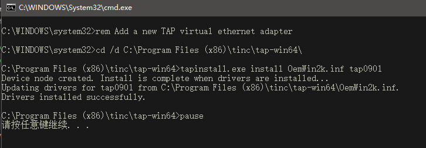
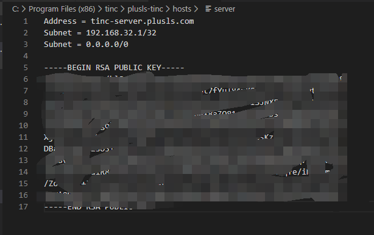
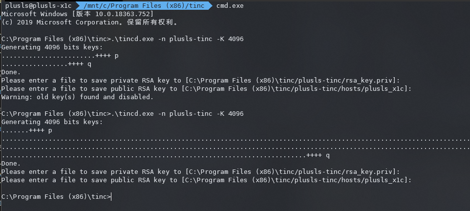

## 配置 Tinc VPN

https://blog.plusls.com/network/configure-tinc-vpn/


在广域网想要使用局域网联机玩一些游戏, 如 Left 4 Death 2, 一般需要使用 VPN 来构成局域网。但是 openvpn, L2TP 之类的 VPN 配置复杂, 并且是中心化的 VPN, 若是服务器线路不好则会延迟过高。

考虑到国内的机器贵的要死, 国外机器延迟又高, 只有白嫖阿里云学生机才能维持得了生活的样子。学生机配置也不高, 带宽也不够, Tinc VPN 这类 P2P vpn 刚好能解决学生机的痛点, 我最后决定用 Tinc VPN 组建内网。

本文用于记录 Tinc VPN 搭建过程。


## 中心化与 P2P VPN

假设 A 机器和 B 机器需要相互连接, 但是都没有公网 IP, 中心化 VPN 服务器为 C, 在 A 和 B连接上 VPN 后 A 要访问 B, 则流量走向为

```
A->C->B
```

最后 A 到 B 的延迟则为

```
A->C 的延迟 + B->C 的延迟
```

若是网络结构保持不变, 但是 VPN 支持 P2P 连接, 并且 A 和 B 不全是对称 NAT, 则服务器 C 会辅助 A 和 B 机器进行打洞, 如果打洞成功, 最后的流量走向为

```
A->B
```

流量不需要经过机器 C, 这时延迟和带宽就不会受到服务器的限制, 并且能大大降低服务器的压力

如果 A 和 B机器之间的网络情况比较复杂（比如 A B 都是对称 NAT）, 这时就会打洞失败, A 到 B 之间的流量走向仍为

```
A->C->B
```

## 服务器配置

本来搭 Tinc 还是挺麻烦的, 但是有人已经打包了一个 docker 镜像, 一键部署就好

新建 docker-compose.yml:

```
version: "3.7"
services:
  tinc:
    image: vimagick/tinc
    container_name: plusls-tinc
    ports:
      - "655:655/tcp"
      - "655:655/udp"
    volumes:
      - ./tinc:/etc/tinc
    environment:
      - IP_ADDR=tinc-server.plusls.com
      - ADDRESS=192.168.32.1/32
      - NETMASK=255.255.255.0
      - NETWORK=192.168.32.0/24
      - RUNMODE=server
      - NETNAME=plusls-tinc
    cap_add:
      - NET_ADMIN
    dns: 8.8.8.8
    restart: always
networks:
  default:
    name: plusls-tinc
    driver: bridge
    driver_opts:
      com.docker.network.bridge.name: plusls-tinc
```

一般只需要更改 environment 部分

其中 IP_ADDR 是 VPN server 的 公网 IP, 可以使用域名

NETWORK 是 tinc 的子网, 随便设一个就好, 只要不和你机器的网络冲突就行

NETMASK 在 peer.sh 中使用, 目前用不上, 但是最好也填上, 要和 NETWORK 设置的子网一致

ADDRESS 是 VPN server 在子网中的 IP

NETNAME 是网络名, 自己起一个名字就好, 要求服务器和客户端的 NETNAME 要一致

随后 `docker-compose up -d`, 就可完成服务器搭建

```
plusls@us1:~/tinc$ docker-compose up -d
Creating network "tinc" with driver "bridge"
Creating tinc ... done
plusls@us1:~/tinc$
```

此时服务器目录结构如下

```
.
├── docker-compose.yml
└── tinc
    └── plusls-tinc
        ├── hosts
        │   └── server
        ├── rsa_key.priv
        ├── tinc.conf
        ├── tinc-down
        └── tinc-up

3 directories, 6 files
```

如果希望 Tinc 启动在别的端口上, 可以修改 ports 配置, 语法为

```
ports:
  - "host:container/tcp"
  - "host:container/udp"
```

如果希望启动在 11451 端口, 则可以写为

```
- "11451:655/tcp"
- "11451:655/udp"
```

## 客户端配置

### windows

#### 安装tinc

https://www.tinc-vpn.org/packages/windows/tinc-1.0.36-install.exe

废话不写了

默认会安装到 `C:\Program Files (x86)\tinc`

安装完后安装目录下应该是这样


#### 创建 TAP 设备

tinc VPN 需要使用一个 TAP 设备, 在 tap-win64 目录下有 addtap.bat

右键用管理员权限打开 addtap.bat



#### 更改网络适配器名字

找到写有TAP-Windows-Adapter V9的那个网络适配器, 为它起一个别名, 后面配置文件中会用到, 这里起的别名为 `plusls-tinc`


#### 创建配置文件

在安装目录下新建个目录, 名字为服务器配置的 NETNAME, 在这里使用 plusls-tinc

最后配置结束后的目录结构如下:

```
./
├── COPYING.txt
├── doc
├── NEWS.txt
├── plusls-tinc
│   ├── hosts
│   │   ├── plusls_x1c
│   │   └── server
│   ├── rsa_key.priv
│   ├── rsa_key.pub
│   ├── tinc.conf
│   ├── tinc-down.bat
│   └── tinc-up.bat
├── README.txt
├── tap-win64
│   ├── addtap.bat
│   ├── deltapall.bat
│   ├── OemWin2k.inf
│   ├── tap0901.cat
│   ├── tap0901.sys
│   └── tapinstall.exe
├── tincd.exe
└── Uninstall.exe
```

##### tinc.conf

在该目录下新建 `tinc.conf`

```
Name = plusls_x1c
ConnectTo = server
Interface = plusls-tinc
```

Name 为机器名, 可以随便取, 只要不和 Tinc 网络内其它机器冲突就行。名字有个坑点, 不能使用 `-`, 最好使用英文数字下划线

ConnectTo 表示连接到的节点, 由于之前配置的服务器节点名为 server, 这里填写 server

Interface 填写刚才创建的 TAP 设备的名字, 这里填写 plusls-tinc

##### hosts

新建目录 hosts

在 hosts 目录下新建文件, 名字为 `tinc.conf` 中的 Name, 这里填写的是 plusls_x1c

里面填入

```
Subnet = 192.168.32.2/32
```

Subnet 是本机分配到的子网, 只要不和别的机器冲突就行, 这里选了 `192.168.32.2`

在 hosts 目录下新建文件 server, 内容和服务器上的 `tinc/{NETNAME}/hosts` 一致

样例:



如果服务器的端口不是 655, 则需要在 Subnet 后加一行

```
Port = {Port}
```

Port 为端口号

##### tinc-up.bat

```
netsh interface ip set address plusls-tinc static 192.168.32.2 255.255.255.0
```

其中 plusls-tinc 应为之前设置的 NETNAME, 192.168.32.2 对应着在 hosts 设置的 ip, 255.255.255.0 为子网掩码, 要和服务器设置的一致

##### tinc-down.bat

空文件

#### 生成秘钥对

使用 tincd.exe 生成秘钥对

```
.\tincd.exe -n plusls-tinc -K 4096
```

plusls-tinc 为网络名



此时会生成 rsa_key.priv

同时 Tinc 会将公钥附加到 `hosts/{NAME}` 后面

随后将公钥复制到服务器的 `tinc/{NETNAME}/hosts/{NAME}`

```
.
├── docker-compose.yml
└── tinc
    └── plusls-tinc
        ├── hosts
        │   ├── plusls_x1c
        │   └── server
        ├── rsa_key.priv
        ├── tinc.conf
        ├── tinc-down
        └── tinc-up
```

#### 测试连接服务器

需要管理员运行

```
.\tincd --net=plusls-tinc -D -d 5
```

plusls-tinc 为网络名

如果能 ping 通 192.168.32.1, 即服务器 ip, 则说明连接成功

#### 创建服务

需要管理员运行

```
.\tincd --net=plusls-tinc
```

### linux

这里的需求有点变化, 该机器自身有一个内网 `172.29.0.0/22`, 我希望别的机器能够透过 Tinc 访问这台机器的内网

该机器的 ip 为 `192.168.32.3`

#### 安装 Tinc

```
sudo apt update
sudo apt install tinc
```

#### 配置 Tinc

在 `/etc/tinc` 下新建个目录, 名字为服务器配置的 NETNAME, 在这里使用 plusls-tinc

配置完成后的目录结构:

```
/etc/tinc
├── nets.boot
└── plusls-tinc
    ├── hosts
    │   ├── d315
    │   └── server
    ├── rsa_key.priv
    ├── tinc.conf
    ├── tinc-down
    └── tinc-up
```

##### tinc.conf

在`/etc/tinc/plusls-tinc`目录下新建 `tinc.conf`

```
Name = d315
ConnectTo = server
Interface = plusls-tinc
```

Name 为机器名, 可以随便取, 只要不和 Tinc 网络内其它机器冲突就行。名字有个坑点, 不能使用 `-`, 最好使用英文数字下划线

ConnectTo 表示连接到的节点, 由于之前配置的服务器节点名为 server, 这里填写 server

Interface 填写刚才创建的 TAP 设备的名字, 这里填写 d315

##### hosts

在 hosts 目录下新建文件, 名字为 `tinc.conf` 中的 Name, 这里填写的是 d315

由于需要让别的机器能访问 `172.29.0.0/22`, 添加新子网

```
Subnet = 192.168.32.3/32
Subnet = 172.29.0.0/22
```

在 hosts 目录下新建文件 server, 内容和服务器上的 `tinc/{NETNAME}/hosts` 一致

样例:


如果服务器的端口不是 655, 则需要在 Subnet 后加一行

```
Port = {Port}
```

Port 为端口号

##### tinc-up

需要设置接口, 添加路由

由于别的机器要借助此机器访问内网, 还需要配置 NAT

如果没有这个需求则不需要添加下面的 iptables 规则

```
#!/bin/sh
ip link set $INTERFACE up
ip addr add 192.168.32.3/32 dev $INTERFACE
ip route add 192.168.32.0/24 dev $INTERFACE
iptables -A FORWARD -o "${INTERFACE}" -m conntrack --ctstate RELATED,ESTABLISHED -j ACCEPT
iptables -A FORWARD -i "${INTERFACE}" -j ACCEPT
iptables -t nat -A POSTROUTING -s "192.168.32.0"/"255.255.255.0" ! -o "${INTERFACE}" -j MASQUERADE
```

##### tinc-down

```
#!/bin/sh
ip route del 192.168.32.0/24 dev $INTERFACE
ip addr del 192.168.32.3/32 dev $INTERFACE
iptables -D FORWARD -o "${INTERFACE}" -m conntrack --ctstate RELATED,ESTABLISHED -j ACCEPT
iptables -D FORWARD -i "${INTERFACE}" -j ACCEPT
iptables -t nat -D POSTROUTING -s "192.168.32.0"/"255.255.255.0" ! -o "${INTERFACE}" -j MASQUERADE
ip link set $INTERFACE down
```

##### 设置可执行权限

```
sudo chmod +x tinc-up tinc-down
```

#### 生成秘钥对

使用 tincd.exe 生成秘钥对

```
tincd.exe -n plusls-tinc -K 4096
```

plusls-tinc 为网络名

此时会生成 rsa_key.priv

同时 Tinc 会将公钥附加到 `hosts/{NAME}` 后面

随后将公钥复制到服务器的 `tinc/{NETNAME}/hosts/{NAME}`

```
.
├── docker-compose.yml
└── tinc
    └── plusls-tinc
        ├── hosts
        │   ├── plusls_x1c
        │   └── server
        │   └── d315
        ├── rsa_key.priv
        ├── tinc.conf
        ├── tinc-down
        └── tinc-up
```

#### 其它机器的配置

由于其它机器需要以 `192.168.31.3` 为跳板连接内网, 则需要在 tinc 脚本内添加设置路由的命令

tinc-up.bat:

```
netsh interface ip add route 172.29.0.0/22 plusls-tinc 191.168.32.3 store=active
```

tinc-down.bat

```
netsh interface ip delete route 172.29.0.0/22 plusls-tinc 191.168.32.3 store=active
```

#### 测试网络连通性

```
sudo tincd -n plusls-tinc -D -d5
```

可以使用 -k 参数来结束进程

```
sudo tincd -n plusls-tinc -k
```

如果该机器能 ping 通 server 并且别的机器能 ping 通内网则说明配置正常

#### systemd 配置为服务

```
sudo systemctl enable tinc@plusls-tinc
sudo systemctl restart tinc@plusls-tinc
```
