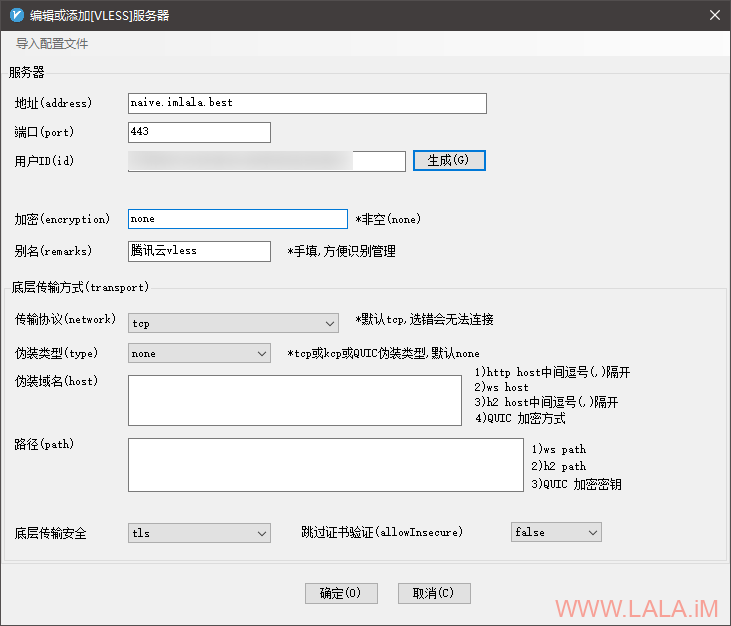

## 配置V2Ray的新协议：VLESS

https://lala.im/7355.html


v2ray的core版本要4.27以上才支持这个VLESS协议，首先看看我机器当前的版本，4.26是不支持的：

```
root@imlala:~# /usr/bin/v2ray/v2ray -version
V2Ray 4.26.0 (V2Fly, a community-driven edition of V2Ray.) Custom (go1.14.4 linux/amd64)
A unified platform for anti-censorship.
```

所以这里我需要先升级一下，想着直接用原来的jio本重新装一遍应该就行了，发现不行，旧jio本也废弃了：

```
root@imlala:~# bash <(curl -L -s https://install.direct/go.sh)
ERROR: This script has been DISCARDED, please switch to fhs-install-v2ray project.
HOW TO USE: https://github.com/v2fly/fhs-install-v2ray
TO MIGRATE: https://github.com/v2fly/fhs-install-v2ray/wiki/Migrate-from-the-old-script-to-this
```

旧jio回显了一个wiki链接，下面的步骤基本上就是照着wiki上来了，首先咱们把systemd服务停了：

```
systemctl disable v2ray
systemctl stop v2ray
```

然后把systemd服务文件和旧版v2ray的文件删了：

```
rm -rf /etc/systemd/system/v2ray.service
rm -rf /usr/bin/v2ray/
```

把原来的配置文件目录复制到新jio本需要的路径：

```
mv /etc/v2ray/ /usr/local/etc/
```

日志文件的所有者也要改一改，新jio本现在不使用root用户了：

```
chown -R nobody:nogroup /var/log/v2ray
```

然后就可以安装新版本了，如果你是全新安装就可以直接从这里开始，上面那些步骤对你而言是没用的：

```
apt -y install curl
curl -O https://raw.githubusercontent.com/v2fly/fhs-install-v2ray/master/install-release.sh
chmod +x install-release.sh
./install-release.sh
```

这里有一个问题，如果你是升级到最新版的，systemd需要reload一下：

```
systemctl daemon-reload
```

然后就可以启动v2ray/设置开机自启了：

```
systemctl start v2ray
systemctl enable v2ray
```

接下来我们就可以着手配置VLESS协议了，就目前而言这个协议如果你是拿来过墙的话务必要+一个TLS，因为VLESS协议本身不提供加密。

那么首先我们把nginx/certbot装一下：

```
apt -y install nginx python-certbot-nginx
```

新建一个nginx站点配置文件：

```
nano /etc/nginx/conf.d/v2raycert.conf
```

写入如下配置：

```
server {
      listen 80;
      server_name naive.imlala.best; # 换成你的域名
}
```

这步的目的仅仅只是为了后续可以用certbot申请一个支持自动续期的let's encrypt证书。当然如果在后续你配置了VLESS协议内的fallback，那装一个nginx也是有必要的。

现在就可以用certbot申请一个你的域名证书了：

```
certbot --nginx --agree-tos --no-eff-email --email xxxxx@qq.com
```

申请好了之后我们需要重新编辑这个nginx站点配置文件：

```
nano /etc/nginx/conf.d/v2raycert.conf
```

把certbot自动配置的这一行注释掉：

```
# listen 443 ssl; # managed by Certbot
```

重载nginx：

```
systemctl reload nginx
```

将申请的证书复制到如下目录：

```
cp /etc/letsencrypt/live/naive.imlala.best/fullchain.pem /usr/local/etc/v2ray
cp /etc/letsencrypt/live/naive.imlala.best/privkey.pem /usr/local/etc/v2ray
```

更改所有者：

```
chown -R nobody:nogroup /usr/local/etc/v2ray/
```

现在生成一个uuid：

```
v2ctl uuid
```

编辑v2ray的配置文件：

```
nano /usr/local/etc/v2ray/config.json
```

写入如下配置：

```
{
  "log": {
    "loglevel": "info",
    "access": "/var/log/v2ray/access.log",
    "error": "/var/log/v2ray/error.log"
  },
  "inbounds": [
    {
      "port": 443,
      "protocol": "vless",
      "settings": {
         "clients": [
           {
             "id": "你刚才生成的UUID"
           }
         ],
         "decryption": "none",
         "fallback": {
           "port": 80
         }
      },
      "streamSettings": {
        "network":"tcp",
        "security": "tls",
        "tlsSettings": {
          "alpn": [
            "http/1.1"
          ],
          "certificates": [
            {
              "certificateFile": "/usr/local/etc/v2ray/fullchain.pem",
              "keyFile": "/usr/local/etc/v2ray/privkey.pem"
            }
          ]
        }
      }
    }
  ],
  "outbounds": [
    {
      "protocol": "freedom",
      "settings": {}
    }
  ]
}
```

测试你的配置是否正确：

```
v2ray -config /usr/local/etc/v2ray/config.json -test
```

最后重启v2ray即可完成服务端这块的配置：

```
systemctl restart v2ray
```

客户端要支持VLESS协议同样需要core版本4.27以上，目前windows下的v2rayN客户端已经支持了，这里以v2rayN的配置为例：

[](https://lala.im/wp-content/uploads/2020/08/lala.im_2020-08-23_20-04-31.png)

