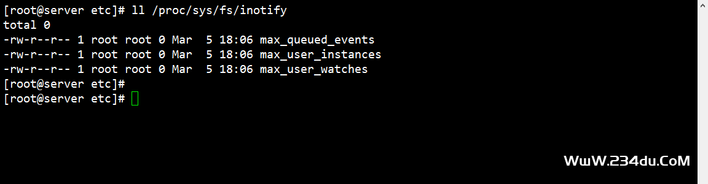
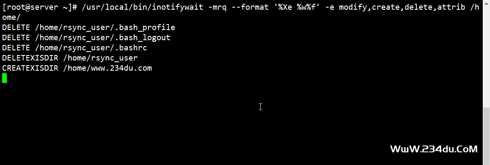
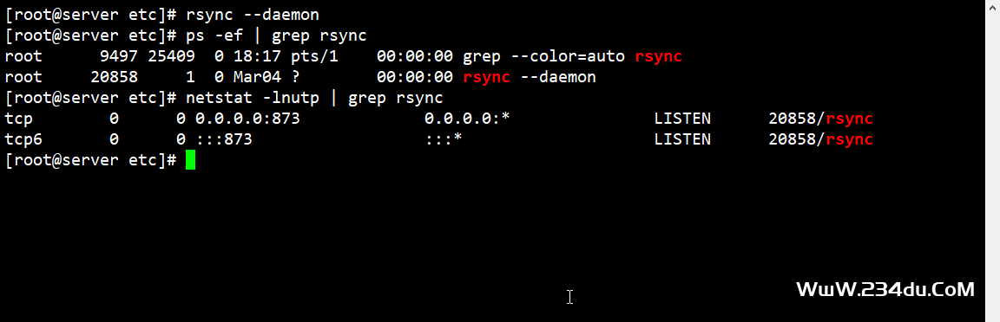
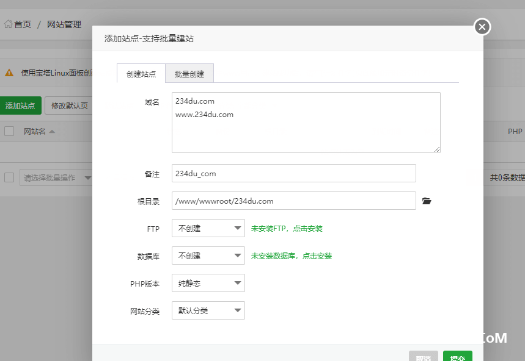
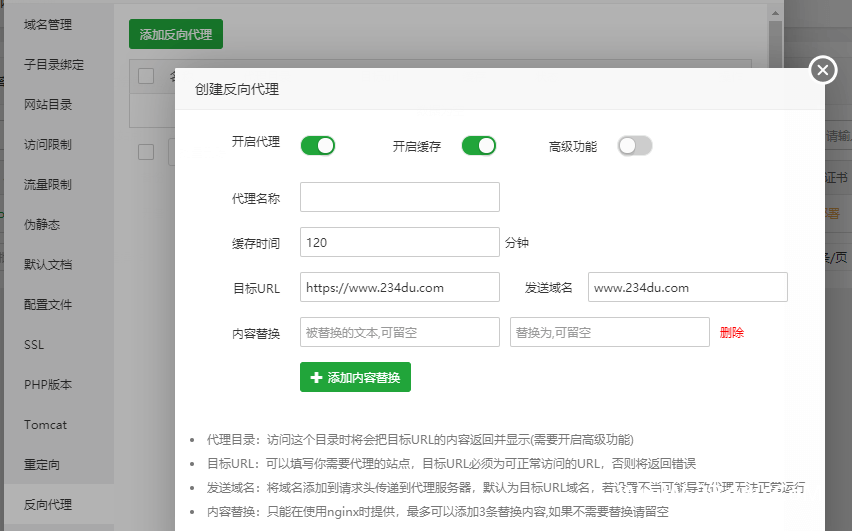
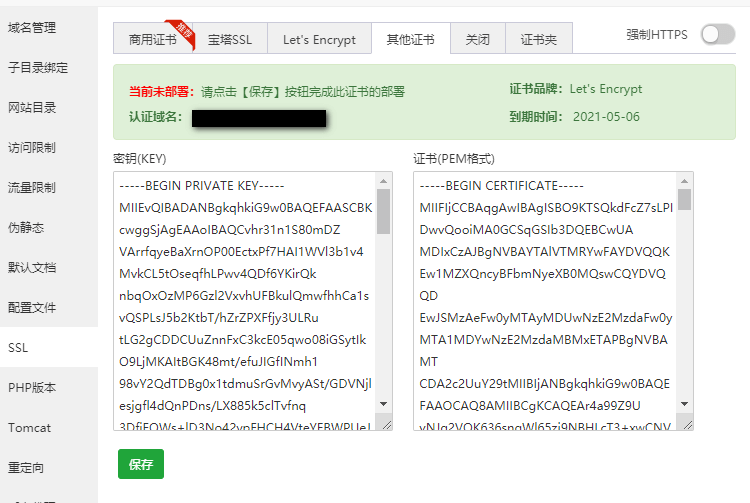
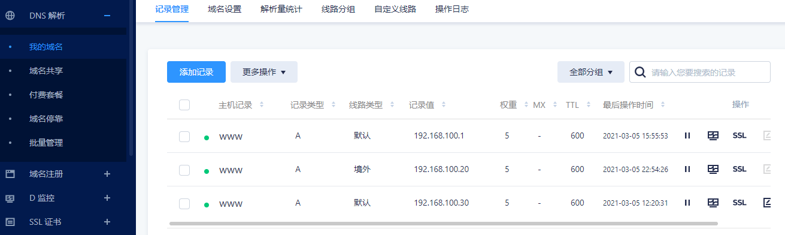

## CentOS下 inotify+rsync 文件实时同步&用宝塔面板自建CDN加速境外网站

https://www.234du.com/1202.html


### 起因：手里空余几个吃灰小鸡，想折腾一下。

环境

> 系统：CentOS7
>
> Rsync：3.1.2
>
> Inotify-Tools：3.20.11.0
>
> 宝塔面板： Beta7.6.13
>

### 准备

关闭firewall防火墙，开机禁止启动。永久关闭selinux。如果有iptables防火墙则允许873端口

```
iptables -A INPUT -p tcp --dport 873 -j ACCEPT （防火墙放行端口，或者在宝塔面板中放行也可以）
 
grep -i "selinux=" /etc/selinux/config （查看selinux是否关闭）

SELINUX=disabled（已关闭）
```

### 一、Rsync安装

一般系统都自带，使用rsync -v 查看就可以了，不需要重新安装。

```
rpm -qa|grep rsync （查看rsync）
rsync-3.1.2-10.el7.x86_64（版本）
yum install -y rsync （安装）
```

注：如果想使用最新版的，把系统自带的卸载之后编译，看安装文档需要安装的扩展，不然后安装不了。

https://github.com/WayneD/rsync/releases（下载地址）

https://github.com/WayneD/rsync/blob/master/INSTALL.md（安装文档）

 

### 二、安装Inotify-Tools

查看当前系统是否支持inotify

```
ll /proc/sys/fs/inotify
```

出下以三个文件说明系统支持，这三个文件的作用自行百度。



https://github.com/inotify-tools/inotify-tools/releases（下载地址）

编译前请确保服务器已安装编译组件：

```
yum install -y make  gcc gcc-c++
```

```
wget https://github.com/inotify-tools/inotify-tools/archive/3.20.11.0.zip
unzip 3.20.11.0.zip
cd inotify-tools-3.20.11.0
./configure    #或./configure --prefix=/usr/local/inotify
make
make install
```

安装后命令在/usr/local/bin/目录下。

查看效果：

```
/usr/local/bin/inotifywait -mrq --format '%Xe %w%f' -e modify,create,delete,attrib /home/
```

不停止上面的命令，重新建一个终端连接然后进入/home/文件夹进行各类操作，可以看下上面输出的结果。



注：数据备份存储的服务器不需要安装inotify-tools

例如：192.168.100.1（网站运行的服务器）、192.168.100.20（1号数据备份服务器）、192.168.100.30（2号数据备份服务器），

我们把网站服务中的数据同时同步到1号数据备份服务器、2号数据备份服务器中。

192.168.100.1需要安装inotify-tools、rsync，192.168.100.20、192.168.100.30只需要安装rsync。

192.168.100.1不需要配置rsyncd.conf，192.168.100.20、192.168.100.30需要配置rsyncd.conf。

 

1、现在操作备份服务器中配置rsyncd.conf，位置在/etc目录中，如果没有就创建一个，1号备份服务器、2号备份服务器操作一样。

在系统中创建用户：

```
useradd -s /sbin/nologin -M rsyncuser（rsyncuser是用户名，可根据自己的实际情况修改）
passwd rsyncuser（添加密码）
 
假设密码为 234du.com,这里为了方便下面教程，因为系统输入密码的时候不显示。
```

rsyncd.conf 配置

```
#工作中指定用户(可以不指定为0)
uid = 0
gid = 0
#相当于黑洞.出错定位
use chroot = no
##有多少个客户端同时传文件
max connections =200
##超时时间
timeout = 300
##进程号文件
pid ifle = /var/run/rsyncd.pid
lock file = /var/run/rsync.lock
##日志文件
log file = /var/log/rsyncd.log
##模块开始（这个模块就是待会儿对端写脚本的里面一个参数的名称）
[rsyncweb]
##需要同步的目录（准确的说是同步过来后放到哪里的目录路径）
path = /
##表示出现错误忽略错误
ignore errors
##表示网络权限可写(本地控制真正可写)（亲测这里写false报错）
read only = no
##这里设置IP或让不让同步
list = false
#允许的ip或者ip段
hosts allow = 192.168.100.1
##拒绝，以下表示都不拒绝
hosts deny = 0.0.0.0/32
##认证用户
auth users = rsyncuser
##用户名和密码存放文件
secrets file = /etc/rsync.passwd
```

创建密码认证文件，修改文件权限为600

```
echo 'rsyncuser:234du.com' >/etc/rsync.passwd
chmod 600 /etc/rsync.passwd
```

```
rsync --daemon  (启动rsync服务  或者 systemctl start rsyncd 启动)
ps -ef | grep rsync
netstat -lnutp | grep rsync
```



2、修改192.168.100.1（网站运行的服务器）配置

创建rsync密码文件，修改文件权限为600

```
echo '234du.com' >/etc/rsync.passwd
chmod 600 /etc/rsync.passwd
```

```
rsync --daemon  (启动rsync服务  或者 systemctl start rsyncd 启动)
ps -ef | grep rsync
netstat -lnutp | grep rsync
```

测试

```
rsync -avH --port=873  /tmp/  rsyncuser@192.168.100.20::rsyncweb  --password-file=/etc/rsync.passwd
```

3、rsync组合inotify-tools完成实时同步

> inotify的作用，是让我们知道监控的文件夹中有变动，我们可以根据inotify输出内容，去触发rsync同步。
>
> 提示：以往使用crontab触发rsync时，我们是将rsync服务端搭建在主服务器，其他服务器去主服务器同步文件。而inotify+rsync的方式，是将rsync服务端搭建在从服务器，主服务器推送文件到从服务器，所以从服务器上的rsync配置中“read only”要配置为no，也就是“read only = no”。
>
> inotify-tools只是个工具，并不是软件，所以要与rsync配合就需要我们自己写shell脚本，并让脚本一直运行在后台。

```
source /etc/profile
src=/www/server/panel/vhost/cert/	# 需要同步的源路径，下面在宝塔面板中会讲为什么要同步这个文件夹
des=rsyncweb	# 目标服务器上 rsync 模块名
rsync_passwd_file=/etc/rsyncd/rsync.passwd  # rsync验证的密码文件
ipaddr=(192.168.100.20 192.168.100.30) 	# 目标服务器,多个目标服务器以空格分开
user=rsyncuser	# rsync --daemon定义的验证用户名
inlogs=/var/log/inotifywait.logs
logs=/var/log/inotify_rsync.logs
errlog=/var/log/inotify_rsync.err.logs
cd ${src}  # 此方法中，由于rsync同步的特性，这里必须要先cd到源目录，inotify再监听 ./ 才能rsync同步后目录结构一致
/usr/local/bin/inotifywait -mrq --format  '%Xe %w%f' -e modify,create,delete,attrib,close_write,move --exclude=".*.swp" ./ >> $inlogs &
while true;do
     if [ -s ${inlogs} ];then
        grep -i -E "delete|moved_from" ${inlogs} >> /var/log/inotify_away.log
        for ip in ${ipaddr[@]}
        do
            rsync -avzcR --password-file=${rsync_passwd_file} --exclude="*.swp" --exclude="*.swx" ${src} ${user}@${ip}::${des} >> $logs
            RETVAL=$?
        done
        #同步失败后的输出日志
        if [ $RETVAL -ne 0 ];then
           echo "${src} sync to ${ipaddr} failed at `date +"%F %T"`,please check it by manual" >> $errlog
        fi
        cat /dev/null > $inlogs
        for ip in ${ipaddr[@]}
        do
            rsync -avzcR --password-file=${rsync_passwd_file} --exclude="*.swp" --exclude="*.swx" ${src} ${user}@${ip}::${des} >> $logs
        done
    else
        sleep 1
    fi
done
```

这个脚本的优点：不会根据inotify输出重复触发rsync同步。

缺点：每次都是rsync完整同步，如果文件数量较大则对比时间会比较长。

将上面内容保存为inotify_web.sh，执行

```
sh inotify_web.sh &
```

```
查看后台都有哪些程序在运行
jobs
[1]+  Running   sh /root/inotify_web.sh &
 
fg将后台的程序调到前台来
fg 1
sh /root/inotify_web.sh
 
脚本后台运行方法
 01. sh inotify_web.sh &
 
 02. nohup sh inotify_web.sh &
```

把脚本加入到开机启动项里

```
echo "setsid /root/inotify_web.sh &" >> /etc/rc.local
```

### 三、宝塔面板设置

1、添加网站

php版本选择“纯静态”



2、修改hosts文件

```
vi /etc/hosts
192.168.100.1 www.234du.com (添加一条记录，网站服务IP和域名)
```

3、设置反向代理

目标URL一定要带http或https，缓存时间根据实际需求修改。



4、部署SSL

SSL-->其它证书。在这里可以看到从192.168.100.1服务中同步过来的域名证书，上面实时同步的作用就是为把证同步过来，以后192.168.100.1域名证书更新，其它的两个服务器也同步更新。

注：如果1号、2号备份服务器没有同步，在192.168.100.1服务器中/www/server/panel/vhost/cert 下随便创建一个文件就可以了。



5、添加解析




> 文章参考：
>
> https://www.capjsj.cn/inotify_rsync.html
>
> https://www.cnblogs.com/lei0213/p/8595112.html
>
> https://www.cnblogs.com/yx520zhao/p/13755602.html
