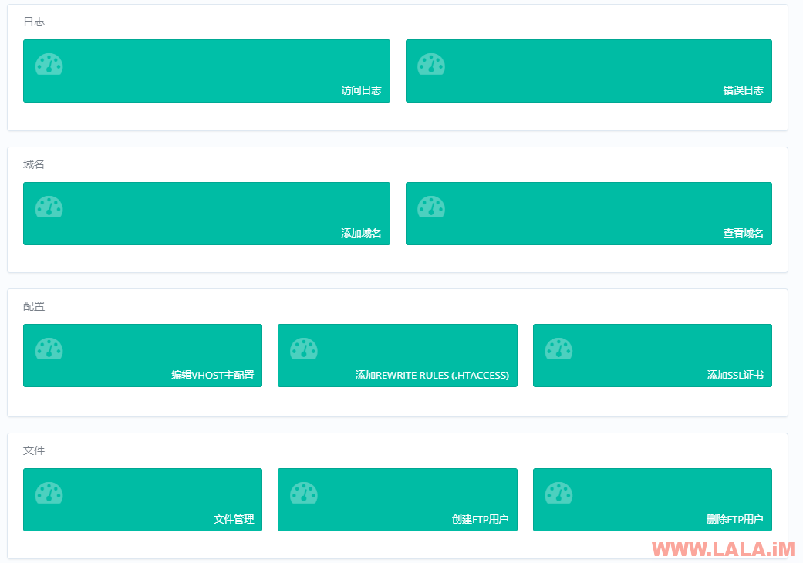
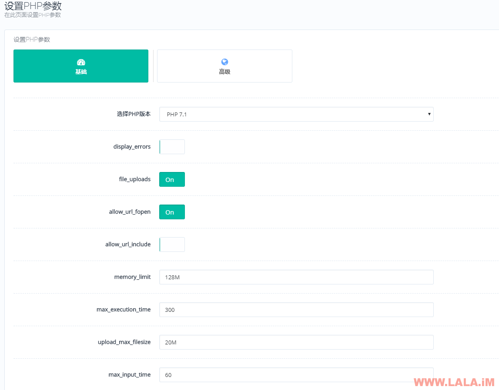

## CyberPanel：基于OpenLiteSpeed的WEB控制面板

https://lala.im/2228.html


CyberPanel是一款近期刚出炉的WEB面板，由外国人开发，从最初的版本到现在不断更新成熟的1.6版本，其功能已经非常强大，其次稳定性也越来越好，另外作者还在不断尝试修复现有问题和添加更多新的功能，总而言之是一款潜力很大的面板。

我个人认为这个面板和宝塔相比的话，它有两个优势：

1、CyberPanel是一个多用户面板，适合用来开虚拟主机，并且已有现成的WHMCS对接模块。而宝塔依旧还是单用户，也没有和WHMCS对接的模块，所以如果是用来销售虚拟主机的话，我想CyberPanel会是一个不错的选择。

2、CyberPanel是用OpenLiteSpeed跑PHP脚本，据说OpenLiteSpeed跑PHP的性能要比Nginx和Apache要好很多，当然具体是怎样我还没有做测试，这个还有待商榷。

CyberPanel面板官网：http://cyberpanel.net/

给作者反馈BUG？提供一些有用的建议？请戳这里：https://www.lowendtalk.com/discussion/121796/cyberpanel-control-panel-based-on-openlitespeed-updated

下面LALA尝试搭建一下这个面板，另外和大家一起熟悉下这款面板的各项设置，也许以后会用到这款面板也说不定~

首先你们要注意的是CyberPanel目前只支持CentOS7，其他系统一律不支持。也许在不久的将来会支持Debian。

安装命令：

```
wget http://cyberpanel.net/install.tar.gz
tar zxf install.tar.gz
cd install
chmod +x install.py
python install.py [IP Address]
```

注：上面的[IP Address]需要修改成你的VPS公网IP。

安装完成后，会回显给你面板的管理地址和账号密码：


这款面板安装完成后，密码不是随机生成的，所以我们要立即登录进去修改管理员密码：


另外此面板现在已经完美支持中文，登录的时候选择Chinese即可：


登录进去可以看到首页有一排大大的HTTP统计，下面写着“可用/最大连接数”、“可用/最大SSL连接数”。有人可能会担心这是不是意味着用这个面板搭建的WEB网站最大的连接数只能是2000个？


一开始我也吓了一跳，因为如果限制最大连接数的话，那这个面板就显得很鸡肋了。幸好面板提供了修改连接数的功能，按如下图操作尽量把连接数的数值改大一些就好了：


修改完成后，别忘了要重启OpenLiteSpeed才能使新设置生效：


然后你回到面板首页，发现最大连接数还是没有变化？别担心，这是这个面板目前的一个BUG，在首页中这里不能正常显示，但实际上修改的设置已经生效了，有没有什么办法验证修改已经生效了？

我们可以打开OpenLiteSpeed的管理员面板来查看，如何打开并登录？

1、首先点击CyberPanel面板内的“安全”-“防火墙”，添加一条放行7080端口的规则

2、用你的VPS公网IP+端口7080打开OpenLiteSpeed管理员面板：


3、使用默认管理员账号登录，账号：admin，密码：123456。登录进去后可以在右上角选择中文。

因为开了这个面板的访问端口，而面板的登录密码也是弱密码，所以登录进去第一件事也是更改管理员的密码：


接着我们就可以查看一下之前的连接数设置是否生效了：


可以看到是生效的，并且在首页的图表那里也能看到是生效的：


这样我们就放心了，现在回到CyberPanel就可以开始尝试一下各种功能了。

1、如何创建一个WEB网站？

使用CyberPanel创建网站前，必须要先创建一个套餐：


如果是自用的话，这里域名、硬盘空间、流量都最好填0，自己的VPS自己用还限制自己，岂不是很过分。。。

接着就是来创建网站了，如下图选择我们之前创建的套餐，然后填写域名、邮箱什么的，接着选择PHP版本。


最后就是创建该网站所属的数据库了，如下图选择我们之前创建的网站域名，然后输入数据库信息：


至此一个完整的PHP网站运行环境就完成了，现在我们可以点击“网站”-“查看网站”-选择我们刚才创建的网站，来使用这个面板的各种功能：


绑定新域名、添加伪静态规则（支持Apache规则）、添加SSL证书、在线文件管理、创建FTP用户、查看网站运行日志等等：



需要注意的是，这个面板的在线文件管理在国内无法正常打开，有些引用的资源库被墙了，需要翻墙才能打开。

2、一些个性化的设置。

一、给PHP安装扩展，该面板支持PHP5.3、5.4、5.5、5.6、7.0、7.1，所以在安装前，先选择你正在使用的PHP版本：


支持的扩展相当多，已安装的会显示Installed，未安装的会显示Not-Installed：


二、修改PHP设置：



如果想更详细的编辑PHP设置，可以点击高级按钮，面板会回显出所有的PHP设置内容：


三、这个面板的数据库root密码在哪里？

使用Xshell登录到你的机器内，执行下面命令会回显给你密码信息：

```
cat /etc/cyberpanel/mysqlPassword
```

该面板还有很多其他的功能，比如：邮局、DNS解析、备份等等，这里我就不多做介绍了，感兴趣的朋友可以自己安装一个试试看。我认为普通做站的话，能够熟悉我上面所说的那些，这个面板你就基本上是玩通了，剩下的这些需求感觉不是很大，所以我这里也就不多说了。。。

写在最后：

我还没有将此面板投入生产环境，不过我认为这个面板对各个PHP程序的兼容性不会比宝塔好，也就是说，宝塔能做的事情还是会比这个面板多的多，就目前而言，我认为CyberPanel只适合用来跑一些常见的PHP程序，比如WordPress之类的。稍微对环境要求复杂一点的，估计这个面板就有点吃不消了。

当然话又说回来，市面上就目前而言又有哪款面板能有宝塔那种强的可怕的兼容性，基本上什么PHP程序都能跑，只要稍微改下规则、设置什么的，就连AMH都做不到这些，我讲真的。