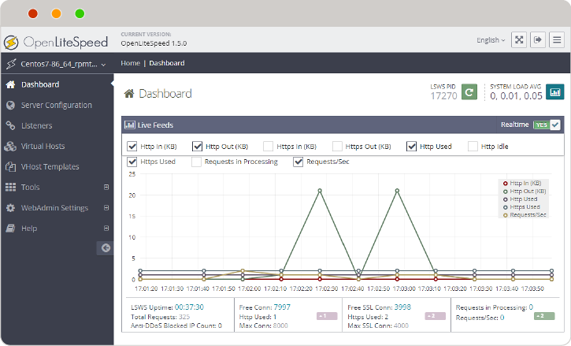
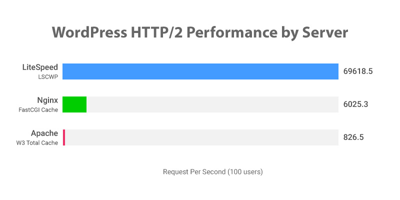
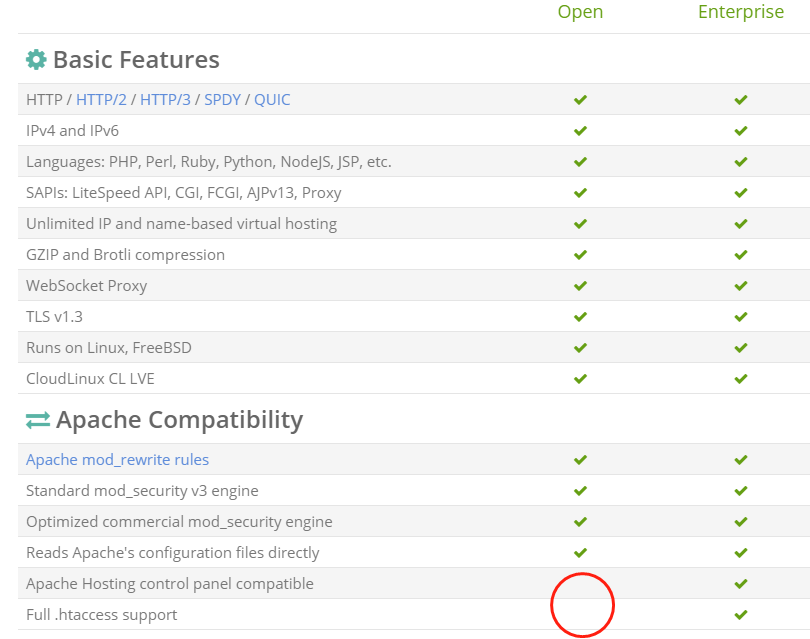
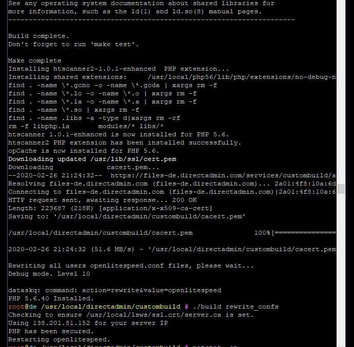

## DirectAdmin面板如何使用OpenLiteSpeed替代默认的Apache

https://git.69cdn.com/post/directadmin-use-openlitespeed-instead-of-apache/




预计将写成一个系列文章，本文为此系列的第一章：
第一章：[DirectAdmin面板如何使用OpenLiteSpeed替代默认的Apache](https://git.69cdn.com/post/directadmin-use-openlitespeed-instead-of-apache/)
第二章：[如果OpenLiteSpeed使用了CloudFlare等CDN如何显示访客的真实IP](https://git.69cdn.com/post/openlitespeed-behind-cloudflare-show-user-real-ip/)
第三章：[使用OpenLiteSpeed后如何开启HTTP/2 / HTTP/3 / SPDY / QUIC的支持](https://git.69cdn.com/post/openlitespeed-use-http2-http3-spdy-quic/)
第四章：[DirectAdmin后台安装[LiteSpeed控制插件\]一键安装缓存插件](https://git.69cdn.com/post/directadmin-install-litespeed-cache-plugin/)

首先普及下[OpenLiteSpeed](https://openlitespeed.org/)（以下简称OLS）相关知识，OLS是[LiteSpeed Technologies Inc.](https://www.litespeedtech.com/)出品的一款开源的网页服务器，该公司出品的商业版Web服务器[LiteSpeed Web Server, Enterprise edition](https://www.litespeedtech.com/products/litespeed-web-server)（简称LSWS）性能超强，在各种测试和实际使用中都是几乎都是地表最强的存在，以最常见的WordPress平台为例，使用LSWS服务器并且开启他们专门针对WP开发的缓存优化插件[LSCache for WP](https://www.litespeedtech.com/products/cache-plugins)后，[每秒处理能力远超其他插件](https://www.litespeedtech.com/benchmarks/wordpress)，如下图：



并且无论是商业版还是开源版都支持很多最新的技术，比如HTTP/2 / HTTP/3 / SPDY / QUIC的支持，让网站打开飞快。

但是商业版LSWS的最大缺点[就是贵🙁](https://www.litespeedtech.com/products/litespeed-web-server/lsws-pricing)，我们这里不考虑商业版。好在该公司也出了一个开源版的OLS，相信很多人也安装体验过，但是OLS在使用上非常不友好，与LSWS商业版相比较而言，阉割了最重要的功能：完全兼容Apache的httpd.conf文件以及.htaccess文件。开源版与商业版的区别见[官方页面](https://www.litespeedtech.com/products/litespeed-web-server/editions)，如下图红圈位置OLS缺少了两个DirectAdmin最需要的功能。



LSWS商业版的配置文件可以兼容Apache，而OLS的配置文件使用私有格式，这就导致了一个很严重的问题，现有流行的Web服务器操作面板如cPanel和DirectAdmin以及Plesk等都是基于Apache，一些内置的脚本也是基于Apache格式进行处理，所以我们之前还没有办法在CP或者DA上完美体验安装免费并且开源的OLS网页服务器。

在DirectAdmin更新到1.57版本以后（[版本推出时间大约在2019年的4月底](https://help.directadmin.com/item.php?id=2095)），开始支持OLS的安装，但是当时我在体验时有很多莫名其妙的bug，后来也就没继续用。这两天因为更换服务器，重新安装了DirectAdmin，优化服务器的时候发现DA官方通过努力，已经很好的解决了上面提到的兼容性问题，所以我也就尝试安装了一下开源的OLS，以下为安装OLS替换Apache的过程。

要求：**DA一定升级到最新版**（[1.57以上就支持了](https://help.directadmin.com/item.php?id=2095)，但是我劝你不是最新版别尝试）并且将DirectAdmin内置的[Custombuild](https://help.directadmin.com/index.php?topic=29)也升级到[2.0最新版](https://help.directadmin.com/item.php?id=555)，执行命令：

```javascript
cd /usr/local/directadmin
mv custombuild custombuild_1.x
wget -O custombuild.tar.gz http://files.directadmin.com/services/custombuild/2.0/custombuild.tar.gz
tar xvzf custombuild.tar.gz
cd custombuild
./build
```

根据[官方文档](https://help.directadmin.com/item.php?id=2095)的做法，在custombuild里面将webserver设置为OpenLiteSpeed，**同时将php的模式改为OLS才支持的lsphp**，然后开始编译OLS以及lsphp，最后重写DA的配置文件，编译过程比较久，请耐心等待。

```javascript
./build update
./build set webserver openlitespeed
./build set mod_ruid2 no
./build set php1_mode lsphp
./build openlitespeed
./build php n
./build rewrite_confs
```

基本上如果你只需要一个php版本，那你看到这里就行了。
像我安装了4个版本的php，所以我的操作如下（[如何在DirectAdmin中安装多个版本的PHP](https://help.directadmin.com/item.php?id=2094)）：

```javascript
cd /usr/local/directadmin/custombuild
./build update
./build set webserver openlitespeed
./build set mod_ruid2 no
./build set php1_release 7.3
./build set php2_release 7.2
./build set php3_release 7.1
./build set php4_release 5.6
./build set php1_mode lsphp
./build set php2_mode lsphp
./build set php3_mode lsphp
./build set php4_mode lsphp
./build openlitespeed
./build php n
./build rewrite_confs
```

我这里指定了要安装的4个php的版本号，并且设定模式都是lsphp，执行完命令后，经过漫长等待，看到如下图这样的提示，安装结束了。



剩下的一步也是最重要的一步，因为开源版的OLS为了跟商业版做出区别，**十分恶心的限制了实时读取.htaccess文件的功能，仅仅在OLS启动的时候读取一次.htaccess**，逼着大家用商业版。接下来这一步操作就是让系统定时扫描所有用户网站根目录下的.htaccess文件，如果发现有变动就自动重启OLS，以此来规避限制。

我们利用系统的cronjob功能在系统新增一个定时任务，进入/etc/cron.d/目录，新建文件名字为openlitespeed_htaccess_scan，把下面的代码写入文件即可。
以下代码意思为每三分钟扫描所有用户网站根目录以及最深2层目录下的.htaccess文件是否有变动，如果变动了就重启OLS服务，你可以把 "*/3" 改为5或者其他间隔时间，不需要太小以免负载过大。"maxdepth 2"基本也就够了，查找的层数过多会有严重性能问题。

```javascript
cd /etc/cron.d/
touch openlitespeed_htaccess_scan
echo "*/3 * * * * root if ! find /home/*/domains/*/*_html/ -maxdepth 2 -type f -newer /usr/local/lsws/cgid -name '.htaccess' -exec false {} +; then /usr/local/lsws/bin/lswsctrl restart; fi"> openlitespeed_htaccess_scan
```

至此，安装OpenLiteSpeed替换Apache的过程就已经结束，你现在可以开始体验了。
下一篇文章写“[如果OpenLiteSpeed使用了CloudFlare等CDN如何显示访客的真实IP](https://git.69cdn.com/post/openlitespeed-behind-cloudflare-show-user-real-ip/)”的问题。