## OpenLiteSpeed+V2Ray+WebSocket+TLS+CDN

https://lala.im/7035.html


这篇介绍一下如何用OpenLiteSpeed来实现V2Ray+WebSocket+TLS+CDN。

首先我们来安装openlitespeed和certbot：

```
apt -y update
apt -y install wget
wget -O - http://rpms.litespeedtech.com/debian/enable_lst_debian_repo.sh | bash
apt -y install openlitespeed certbot
```

接下来装一下v2ray/清空默认的配置文件/生成一个uuid：

```
bash <(curl -L -s https://install.direct/go.sh)
echo > /etc/v2ray/config.json
cat /proc/sys/kernel/random/uuid
```

编辑v2ray的配置文件：

```
nano /etc/v2ray/config.json
```

写入如下配置：

```
{
  "log": {
    "loglevel": "info",
    "access": "/var/log/v2ray/access.log",
    "error": "/var/log/v2ray/error.log"
  },
  "inbounds": [
    {
      "port": 10000,
      "listen":"127.0.0.1",
      "protocol": "vmess",
      "settings": {
        "clients": [
          {
            "id": "你生成的UUID",
            "alterId": 64
          }
        ]
      },
      "streamSettings": {
        "network": "ws",
        "wsSettings": {
        "path": "/sometimesnaive"
        }
      }
    }
  ],
  "outbounds": [
    {
      "protocol": "freedom",
      "settings": {}
    }
  ]
}
```

检查v2ray配置是否有误：

```
/usr/bin/v2ray/v2ray -config /etc/v2ray/config.json -test
```

没问题的话重启v2ray使新的配置生效：

```
systemctl restart v2ray
```

接下来需要配置OpenLiteSpeed，需要做的配置有：

1.更改OpenLiteSpeed的WEB控制台密码

2.新建一个SSL监听器

3.新建一个虚拟主机

4.映射虚拟主机到相应的监听器

关于这4个步骤，本文不再重复，如果你不会操作的话可以参考这篇文章：


这里只简单截几张配置好的图片，首先是SSL监听器：

[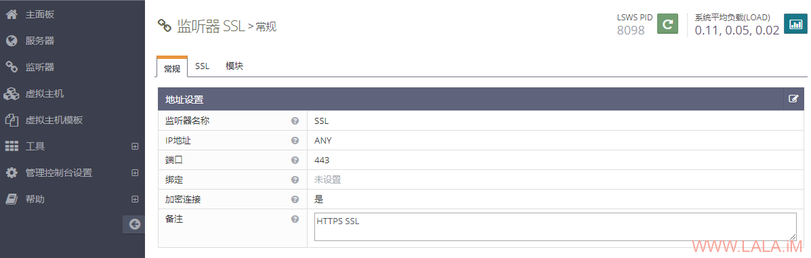](https://lala.im/wp-content/uploads/2020/05/lala.im_2020-05-19_14-16-48.png)

SSL监听器这里我用的自签证书：

[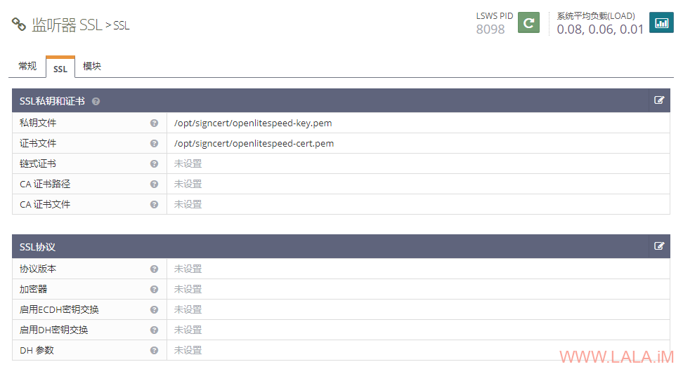](https://lala.im/wp-content/uploads/2020/05/lala.im_2020-05-19_14-30-54.png)

接着是新建虚拟主机，“基本”配置：

[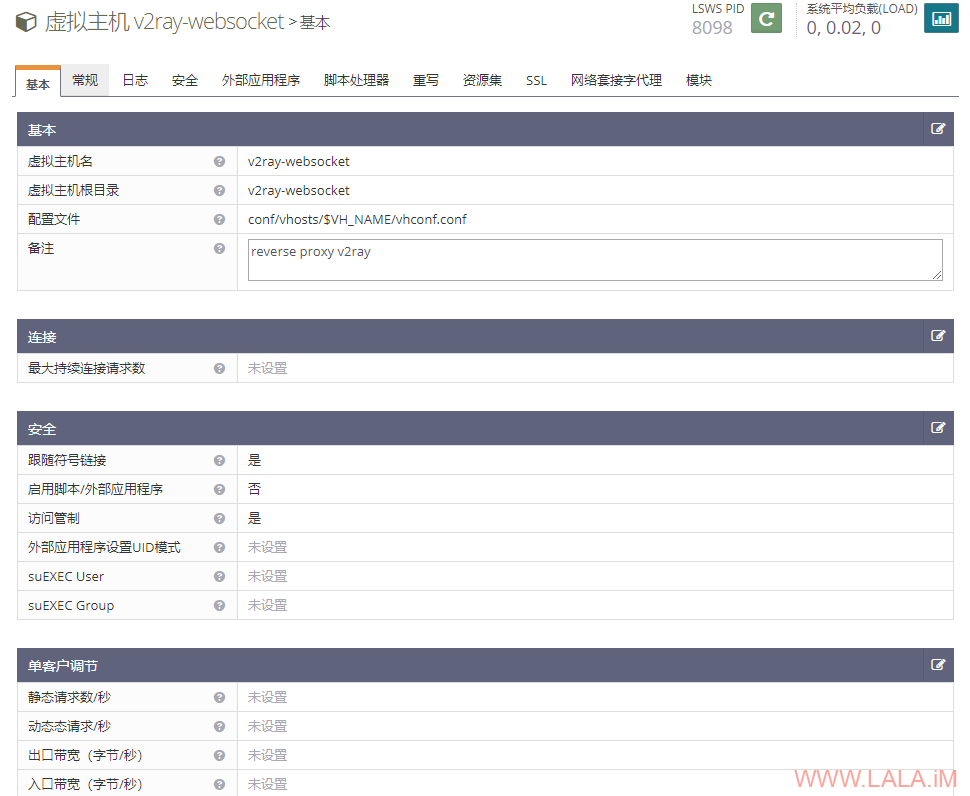](https://lala.im/wp-content/uploads/2020/05/lala.im_2020-05-19_14-19-55.png)

你可能需要先把虚拟主机的目录创建好才能进行这项配置，基于上图内的配置，你可以直接执行下面的命令创建好目录：

```
mkdir /usr/local/lsws/v2ray-websocket
mkdir /usr/local/lsws/v2ray-websocket/html
```

然后是“常规”配置：

[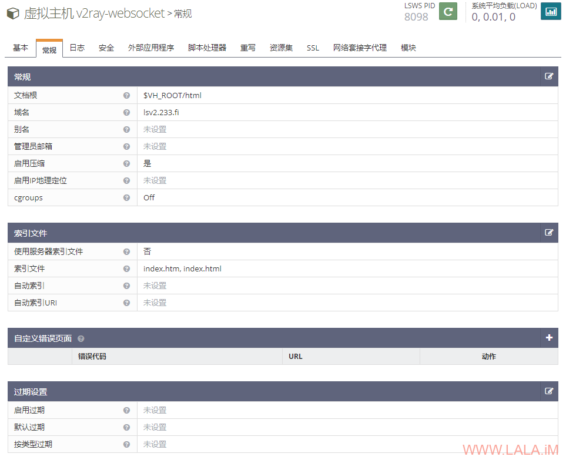](https://lala.im/wp-content/uploads/2020/05/lala.im_2020-05-19_14-21-44.png)

此外在“安全”这个选项卡内，访问控制这里要填写一个*允许所有人访问：

[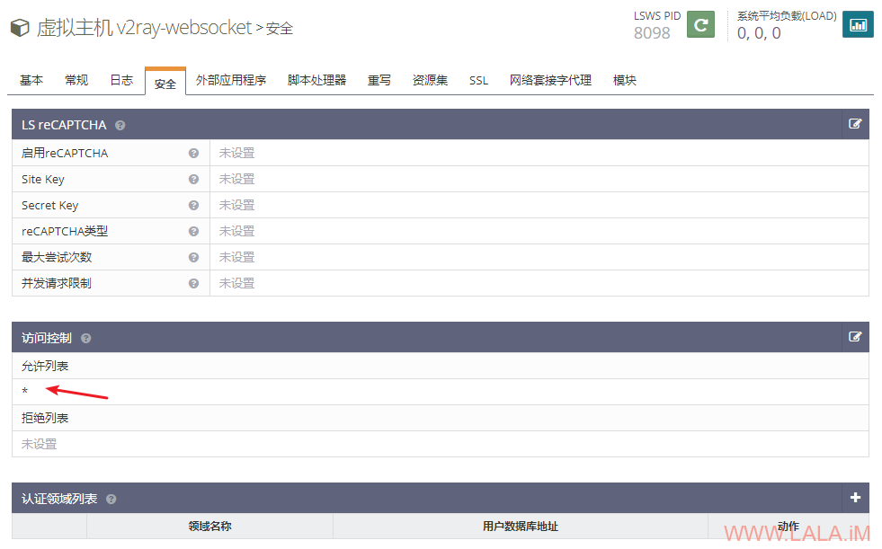](https://lala.im/wp-content/uploads/2020/05/lala.im_2020-05-19_14-22-43.png)

现在来到非常关键的一步了，找到“网络套接字代理”，在这里新建一个websocket代理，如果你之前没有改动v2ray的配置，那么按下图填写即可：

[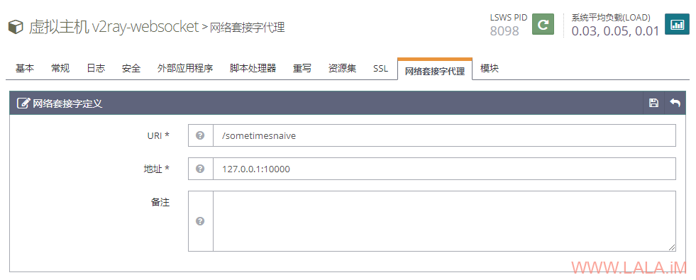](https://lala.im/wp-content/uploads/2020/05/lala.im_2020-05-19_14-34-13.png)

虚拟主机就新建好了，其实如果你嫌麻烦的话也可以在你现有的虚拟主机内直接添加一个“网络套接字代理”，这样就不用新建虚拟主机了。

接下来把刚才新建的这个虚拟主机映射给刚创建的SSL监听器：

[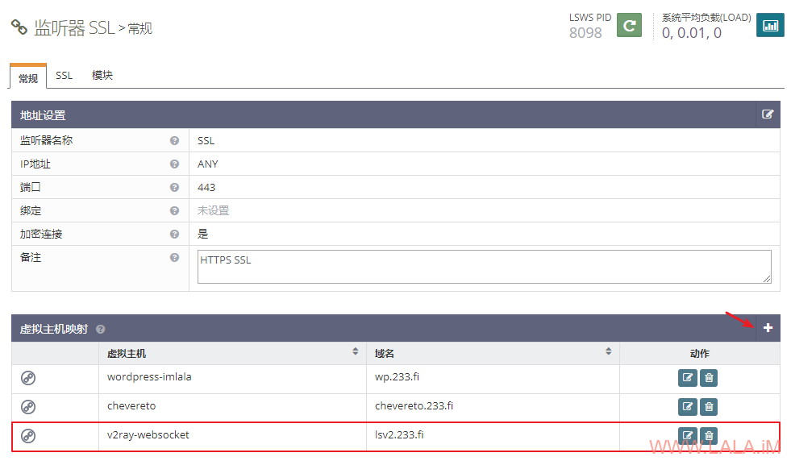](https://lala.im/wp-content/uploads/2020/05/lala.im_2020-05-19_14-38-15.png)

同时你也需要映射给80端口的default监听器（待会使用certbot签发letencrypt证书的时候用到：）

[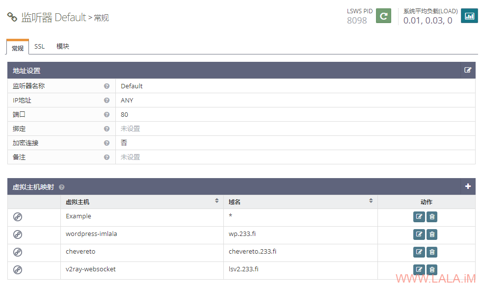](https://lala.im/wp-content/uploads/2020/05/lala.im_2020-05-19_14-42-32.png)

在OpenLiteSpeed的WEB控制台上重启使刚才配置的这些内容生效。

现在你可以使用certbot签发一个域名证书：

```
certbot certonly --agree-tos --no-eff-email --email xxxx@qq.com --webroot -w /usr/local/lsws/v2ray-websocket/html -d lsv2.233.fi
```

然后回到虚拟主机，找到“SSL”配置，按下图填上你刚新建的证书：

[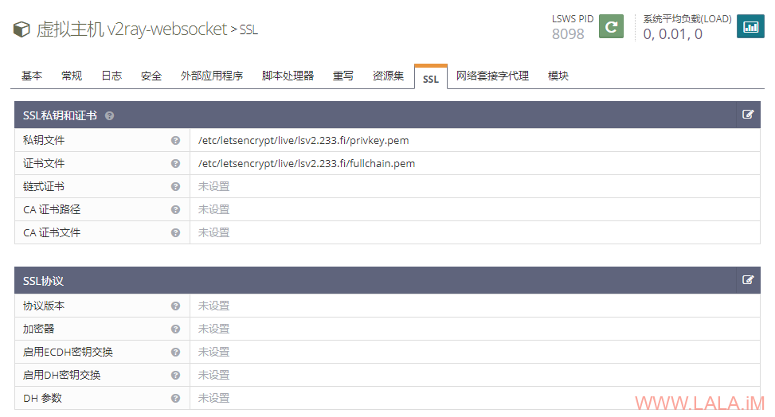](https://lala.im/wp-content/uploads/2020/05/lala.im_2020-05-19_14-46-27.png)

最后在CloudFlare的SSL/TLS界面把加密设置为完全（严格）

[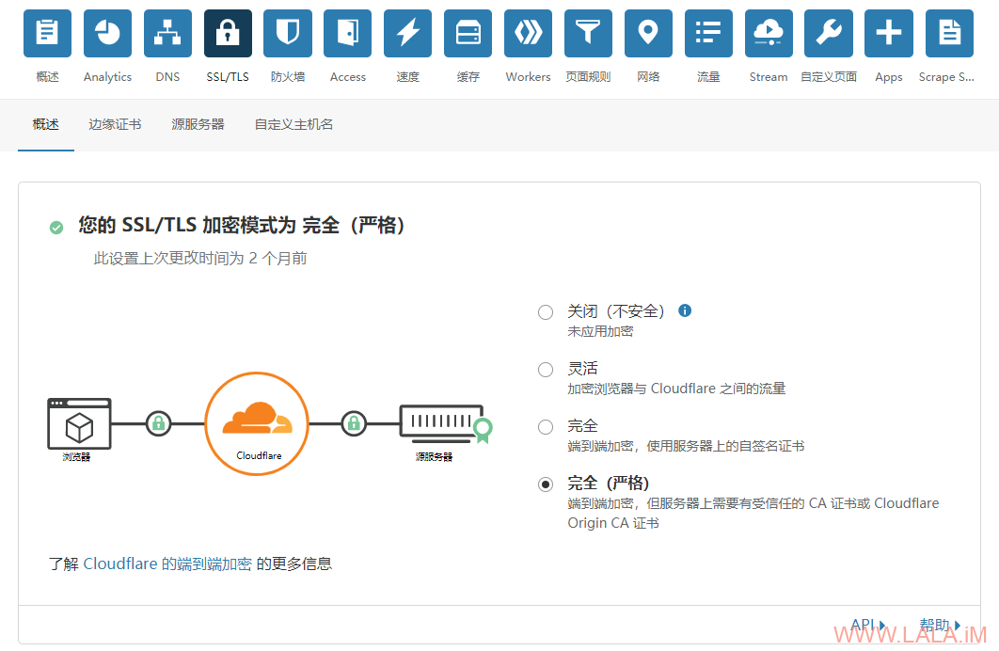](https://lala.im/wp-content/uploads/2020/05/lala.im_2020-05-19_14-48-45.png)

v2rayN客户端的配置：

[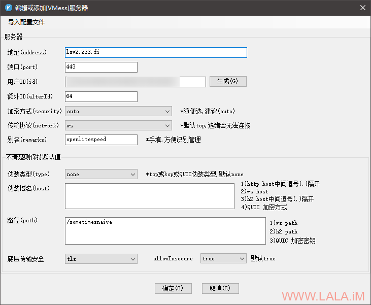](https://lala.im/wp-content/uploads/2020/05/lala.im_2020-05-19_14-50-31.png)

这里额外补充点内容，如果你只是单纯的想套CDN的话（始终使用CDN，不考虑直接与源服务器连接）那么你可以偷懒省略一些步骤。

OpenLiteSpeed的虚拟主机可以不配置SSL证书，然后在CloudFlare的SSL/TLS界面把加密设置为灵活：

[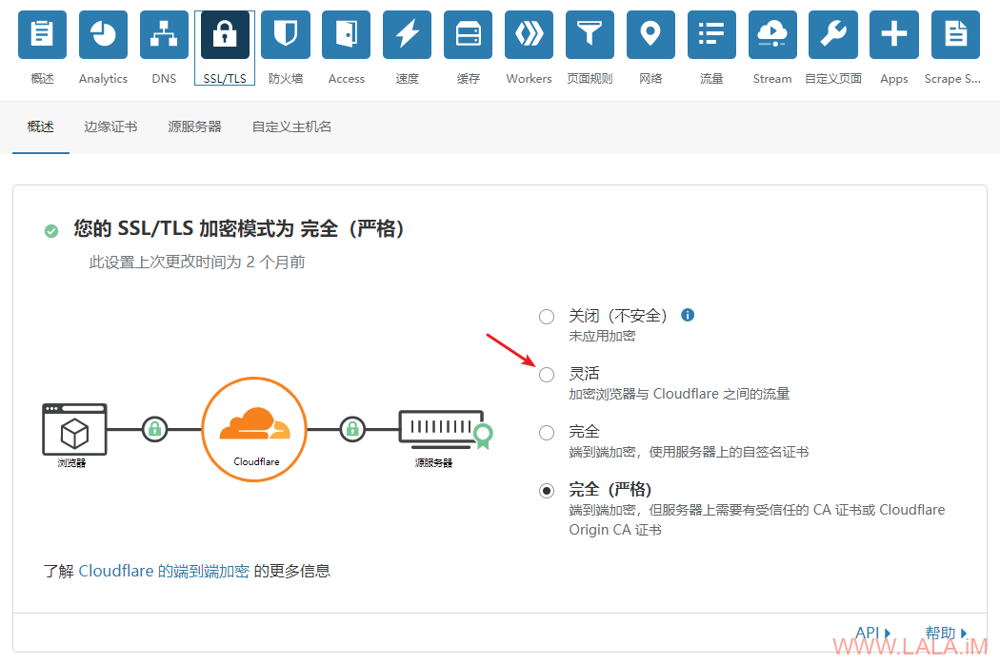](https://lala.im/wp-content/uploads/2020/05/lala.im_2020-05-19_15-13-52.png)