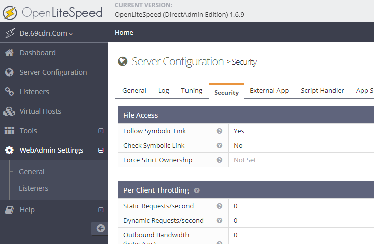
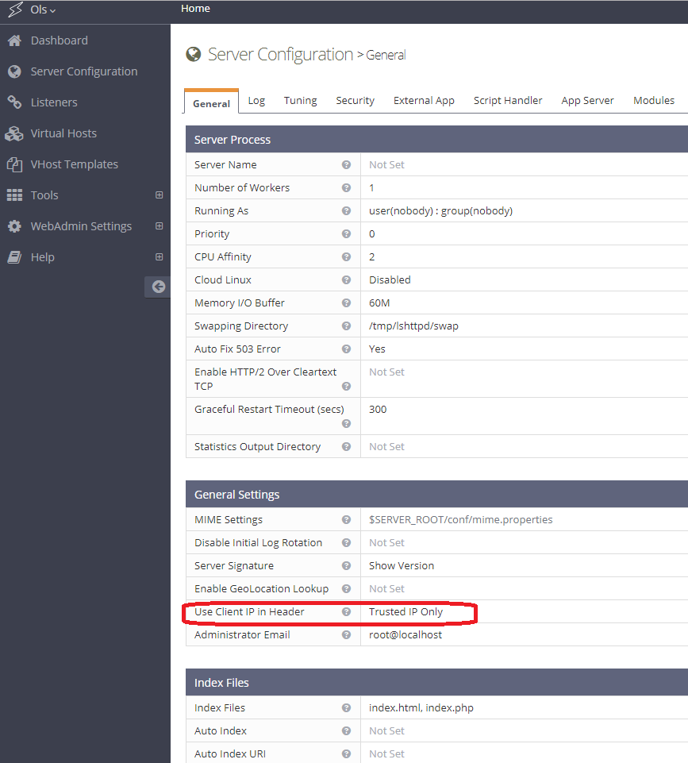
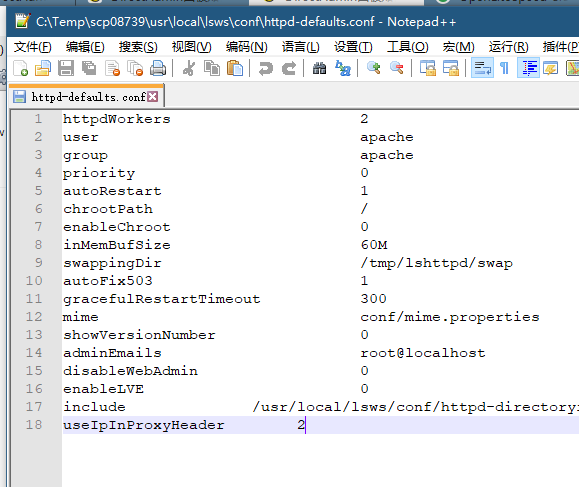
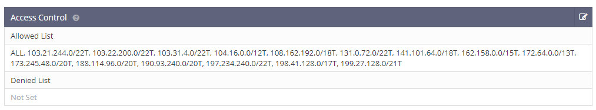

## OpenLiteSpeed使用CloudFlare等CDN如何显示访客的真实IP

https://git.69cdn.com/post/openlitespeed-behind-cloudflare-show-user-real-ip/



本文为DirectAdmin面板如何使用OpenLiteSpeed系列的第二章：

第一章：[DirectAdmin面板如何使用OpenLiteSpeed替代默认的Apache](https://git.69cdn.com/post/directadmin-use-openlitespeed-instead-of-apache/)
第二章：[如果OpenLiteSpeed使用了CloudFlare等CDN如何显示访客的真实IP](https://git.69cdn.com/post/openlitespeed-behind-cloudflare-show-user-real-ip/)
第三章：[使用OpenLiteSpeed后如何开启HTTP/2 / HTTP/3 / SPDY / QUIC的支持](https://git.69cdn.com/post/openlitespeed-use-http2-http3-spdy-quic/)
第四章：[DirectAdmin后台安装[LiteSpeed控制插件\]一键安装缓存插件](https://git.69cdn.com/post/directadmin-install-litespeed-cache-plugin/)

跟Apache一样，OpenLiteSpeed（以下简称OLS）也需要将CloudFlare的ip库设置在OLS的配置文件中以后，才可以获取到访客的真实IP，否则只能在日志里面看到一堆CF的IP。

根据[OLS官网的文章](https://openlitespeed.org/kb/show-real-visitor-ip-instead-of-cloudflare-ips/)，**首先要开启“[Use Client IP in Header](https://openlitespeed.org/kb/show-real-visitor-ip-instead-of-cloudflare-ips/)”功能**，并且将CloudFlare的IP地址加入可信地址库后即可正确识别真实访客的IP地址，与Apache的“RemoteIPInternalProxy”功能如出一辙。如果是独立安装不使用cPanel或者DirectAdmin之类的控制面板的话，可以直接按照官方的提示进行操作即可。



DirectAdmin面板在使用OLS时引入了外部配置文件，[导致OLS的后台会直接提示你“只读模式”](https://forum.directadmin.com/threads/da-openlitespeed-configuration-is-readonly.58254/)，只能去修改配置文件了。用了DA面板后的配置文件跟原始OLS的配置文件并不相同，多次尝试后，应该修改OLS程序安装目录下/usr/local/lsws/conf/httpd-defaults.conf文件，在最后加上'useIpInProxyHeader 2'这段内容，如下图：



```javascript
cd /usr/local/lsws/conf
echo "useIpInProxyHeader 2"> httpd-defaults.conf
```

第二部操作就是[获取CloudFlare的IP地址库内容](https://www.cloudflare.com/ips/)，并按照OLS的格式加进配置文件，找到OLS程序安装目录下/usr/local/lsws/conf/httpd-accesscontrol.conf配置文件，清空原有内容，用我这个替换掉。

```javascript
accessControl  {
  allow                   ALL, 103.21.244.0/22T, 103.22.200.0/22T, 103.31.4.0/22T, 104.16.0.0/12T, 108.162.192.0/18T, 131.0.72.0/22T, 141.101.64.0/18T, 162.158.0.0/15T, 172.64.0.0/13T, 173.245.48.0/20T, 188.114.96.0/20T, 190.93.240.0/20T, 197.234.240.0/22T, 198.41.128.0/17T, 199.27.128.0/21T
}
```



如果你有其他的前端或者LB之类的，也一样要把IP地址加进去，并且最后一定要加上一个大写的T，改好后在OpenLiteSpeed后台刷新即可见到已经成功将CF的IP加载到了OLS配置文件中，从此即可正常显示访客的真实IP。

下一章内容写：使用OpenLiteSpeed后如何开启HTTP/2 / HTTP/3 / SPDY / QUIC的支持。