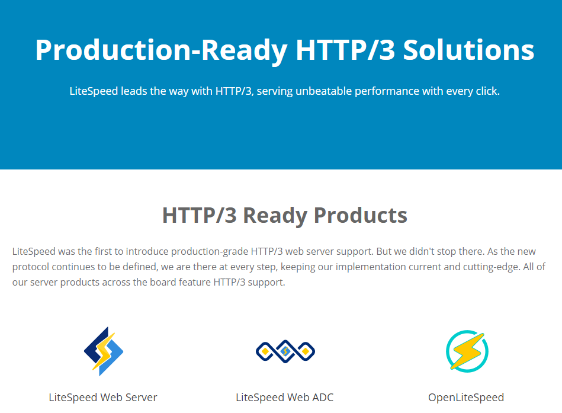
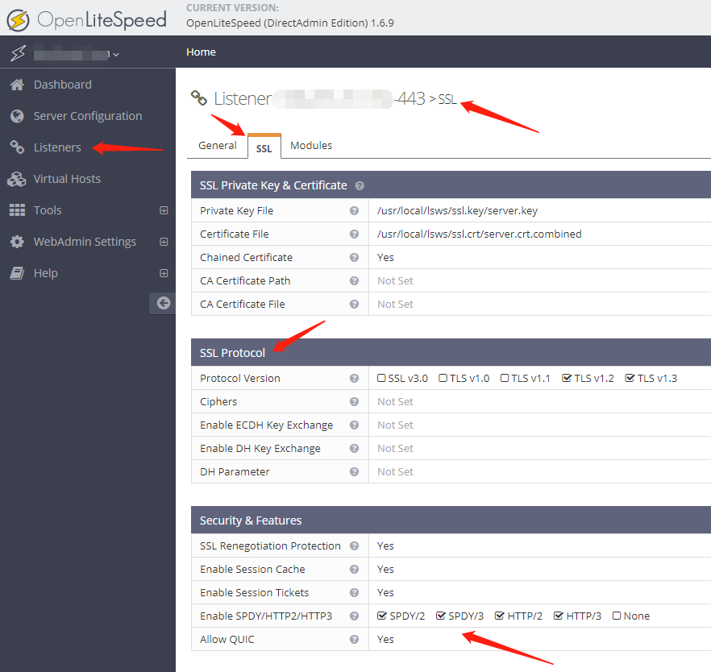
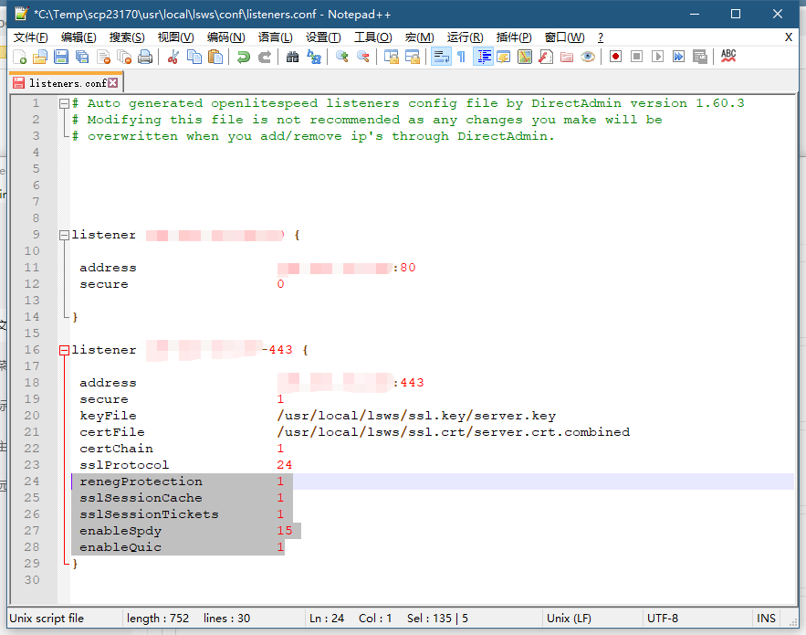
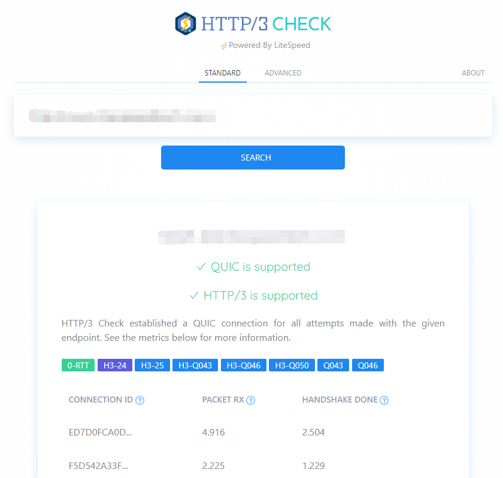

## OpenLiteSpeed开启HTTP/2 / HTTP/3 / SPDY / QUIC的支持

https://git.69cdn.com/post/openlitespeed-use-http2-http3-spdy-quic/



本文为DirectAdmin面板如何使用OpenLiteSpeed系列的第三章：
第一章：[DirectAdmin面板如何使用OpenLiteSpeed替代默认的Apache](https://git.69cdn.com/post/directadmin-use-openlitespeed-instead-of-apache/)
第二章：[如果OpenLiteSpeed使用了CloudFlare等CDN如何显示访客的真实IP](https://git.69cdn.com/post/openlitespeed-behind-cloudflare-show-user-real-ip/)
第三章：[使用OpenLiteSpeed后如何开启HTTP/2 / HTTP/3 / SPDY / QUIC的支持](https://git.69cdn.com/post/openlitespeed-use-http2-http3-spdy-quic/)
第四章：[DirectAdmin后台安装[LiteSpeed控制插件\]一键安装缓存插件](https://git.69cdn.com/post/directadmin-install-litespeed-cache-plugin/)

开源版的OpenLiteSpeed（OLS）与商业版一样，现在已经完全支持现有的HTTP/ [HTTP/2](https://www.litespeedtech.com/products/litespeed-web-server/features/http-2-support) / [HTTP/3](https://www.litespeedtech.com/http3-solutions) / [SPDY](https://www.litespeedtech.com/products/litespeed-web-server/features/http-2-support) / [QUIC](https://www.litespeedtech.com/products/litespeed-web-server/features/quic-support)协议，这些新协议给大家带来的好处就是打开网页速度越来越快，许多网页都能秒开。

使用单独安装的OpenLiteSpeed的时候，我们可以通过OLS的web admin管理页面通过选项方便开启这些协议的支持，后台选择Listeners，选择相应IP的SSL选项，按照页面提示开启即可。



DirectAdmin版本的OLS默认安装好后只开启了HTTP/2协议的支持， [HTTP/3](https://www.litespeedtech.com/http3-solutions) / [SPDY](https://www.litespeedtech.com/products/litespeed-web-server/features/http-2-support) / [QUIC](https://www.litespeedtech.com/products/litespeed-web-server/features/quic-support)这几个速度更快，技术更新的协议，因为DirectAdmin的原因无法直接在OLS的webadmin页面开启，需要手动修改OLS的配置文件进行修改。



打开`usr/local/lsws/conf/listeners.conf`文件，会看到有以你服务器IP地址命名的配置选项，找到443结尾的地方，增加如下内容然后重启lsws服务即可。`/usr/local/lsws/bin/lswsctrl restart`。

```bash
 renegProtection         1
 sslSessionCache         1
 sslSessionTickets       1
 enableSpdy              15
 enableQuic              1
```

接下来我们去一个网站测试下这些功能是否成功开启，打开 https://http3check.net/进行测试，这个网站也是LiteSpeed官方出的。显示** HTTP/3 is supported**和**HTTP/3 is supported**就说明大功告成了。



如果提示失败，我们则一步步来确认问题出在哪里。

**开启QUIC有[两个硬性要求](https://www.litespeedtech.com/support/wiki/doku.php/litespeed_wiki:config:enable_quic)：**
!.必须是可信证书，自签发的不行，而且证书需要正确安装，有完整的证书链。
!.防火墙的443端口必须同时开启UDP，不能只开HTTP。

我们首先确认UDP 443端口是否由OLS正常占用。
执行命令：`netstat -lupn | grep 443` 查看端口占用情况。

```bash
root@de ~ # netstat -lupn | grep 443
udp        0      0 138.201.81.152:443      0.0.0.0:*                           29840/openlitespeed
udp        0      0 138.201.81.152:443      0.0.0.0:*                           29840/openlitespeed
```

如果能看到进程，说明进程已经正确运行并占用端口，接下来确认是否在防火墙设置里面放行。
如果使用Firewalld：

```bash
firewall-cmd --zone=public --add-port=443/udp --permanent
firewall-cmd --reload
```

如果使用iptables：

```bash
iptables -I INPUT -p udp --dport 443 -j ACCEPT
/sbin/service iptables save
/sbin/service iptables restart
```

关于测试UDP包是否能正常进出，[这里有方法](https://www.litespeedtech.com/support/wiki/doku.php/litespeed_wiki:config:enable_quic#how_to_test_udp_incoming_and_outgoing_connections)。

下一篇文章来说一说：DirectAdmin后台安装[LiteSpeed控制插件]一键安装缓存插件。